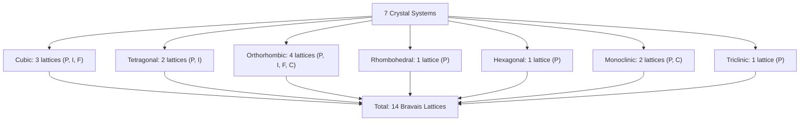

## The Seven Crystal Systems and Fourteen Bravais Lattices

### Fundamental Concept

Every possible three-dimensional periodic point lattice can be classified into one of **seven crystal systems**, based on the geometric relationships between the unit cell edge lengths ($a$, $b$, $c$) and interaxial angles ($\alpha$, $\beta$, $\gamma$). When lattice centering possibilities (points added at face centers, the body center, or base centers, in addition to corner points) are considered within each crystal system, exactly **fourteen unique space lattices** result — known as the **Bravais lattices**, after French physicist Auguste Bravais, who demonstrated in 1848 that only fourteen distinct lattices are geometrically possible in three-dimensional space.

### The Seven Crystal Systems

| System | Axial Lengths | Interaxial Angles | Symmetry Level |
| --- | --- | --- | --- |
| Cubic | $a = b = c$ | $\alpha = \beta = \gamma = 90°$ | Highest |
| Tetragonal | $a = b \neq c$ | $\alpha = \beta = \gamma = 90°$ | High |
| Orthorhombic | $a \neq b \neq c$ | $\alpha = \beta = \gamma = 90°$ | Moderate |
| Rhombohedral (Trigonal) | $a = b = c$ | $\alpha = \beta = \gamma \neq 90°$ | Moderate |
| Hexagonal | $a = b \neq c$ | $\alpha = \beta = 90°$, $\gamma = 120°$ | Moderate |
| Monoclinic | $a \neq b \neq c$ | $\alpha = \gamma = 90° \neq \beta$ | Low |
| Triclinic | $a \neq b \neq c$ | $\alpha \neq \beta \neq \gamma \neq 90°$ | Lowest |

**Key Points**

- The cubic system exhibits the greatest degree of symmetry, with all edges equal and all angles at 90°
- The triclinic system has the lowest symmetry, with no edges or angles equal
- Symmetry generally decreases moving down the table, though the ordering of intermediate systems (tetragonal, hexagonal, rhombohedral, orthorhombic) reflects different, not strictly nested, symmetry elements

### Lattice Centering Types

Within a given crystal system, additional lattice points may be present beyond the eight corner points, defining four possible centering types:

- **Primitive (P)**: lattice points only at the eight cell corners
- **Body-centered (I)**: lattice points at the corners plus one additional point at the body center
- **Face-centered (F)**: lattice points at the corners plus one additional point at the center of each of the six faces
- **Base-centered (C)**: lattice points at the corners plus one additional point at the center of two opposing (top and bottom, or side) faces

Not every crystal system permits all four centering types without reducing to a smaller or higher-symmetry cell; only the combinations that produce geometrically distinct, non-redundant lattices are retained, which is precisely how the number is constrained to fourteen rather than $7 \times 4 = 28$.

### The Fourteen Bravais Lattices

| Crystal System | Bravais Lattices Present | Count |
| --- | --- | --- |
| Cubic | Simple (P), Body-Centered (I), Face-Centered (F) | 3 |
| Tetragonal | Simple (P), Body-Centered (I) | 2 |
| Orthorhombic | Simple (P), Body-Centered (I), Face-Centered (F), Base-Centered (C) | 4 |
| Rhombohedral | Simple (P) | 1 |
| Hexagonal | Simple (P) | 1 |
| Monoclinic | Simple (P), Base-Centered (C) | 2 |
| Triclinic | Simple (P) | 1 |
| **Total** |  | **14** |

This diagram summarizes the derivation of the fourteen Bravais lattices from the seven crystal systems:

### Why Not All Combinations Exist

Certain apparent centering combinations reduce, through geometric equivalence, to a smaller primitive cell of the same or a different crystal system, and are therefore not counted as distinct Bravais lattices. For example:

- A **base-centered cubic** lattice is geometrically equivalent to a simple tetragonal lattice with a smaller unit cell, so it is not listed separately
- A **face-centered tetragonal** lattice can be re-described as a smaller body-centered tetragonal cell
- **Rhombohedral, hexagonal, and triclinic** systems each support only the primitive (P) lattice, since their lower symmetry means that adding centering points does not produce a new, non-redundant lattice type distinguishable from a differently-chosen primitive cell

[Inference] This reduction principle is a standard result in crystallography — a full formal proof requires group-theoretic treatment of point and space groups, which is generally beyond introductory materials science coverage, so the fourteen-lattice result is typically presented and accepted as an established geometric fact rather than derived from first principles in most courses.

### Significance for Materials Science

The seven crystal systems and fourteen Bravais lattices provide the complete geometric framework for classifying the structure of any crystalline material:

- **Metals** most commonly crystallize into the cubic (FCC, BCC) or hexagonal (HCP) Bravais lattices, owing to the nondirectional nature of metallic bonding, which favors dense, high-symmetry packing arrangements
- **Ceramics and covalently bonded materials** frequently adopt lower-symmetry structures (e.g., orthorhombic, monoclinic) due to the directional bonding constraints imposed by covalent or partially covalent bonds and by the need to balance charge in ionic/mixed-bonded compounds
- **Polymorphism/allotropy**, where a single chemical composition can adopt more than one crystal structure depending on temperature or pressure (e.g., iron transforming between BCC and FCC forms, or carbon existing as diamond [cubic] versus graphite [hexagonal]), is described in terms of transitions between different Bravais lattices or crystal systems

### Related Topics

- Unit Cells and Lattice Parameters
- Metallic Crystal Structures (FCC, BCC, HCP)
- Crystallographic Points, Directions, and Planes
- Miller Indices
- Polymorphism and Allotropy
- Density Computations from Crystal Structure
- X-Ray Diffraction and Crystal Structure Determination
- Point Groups and Space Groups