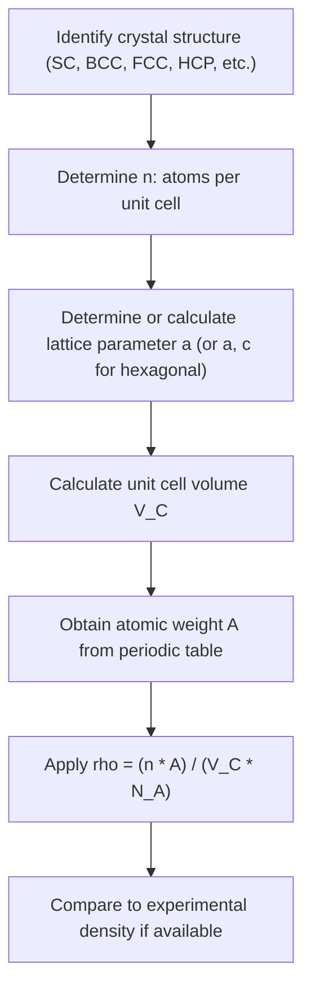

## Density Computations from Crystal Structure

### Fundamental Concept

Because crystalline materials consist of a periodically repeating unit cell containing a known, fixed number of atoms of known mass, the **theoretical density** of a crystalline material can be calculated directly from its crystal structure data — specifically, the number of atoms per unit cell, the unit cell volume, and the atomic weight of the constituent element(s) — without any need for direct physical measurement.

### The Theoretical Density Formula

The theoretical density, $\rho$, is given by:

$$\rho = \frac{n A}{V_C N_A}$$

where:

- $n$ = number of atoms associated with each unit cell
- $A$ = atomic weight (g/mol)
- $V_C$ = volume of the unit cell (cm³)
- $N_A$ = Avogadro's number, $6.022 \times 10^{23}$ atoms/mol

This relationship follows directly from dimensional reasoning: the numerator, $nA$, represents the mass (in grams) of all atoms formally belonging to one mole's worth of unit cells (since $A$ is the mass of $N_A$ atoms, $nA/N_A$ is the mass of the $n$ atoms in a single unit cell), and dividing by the unit cell volume, $V_C$, converts this mass into a density (mass per unit volume).

### Determining the Unit Cell Volume

For the **cubic system**, where $a = b = c$ and all angles are 90°, the unit cell volume is simply:

$$V_C = a^3$$

For non-cubic systems, the general formula for unit cell volume incorporates all six lattice parameters ($a$, $b$, $c$, $\alpha$, $\beta$, $\gamma$):

$$V_C = abc\sqrt{1 - \cos^2\alpha - \cos^2\beta - \cos^2\gamma + 2\cos\alpha\cos\beta\cos\gamma}$$

This general expression simplifies considerably for higher-symmetry systems — for example, for the hexagonal system ($a = b \neq c$, $\alpha = \beta = 90°$, $\gamma = 120°$):

$$V_C = \frac{3\sqrt{3}}{2}a^2c \approx 2.598\,a^2c$$

### Worked Example: BCC Iron

**Given**: Iron (Fe) crystallizes in the BCC structure at room temperature, with lattice parameter $a = 0.2866\ \text{nm} = 2.866 \times 10^{-8}\ \text{cm}$, atomic weight $A = 55.85\ \text{g/mol}$, and $n = 2$ atoms per unit cell (BCC structure).

**Step 1 — Calculate unit cell volume:**

$$V_C = a^3 = (2.866 \times 10^{-8}\ \text{cm})^3 = 2.355 \times 10^{-23}\ \text{cm}^3$$

**Step 2 — Apply the density formula:**

$$\rho = \frac{n A}{V_C N_A} = \frac{(2)(55.85\ \text{g/mol})}{(2.355 \times 10^{-23}\ \text{cm}^3)(6.022 \times 10^{23}\ \text{atoms/mol})}$$

$$\rho = \frac{111.70}{14.18} \approx 7.87\ \text{g/cm}^3$$

**Output**: The theoretical density of BCC iron is approximately $7.87\ \text{g/cm}^3$, which agrees closely with the experimentally measured density of iron (approximately $7.87\ \text{g/cm}^3$ at room temperature).

### Worked Example: FCC Copper

**Given**: Copper (Cu) crystallizes in the FCC structure, with atomic radius $R = 0.1278\ \text{nm}$, atomic weight $A = 63.55\ \text{g/mol}$, and $n = 4$ atoms per unit cell (FCC structure).

**Step 1 — Determine the lattice parameter from the atomic radius** using the FCC touching-sphere relationship:

$$a = 2R\sqrt{2} = 2(0.1278 \times 10^{-7}\ \text{cm})(1.414) \approx 3.615 \times 10^{-8}\ \text{cm}$$

**Step 2 — Calculate unit cell volume:**

$$V_C = a^3 = (3.615 \times 10^{-8}\ \text{cm})^3 \approx 4.724 \times 10^{-23}\ \text{cm}^3$$

**Step 3 — Apply the density formula:**

$$\rho = \frac{(4)(63.55)}{(4.724 \times 10^{-23})(6.022 \times 10^{23})} = \frac{254.2}{28.45} \approx 8.94\ \text{g/cm}^3$$

**Output**: The theoretical density of FCC copper is approximately $8.94\ \text{g/cm}^3$, which closely matches the accepted experimental density of copper (approximately $8.96\ \text{g/cm}^3$).

### Calculation Workflow Summary

### Sources of Discrepancy Between Theoretical and Measured Density

Theoretical density calculated from ideal crystal structure data typically agrees closely with experimentally measured density, but small discrepancies are commonly observed in practice. [Inference] These discrepancies are generally attributed by materials scientists to one or more of the following factors, though the specific dominant cause varies by material and sample history:

- **Point defects**: vacancies (missing atoms at lattice sites) reduce actual mass per unit volume relative to the theoretical, defect-free calculation, since theoretical density assumes a perfect, defect-free lattice
- **Impurities and alloying**: the presence of solute atoms with different atomic weight or size than the assumed pure element alters the effective mass and/or lattice parameter used in measurement
- **Porosity**: in processed or sintered materials, residual porosity (especially relevant in ceramics and powder-metallurgy parts) reduces measured bulk density below the fully dense theoretical value
- **Measurement/rounding precision**: uncertainty in the experimentally determined lattice parameter (typically from X-ray diffraction) or in tabulated atomic weight values propagates into the calculated theoretical density

### Extension to Multi-Element Compounds

For crystalline compounds containing more than one element (e.g., ceramic compounds such as $\text{MgO}$ or $\text{NaCl}$), the same general formula applies, but the numerator $nA$ must be replaced by the sum of the formula-unit masses of all species contained within the unit cell:

$$\rho = \frac{n' \left(\sum A_C + \sum A_A\right)}{V_C N_A}$$

where $n'$ is the number of formula units per unit cell, and $\sum A_C$ and $\sum A_A$ represent the sum of atomic weights of the cations and anions, respectively, per formula unit.

### Key Points

- Theoretical density requires only $n$, $A$, $V_C$, and $N_A$ — no direct physical measurement is needed
- $V_C = a^3$ for cubic systems; more complex expressions apply for lower-symmetry crystal systems
- Close agreement between theoretical and experimental density is a common validation check for a proposed crystal structure or lattice parameter
- Discrepancies are typically attributed to point defects, impurities, porosity, or measurement uncertainty
- The same formula framework extends to multi-element compounds by summing formula-unit masses

### Related Topics

- Unit Cells and Lattice Parameters
- Metallic Crystal Structures (FCC, BCC, HCP)
- Atomic Packing Factor
- Point Defects (Vacancies and Interstitials)
- X-Ray Diffraction and Lattice Parameter Determination
- Ceramic Crystal Structures
- Polymorphism and Allotropy