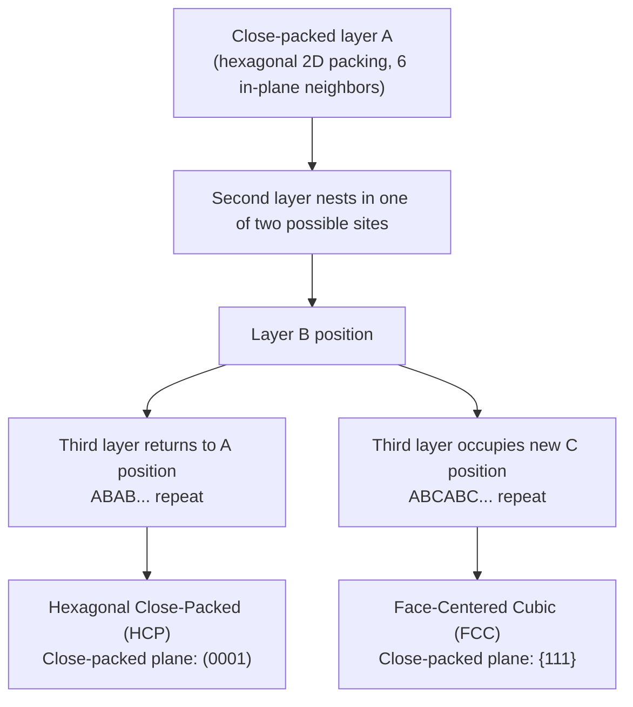

## Close Packed Structures and Coordination Number

### Fundamental Concept

**Close-packed structures** refer to atomic arrangements in which spheres of equal size are packed together as densely as geometrically possible, minimizing unoccupied space. The **coordination number (CN)** is defined as the number of nearest-neighbor atoms directly touching a given reference atom. These two concepts are closely linked: the theoretical maximum coordination number for equal-sized spheres in three dimensions is **12**, and structures that achieve this maximum are termed close-packed structures.

### The Concept of Close-Packed Planes

A **close-packed plane** is a two-dimensional atomic layer in which each atom is surrounded by the maximum possible number of neighbors within that plane — specifically, 6 neighbors arranged hexagonally, achieving the maximum 2D packing density. Three-dimensional close-packed structures are built by stacking these close-packed planes in specific sequences, with each atom in one layer nesting into the depression formed by three atoms in the adjacent layer.

### Stacking Sequences: The Origin of FCC and HCP

When close-packed planes are stacked, there are exactly two distinct sites (commonly labeled B and C) into which a second layer can nest atop a first layer (labeled A). Depending on which of these sites is chosen for each subsequent layer, two distinct three-dimensional close-packed structures result:

- **ABCABC... stacking** → produces the **face-centered cubic (FCC)** structure, in which the close-packed planes correspond to the {111} crystallographic plane family
- **ABAB... stacking** → produces the **hexagonal close-packed (HCP)** structure, in which the close-packed plane is the (0001) basal plane

Both stacking sequences achieve **identical packing efficiency**, since both involve the same local nesting geometry between adjacent layers; the difference lies only in whether the third layer repeats the position of the first layer (HCP, two-layer repeat) or occupies a third, distinct position before repeating (FCC, three-layer repeat).

This diagram illustrates the two close-packed stacking sequences:

### Coordination Number by Structure Type

| Structure | Coordination Number | Atomic Packing Factor | Close-Packed? |
| --- | --- | --- | --- |
| Simple Cubic (SC) | 6 | 0.52 | No |
| Body-Centered Cubic (BCC) | 8 | 0.68 | No (near close-packed) |
| Face-Centered Cubic (FCC) | 12 | 0.74 | Yes |
| Hexagonal Close-Packed (HCP) | 12 | 0.74 | Yes |

**Key Points**

- Coordination number 12 and APF 0.74 together represent the theoretical maximum packing density for equal-sized hard spheres in three dimensions
- FCC and HCP are the only two common metallic crystal structures that achieve true close-packing
- BCC, despite its relatively high APF (0.68) compared to simple cubic, is **not** a true close-packed structure — its coordination number of 8 nearest neighbors is supplemented by 6 additional next-nearest neighbors only slightly farther away, giving BCC an "effective" coordination somewhat higher than 8 in practice, though the formal nearest-neighbor CN remains 8

### Determining Coordination Number Within a Given Structure

For each principal metallic crystal structure, coordination number can be verified geometrically by counting the number of atoms whose centers lie at the nearest-neighbor distance from a given reference atom:

- **FCC**: a corner atom is surrounded by 12 nearest neighbors — 4 face-centered atoms in its own unit cell layer, plus 4 face-centered atoms from the layer above, plus 4 from the layer below (counting across shared unit cells)
- **BCC**: a corner atom's nearest neighbor is the body-centered atom, and by symmetry there are 8 such body-centered atoms in the surrounding unit cells equidistant from any given corner atom
- **HCP**: an atom in the basal plane is surrounded by 6 neighbors within its own basal plane, plus 3 neighbors in the layer above and 3 in the layer below, totaling 12

### Significance of Coordination Number

Coordination number and packing density have several important consequences for material behavior:

- **Density**: higher packing density (higher APF) generally corresponds to higher material density for a given atomic mass, all else being equal, since more atoms occupy a given volume
- **Diffusion and phase transformations**: the relative openness of a structure (lower APF, e.g., BCC) generally permits somewhat faster atomic diffusion than a more densely packed structure (higher APF, e.g., FCC), since there is more open volume for atoms to move through — this is [Inference] a widely cited explanation for the generally higher self-diffusion rates observed in BCC iron compared to FCC iron at comparable homologous temperatures, though the magnitude of the effect and its universality across all BCC/FCC metal pairs depends on additional factors such as bonding strength and activation energy specific to each system
- **Mechanical behavior**: the availability of true close-packed planes (as in FCC and HCP) directly enables dislocation slip along those planes, since close-packed planes have the largest interplanar spacing and lowest resistance to shear, which is why FCC metals are generally highly ductile

### Coordination Number in Ionic and Covalent Structures

While coordination number of 12 represents the packing-driven maximum for pure metallic (non-directional, equal-sized sphere) bonding, coordination numbers in **ionic** compounds are instead governed by the **radius ratio** ($r_{cation}/r_{anion}$) between cation and anion, since ions of different size and charge must satisfy both geometric packing and electrical neutrality constraints — typically resulting in lower coordination numbers (4, 6, or 8) depending on the specific radius ratio. In **covalent** structures, coordination number is dictated by the number of covalent bonds an atom must form to satisfy its valence requirements (e.g., $CN = 4$ for tetrahedrally-bonded carbon in diamond), rather than by geometric close-packing considerations at all.

### Key Points Summary

- Close-packed structures achieve the maximum possible coordination number (12) and atomic packing factor (0.74) for equal-sized spheres
- Two distinct three-dimensional stacking sequences of close-packed planes exist: ABCABC... (FCC) and ABAB... (HCP)
- Both achieve identical packing efficiency despite different overall crystal symmetry
- BCC and SC are not true close-packed structures and have lower coordination numbers (8 and 6, respectively)
- Coordination number rules differ fundamentally between metallic (packing-driven), ionic (radius-ratio-driven), and covalent (valence-driven) bonding systems

### Related Topics

- Metallic Crystal Structures (FCC, BCC, HCP)
- Unit Cells and Lattice Parameters
- Atomic Packing Factor
- Miller Indices for Directions and Planes
- Slip Systems and Plastic Deformation
- Ionic Crystal Structures and Radius Ratios
- Diffusion Mechanisms in Solids
- Polymorphism and Allotropy