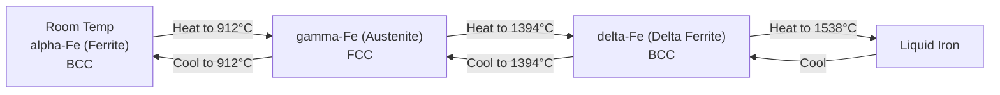

## Polymorphism and Allotropy

### Definition and Fundamental Concept

**Polymorphism** is the phenomenon in which a single chemical substance can exist in more than one crystal structure, depending on external conditions such as temperature and pressure. When this phenomenon occurs specifically in elemental (single-element) solids, the more specific term **allotropy** is used, though the two terms are frequently used interchangeably in materials science literature. Each distinct crystal structure that the substance can adopt is referred to as a **polymorph** (or, for elements, an **allotrope**).

Polymorphism arises because, at different temperatures and pressures, different crystal structures may represent the thermodynamically stable (minimum free energy) configuration for a given substance. As conditions change, the substance can undergo a **polymorphic transformation** — a solid-state phase transformation from one crystal structure to another.

### Iron as the Classic Example

Iron (Fe) is the most commonly cited example of allotropy in introductory materials science, due to its critical importance in steel metallurgy. Pure iron exhibits the following sequence of allotropic transformations upon heating from room temperature to its melting point:

| Temperature Range | Allotrope | Crystal Structure |
| --- | --- | --- |
| Room temperature to 912°C | $\alpha$-iron (ferrite) | Body-centered cubic (BCC) |
| 912°C to 1394°C | $\gamma$-iron (austenite) | Face-centered cubic (FCC) |
| 1394°C to 1538°C (melting point) | $\delta$-iron (delta ferrite) | Body-centered cubic (BCC) |

This diagram illustrates the temperature-dependent allotropic sequence of pure iron:

**[Inference]** The reappearance of the BCC structure at the highest temperature ($\delta$-iron) after the intermediate FCC ($\gamma$-iron) phase is a well-documented experimental observation; the underlying thermodynamic reasoning (relating to the relative free energy contributions of vibrational entropy and magnetic effects at different temperature ranges) is generally covered in more advanced physical metallurgy treatments and is not typically derived from first principles in introductory coverage.

This allotropic behavior of iron is the fundamental basis for essentially all heat treatment processes applied to steel (e.g., annealing, normalizing, quenching, and tempering), since the solubility of carbon differs dramatically between BCC ferrite (very low carbon solubility, ~0.02 wt% maximum) and FCC austenite (much higher carbon solubility, up to ~2.1 wt%), and controlling the cooling rate through the austenite-to-ferrite transformation is the primary lever by which steel microstructures — and therefore mechanical properties — are engineered.

### Carbon: The Prototypical Allotropy Example

Carbon exhibits some of the most dramatic property differences between allotropes of any element, illustrating how profoundly crystal structure (and associated bonding) can affect macroscopic behavior despite identical chemical composition:

| Allotrope | Crystal Structure | Bonding | Key Properties |
| --- | --- | --- | --- |
| Diamond | Cubic (diamond cubic) | Covalent, $sp^3$, 3D network | Extremely hard, electrically insulating, high thermal conductivity, transparent |
| Graphite | Hexagonal | Covalent ($sp^2$) within layers; van der Waals between layers | Soft, electrically conductive (within basal plane), opaque, good lubricant |
| Fullerenes (e.g., $\text{C}_{60}$) | Molecular (discrete cage molecules) | Covalent within cage; van der Waals between molecules | Molecular solid, distinct electronic and mechanical properties |
| Graphene | Single 2D hexagonal sheet | Covalent ($sp^2$) within sheet | Exceptional strength, extremely high electrical/thermal conductivity |

[Inference] The dramatic property contrast between diamond and graphite — despite both being composed purely of carbon atoms — is frequently used as a canonical illustration in materials science education of the general principle that crystal structure and bonding arrangement, not merely chemical composition, are primary determinants of macroscopic material properties.

### Other Common Examples of Polymorphism

- **Titanium**: exists as $\alpha$-titanium (HCP, stable at lower temperature) and $\beta$-titanium (BCC, stable above approximately 883°C) — this transformation is exploited extensively in titanium alloy heat treatment and alloy design (e.g., $\alpha$, $\beta$, and $\alpha$-$\beta$ titanium alloys)
- **Zirconium**: similarly transforms between $\alpha$-Zr (HCP) at lower temperature and $\beta$-Zr (BCC) at higher temperature
- **Tin**: exhibits the well-known transformation between $\beta$-tin (white tin, tetragonal, metallic and ductile, stable above 13.2°C) and $\alpha$-tin (gray tin, diamond cubic structure, brittle, stable below 13.2°C) — historically significant as "tin pest," a degradation phenomenon that has affected metal artifacts and equipment in cold conditions
- **Silica ($\text{SiO}_2$)**: exhibits several polymorphs including quartz, tridymite, and cristobalite, each stable within specific temperature ranges, of importance in ceramics processing
- **Zinc sulfide (ZnS)**: exists as both zinc blende (cubic) and wurtzite (hexagonal) structures

### Mechanisms of Polymorphic Transformation

Polymorphic transformations can occur through different atomic-scale mechanisms, generally classified as:

- **Diffusion-dependent (reconstructive) transformations**: require breaking of atomic bonds and long-range atomic rearrangement, and are therefore relatively slow, strongly time- and temperature-dependent processes (e.g., the pearlite transformation in steel)
- **Diffusionless (displacive) transformations**: involve only small, coordinated atomic displacements without long-range diffusion, and can therefore occur extremely rapidly (essentially athermally, dependent primarily on temperature rather than time) — the classic example being the **martensitic transformation** in steel, where FCC austenite transforms to a highly strained body-centered tetragonal (BCT) martensite structure upon rapid quenching

**Key Points**

- Polymorphism = multiple possible crystal structures for one substance; allotropy = the same phenomenon restricted to elemental solids
- Transformations between polymorphs are driven by changes in the thermodynamically stable (lowest free energy) structure with temperature and/or pressure
- Iron's BCC-FCC-BCC sequence is foundational to steel heat treatment
- Carbon's allotropes (diamond, graphite, fullerenes, graphene) illustrate the dramatic effect of crystal structure/bonding on macroscopic properties independent of chemical composition
- Transformations may proceed via diffusion-dependent (reconstructive, slow) or diffusionless (displacive, rapid) mechanisms

### Related Topics

- Metallic Crystal Structures (FCC, BCC, HCP)
- The Seven Crystal Systems and Fourteen Bravais Lattices
- Iron-Carbon Phase Diagram and Steel Heat Treatment
- Martensitic Transformations
- Covalent Bonding
- Density Computations from Crystal Structure
- Ceramic Crystal Structures and Silica Polymorphs
- Diffusion Mechanisms in Solids