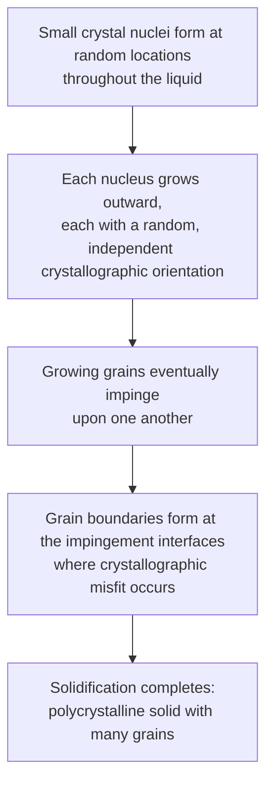

## Single Crystals versus Polycrystalline Materials

### Fundamental Concept

Crystalline solids can be broadly classified by the extent to which their periodic atomic arrangement extends throughout the material without interruption. A **single crystal** is a crystalline solid in which the periodic and repeated arrangement of atoms is perfect (or nearly perfect) and extends throughout the entirety of the specimen without interruption, with no boundaries. A **polycrystalline material**, by contrast, is composed of a large number of small individual crystals or "grains," each with its own crystallographic orientation, separated from adjacent grains by **grain boundaries**.

### Single Crystals

In a single crystal, the crystal lattice is continuous and unbroken across the entire sample, meaning the extremities of the specimen may take on regular, well-defined geometric shapes (facets) reflecting the underlying crystal symmetry if the crystal was allowed to grow without physical constraint.

- Single crystals can occur naturally (e.g., certain gemstones, quartz crystals) but are also produced synthetically for specialized applications
- **Synthetic production** typically involves carefully controlled solidification from a melt, in which the orientation of the solid remains constant across the entire growth process — techniques include the Czochralski process (crystal pulling from a melt) and the Bridgman method, both widely used to produce single-crystal silicon ingots for semiconductor device fabrication
- Single crystals are relatively difficult and expensive to grow, since their production requires precise, slow control over solidification conditions to prevent nucleation of additional, differently-oriented crystals

**Applications of single crystals**:

- **Semiconductor devices**: single-crystal silicon and germanium wafers are essential for integrated circuit fabrication, since grain boundaries would severely disrupt electronic properties (carrier mobility, uniformity)
- **Turbine blades**: single-crystal (and directionally solidified) nickel-based superalloy turbine blades are used in aircraft jet engines and power-generation turbines to eliminate grain boundaries, which are preferential sites for high-temperature creep deformation and failure
- **Optical and piezoelectric devices**: certain applications require the anisotropic optical or piezoelectric properties of a single, defined crystallographic orientation

### Polycrystalline Materials

The vast majority of engineering crystalline materials — essentially all common structural metals, alloys, and many ceramics — are polycrystalline rather than single-crystal in their as-processed form.

**Formation via solidification**: When a polycrystalline material solidifies from a molten or liquid state, the transformation proceeds through the following general stages:

Because each nucleus forms and grows with an independent, essentially random crystallographic orientation relative to its neighbors, the final solidified material consists of numerous individual grains, each internally a small single crystal, joined together at grain boundaries where the crystallographic orientation abruptly changes from one grain to the next.

### Grain Boundaries

A **grain boundary** is the two-dimensional interfacial region separating two grains of different crystallographic orientation. Key characteristics include:

- Atoms at the grain boundary are in a somewhat disordered configuration compared to the interior of either adjoining grain, since the boundary must accommodate the mismatch in crystallographic orientation between the two grains
- Grain boundaries represent regions of comparatively higher energy than the interior of a grain (the ordered crystal interior represents the lower-energy state), due to this atomic disorder
- Grain boundaries act as barriers to dislocation motion during plastic deformation, since a dislocation must change direction to continue moving across a grain boundary into a differently-oriented neighboring grain — this is the fundamental mechanism behind **grain boundary strengthening** (the Hall-Petch relationship), in which materials with smaller average grain size exhibit higher yield strength
- Grain boundaries are also preferential sites for atomic diffusion (since the disordered boundary structure provides comparatively open, higher-energy pathways) and for the nucleation of new phases during solid-state transformations

### Isotropy and Anisotropy: A Key Distinguishing Property

A crucial distinction between single crystals and polycrystalline materials lies in their directional property behavior:

- **Single crystals** frequently exhibit **anisotropy** — the variation of a physical property (elastic modulus, electrical conductivity, thermal expansion, etc.) with crystallographic direction, since atomic spacing and bonding density genuinely differ along different crystallographic directions within the ordered lattice
- **Polycrystalline materials**, if the individual grains have **random crystallographic orientation** (no preferred orientation, or "texture"), tend to exhibit approximately **isotropic** bulk properties, because the property variations of the many randomly-oriented individual grains statistically average out over the bulk specimen, even though each individual grain remains internally anisotropic
- If, however, the grains in a polycrystalline material share a **preferred crystallographic orientation** — a condition known as **texture**, commonly introduced by certain forming processes such as rolling or wire drawing — the bulk material can exhibit **anisotropic** properties despite being polycrystalline, since the random-averaging assumption no longer holds

**Key Points**

- Single crystal = one continuous, uninterrupted crystal lattice throughout the specimen
- Polycrystalline = many small grains, each an individual crystal, separated by grain boundaries
- Grain boundaries are regions of atomic disorder, elevated energy, restricted dislocation motion, and enhanced diffusion
- Randomly-oriented polycrystalline materials tend toward isotropic bulk behavior; textured polycrystalline materials can be anisotropic
- Single crystals are used where grain boundaries are specifically undesirable (semiconductors, turbine blades); polycrystalline materials dominate general structural and engineering applications

### Comparative Summary

| Feature | Single Crystal | Polycrystalline |
| --- | --- | --- |
| Lattice continuity | Uninterrupted throughout specimen | Interrupted by grain boundaries |
| Grain boundaries | Absent (ideally) | Present, separating individual grains |
| Typical bulk property behavior | Anisotropic | Isotropic (random orientation) or anisotropic (textured) |
| Production difficulty/cost | High (controlled slow solidification) | Lower (conventional casting/processing) |
| Typical applications | Semiconductor wafers, turbine blades, optical components | Structural metals, most engineering alloys and ceramics |
| Mechanical strength relationship | Governed by intrinsic bonding/slip anisotropy | Enhanced by grain boundary strengthening (Hall-Petch relationship) as grain size decreases |

### Related Topics

- Metallic Crystal Structures (FCC, BCC, HCP)
- Anisotropy in Single Crystals
- Grain Boundaries and Hall-Petch Strengthening
- Polymorphism and Allotropy
- Solidification and Nucleation
- Crystallographic Texture
- Diffusion Mechanisms in Solids
- Semiconductor Processing and Czochralski Crystal Growth