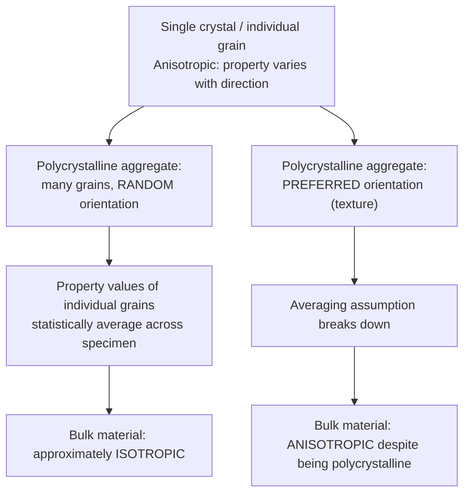

## Anisotropy in Crystalline Materials

### Definition and Fundamental Concept

**Anisotropy** refers to the directional dependence of a physical property — meaning the property's magnitude varies depending on the crystallographic direction along which it is measured. The opposite condition, in which a property has the same magnitude regardless of measurement direction, is termed **isotropy**. Anisotropy arises fundamentally from the fact that atomic spacing and the density of bonds vary with crystallographic direction within an ordered crystal lattice — directions with more closely-spaced, more strongly-bonded atoms generally exhibit different property values than directions with more widely-spaced, more weakly-bonded atoms.

### Physical Origin of Anisotropy

Within any crystal structure, the linear density of atoms (number of atoms per unit length along a given direction) and the planar density of atoms (number of atoms per unit area within a given plane) both vary depending on which crystallographic direction or plane is considered. Since interatomic bonding strength and atomic spacing directly govern properties such as elastic stiffness, thermal expansion, and electrical conductivity, any variation of atomic density and bond strength with direction necessarily produces a corresponding variation of these properties with direction.

**Key Points**

- Anisotropy is an intrinsic consequence of the ordered, periodic, and generally non-spherically-symmetric nature of crystal lattices
- The degree of anisotropy (the magnitude of property variation between different directions) varies significantly between different crystal structures and different specific properties
- Higher-symmetry crystal systems (e.g., cubic) generally exhibit less pronounced anisotropy for certain properties (though notably, cubic crystals are not perfectly isotropic for all properties, particularly elastic modulus) compared to lower-symmetry systems (e.g., hexagonal, tetragonal, orthorhombic)

### Example: Elastic Modulus Anisotropy

The **modulus of elasticity** (Young's modulus) is a commonly cited example of a directionally-variable property in single crystals. For a cubic crystal, the elastic modulus values measured along the principal directions typically differ:

| Metal (Cubic) | $E_{[100]}$ (GPa) | $E_{[110]}$ (GPa) | $E_{[111]}$ (GPa) |
| --- | --- | --- | --- |
| Iron (BCC) | ~125 | ~210 | ~272 |
| Copper (FCC) | ~66 | ~130 | ~191 |
| Aluminum (FCC) | ~63 | ~72 | ~76 |

[Inference] These specific numerical values are commonly cited illustrative figures for the degree of elastic anisotropy in cubic metals found in standard materials science references; because the precise magnitude can vary somewhat between different literature sources and measurement conditions, the values presented here should be understood as representative of the qualitative trend (that $E_{[111]} > E_{[110]} > E_{[100]}$ for these particular FCC and BCC metals) rather than as precisely universal constants.

The ratio of the maximum to minimum elastic modulus value provides a convenient, single-number index of the degree of anisotropy present in a given cubic crystal; aluminum, for example, is often noted as being nearly elastically isotropic (with $E_{[111]}/E_{[100]}$ close to 1), while iron and copper show substantially greater anisotropy.

### Isotropy in Polycrystalline Materials

Although individual single crystals or individual grains within a polycrystalline material are generally anisotropic, a bulk polycrystalline specimen composed of many small grains with **random crystallographic orientation** typically exhibits approximately **isotropic** average properties. This arises because the property values of the many differently-oriented grains statistically average out across the specimen as a whole, even though the microscopic origin (each individual grain) remains anisotropic.

This diagram illustrates how random grain orientation in a polycrystal leads to averaged, approximately isotropic bulk behavior despite individual grain anisotropy:

### Crystallographic Texture

When a polycrystalline material's grains are **not** randomly oriented but instead share a statistically preferred crystallographic orientation, this condition is termed **texture**. Texture commonly develops as a result of certain material processing operations, particularly those involving significant plastic deformation with a preferred deformation direction:

- **Rolling**: sheet and plate metal rolling frequently produces a rolling texture, in which grains tend to align with specific crystallographic planes and directions parallel to the rolling direction and rolling plane
- **Wire drawing**: drawn wire frequently develops a fiber texture, in which a specific crystallographic direction (e.g., $\langle 111 \rangle$ or $\langle 110 \rangle$ depending on the metal) aligns preferentially along the wire axis
- **Directional solidification**: controlled solidification processes (e.g., for turbine blade manufacture) can intentionally introduce texture, aligning grains along a desired direction to optimize properties (such as creep resistance) along that direction

Textured polycrystalline materials exhibit **anisotropic** bulk properties as a direct consequence, which can be either an undesirable side effect requiring correction (e.g., "earing" defects during deep-drawing of textured sheet metal) or a deliberately engineered and exploited characteristic (e.g., grain-oriented electrical steel, in which texture is intentionally introduced to optimize magnetic permeability along the desired direction for transformer core applications).

### Anisotropy in Other Properties

Beyond elastic modulus, anisotropy can manifest in numerous other physical and mechanical properties of single crystals and textured polycrystalline materials:

- **Thermal expansion**: many non-cubic crystals (e.g., zinc, HCP) show substantially different thermal expansion coefficients along different crystallographic axes (e.g., along $a$ versus $c$)
- **Electrical conductivity**: notably pronounced in graphite, where conductivity within the covalently-bonded basal plane vastly exceeds conductivity perpendicular to the plane (across the weakly van der Waals-bonded layers)
- **Magnetic permeability**: iron exhibits pronounced magnetic anisotropy, being magnetized far more easily along $\langle 100 \rangle$ directions than along $\langle 111 \rangle$ directions — the basis for grain-oriented electrical steel
- **Yield strength and slip behavior**: single crystals show markedly different critical resolved shear stress and yield behavior depending on the orientation of the applied load relative to the crystal's slip systems

### Practical and Engineering Significance

Anisotropy is a critical consideration in materials selection, processing, and design:

- **Single-crystal components** (e.g., turbine blades) are intentionally oriented during manufacture so that the crystal's stiffest and most creep-resistant direction aligns with the primary in-service loading direction
- **Sheet metal forming** must account for anisotropic behavior (quantified via parameters such as the plastic strain ratio, $r$-value) to predict and control forming defects
- **Isotropic assumption in engineering design**: for most general engineering calculations involving polycrystalline metals with randomly oriented, fine grains, the simplifying assumption of isotropic bulk behavior is standard practice and generally provides sufficiently accurate predictions, though this assumption should be explicitly reconsidered whenever significant texture is known or suspected to be present in the material

### Key Points Summary

- Anisotropy = property variation with crystallographic direction; isotropy = no such variation
- Arises from directionally-varying atomic spacing and bond density within the crystal lattice
- Single crystals are generally anisotropic; randomly-oriented polycrystals are approximately isotropic; textured polycrystals are anisotropic
- Elastic modulus anisotropy in cubic metals is a standard illustrative example
- Texture, whether incidental (rolling, drawing) or intentional (grain-oriented steel, directionally solidified blades), governs whether a polycrystalline material behaves anisotropically in practice

### Related Topics

- Single Crystals versus Polycrystalline Materials
- Miller Indices for Directions and Planes
- Metallic Crystal Structures (FCC, BCC, HCP)
- Bond Energy and Interatomic Forces
- Grain Boundaries and Hall-Petch Strengthening
- Crystallographic Texture and Preferred Orientation
- Elastic Deformation and Modulus of Elasticity