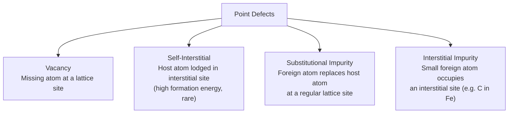

## Point Defects: Vacancies and Interstitials

### Fundamental Concept

A **crystalline defect** is any deviation from the perfectly ordered, periodic arrangement of atoms assumed in an ideal crystal lattice. **Point defects** are the simplest category of crystalline imperfection, characterized by a deviation localized to, or associated with, a single lattice point or a very small cluster of atomic sites — as opposed to line defects (dislocations), planar defects (grain boundaries, stacking faults), or volume defects (voids, precipitates), which extend over larger spatial scales.

No crystalline material is ever completely free of point defects; a certain equilibrium concentration of point defects exists in any crystal at any temperature above absolute zero, as a direct consequence of thermodynamics.

### Vacancies

A **vacancy** is the simplest point defect, consisting of a normally-occupied lattice site from which the atom is missing.

The equilibrium concentration of vacancies, $N_v$, increases exponentially with absolute temperature, following an Arrhenius-type relationship:

$$N_v = N \exp\left(-\frac{Q_v}{kT}\right)$$

where:

- $N$ = total number of atomic (lattice) sites per unit volume
- $Q_v$ = activation energy required to form a vacancy (J/mol or eV/atom)
- $k$ = Boltzmann's constant ($8.62 \times 10^{-5}\ \text{eV/atom·K}$, or $1.38 \times 10^{-23}\ \text{J/atom·K}$)
- $T$ = absolute temperature (K)

**Key Points**

- Vacancy concentration increases exponentially with temperature — this is why more vacancies are present near a material's melting point than at room temperature (typically, the equilibrium fraction of vacant lattice sites reaches on the order of $10^{-4}$ near the melting point for many metals, compared to a far smaller fraction near room temperature)
- The existence of a nonzero equilibrium vacancy concentration at any $T > 0\,\text{K}$ is a direct thermodynamic consequence: even though creating a vacancy requires an energy input $Q_v$ (raising the internal energy), the associated increase in configurational entropy (from the enormous number of ways vacancies can be arranged among lattice sites) makes some nonzero vacancy concentration thermodynamically favorable (i.e., it lowers the overall Gibbs free energy) at any finite temperature
- Vacancies are essential to solid-state diffusion, since atomic movement through the lattice by the vacancy diffusion mechanism requires an adjacent vacant site for an atom to move into

**Worked Example**: Calculate the equilibrium number of vacancies per cubic meter of copper at 1000°C (1273 K), given $Q_v = 0.9\ \text{eV/atom}$, density $\rho = 8.4\ \text{g/cm}^3$, and atomic weight $A_{Cu} = 63.5\ \text{g/mol}$.

**Step 1 — Calculate $N$, the number of atomic sites per unit volume:**

$$N = \frac{N_A \rho}{A_{Cu}} = \frac{(6.022 \times 10^{23})(8.4)}{63.5} \approx 8.0 \times 10^{22}\ \text{atoms/cm}^3 = 8.0 \times 10^{28}\ \text{atoms/m}^3$$

**Step 2 — Apply the vacancy concentration formula:**

$$N_v = N \exp\left(-\frac{Q_v}{kT}\right) = (8.0 \times 10^{28}) \exp\left(-\frac{0.9}{(8.62 \times 10^{-5})(1273)}\right)$$

$$N_v = (8.0 \times 10^{28}) \exp(-8.20) \approx (8.0 \times 10^{28})(2.74 \times 10^{-4})$$

**Output**: $N_v \approx 2.2 \times 10^{25}\ \text{vacancies/m}^3$

### Self-Interstitials

A **self-interstitial** is an atom of the host material that has become lodged into an interstitial site — a small, normally unoccupied space between regularly positioned atoms in the crystal structure. Self-interstitials are considerably rarer than vacancies in most metals, for a clear geometric reason: interstitial sites in close-packed metallic structures are quite small relative to the size of the host atoms, so introducing a self-interstitial requires substantial compressive distortion of the surrounding lattice, giving it a much higher formation energy than a vacancy.

[Inference] Because of this significantly higher formation energy, self-interstitial equilibrium concentrations are typically several orders of magnitude lower than equilibrium vacancy concentrations at the same temperature in most common metals, though the precise ratio depends on the specific metal and its crystal structure.

### Impurity Point Defects

Point defects also arise from the presence of foreign (impurity or alloying) atoms within the host lattice, classified into two categories based on their location:

- **Substitutional impurity atoms**: a host atom is replaced by an impurity atom of a different element at a regular lattice site. The **Hume-Rothery rules** describe conditions favoring extensive substitutional solid solubility, including similar atomic radii (within approximately 15%), similar crystal structures, similar electronegativities, and similar valences between solute and solvent
- **Interstitial impurity atoms**: a small impurity atom (typically much smaller than the host atom, such as carbon, nitrogen, hydrogen, or boron in a metal lattice) occupies an interstitial site between host atoms, rather than replacing a host atom — the classic example being carbon atoms occupying octahedral interstitial sites in the BCC or FCC iron lattice in steel, which is fundamental to steel's mechanical properties (solid solution strengthening, martensite formation)

This diagram illustrates the principal categories of point defects:

### Point Defects in Ionic Compounds

Ionic crystals exhibit additional constraints on point defect formation, since **local electroneutrality** must be maintained (the overall charge balance of the crystal cannot be disrupted by defect formation without compensating defects). This gives rise to two characteristic paired-defect structures:

- **Frenkel defect**: a cation vacates its normal lattice site and becomes lodged in a nearby interstitial position, creating a cation vacancy paired with a cation self-interstitial — charge neutrality is preserved because the same ion is simply relocated, not removed from the crystal
- **Schottky defect**: a cation vacancy and an anion vacancy occur together, in a stoichiometric ratio matching the compound's chemical formula (e.g., one cation vacancy paired with one anion vacancy in a 1:1 compound such as NaCl), preserving overall electroneutrality by removing matched pairs of oppositely charged ions from the lattice

[Inference] The relative prevalence of Frenkel versus Schottky defects in a given ionic compound is generally understood to depend on the relative sizes of the cation and anion (Frenkel defects being more favorable when the cation is small enough to fit into interstitial sites without excessive lattice strain) and on the specific crystal structure, though determining which defect type dominates in a specific real material typically requires experimental or computational study rather than prediction from general first principles alone.

### Significance of Point Defects for Material Properties

Point defects, despite their small individual scale, have substantial consequences for macroscopic material behavior:

- **Diffusion**: vacancies provide the essential mechanism for substitutional atomic diffusion in solids (vacancy diffusion mechanism); interstitial impurity atoms diffuse via the interstitial diffusion mechanism, generally faster than vacancy-mediated diffusion due to the smaller size and higher mobility of interstitial species
- **Solid solution strengthening**: both substitutional and interstitial impurity atoms distort the surrounding lattice, interacting with and impeding dislocation motion, thereby increasing the yield strength of the material (e.g., carbon interstitials in iron are the primary strengthening mechanism in martensitic steel)
- **Electrical properties**: point defects in semiconductors (dopant atoms, typically substitutional) are deliberately introduced to control electrical conductivity type and magnitude (n-type and p-type doping)
- **Density deviation**: as noted in theoretical density calculations, the presence of vacancies causes measured density to be slightly lower than the theoretical, defect-free value

### Key Points Summary

- Vacancies: missing atoms at lattice sites; equilibrium concentration increases exponentially with temperature per $N_v = N\exp(-Q_v/kT)$
- Self-interstitials: host atoms in interstitial sites; much higher formation energy and lower concentration than vacancies
- Substitutional and interstitial impurity atoms introduce point defects associated with alloying/doping
- Frenkel and Schottky defects are the characteristic paired point-defect structures in ionic compounds, required to maintain electroneutrality
- Point defects are essential to diffusion, solid solution strengthening, and controlled semiconductor doping

### Related Topics

- Density Computations from Crystal Structure
- Diffusion Mechanisms in Solids
- Solid Solution Strengthening
- Dislocations and Line Defects
- Grain Boundaries and Planar Defects
- Ionic Bonding
- Hume-Rothery Rules and Solid Solubility
- Semiconductor Doping