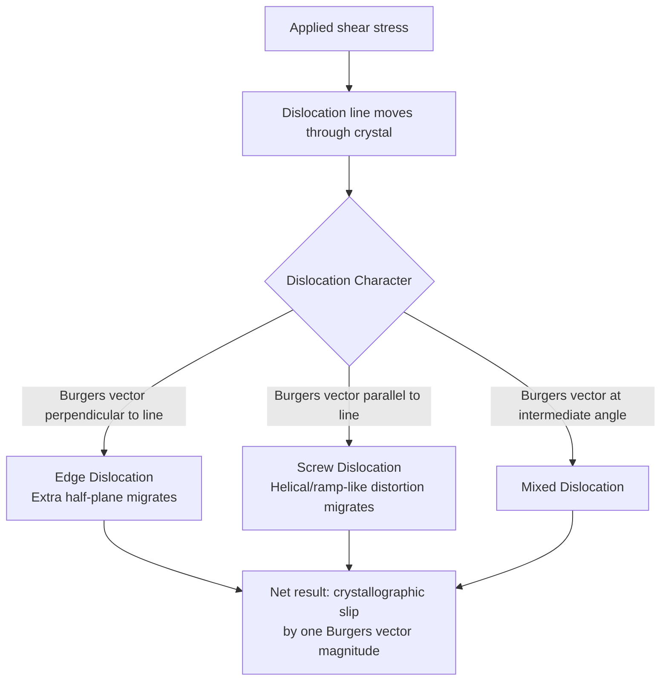

## Line Defects: Edge and Screw Dislocations

### Fundamental Concept

A **dislocation** is a one-dimensional (line) crystalline defect around which the atoms are misaligned from their normal, perfectly periodic lattice positions. Unlike point defects, which are localized to single atomic sites, dislocations extend as a line through the crystal, and their motion through the lattice is the primary mechanism by which **plastic (permanent) deformation** occurs in crystalline materials. The two limiting, idealized dislocation types are the **edge dislocation** and the **screw dislocation**; most real dislocations are of **mixed character**, combining edge and screw components along their length.

### Edge Dislocations

An **edge dislocation** can be visualized as the edge of an extra half-plane of atoms that has been inserted into an otherwise perfect crystal lattice. The line defect itself, called the **dislocation line**, runs along the terminating edge of this extra half-plane, perpendicular to the direction in which the extra half-plane was inserted.

**Key geometric features**:

- Directly above the dislocation line (where the extra half-plane terminates), the lattice is in a state of **compression**, since atoms are crowded more closely together than in the perfect lattice
- Directly below the dislocation line, the lattice is in a state of **tension**, since atoms are pulled farther apart to accommodate the absence of the extra half-plane
- This localized region of lattice strain (both compressive and tensile) surrounding the dislocation line is termed the **strain field**, and it is this strain field that governs the interaction of the dislocation with other defects (point defects, other dislocations, grain boundaries)

This diagram illustrates the structure of an edge dislocation:

<svg xmlns="http://www.w3.org/2000/svg" viewBox="0 0 400 300">
<text x="200" y="25" text-anchor="middle" font-size="16" font-weight="bold" fill="#1a1a1a">Edge Dislocation (svg_diagram)</text>
<g stroke="#888" stroke-width="1" fill="#333">
<circle cx="60" cy="80" r="6" /><circle cx="100" cy="80" r="6" /><circle cx="140" cy="80" r="6" /><circle cx="180" cy="80" r="6" /><circle cx="220" cy="80" r="6" /><circle cx="260" cy="80" r="6" /><circle cx="300" cy="80" r="6" /><circle cx="340" cy="80" r="6" />
<circle cx="60" cy="120" r="6" /><circle cx="100" cy="120" r="6" /><circle cx="140" cy="120" r="6" /><circle cx="180" cy="120" r="6" /><circle cx="220" cy="120" r="6" /><circle cx="260" cy="120" r="6" /><circle cx="300" cy="120" r="6" /><circle cx="340" cy="120" r="6" />
<circle cx="60" cy="200" r="6" /><circle cx="100" cy="200" r="6" /><circle cx="140" cy="200" r="6" /><circle cx="180" cy="200" r="6" /><circle cx="220" cy="200" r="6" /><circle cx="260" cy="200" r="6" /><circle cx="300" cy="200" r="6" /><circle cx="340" cy="200" r="6" />
<circle cx="60" cy="240" r="6" /><circle cx="100" cy="240" r="6" /><circle cx="140" cy="240" r="6" /><circle cx="180" cy="240" r="6" /><circle cx="220" cy="240" r="6" /><circle cx="260" cy="240" r="6" /><circle cx="300" cy="240" r="6" /><circle cx="340" cy="240" r="6" />
</g>
<g stroke="#333" stroke-width="1" fill="#c0392b">
<circle cx="200" cy="150" r="6" /><circle cx="200" cy="160" r="6" fill="#c0392b" />
</g>
<line x1="200" y1="70" x2="200" y2="140" stroke="#1a1a1a" stroke-width="3" />
<text x="215" y="105" font-size="12" font-weight="bold">Extra half-plane</text>
<text x="90" y="170" font-size="11" fill="#c0392b">⊥ dislocation line (into page)</text>
<text x="40" y="270" font-size="10" fill="#555">Compression above, tension below the dislocation line</text>
</svg>

### Screw Dislocations

A **screw dislocation** can be visualized as forming when a crystal is subjected to a shear stress that displaces one region of the lattice relative to another by an amount corresponding to one atomic spacing, but only over part of the crystal, leaving a partial slip boundary. The resulting atomic plane arrangement spirals around the dislocation line in a ramp-like, helical (screw-like) fashion — hence the name.

**Key geometric features**:

- Unlike the edge dislocation, a screw dislocation does not involve the insertion of an extra half-plane of atoms
- The Burgers vector (defined below) of a screw dislocation is oriented **parallel** to the dislocation line itself, in contrast to the edge dislocation, where the Burgers vector is **perpendicular** to the dislocation line
- The lattice distortion around a screw dislocation is predominantly **shear strain**, rather than the combined compressive/tensile strain characteristic of an edge dislocation

### The Burgers Vector

The **Burgers vector**, $\mathbf{b}$, is a vector quantity that characterizes the magnitude and direction of the lattice distortion associated with a dislocation. It is determined by tracing a closed atomic path (a Burgers circuit) around the dislocation line in a perfect region of the lattice, then tracing the equivalent path around the actual dislocation in the defective crystal; the vector required to close this second path (from the finishing point back to the starting point) is the Burgers vector.

| Dislocation Type | Relationship Between Burgers Vector and Dislocation Line |
| --- | --- |
| Edge dislocation | Burgers vector is **perpendicular** to the dislocation line |
| Screw dislocation | Burgers vector is **parallel** to the dislocation line |
| Mixed dislocation | Burgers vector is at some intermediate angle to the dislocation line |

**Key Points**

- The Burgers vector magnitude, for a perfect (unit) dislocation, typically corresponds to one interatomic spacing along a close-packed direction of the crystal structure
- The Burgers vector is invariant along the entire length of a given dislocation line, even as the dislocation's character transitions between edge, screw, and mixed along its path (for example, in a dislocation loop)
- The Burgers vector directly determines the direction and magnitude of the crystallographic slip produced when the dislocation moves through the crystal

### Dislocation Motion and Plastic Deformation

Dislocations move through the crystal lattice via a mechanism called **slip**, which is the fundamental atomic-scale process underlying macroscopic plastic deformation in crystalline materials:

- Slip occurs preferentially on specific **slip planes** (typically the most densely-packed, close-packed crystallographic planes) along specific **slip directions** (typically the most densely-packed, close-packed crystallographic directions)
- A slip plane and slip direction combination together define a **slip system**; a crystal structure with a greater number of available slip systems (such as FCC, with 12 slip systems) generally exhibits greater ductility than a crystal structure with fewer available slip systems (such as HCP, with typically only 3 basal slip systems readily active at room temperature)
- Dislocation motion requires substantially less applied stress than would be needed to shear an entire perfect crystal plane simultaneously, since only the atomic bonds directly adjacent to the dislocation line need to be broken and reformed at any given instant as the dislocation propagates — this is the fundamental reason why the theoretical shear strength of a perfect crystal vastly exceeds the experimentally observed yield strength of real crystalline materials, which contain dislocations

This diagram summarizes the relationship between dislocation type, Burgers vector orientation, and the resulting slip process:

### Dislocation Density and Its Significance

**Dislocation density** is defined as the total length of dislocation line per unit volume of material (units: mm/mm³, equivalently mm⁻²), or equivalently as the number of dislocations intersecting a unit cross-sectional area. Dislocation density is a critical microstructural parameter influencing mechanical behavior:

- Carefully-grown, nearly perfect single crystals can have very low dislocation densities (as low as $10^3$ mm⁻²)
- Heavily cold-worked (plastically deformed) metals can have dislocation densities as high as $10^9$–$10^{10}$ mm⁻² or greater
- Increasing dislocation density (e.g., through cold working) generally **increases** strength and hardness while decreasing ductility, since the dislocations themselves interact with and impede the motion of one another (dislocations moving on intersecting slip systems obstruct each other) — this is the fundamental basis of **strain hardening** (work hardening)

### Key Points Summary

- Edge dislocation: extra half-plane of atoms; Burgers vector perpendicular to dislocation line; localized compressive/tensile strain field
- Screw dislocation: helical/ramp-like lattice distortion; Burgers vector parallel to dislocation line; localized shear strain field
- Mixed dislocations combine edge and screw character and are most commonly observed in real crystals
- The Burgers vector characterizes dislocation magnitude and direction and remains constant along a given dislocation line
- Dislocation motion (slip) is the fundamental mechanism of plastic deformation; slip systems, dislocation density, and their interactions govern strength, hardness, and ductility

### Related Topics

- Slip Systems and Plastic Deformation
- Metallic Crystal Structures (FCC, BCC, HCP)
- Point Defects: Vacancies and Interstitials
- Strain Hardening (Cold Working)
- Grain Boundaries and Hall-Petch Strengthening
- Critical Resolved Shear Stress
- Miller Indices for Directions and Planes