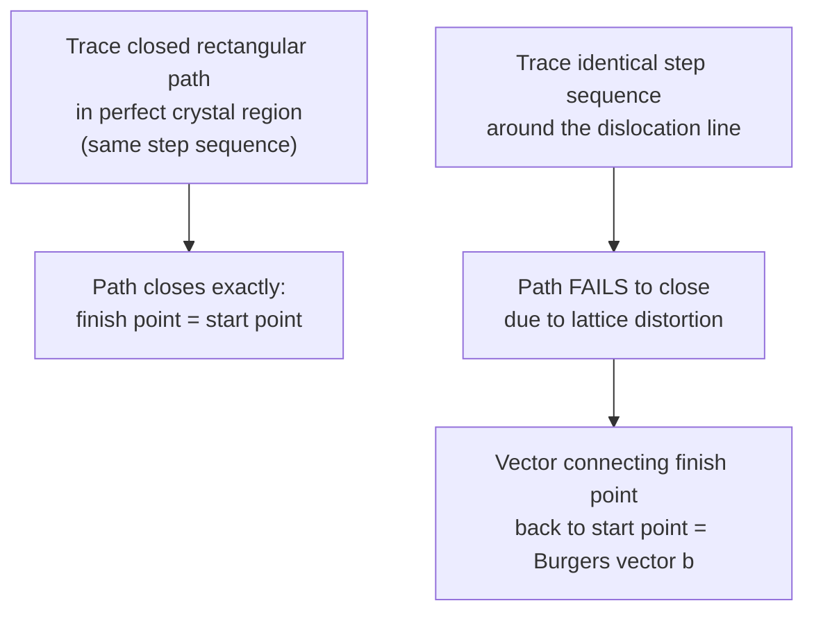

## Burgers Vector and Dislocation Motion

### Fundamental Concept

The **Burgers vector**, denoted $\mathbf{b}$, is the fundamental quantity that characterizes the magnitude and direction of lattice distortion associated with a dislocation. It quantifies precisely how much, and in which crystallographic direction, the lattice on one side of the dislocation is displaced relative to the lattice on the other side. Every dislocation, regardless of its edge, screw, or mixed character, has an associated Burgers vector, and this vector governs both the geometry of the dislocation and the physical result (slip) produced when the dislocation moves through the crystal.

### Determining the Burgers Vector: The Burgers Circuit

The Burgers vector is determined through a standardized geometric procedure called a **Burgers circuit**:

1. In a defect-free (perfect) region of the crystal, trace a closed atom-to-atom path forming a complete loop (e.g., a rectangle traced by stepping a fixed number of atomic spacings in each of several directions, returning exactly to the starting atom)
2. Trace the **same sequence of steps** (same number of atomic spacings in each of the same directions) starting from an equivalent atom, but this time in the region of the crystal containing the dislocation, with the path enclosing the dislocation line
3. Because the dislocation introduces a lattice distortion, this second path will **fail to close** — it will finish at a different atom than it started from
4. The vector required to connect the finish point back to the start point (closing the circuit) is defined as the Burgers vector, $\mathbf{b}$

This diagram illustrates the Burgers circuit procedure conceptually:

### Relationship Between Burgers Vector and Dislocation Type

The orientation of the Burgers vector relative to the dislocation line is the defining geometric distinction between the two limiting dislocation types:

| Dislocation Type | Burgers Vector Orientation Relative to Dislocation Line |
| --- | --- |
| Edge dislocation | **Perpendicular** ($\mathbf{b} \perp$ dislocation line) |
| Screw dislocation | **Parallel** ($\mathbf{b} \parallel$ dislocation line) |
| Mixed dislocation | At some intermediate angle between 0° and 90° |

**Key Points**

- The Burgers vector is **invariant along the entire length of a single dislocation line**, even where the dislocation's local character transitions between edge, screw, and mixed (for example, along a curved dislocation or a closed dislocation loop) — this invariance is a defining topological property of a dislocation
- The Burgers vector magnitude for a "perfect" or "unit" dislocation typically corresponds to exactly one interatomic spacing measured along a close-packed crystallographic direction of the host structure (e.g., $\mathbf{b} = \tfrac{a}{2}\langle110\rangle$ for FCC metals, $\mathbf{b} = \tfrac{a}{2}\langle111\rangle$ for BCC metals)
- "Partial" dislocations, with a Burgers vector smaller than a full lattice translation, can also exist in certain crystal structures (notably FCC metals), and are associated with stacking faults

### Dislocation Energy and the Burgers Vector

The strain energy per unit length associated with a dislocation is proportional to the square of the Burgers vector magnitude:

$$E_{dislocation} \propto G b^2$$

where $G$ is the shear modulus of the material and $b = |\mathbf{b}|$ is the Burgers vector magnitude. [Inference] This proportionality is a standard, well-established result derived from linear elasticity theory applied to the dislocation strain field; because dislocation energy scales with $b^2$, dislocations strongly favor Burgers vectors of the smallest possible magnitude available in a given crystal structure (typically corresponding to the shortest lattice translation vector along a close-packed direction), which is why full dislocations in real crystals are overwhelmingly observed with unit Burgers vectors rather than larger multiples.

### Dislocation Motion: Glide and Climb

Dislocations move through the crystal lattice via two principal mechanisms:

- **Glide (slip)**: the dislocation moves within the plane containing both the dislocation line and its Burgers vector (the **slip plane**), by successive, localized breaking and reforming of atomic bonds directly at the dislocation core. Glide requires no long-range atomic diffusion and can occur relatively easily under an applied shear stress; it is the dominant mechanism of plastic deformation at low-to-moderate temperatures.
- **Climb**: the dislocation (specifically, the edge component) moves **out of** its slip plane, in a direction perpendicular to its Burgers vector, by the absorption or emission of vacancies at the dislocation core. Because climb requires vacancy diffusion, it is a thermally-activated process that becomes significant only at elevated temperatures (typically above approximately $0.4\,T_m$, where $T_m$ is the absolute melting temperature), and is a key mechanism enabling high-temperature creep deformation.

Pure screw dislocations, lacking an extra half-plane, cannot climb; climb is a mechanism available only to the edge component of a dislocation.

### Slip Systems: Combining Slip Plane and Slip Direction

A **slip system** consists of the combination of a specific slip plane and a specific slip direction (the direction of the Burgers vector) along which dislocation glide occurs. Slip preferentially occurs on the most densely-packed (close-packed) planes, along the most densely-packed (close-packed) directions, since these combinations minimize the Burgers vector magnitude and therefore the energy required for slip.

| Crystal Structure | Slip Plane(s) | Slip Direction | Number of Slip Systems |
| --- | --- | --- | --- |
| FCC | {111} | $\langle 110 \rangle$ | 12 |
| BCC | {110}, {112}, {123} (multiple, temperature-dependent) | $\langle 111 \rangle$ | 48 (many, though individually less favorable) |
| HCP | (0001) basal | $\langle 11\bar{2}0 \rangle$ | 3 (basal only; additional systems require higher stress) |

**Key Points**

- FCC metals, despite having fewer total slip systems than BCC, generally exhibit high ductility because their 12 {111}$\langle110\rangle$ slip systems are all highly favorable (low critical resolved shear stress) and well-distributed in orientation space
- HCP metals, with only 3 readily-active basal slip systems at room temperature, generally show more limited ductility unless supplementary slip systems (prismatic, pyramidal) or mechanical twinning are activated, which typically requires elevated temperature or specific alloy composition

### Critical Resolved Shear Stress

Dislocation glide on a given slip system initiates only once the shear stress resolved onto that slip plane, in the slip direction, reaches a critical threshold value called the **critical resolved shear stress (CRSS)**. This resolved shear stress, $\tau_R$, relates to the applied uniaxial tensile stress, $\sigma$, through **Schmid's Law**:

$$\tau_R = \sigma \cos\phi \cos\lambda$$

where $\phi$ is the angle between the tensile axis and the slip plane normal, and $\lambda$ is the angle between the tensile axis and the slip direction. The product $\cos\phi\cos\lambda$ is termed the **Schmid factor**. Yielding begins on whichever slip system(s) reach their CRSS first — generally the system(s) with the highest Schmid factor for the given loading orientation, assuming similar CRSS values across the available systems.

### Key Points Summary

- The Burgers vector characterizes dislocation displacement magnitude and direction, determined via the Burgers circuit method
- Edge dislocations: $\mathbf{b} \perp$ line; screw dislocations: $\mathbf{b} \parallel$ line; the Burgers vector is invariant along a given dislocation
- Dislocation strain energy scales with $Gb^2$, favoring minimum-magnitude Burgers vectors
- Glide (in-plane, athermal) and climb (out-of-plane, thermally activated, vacancy-mediated) are the two fundamental dislocation motion mechanisms
- Slip systems combine a close-packed slip plane and slip direction; the number and favorability of available slip systems governs ductility differences between FCC, BCC, and HCP metals
- Schmid's Law and the critical resolved shear stress determine which slip system(s) activate first under a given applied stress

### Related Topics

- Line Defects: Edge and Screw Dislocations
- Metallic Crystal Structures (FCC, BCC, HCP)
- Point Defects: Vacancies and Interstitials
- Strain Hardening (Cold Working)
- Creep Deformation at Elevated Temperature
- Schmid's Law and Critical Resolved Shear Stress
- Miller Indices for Directions and Planes