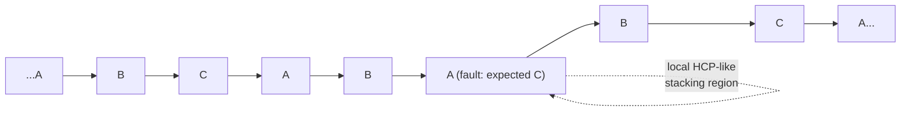

## Stacking Faults and Phase Boundaries

### Fundamental Concept

Stacking faults and phase boundaries are both planar (two-dimensional) crystalline defects, but they differ fundamentally in origin and character. A **stacking fault** is a local interruption in the otherwise regular stacking sequence of close-packed atomic planes, occurring within a single, chemically homogeneous phase. A **phase boundary**, by contrast, is an interface separating two distinct phases — regions differing in chemical composition and/or crystal structure — within a multiphase material.

### Stacking Faults: Origin in Close-Packed Stacking Sequences

As established in the discussion of close-packed structures, the two principal close-packed metallic crystal structures are distinguished by their stacking sequence of close-packed atomic planes:

- **FCC**: stacking sequence **ABCABC...** (three-layer repeat, along {111} planes)
- **HCP**: stacking sequence **ABAB...** (two-layer repeat, along the (0001) basal plane)

A **stacking fault** occurs when this regular sequence is locally disrupted over a limited region of the crystal, without a permanent change to the overall crystal structure elsewhere. For example, in an FCC crystal, a stacking fault might introduce a local sequence such as ...ABCAB**A**BCABC..., where the bolded layer represents a local deviation that momentarily resembles the ABAB HCP stacking sequence before the normal FCC sequence resumes.

This diagram illustrates a stacking fault as a local interruption of the FCC ABCABC stacking sequence:

### Formation via Partial Dislocations

Stacking faults are generally bounded, at their perimeter within the crystal, by **partial dislocations** — dislocations possessing a Burgers vector smaller in magnitude than the full unit lattice translation vector characteristic of the perfect crystal structure. A full (unit) dislocation in an FCC crystal can, under favorable energetic conditions, dissociate into two partial dislocations connected by a ribbon of stacking fault:

$$\mathbf{b}_{full} \rightarrow \mathbf{b}_{partial,1} + \mathbf{b}_{partial,2}$$

[Inference] This dissociation reaction is generally understood to be energetically favorable in many FCC metals because, per the relationship $E \propto Gb^2$ governing dislocation strain energy, splitting a single full dislocation into two partials, each with smaller Burgers vector magnitude, can reduce the total strain energy — provided the resulting stacking fault energy penalty (the additional planar-defect energy of the fault ribbon connecting the two partials) does not outweigh this strain energy reduction.

### Stacking Fault Energy

The **stacking fault energy (SFE)** is a material-specific parameter quantifying the energy per unit area associated with a stacking fault. Its magnitude has substantial consequences for deformation behavior:

| Stacking Fault Energy | Dislocation Dissociation Width | Cross-Slip Behavior | Representative Materials | Deformation Characteristics |
| --- | --- | --- | --- | --- |
| Low SFE | Wide (partials well-separated) | Difficult (restricted) | Austenitic stainless steel, brass, silver | Strong strain hardening; planar slip; enhanced twinning tendency |
| High SFE | Narrow (partials closely spaced) | Easy | Aluminum, nickel | Comparatively lower strain hardening; wavy slip; reduced twinning tendency |

**Key Points**

- A low stacking fault energy favors wide separation between the two partial dislocations bounding a fault, since a lower energy penalty per unit area of fault allows the partials to spread farther apart before the increasing total fault energy balances the repulsive elastic interaction between the two partials
- Widely-separated partial dislocations are more difficult to constrict back together, which is required for cross-slip (a dislocation changing from one slip plane to another) to occur — this is [Inference] a widely accepted explanation for why low-SFE materials such as austenitic stainless steels exhibit pronounced planar slip character and correspondingly strong strain hardening rates compared to high-SFE materials such as aluminum, though the complete picture of strain hardening behavior also involves additional factors such as dislocation cell structure formation and alloy composition effects
- Low stacking fault energy is also generally associated with an increased tendency toward **annealing twin formation** during recrystallization, since the same energetic factors that favor wide stacking fault ribbons also favor the low-energy, mirror-symmetric twin boundary configuration

### Phase Boundaries

A **phase boundary** is the interface separating two regions of a material that differ in chemical composition and/or crystal structure — that is, an interface between two distinct **phases**. This is a fundamentally different type of planar defect from a stacking fault or grain boundary, both of which separate regions of identical composition and crystal structure (differing only in stacking sequence or crystallographic orientation, respectively).

**Common examples of phase boundaries in engineering materials**:

- **Ferrite-cementite interfaces**: the boundaries between the BCC $\alpha$-ferrite phase and the orthorhombic cementite ($\text{Fe}_3\text{C}$) phase, which together constitute the lamellar pearlite microstructure in steel
- **Matrix-precipitate interfaces**: boundaries between a solid solution matrix phase and a precipitate phase (e.g., $\theta'$ or $\theta$ precipitates in age-hardened Al-Cu alloys), which are central to precipitation (age) hardening
- **Matrix-second-phase interfaces** in composite and multiphase materials generally, including reinforcement-matrix interfaces in composite materials

### Coherency of Phase Boundaries

Phase boundaries are further classified by the degree of atomic-scale lattice matching (**coherency**) across the interface:

- **Coherent boundary**: the atomic planes of the two phases match up continuously across the interface, with the lattice mismatch accommodated entirely by elastic strain (lattice distortion) rather than by the introduction of dislocations at the boundary. Coherent interfaces have relatively low interfacial energy.
- **Semi-coherent boundary**: partial matching of atomic planes occurs across the interface, with the remaining mismatch accommodated by a periodic array of interfacial dislocations, analogous in structure to a low-angle grain boundary
- **Incoherent boundary**: no meaningful continuity of atomic planes exists across the interface; the interface resembles a high-angle grain boundary in its degree of atomic disorder, and generally possesses the highest interfacial energy of the three coherency types

[Inference] The degree of coherency at a phase boundary is generally understood to be a critical factor governing precipitation hardening effectiveness, since coherent and semi-coherent precipitate interfaces typically produce a stronger, more effective strengthening effect (through a combination of coherency strain fields and, for semi-coherent interfaces, dislocation interactions at the boundary) than fully incoherent precipitates of comparable size and spacing, though the precise relationship between coherency, precipitate size, and optimal strengthening is alloy-system-specific and generally determined through experimental characterization (e.g., via the well-known overaging phenomenon, in which precipitates coarsen and typically transition toward lower coherency, reducing strengthening effectiveness).

### Comparative Summary

| Feature | Stacking Fault | Phase Boundary |
| --- | --- | --- |
| Compositional change across interface | None (same phase) | Yes (distinct phases) |
| Crystal structure change | Local, temporary (stacking sequence only) | Permanent, structural (differing crystal structures typical) |
| Bounding defect | Partial dislocations | May involve interfacial dislocations (semi-coherent case) |
| Typical role | Governs dislocation dissociation, cross-slip, twinning tendency | Central to precipitation hardening, multiphase microstructure behavior |
| Coherency classification | Not typically applicable | Coherent, semi-coherent, or incoherent |

### Key Points Summary

- Stacking faults are local interruptions of the normal ABCABC (FCC) or ABAB (HCP) stacking sequence, bounded by partial dislocations
- Stacking fault energy governs dislocation dissociation width, cross-slip ease, strain hardening behavior, and twinning tendency
- Phase boundaries separate chemically and/or structurally distinct phases, distinguishing them from stacking faults and grain boundaries
- Phase boundary coherency (coherent, semi-coherent, incoherent) is a key factor in precipitation hardening effectiveness

### Related Topics

- Planar Defects: Grain Boundaries and Twin Boundaries
- Burgers Vector and Dislocation Motion
- Close Packed Structures and Coordination Number
- Line Defects: Edge and Screw Dislocations
- Precipitation (Age) Hardening
- Iron-Carbon Phase Diagram and Steel Heat Treatment
- Strain Hardening (Cold Working)