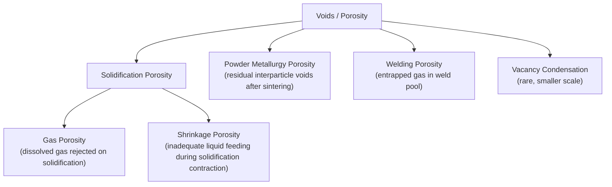

## Volume Defects: Voids and Inclusions

### Fundamental Concept

**Volume (bulk) defects** are three-dimensional crystalline imperfections that occupy a finite volume within a material's microstructure, distinguishing them from point defects (zero-dimensional), line defects/dislocations (one-dimensional), and planar defects (two-dimensional). Volume defects are generally larger in physical extent than the other defect categories, ranging from nanometer-to-micrometer scale precipitates and porosity up to macroscopic cracks and processing defects, and they typically arise from the processing history of the material (solidification, powder consolidation, welding, casting) rather than from equilibrium thermodynamic considerations, as is the case with point defects.

### Voids and Porosity

A **void** (or **pore**) is a three-dimensional region within a material that is devoid of solid material — essentially, a gas-filled or vacuum cavity embedded within the solid microstructure. Porosity is quantified as the volume fraction of a material occupied by voids.

**Common origins of voids and porosity**:

- **Solidification (casting) porosity**: arises from two principal mechanisms during the casting of metals — **gas porosity**, resulting from dissolved gases (commonly hydrogen in aluminum alloys, or nitrogen and oxygen in steels) coming out of solution and forming bubbles as the metal solidifies (since gas solubility in a metal is generally significantly lower in the solid state than in the liquid state), and **shrinkage porosity**, resulting from the volumetric contraction that occurs as liquid metal solidifies and cools, if this volume change is not adequately compensated by continued feeding of liquid metal into the solidifying region
- **Powder metallurgy and sintering porosity**: residual porosity remaining after the consolidation and sintering of a powder compact, since complete elimination of the interparticle void space present in the initial powder packing is rarely achieved without additional processing (hot isostatic pressing, extended sintering time, or liquid-phase sintering)
- **Welding porosity**: entrapped gas bubbles that fail to escape the weld pool before solidification, often resulting from contamination, moisture, or inadequate shielding gas coverage during the welding process
- **Vacancy condensation**: at a much smaller scale, an excess concentration of point-defect vacancies (for example, following rapid quenching from high temperature) can, under appropriate conditions, condense together to form a small void, though such vacancy-derived voids are typically far smaller in scale than processing-related porosity

This diagram summarizes the principal origins of voids and porosity in engineering materials:

### Effects of Porosity on Material Properties

Porosity generally has a substantially detrimental effect on mechanical properties, since voids act as stress concentrators and reduce the effective load-bearing cross-sectional area of the material:

- **Reduced strength and stiffness**: the presence of porosity reduces the effective density and load-bearing area, generally decreasing tensile strength, fatigue strength, and elastic modulus relative to a fully dense specimen of the same material
- **Stress concentration**: the sharp or irregular geometry frequently associated with voids (particularly shrinkage porosity, which often has an irregular, interconnected morphology) can create locally amplified stress fields under applied loading, promoting premature crack initiation
- **Fatigue life reduction**: porosity is a particularly significant concern for components subjected to cyclic loading, since pores serve as preferential sites for fatigue crack initiation — [Inference] this is a widely recognized reason why cast and additively-manufactured metal components, which are more prone to residual porosity than wrought (forged or rolled) components, are often subjected to hot isostatic pressing (HIP) treatment specifically to close internal porosity and improve fatigue performance, particularly for critical aerospace and biomedical applications, though the specific porosity thresholds and HIP parameters required vary by alloy system and application
- **Reduced ductility**: voids can promote premature fracture through a mechanism involving void nucleation, growth, and eventual coalescence under plastic strain, reducing the material's ability to deform before failure

### Inclusions

An **inclusion** is a discrete particle of a foreign substance — chemically distinct from the surrounding matrix material — embedded within the microstructure of a material. Inclusions are distinguished from intentional second-phase particles (such as strengthening precipitates) primarily by their generally unintentional, often deleterious origin in processing, although the boundary between "inclusion" and "intentional second phase" is not always sharply defined in practice.

**Common origins of inclusions**:

- **Deoxidation products in steelmaking**: oxide particles (e.g., alumina, silica, manganese silicates) formed as a byproduct of the deoxidation practice used to remove dissolved oxygen from liquid steel prior to solidification
- **Refractory erosion**: particles of furnace or ladle refractory lining material that become entrained into the melt during processing
- **Slag entrapment**: entrainment of slag (the byproduct layer of oxides and other compounds that floats atop molten metal during refining) into the solidifying metal
- **Sulfide inclusions**: manganese sulfide (MnS) and similar compounds, common in steel, forming from the reaction of sulfur impurities with alloying elements

**Effects of inclusions on properties**:

- Inclusions, similar to voids, generally act as **stress concentrators** and preferential sites for the nucleation of fatigue cracks and ductile fracture voids, since the inclusion-matrix interface typically represents a region of reduced cohesive strength (particularly for non-metallic inclusions with a large elastic modulus and thermal expansion mismatch relative to the metallic matrix)
- Elongated or stringer-shaped inclusions (commonly resulting from the mechanical deformation of originally more equiaxed inclusions during hot rolling or forging) can introduce pronounced **anisotropy** in mechanical properties, particularly reducing ductility and toughness in the direction transverse to the primary working direction
- **Beneficial exceptions**: certain inclusions are deliberately controlled or even intentionally introduced for beneficial effect — for example, controlled sulfide inclusion morphology (via calcium treatment) is used in free-machining steels to improve machinability by promoting chip breakage, and fine, well-dispersed oxide or nitride particles are intentionally used in oxide-dispersion-strengthened (ODS) alloys to provide high-temperature creep resistance

### Comparative Summary

| Feature | Voids/Porosity | Inclusions |
| --- | --- | --- |
| Composition | Absence of material (gas/vacuum) | Distinct solid material embedded in matrix |
| Common origin | Solidification (gas/shrinkage), sintering, welding | Deoxidation products, refractory erosion, slag entrapment, sulfides |
| Typical effect on strength | Decreased (reduced load-bearing area, stress concentration) | Decreased (stress concentration, interfacial weakness) |
| Typical effect on fatigue life | Decreased (crack initiation sites) | Decreased (crack initiation sites) |
| Mitigation strategies | Hot isostatic pressing, improved gating/riser design, degassing | Clean steelmaking practice, filtration, inclusion shape control |
| Potential beneficial use | Generally none (porosity is control target for removal) | Controlled inclusions (e.g., MnS for machinability, ODS particles) |

### Key Points Summary

- Volume defects are three-dimensional imperfections, generally arising from processing history rather than equilibrium thermodynamics
- Voids/porosity originate primarily from solidification (gas and shrinkage porosity), powder metallurgy sintering, or welding, and generally degrade strength, ductility, and especially fatigue life
- Inclusions are foreign-phase particles, commonly deoxidation products, entrained slag, or sulfides in steel, that act as stress concentrators and crack initiation sites
- Certain inclusions and controlled porosity-reduction treatments (HIP) are deliberately engineered to mitigate these detrimental effects or, in specific cases (MnS, ODS particles), to provide a beneficial functional role

### Related Topics

- Point Defects: Vacancies and Interstitials
- Planar Defects: Grain Boundaries and Twin Boundaries
- Stacking Faults and Phase Boundaries
- Fatigue Failure and Crack Initiation
- Solidification and Casting Defects
- Powder Metallurgy Processing
- Precipitation (Age) Hardening