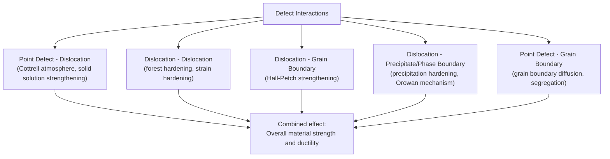

## Defect Interactions and Their Effect on Properties

### Fundamental Concept

While point defects, line defects (dislocations), planar defects, and volume defects are often studied individually, real crystalline materials contain all of these defect categories simultaneously, and their **interactions with one another** are frequently the dominant factor governing macroscopic mechanical, thermal, and electrical behavior. Understanding these interactions — rather than any single defect type in isolation — is essential to explaining and engineering the strengthening mechanisms, diffusion behavior, and failure processes observed in real engineering materials.

### Point Defect–Dislocation Interactions: Solid Solution Strengthening

Point defects (substitutional and interstitial solute atoms) interact with dislocations through their associated elastic strain fields, since both point defects and dislocations locally distort the surrounding crystal lattice:

- A solute atom larger than the host atom creates a local compressive strain field, while a smaller solute atom creates a local tensile strain field
- These solute strain fields interact elastically with the strain field surrounding a dislocation (compressive above an edge dislocation's extra half-plane, tensile below it, as previously established), such that solute atoms tend to migrate toward and segregate at the dislocation location that minimizes the total strain energy of the system (larger solute atoms preferentially occupying the tensile region below the extra half-plane, smaller solutes preferentially occupying the compressive region)
- This solute segregation around a dislocation, known as a **Cottrell atmosphere**, effectively "pins" the dislocation in place, since moving the dislocation away from its solute atmosphere requires additional energy to either drag the atmosphere along or break free of it entirely — this pinning effect is the atomic-scale origin of the pronounced **yield point phenomenon** (upper and lower yield points, and Lüders band formation) observed in low-carbon steels, where the sudden unpinning of dislocations from their carbon/nitrogen Cottrell atmospheres produces a distinct load drop at yielding

### Dislocation–Dislocation Interactions: Strain Hardening

As plastic deformation proceeds, dislocation density increases substantially (often by several orders of magnitude from the initial annealed state), and dislocations moving on intersecting slip systems inevitably interact with one another:

- Dislocations of like sign on parallel slip planes repel one another elastically; dislocations of opposite sign attract and can annihilate upon meeting
- Intersecting dislocations moving on different slip systems can form **dislocation forests** — tangled networks of intersecting dislocation lines that substantially impede further dislocation motion, since a moving dislocation must overcome the stress field of each forest dislocation it encounters (and may also acquire a **jog**, a small step in the dislocation line, when it cuts through another dislocation, which can further impede subsequent motion)
- This progressive impedance of dislocation motion by the increasing population of other dislocations is the fundamental mechanism of **strain hardening (work hardening)**: as plastic strain accumulates, the flow stress required to continue plastic deformation increases, since dislocations must overcome an increasingly dense and tangled dislocation network

This diagram summarizes the principal categories of defect interaction and their resulting strengthening mechanisms:

### Dislocation–Grain Boundary Interactions: Hall-Petch Strengthening

As established in the discussion of planar defects, grain boundaries act as significant barriers to dislocation motion, since a dislocation cannot readily cross into an adjacent, differently-oriented grain without first activating a new slip system aligned favorably with the different crystallographic orientation on the far side of the boundary. Dislocations moving on a given slip system within a grain pile up against the grain boundary, and this dislocation pile-up generates a localized stress concentration at the boundary itself:

$$\sigma_y = \sigma_0 + k_y d^{-1/2}$$

Smaller average grain size, $d$, results in shorter pile-up distances and correspondingly smaller stress concentrations for a given applied stress, meaning a higher applied stress is required to trigger slip transmission (or new dislocation source activation) in the neighboring grain — hence, decreasing grain size increases yield strength ($\sigma_y$) via the **Hall-Petch relationship**. [Inference] This grain-size dependence of strength is one of the most practically significant defect interactions in engineering alloy design, since grain refinement (through controlled thermomechanical processing, alloying with grain-refining elements, or rapid solidification/additive manufacturing techniques) represents one of the few strengthening mechanisms that simultaneously increases strength without a substantial corresponding sacrifice in ductility or toughness, unlike most other strengthening mechanisms.

### Dislocation–Precipitate Interactions: Precipitation Hardening

When a second-phase precipitate particle is present within a matrix (as discussed in the context of phase boundaries), a moving dislocation encountering the precipitate must overcome it through one of two principal mechanisms, depending primarily on precipitate coherency and size:

- **Particle shearing**: for small, coherent precipitates, the dislocation can cut directly through the precipitate particle, though this generally requires additional stress due to the differing lattice structure, stacking fault energy, or ordering within the precipitate compared to the surrounding matrix
- **Orowan looping (bowing mechanism)**: for larger, typically incoherent precipitates, the dislocation cannot shear through the particle and instead bows around it, eventually looping completely around the precipitate and leaving behind a small dislocation loop encircling the particle as the main dislocation line continues forward — this mechanism generally requires progressively higher stress as interparticle spacing decreases

[Inference] The transition between the shearing and Orowan looping mechanisms as precipitate size increases during aging treatment is the well-established physical basis for the characteristic strength-versus-aging-time curve observed in precipitation-hardening alloy systems (peak-aged, underaged, and overaged conditions), since the optimal (peak-aged) strength condition generally corresponds to the precipitate size and spacing at which the transition between shearing and looping mechanisms occurs, though the precise optimal precipitate characteristics are alloy-system-specific and determined empirically through aging curve characterization.

### Point Defect–Grain Boundary Interactions: Diffusion and Segregation

Grain boundaries, owing to their disordered, higher-energy atomic structure, provide comparatively open pathways for atomic diffusion relative to diffusion through the ordered crystal lattice interior — **grain boundary diffusion** generally proceeds considerably faster than **lattice (bulk) diffusion** at a given temperature, particularly at lower temperatures where lattice diffusion is sluggish. Additionally, certain solute or impurity atoms can preferentially **segregate** to grain boundaries, driven by the same type of elastic strain energy minimization that produces Cottrell atmospheres around dislocations, but occurring at the two-dimensional grain boundary interface rather than along a one-dimensional dislocation line. [Inference] Such grain boundary segregation is generally understood to be responsible for certain forms of intergranular embrittlement (for example, temper embrittlement in some alloy steels, associated with the segregation of trace impurity elements such as phosphorus, antimony, or arsenic to prior-austenite grain boundaries), though the specific embrittling mechanism and susceptible alloy compositions are the subject of ongoing specialized metallurgical research.

### Synthesis: Combined Effects on Overall Material Properties

Real engineering alloys are deliberately designed to exploit multiple defect-interaction strengthening mechanisms simultaneously, since these mechanisms are generally understood to combine in an approximately (though not perfectly) additive fashion:

$$\sigma_y \approx \sigma_0 + \Delta\sigma_{ss} + \Delta\sigma_{gb} + \Delta\sigma_{ppt} + \Delta\sigma_{disl}$$

where the terms represent, respectively, the intrinsic lattice friction stress, solid solution strengthening contribution, grain boundary (Hall-Petch) contribution, precipitation hardening contribution, and dislocation (strain hardening) contribution.

**Key Points**

- No single defect type acts in isolation in a real material; the interactions between defect categories (point-dislocation, dislocation-dislocation, dislocation-grain boundary, dislocation-precipitate, point-grain boundary) collectively determine bulk mechanical behavior
- Cottrell atmospheres (point defect-dislocation) explain yield point phenomena in steel
- Dislocation forest interactions explain strain hardening
- Hall-Petch strengthening (dislocation-grain boundary) links grain size directly to yield strength
- The shearing/Orowan looping transition (dislocation-precipitate) explains the aging curve in precipitation-hardened alloys
- Grain boundary segregation (point defect-grain boundary) can contribute to specific embrittlement phenomena
- Alloy design generally seeks to combine multiple strengthening mechanisms, which sum in an approximately additive manner

### Related Topics

- Point Defects: Vacancies and Interstitials
- Impurities and Solid Solutions
- Line Defects: Edge and Screw Dislocations
- Burgers Vector and Dislocation Motion
- Planar Defects: Grain Boundaries and Twin Boundaries
- Stacking Faults and Phase Boundaries
- Precipitation (Age) Hardening
- Strain Hardening (Cold Working)