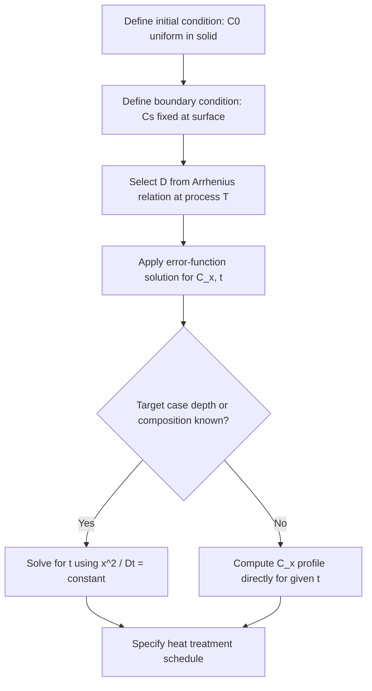

## Fick's First and Second Laws

### Overview

Fick's laws describe the mathematical relationship between the concentration of a diffusing species and its flux through a medium, forming the foundation for analyzing diffusion-controlled processes in solids — carburizing, doping of semiconductors, homogenization of alloys, sintering, and oxidation. The first law addresses **steady-state diffusion** (concentration independent of time), while the second law addresses **non-steady-state (transient) diffusion** (concentration varying with both position and time).

### Fick's First Law

#### Statement

The diffusive flux is proportional to the negative concentration gradient, i.e., diffusion occurs down the concentration gradient, from high to low concentration.

$$J = -D\frac{\partial C}{\partial x}$$

Where:

- $J$ = diffusion flux (amount of substance per unit area per unit time, typically $\text{kg/m}^2\text{s}$ or $\text{atoms/m}^2\text{s}$)
- $D$ = diffusion coefficient (diffusivity), $\text{m}^2/\text{s}$
- $C$ = concentration of diffusing species, $\text{kg/m}^3$
- $\partial C/\partial x$ = concentration gradient along direction $x$

The negative sign indicates that flux flows in the direction of decreasing concentration.

#### Conditions of Applicability

- Steady-state diffusion: the concentration profile $C(x)$ does not change with time at any point ($\partial C/\partial t = 0$).
- The concentration gradient itself may still vary with position, but the flux at any given point is constant over time.

#### Classic Example: Thin Membrane / Gas Permeation

A thin metal membrane (e.g., palladium) separating two gas reservoirs at fixed concentrations $C_1$ and $C_2$ ($C_1 > C_2$) on either face, with thickness $\Delta x$, reaches steady state once concentration on each face stabilizes. The flux becomes:

$$J = -D\frac{C_2 - C_1}{\Delta x} = D\frac{C_1 - C_2}{\Delta x}$$

**Example:**

A steel plate 5 mm thick is at steady-state diffusion of carbon. Surface concentrations are maintained at $C_A = 1.2\ \text{kg/m}^3$ and $C_B = 0.8\ \text{kg/m}^3$ on either face. Given $D = 3 \times 10^{-11}\ \text{m}^2/\text{s}$ at the process temperature:

$$J = D\frac{C_A - C_B}{\Delta x} = (3\times10^{-11})\frac{(1.2 - 0.8)}{5\times10^{-3}} = 2.4 \times 10^{-9}\ \text{kg/m}^2\text{s}$$

### Fick's Second Law

#### Derivation Rationale

In most practical diffusion problems (e.g., carburizing a gear tooth surface), concentration at a point changes with time — flux itself is not constant. Fick's second law is obtained by applying conservation of mass to Fick's first law: the net accumulation rate in a volume element equals the difference between flux in and flux out.

#### Statement (One-Dimensional, Constant D)

$$\frac{\partial C}{\partial t} = D\frac{\partial^2 C}{\partial x^2}$$

This is derived by substituting Fick's first law into the continuity equation:

$$\frac{\partial C}{\partial t} = -\frac{\partial J}{\partial x} = -\frac{\partial}{\partial x}\left(-D\frac{\partial C}{\partial x}\right) = \frac{\partial}{\partial x}\left(D\frac{\partial C}{\partial x}\right)$$

When $D$ is independent of concentration (and hence position), it can be taken outside the derivative, yielding the simplified form above. [Inference] In real systems, $D$ often varies with concentration (particularly for interstitial diffusion at high solute content), in which case the full form $\partial C/\partial t = \partial/\partial x(D\,\partial C/\partial x)$ must be retained and solved numerically.

#### Solution for Semi-Infinite Solid with Constant Surface Concentration

This is the standard boundary-value problem for surface hardening processes (carburizing, nitriding):

**Boundary/Initial Conditions:**

- At $t = 0$: $C = C_0$ throughout the solid
- At $x = 0$ (surface), $t > 0$: $C = C_s$ (constant surface concentration)
- As $x \to \infty$: $C = C_0$

**Solution:**

$$\frac{C_x - C_0}{C_s - C_0} = 1 - \text{erf}\left(\frac{x}{2\sqrt{Dt}}\right)$$

Where:

- $C_x$ = concentration at depth $x$ and time $t$
- $C_0$ = initial uniform concentration in the solid
- $C_s$ = surface concentration (held constant)
- $\text{erf}(z)$ = Gaussian error function

$$\text{erf}(z) = \frac{2}{\sqrt{\pi}}\int_0^z e^{-y^2}\,dy$$

**Key Points:**

- $\text{erf}(0) = 0$, $\text{erf}(\infty) = 1$; values are tabulated or computed numerically.
- $\text{erf}(z)$ is well approximated as linear for small $z$ ($z < 0.5$) and approaches 1 rapidly for $z > 2$.
- The term $x/2\sqrt{Dt}$ is dimensionless and governs the shape of the penetration profile.

#### Worked Example: Carburizing

A low-carbon steel gear ($C_0 = 0.20\ \text{wt\%}$ C) is carburized at 927°C in an atmosphere maintaining $C_s = 1.00\ \text{wt\%}$ C at the surface. Given $D = 1.28 \times 10^{-11}\ \text{m}^2/\text{s}$ at this temperature, find the carbon content at $x = 0.5\ \text{mm} = 5\times10^{-4}\ \text{m}$ after $t = 10\ \text{h} = 36{,}000\ \text{s}$.

Compute the argument:

$$\frac{x}{2\sqrt{Dt}} = \frac{5\times10^{-4}}{2\sqrt{(1.28\times10^{-11})(36000)}} = \frac{5\times10^{-4}}{2\sqrt{4.608\times10^{-7}}} = \frac{5\times10^{-4}}{2(6.79\times10^{-4})} \approx 0.368$$

From error function tables, $\text{erf}(0.368) \approx 0.396$.

$$\frac{C_x - 0.20}{1.00 - 0.20} = 1 - 0.396 = 0.604$$

$$C_x = 0.20 + 0.604(0.80) = 0.20 + 0.483 = 0.68\ \text{wt\%\ C}$$

**Output:** Carbon concentration at 0.5 mm depth after 10 h ≈ **0.68 wt%**.

#### Case-Depth / Time-Temperature Relationship

A practically important consequence: to achieve the same concentration profile (same $C_x/C_s$ ratio at the same $x$), the parameter $x^2/Dt$ must remain constant. This gives the scaling relation for comparing two heat treatments:

$$\frac{x_1^2}{D_1 t_1} = \frac{x_2^2}{D_2 t_2}$$

If temperature (and thus $D$) is held constant, case depth scales with $\sqrt{t}$ — doubling case depth requires roughly quadrupling treatment time.

### Temperature Dependence of D (Arrhenius Relation)

Diffusivity is strongly temperature dependent, following an Arrhenius-type expression:

$$D = D_0 \exp\left(-\frac{Q_d}{RT}\right)$$

Where:

- $D_0$ = temperature-independent pre-exponential factor, $\text{m}^2/\text{s}$
- $Q_d$ = activation energy for diffusion, $\text{J/mol}$
- $R$ = gas constant, $8.314\ \text{J/mol·K}$
- $T$ = absolute temperature, K

Taking the natural log linearizes this relation:

$$\ln D = \ln D_0 - \frac{Q_d}{R}\left(\frac{1}{T}\right)$$

A plot of $\ln D$ vs. $1/T$ yields a straight line with slope $-Q_d/R$, allowing $Q_d$ and $D_0$ to be extracted experimentally.

### Diagram: Concentration Profile Evolution (svg_diagram)

<svg xmlns="http://www.w3.org/2000/svg" viewBox="0 0 640 400">
<rect width="640" height="400" fill="#ffffff" />
<text x="320" y="24" font-size="16" font-family="sans-serif" text-anchor="middle" font-weight="bold">Non-Steady-State Diffusion Profile (svg_diagram)</text>

<line x1="80" y1="340" x2="580" y2="340" stroke="#000" stroke-width="2" />
<line x1="80" y1="340" x2="80" y2="60" stroke="#000" stroke-width="2" />
<text x="330" y="375" font-size="14" font-family="sans-serif" text-anchor="middle">Distance from surface, x</text>
<text x="30" y="200" font-size="14" font-family="sans-serif" text-anchor="middle" transform="rotate(-90 30 200)">Concentration, C</text>

<line x1="80" y1="80" x2="580" y2="80" stroke="#999" stroke-dasharray="4,4" />
<text x="590" y="84" font-size="13" font-family="sans-serif">Cs</text>

<line x1="80" y1="300" x2="580" y2="300" stroke="#999" stroke-dasharray="4,4" />
<text x="590" y="304" font-size="13" font-family="sans-serif">C0</text>

<path d="M 80 80 C 160 90, 200 200, 260 300" stroke="#1f77b4" stroke-width="2.5" fill="none" />
<text x="265" y="290" font-size="12" font-family="sans-serif" fill="#1f77b4">t1 (short)</text>

<path d="M 80 80 C 220 95, 300 200, 400 300" stroke="#2ca02c" stroke-width="2.5" fill="none" />
<text x="405" y="290" font-size="12" font-family="sans-serif" fill="#2ca02c">t2</text>

<path d="M 80 80 C 300 100, 420 200, 560 300" stroke="#d62728" stroke-width="2.5" fill="none" />
<text x="500" y="270" font-size="12" font-family="sans-serif" fill="#d62728">t3 (long, t3 &gt; t2 &gt; t1)</text>

<text x="78" y="355" font-size="12" font-family="sans-serif" text-anchor="middle">0</text>

</svg>

### Diffusion Mechanisms Underlying D

- **Vacancy (substitutional) diffusion:** atoms move into adjacent vacant lattice sites; rate depends on vacancy concentration and jump frequency. Dominant for self-diffusion and substitutional solid solutions (e.g., Cu in Ni).
- **Interstitial diffusion:** small solute atoms (C, N, H, O) move between interstitial sites without requiring vacancies. Generally faster than vacancy diffusion because activation energy is lower and interstitial site availability is high.
- Because interstitial diffusion does not require vacancy formation energy, $Q_d$ for interstitial diffusion is typically much lower than for vacancy diffusion, resulting in higher $D$ at a given temperature. [Inference] The exact magnitude of this difference is system-specific and should be verified against tabulated $Q_d$ values for the particular solute-solvent pair.

### Factors Influencing Diffusion Rate

- **Temperature:** dominant factor, exponential dependence per Arrhenius relation.
- **Diffusing species:** interstitial vs. substitutional mechanism, atomic size relative to host lattice.
- **Host microstructure:** grain boundaries and dislocations act as short-circuit diffusion paths with lower activation energy than bulk (lattice) diffusion; polycrystalline materials with fine grain size show enhanced apparent diffusivity due to greater grain boundary area.
- **Crystal structure:** BCC lattices generally show higher diffusivity than FCC at equivalent homologous temperature due to lower atomic packing factor (more open structure).

### Process Flow: Applying Fick's Second Law to Surface Hardening

### Common Pitfalls

- Confusing steady-state (first law) with transient (second law) problems — using the linear flux equation when concentration is still evolving with time gives incorrect results.
- Forgetting that $\text{erf}(z)$ tables/approximations are required; the function is not analytically invertible in closed form, so finding $t$ or $x$ for a target $C_x$ requires iteration or table lookup.
- Assuming $D$ is constant across a wide concentration range when working with interstitial solutes at high concentration, where $D = D(C)$ in reality.
- Mixing units of $Q_d$ (J/mol vs. cal/mol) when using tabulated activation energy values with the gas constant $R$.

### Related Topics

- Arrhenius Equation and Temperature Dependence of Diffusivity
- Diffusion Mechanisms: Vacancy vs. Interstitial
- Error Function and Its Application in Diffusion Problems
- Carburizing, Nitriding, and Surface Hardening Processes
- Kirkendall Effect and Interdiffusion
- Grain Boundary and Dislocation (Short-Circuit) Diffusion
- Non-Constant Diffusivity: Concentration-Dependent D
- Diffusion Couples and Interdiffusion Coefficients