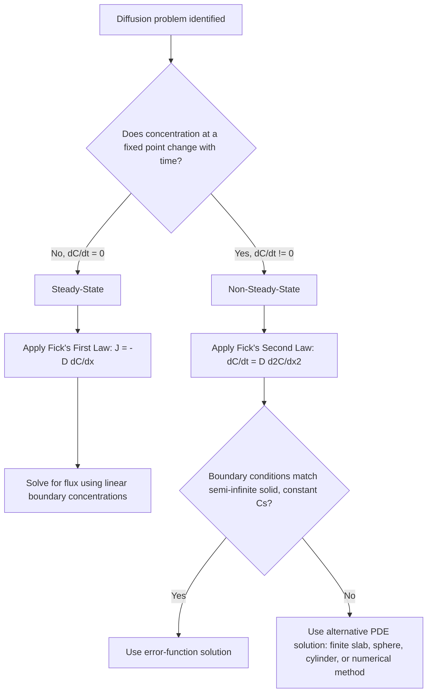

## Steady State and Non Steady State Diffusion

### Overview

Diffusion processes are classified by whether the concentration profile changes with time. This distinction determines which form of Fick's law governs the problem and which mathematical solution method applies. Steady-state diffusion involves time-invariant concentration profiles and constant flux; non-steady-state (transient) diffusion involves concentration profiles and flux that evolve continuously with time until (and if) equilibrium or steady state is reached.

### Steady-State Diffusion

#### Definition

A diffusion process is steady-state when the concentration $C$ at any given position $x$ does not change with time:

$$\frac{\partial C}{\partial x}\bigg|_{\text{fixed } x} = \text{constant with time}, \quad \frac{\partial C}{\partial t} = 0$$

Flux $J$ is likewise constant with time at every position, though it may vary with position if the geometry or gradient is non-uniform.

#### Governing Equation

Steady-state diffusion is described entirely by **Fick's first law**:

$$J = -D\frac{\partial C}{\partial x}$$

For the special case of a planar geometry with linear concentration gradient (constant $D$, constant cross-sectional area), this reduces to:

$$J = -D\frac{\Delta C}{\Delta x} = -D\frac{C_A - C_B}{x_A - x_B}$$

#### Physical Requirements for Steady State

- A constant source of diffusing species must be maintained at one boundary and a constant sink at the other (or removal mechanism), so that surface concentrations $C_1$ and $C_2$ do not change with time.
- The system must be given sufficient time to reach the steady condition; transient behavior always precedes it.
- Geometry and $D$ are typically taken as time-invariant during the process.

#### Classic Example: Gas Purification Membrane

A thin palladium membrane separating hydrogen gas at high pressure ($C_1$, high concentration side) from low pressure ($C_2$, low concentration side) reaches steady state once the concentration profile across the membrane thickness stabilizes. Hydrogen continuously diffuses through at constant flux as long as the pressure difference (and therefore $C_1, C_2$) is maintained.

**Example:**

A thin iron membrane, thickness 2 mm, is used to separate a high-pressure gas (nitrogen) at $700\ \text{K}$ from a low-pressure environment. Surface concentrations are $C_1 = 2.4\ \text{kg/m}^3$ and $C_2 = 0.6\ \text{kg/m}^3$, with $D = 1.4\times10^{-9}\ \text{m}^2/\text{s}$ at this temperature.

$$J = D\frac{C_1 - C_2}{\Delta x} = (1.4\times10^{-9})\frac{2.4-0.6}{2\times10^{-3}} = 1.26\times10^{-6}\ \text{kg/m}^2\text{s}$$

**Output:** Steady-state flux through the membrane ≈ $1.26 \times 10^{-6}\ \text{kg/m}^2\text{s}$.

### Non-Steady-State (Transient) Diffusion

#### Definition

In most practical engineering situations — carburizing, doping, sintering, homogenization — the concentration at a given point changes as diffusion progresses, so $\partial C/\partial t \neq 0$. The concentration profile flattens and spreads over time as the system approaches (but may never fully reach) equilibrium.

#### Governing Equation

Non-steady-state diffusion is described by **Fick's second law**, derived from conservation of mass applied to the first law:

$$\frac{\partial C}{\partial t} = D\frac{\partial^2 C}{\partial x^2} \quad \text{(constant } D\text{)}$$

or in general form when $D$ depends on concentration/position:

$$\frac{\partial C}{\partial t} = \frac{\partial}{\partial x}\left(D\frac{\partial C}{\partial x}\right)$$

#### Standard Solution: Semi-Infinite Solid, Constant Surface Concentration

**Conditions:** uniform initial concentration $C_0$; surface concentration held at $C_s$ for $t>0$; solid extends effectively to infinity from the surface.

$$\frac{C_x - C_0}{C_s - C_0} = 1 - \text{erf}\left(\frac{x}{2\sqrt{Dt}}\right)$$

**Key Points:**

- The profile at $t=0$ is a step function; as $t$ increases, the profile smooths and penetrates deeper.
- The characteristic diffusion depth scales as $\sqrt{Dt}$ — this is the single most important scaling relationship in transient diffusion analysis.
- For a fixed target composition at fixed depth, $x^2/Dt$ = constant links time and temperature (via $D$) for process design.

**Example:**

Nitriding of a steel component at 550°C ($D = 1.0\times10^{-11}\ \text{m}^2/\text{s}$), initial nitrogen content $C_0 = 0$, surface concentration maintained at $C_s = 0.90\ \text{wt\%}$ N. Find time required to reach $C_x = 0.30\ \text{wt\%}$ at $x = 0.3\ \text{mm}$.

$$\frac{C_x - C_0}{C_s - C_0} = \frac{0.30 - 0}{0.90 - 0} = 0.333 = 1 - \text{erf}(z)$$

$$\text{erf}(z) = 0.667 \implies z \approx 0.685 \ \text{(from error function table)}$$

$$z = \frac{x}{2\sqrt{Dt}} \implies 0.685 = \frac{3\times10^{-4}}{2\sqrt{(1.0\times10^{-11})t}}$$

Solving for $t$:

$$\sqrt{t} = \frac{3\times10^{-4}}{2(0.685)\sqrt{1.0\times10^{-11}}} = \frac{3\times10^{-4}}{1.37 \times 3.162\times10^{-6}} \approx 69.3$$

$$t \approx 4803\ \text{s} \approx 1.33\ \text{h}$$

**Output:** Required nitriding time ≈ **1.33 hours**.

### Comparative Summary

| Aspect | Steady-State | Non-Steady-State |
| --- | --- | --- |
| Governing law | Fick's first law | Fick's second law |
| Time dependence | $\partial C/\partial t = 0$ | $\partial C/\partial t \neq 0$ |
| Flux | Constant with time | Varies with time and position |
| Typical geometry | Thin membrane, fixed boundary concentrations | Semi-infinite solid, evolving profile |
| Solution method | Direct algebraic (linear gradient) | Error-function / PDE solution |
| Engineering examples | Gas separation membranes, permeation barriers | Carburizing, nitriding, doping, homogenization, sintering |

### Diagram: Steady vs. Non-Steady Concentration Profiles (svg_diagram)

<svg viewBox="0 0 640 420" xmlns="http://www.w3.org/2000/svg">
<rect width="640" height="420" fill="#ffffff"/>
<text x="320" y="24" font-size="16" font-family="sans-serif" text-anchor="middle" font-weight="bold">Steady-State vs Non-Steady-State Profiles (svg_diagram)</text>
<!-- Left panel: Steady state -->

<text x="150" y="50" font-size="13" font-family="sans-serif" text-anchor="middle" font-weight="bold">Steady State</text>

<line x1="60" y1="200" x2="280" y2="200" stroke="#000" stroke-width="2"/>

<line x1="60" y1="200" x2="60" y2="70" stroke="#000" stroke-width="2"/>

<text x="170" y="220" font-size="11" font-family="sans-serif" text-anchor="middle">x (0 to L)</text>

<text x="30" y="140" font-size="11" font-family="sans-serif" transform="rotate(-90 30 140)">C</text>

<line x1="60" y1="90" x2="280" y2="180" stroke="`#1f77b4`" stroke-width="2.5"/>

<text x="65" y="85" font-size="11" font-family="sans-serif">C1</text>

<text x="255" y="195" font-size="11" font-family="sans-serif">C2</text>

<text x="70" y="215" font-size="10" font-family="sans-serif" fill="#555">Profile: fixed, unchanging with t</text>

<!-- Right panel: Non-steady state -->

<text x="480" y="50" font-size="13" font-family="sans-serif" text-anchor="middle" font-weight="bold">Non-Steady State</text>

<line x1="360" y1="200" x2="600" y2="200" stroke="#000" stroke-width="2"/>

<line x1="360" y1="200" x2="360" y2="70" stroke="#000" stroke-width="2"/>

<text x="480" y="220" font-size="11" font-family="sans-serif" text-anchor="middle">x</text>

<text x="335" y="140" font-size="11" font-family="sans-serif" transform="rotate(-90 335 140)">C</text>

<path d="M 360 80 C 400 90, 430 160, 470 195" stroke="`#1f77b4`" stroke-width="2" fill="none"/>

<path d="M 360 80 C 440 95, 490 160, 550 195" stroke="`#2ca02c`" stroke-width="2" fill="none"/>

<path d="M 360 80 C 480 100, 550 160, 595 195" stroke="`#d62728`" stroke-width="2" fill="none"/>

<text x="480" y="215" font-size="10" font-family="sans-serif" fill="#555">Profile evolves: t1 < t2 < t3</text>

<!-- bottom note -->
<line x1="60" y1="320" x2="600" y2="320" stroke="#ccc"/>
<text x="320" y="345" font-size="11" font-family="sans-serif" text-anchor="middle" fill="#333">Steady: J = -D(dC/dx), constant in time | Non-steady: dC/dt = D(d^2C/dx^2), evolves in time</text>
</svg>

### Decision Logic: Which Law Applies

### Transition Between Regimes

[Inference] Many real processes begin in a non-steady-state regime and asymptotically approach steady-state if boundary conditions are held constant long enough and the geometry is finite (e.g., a thin membrane initially at uniform low concentration will show a transient period before flux through it stabilizes). The time required to approach steady state depends on $L^2/D$, where $L$ is the characteristic diffusion length of the geometry; this should be evaluated against the actual boundary conditions of the specific system rather than assumed.

### Common Pitfalls

- Applying the linear (first law) flux equation to a problem where surface or bulk concentration is still changing — this yields an incorrect, non-physical constant flux value.
- Assuming a "thin sample" problem is steady-state by default; steady-state requires constant boundary concentrations *and* sufficient elapsed time, not just thinness.
- Using the semi-infinite solid solution for a finite geometry (e.g., a thin sheet where the diffusion front reaches the far side) — the error-function solution becomes invalid once boundary effects interact from both sides.
- Neglecting that $D$ itself is temperature- and sometimes concentration-dependent in both regimes, which affects both flux magnitude and time-to-steady-state estimates.

### Related Topics

- Fick's First and Second Laws (mathematical basis)
- Error Function Solutions for Semi-Infinite Solids
- Finite-Difference and Numerical Solutions to the Diffusion Equation
- Diffusion Through Composite Walls / Multilayer Membranes
- Time-Dependent Boundary Conditions (Non-Constant Surface Concentration)
- Homogenization Heat Treatments
- Carburizing and Nitriding Process Design
- Concentration-Dependent Diffusivity