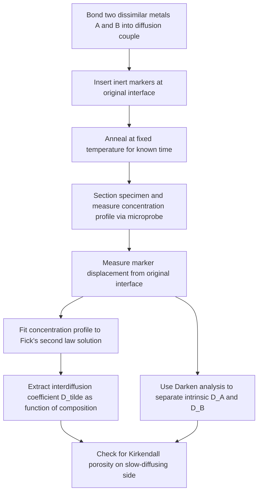

## Interdiffusion and Self Diffusion

### Overview

Diffusion in solids is classified by whether atomic movement occurs within a chemically uniform material (self-diffusion) or between two dissimilar materials establishing a concentration gradient (interdiffusion). Both are governed by the same underlying Fickian framework, but they differ in driving force, measurement method, and practical significance. Interdiffusion is central to processes such as alloy homogenization, diffusion bonding, and coating formation, while self-diffusion underlies processes such as grain growth, sintering, and creep.

### Self-Diffusion

#### Definition

Self-diffusion is the migration of atoms within a pure, single-component material (or within a homogeneous solid solution where no net concentration gradient exists), driven purely by random thermal motion rather than a chemical potential gradient. Even though there is no macroscopic composition change, individual atoms continuously exchange positions with vacancies or interstitial sites.

**Key Points:**

- Self-diffusion cannot be observed directly through concentration changes, since composition remains uniform.
- Measured experimentally using **radioactive tracer atoms** (isotopes of the same element) introduced at a boundary or thin layer, then tracking their penetration profile with time using the same error-function solution as ordinary diffusion.
- The self-diffusion coefficient, often denoted $D^*$ or $D_{\text{self}}$, follows the standard Arrhenius form:

$$D_{\text{self}} = D_0 \exp\left(-\frac{Q_{\text{self}}}{RT}\right)$$

#### Mechanism

Self-diffusion in metals occurs almost exclusively via the **vacancy mechanism**: an atom moves into an adjacent vacant lattice site. The activation energy for self-diffusion therefore comprises two contributions:

$$Q_{\text{self}} = Q_f + Q_m$$

Where $Q_f$ is the energy required to form a vacancy and $Q_m$ is the energy required for an atom to migrate into that vacancy. This two-part energy requirement is why self-diffusion (substitutional mechanism) generally has higher $Q_d$ and lower $D$ than interstitial diffusion of small solutes in the same lattice.

**Example:**

Self-diffusion of copper in pure copper at 1000°C, measured using radiotracer $^{64}$Cu, exhibits $D \approx 5\times10^{-13}\ \text{m}^2/\text{s}$ [Unverified — representative literature order-of-magnitude value; exact figure depends on measurement source]. This value is far lower than typical interstitial diffusivities (e.g., carbon in iron) at comparable temperatures, consistent with the higher activation energy of the vacancy mechanism.

### Interdiffusion

#### Definition

Interdiffusion (also called **chemical diffusion**) is the net mass transport of atoms across a concentration gradient between two initially distinct materials — for example, a diffusion couple formed by bonding two dissimilar metals (Cu and Ni, for instance) and holding them at elevated temperature. Unlike self-diffusion, interdiffusion is directly observable as a macroscopic composition profile change, and it is driven by the thermodynamic tendency to reduce free energy through mixing (chemical potential gradient).

**Key Points:**

- Interdiffusion is the practically relevant case for most engineering processes: carburizing, nitriding, cladding, diffusion bonding, and solid-state alloying.
- Measured using **diffusion couples**: two materials joined at a planar interface, annealed at a fixed temperature, then sectioned and analyzed (e.g., via electron microprobe) to obtain a concentration-vs-distance profile, which is fit to Fick's second law solutions to extract $D$.

#### The Interdiffusion Coefficient

Because two species with generally different individual diffusivities are moving in opposite directions across the interface, a single **interdiffusion coefficient** $\tilde{D}$ is defined to describe the net mixing behavior, related to the individual **intrinsic diffusion coefficients** $D_A$ and $D_B$ of the two species by the **Darken equation**:

$$\tilde{D} = X_B D_A + X_A D_B$$

Where $X_A$ and $X_B$ are the mole fractions of components A and B at the position of interest. This relation accounts for the fact that the two species generally diffuse at different rates.

### The Kirkendall Effect

#### Physical Basis

When two elements with substantially different intrinsic diffusion coefficients ($D_A \neq D_B$) interdiffuse, the faster-diffusing species crosses the original interface more rapidly than the slower species. Since the two counter-diffusing fluxes are unequal, there is a net flux of vacancies in the direction of the faster-diffusing species, causing the original interface (marked with inert markers, historically molybdenum wires in the classic Cu-brass Kirkendall experiment) to physically shift toward the side of the faster diffuser.

**Key Points:**

- The Kirkendall effect provided the first direct experimental evidence for the vacancy mechanism of diffusion, disproving earlier "direct exchange" diffusion theories.
- Marker displacement is measurable and quantifies the difference between intrinsic diffusion coefficients $D_A$ and $D_B$.
- Excess vacancy flux toward the slower-diffusing side can lead to **Kirkendall porosity** (voids) if vacancies supersaturate and coalesce faster than they can be annihilated at sinks (dislocations, grain boundaries, free surfaces) — a known failure mechanism in some diffusion-bonded joints and solder interconnects.

**Example:**

In the classic Cu-Zn (brass) diffusion couple, Zn diffuses faster than Cu into the copper side. Inert markers placed at the original interface are observed to move toward the brass (Zn-rich) side over time, and after prolonged annealing, Kirkendall voids may form on the brass side due to the mismatch in vacancy flux.

### Comparative Summary

| Aspect | Self-Diffusion | Interdiffusion |
| --- | --- | --- |
| System | Single-component (pure element or uniform solid solution) | Two or more chemically distinct materials in contact |
| Driving force | Random thermal motion, no net chemical potential gradient | Chemical potential (concentration) gradient |
| Observable | Not directly observable via composition; requires tracer isotopes | Directly observable via concentration profile |
| Measurement method | Radioactive/stable isotope tracer diffusion | Diffusion couple + concentration profiling (e.g., electron microprobe) |
| Governing coefficient | Self-diffusion coefficient $D_{\text{self}}$ | Interdiffusion coefficient $\tilde{D}$ (Darken equation) |
| Associated phenomena | Vacancy formation/migration, creep, sintering, grain growth | Kirkendall effect, Kirkendall porosity, alloy homogenization |

### Diagram: Kirkendall Effect Schematic (svg_diagram)

<svg xmlns="http://www.w3.org/2000/svg" viewBox="0 0 640 380">
<rect width="640" height="380" fill="#ffffff" />
<text x="320" y="24" font-size="16" font-family="sans-serif" text-anchor="middle" font-weight="bold">Kirkendall Effect (svg_diagram)</text>

<text x="150" y="55" font-size="13" font-family="sans-serif" text-anchor="middle" font-weight="bold">t = 0 (before)</text>

<rect x="60" y="70" width="90" height="140" fill="`#bcd8f1`" stroke="#000" />

<text x="105" y="145" font-size="12" font-family="sans-serif" text-anchor="middle">A (slow D)</text>

<rect x="150" y="70" width="90" height="140" fill="`#f9c9a1`" stroke="#000" />

<text x="195" y="145" font-size="12" font-family="sans-serif" text-anchor="middle">B (fast D)</text>

<line x1="150" y1="65" x2="150" y2="215" stroke="#000" stroke-width="2" stroke-dasharray="3,3" />

<circle cx="150" cy="140" r="4" fill="#000" />

<text x="150" y="230" font-size="10" font-family="sans-serif" text-anchor="middle">Inert marker at interface</text>

<text x="480" y="55" font-size="13" font-family="sans-serif" text-anchor="middle" font-weight="bold">t &gt; 0 (after annealing)</text>

<rect x="390" y="70" width="90" height="140" fill="`#bcd8f1`" stroke="#000" />

<rect x="480" y="70" width="90" height="140" fill="`#f9c9a1`" stroke="#000" />

<text x="435" y="145" font-size="11" font-family="sans-serif" text-anchor="middle">A-rich</text>

<text x="525" y="145" font-size="11" font-family="sans-serif" text-anchor="middle">B-rich</text>

<line x1="480" y1="65" x2="480" y2="215" stroke="#999" stroke-dasharray="2,2" />

<line x1="500" y1="65" x2="500" y2="215" stroke="#000" stroke-width="2" stroke-dasharray="3,3" />

<circle cx="500" cy="140" r="4" fill="#000" />

<text x="500" y="230" font-size="10" font-family="sans-serif" text-anchor="middle">Marker shifted toward B</text>

<text x="440" y="250" font-size="10" font-family="sans-serif" fill="#555">(original interface position, gray)</text>

<path d="M 130 300 L 220 300" stroke="#d62728" stroke-width="2" marker-end="url(#arrow1)" />
<text x="175" y="320" font-size="10" font-family="sans-serif" text-anchor="middle">J_B (fast, into A side)</text>
<path d="M 460 300 L 400 300" stroke="#1f77b4" stroke-width="2" marker-end="url(#arrow2)" />
<text x="430" y="320" font-size="10" font-family="sans-serif" text-anchor="middle">J_A (slow, into B side)</text>
</svg>

### Process Flow: Diffusion Couple Experiment for Determining $\tilde{D}$

### Engineering Significance

- **Diffusion bonding and cladding:** interdiffusion coefficients determine bonding time/temperature schedules and the risk of Kirkendall void formation at dissimilar-metal joints (e.g., Cu-Al electrical connections, which are known to be susceptible to Kirkendall voiding and subsequent joint failure).
- **Solder joint reliability:** in electronic packaging, interdiffusion between solder and substrate metallizations (e.g., Sn-Cu, Sn-Ni systems) can form intermetallic compounds and Kirkendall voids that degrade long-term joint reliability. [Inference] This is a widely documented concern in electronics reliability engineering literature, though specific failure rates depend heavily on alloy system and service conditions.
- **Alloy homogenization:** interdiffusion coefficients dictate the time-temperature schedule required to eliminate coring/segregation in as-cast alloys.
- **Creep and sintering:** self-diffusion coefficients directly govern vacancy-mediated deformation mechanisms (Nabarro-Herring and Coble creep) and mass transport during solid-state sintering.

### Common Pitfalls

- Confusing self-diffusion coefficients with interdiffusion coefficients when looking up data — they are measured differently and are generally not numerically interchangeable.
- Assuming a single interdiffusion coefficient is constant across the entire composition range of a diffusion couple; $\tilde{D}$ from the Darken equation is generally composition-dependent, since $D_A$, $D_B$, and the mole fractions all vary with position.
- Overlooking Kirkendall porosity risk when designing diffusion-bonded joints between metals with significantly different intrinsic diffusivities.
- Treating vacancy flux and Kirkendall marker shift as evidence of a "faster" material moving physically — the marker shift reflects net vacancy flux, not literal bulk material transport.

### Related Topics

- Fick's First and Second Laws
- Factors Affecting Diffusion Rate
- Temperature Dependence and Arrhenius Behavior
- Vacancy Formation and Migration Energies
- Diffusion Bonding and Solid-State Joining
- Sintering Mechanisms and Mass Transport Paths
- Creep Mechanisms: Nabarro-Herring and Coble Creep
- Intermetallic Compound Formation at Dissimilar-Metal Interfaces