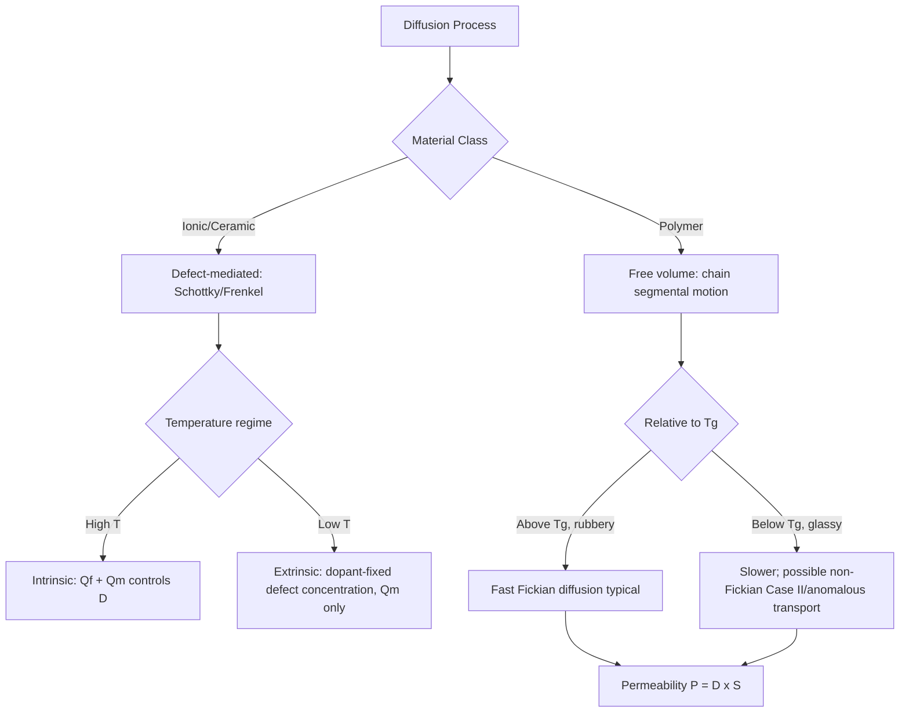

## Diffusion in Ionic and Polymeric Materials

### Overview

While the classical Fickian framework (first and second laws, Arrhenius temperature dependence) applies broadly across material classes, the underlying atomic/molecular mechanisms of diffusion in ionic ceramics and polymers differ substantially from metallic diffusion. In ionic materials, diffusion must satisfy electroneutrality constraints and is coupled to defect chemistry; in polymers, diffusion is governed by free volume and chain segmental motion rather than discrete lattice hopping. Both classes carry significant engineering relevance — ionic diffusion underlies solid oxide fuel cells, sensors, and ceramic processing, while polymer diffusion governs barrier packaging, membrane separation, and drug delivery systems.

### Diffusion in Ionic (Ceramic) Materials

#### Defect-Mediated Mechanism

Diffusion in ionic solids occurs via point defects, but unlike metals, ionic crystals must maintain **electroneutrality**, meaning defects occur in compensating pairs or sets:

- **Schottky defects:** paired cation and anion vacancies (maintaining charge balance), common in compounds like NaCl and MgO.
- **Frenkel defects:** a cation (or occasionally anion) displaced from its normal lattice site into an interstitial position, leaving a vacancy behind; common in materials with larger anions relative to cations (e.g., AgCl, AgBr).

**Key Points:**

- The diffusing species is typically the **smaller, more mobile ion** — cations generally diffuse faster than anions because of their smaller ionic radius, though this is system-dependent.
- Defect concentration is itself thermally activated (following its own Arrhenius-type relation for defect formation energy), so ionic diffusivity depends on both defect formation energy $Q_f$ and defect migration energy $Q_m$, analogous to substitutional metallic diffusion:

$$D = D_0 \exp\left(-\frac{Q_f + Q_m}{RT}\right) \quad \text{(intrinsic regime)}$$

#### Intrinsic vs. Extrinsic Diffusion Regimes

- **Intrinsic regime (high temperature):** defect concentration is thermally generated and dominates; diffusivity shows a single Arrhenius slope corresponding to $Q_f + Q_m$.
- **Extrinsic regime (lower temperature):** defect concentration is fixed by aliovalent impurities/dopants (e.g., $\text{Ca}^{2+}$ substituting for $\text{Na}^+$ in NaCl introduces a compensating cation vacancy) rather than thermal generation. In this regime, diffusivity depends only on the migration energy $Q_m$, giving a shallower Arrhenius slope than the intrinsic regime.
- This produces a characteristic **kinked Arrhenius plot**: steep slope at high temperature (intrinsic), transitioning to a shallower slope at lower temperature (extrinsic, defect-concentration-controlled).

**Example — Doped Zirconia (Solid Oxide Fuel Cell Electrolyte):**

Yttria-stabilized zirconia (YSZ) is engineered specifically to exploit extrinsic ionic diffusion: substituting $\text{Y}^{3+}$ for $\text{Zr}^{4+}$ creates oxygen vacancies to maintain charge neutrality, dramatically increasing oxygen ion ($\text{O}^{2-}$) mobility at operating temperatures (typically 700-1000°C for SOFC applications). [Inference] The specific dopant concentration is optimized in practice to maximize vacancy concentration without causing vacancy ordering/clustering that would reduce mobility — exact optimal doping levels are system- and application-specific and should be referenced against current SOFC materials literature.

#### Ambipolar Diffusion

Because electroneutrality must be locally maintained, diffusion of a charged ionic species is often coupled to counter-diffusion of another charged species (or electrons/holes), described by an **ambipolar diffusion coefficient** analogous in concept to the interdiffusion coefficient (Darken-type relation) used for metallic systems, but incorporating the constraint of charge balance rather than simple mole-fraction weighting.

### Diffusion in Polymeric Materials

#### Fundamentally Different Mechanism: Free Volume Theory

Unlike crystalline metals and ceramics, polymers are largely amorphous (or semi-crystalline with amorphous regions where diffusion occurs). Diffusion of small penetrant molecules (gases, solvents, plasticizers) through a polymer matrix does not proceed via discrete lattice-site hopping but via molecular-scale voids created by **thermal segmental motion of polymer chains** — this is described by **free volume theory**.

**Key Points:**

- Diffusion requires a penetrant molecule to find a transient gap ("free volume element") large enough to accommodate a jump, created momentarily by chain segment fluctuation.
- Diffusivity in polymers is strongly dependent on penetrant molecule size — small gas molecules (He, $\text{H}_2$) diffuse orders of magnitude faster than larger molecules ($\text{CO}_2$, hydrocarbons) through the same polymer.
- Diffusivity is highly sensitive to whether the polymer is above or below its **glass transition temperature** $T_g$:
  - **Above $T_g$ (rubbery state):** chain segments have high mobility, free volume is continuously and rapidly regenerated, diffusion is relatively fast and follows simple Fickian behavior in many cases.
  - **Below $T_g$ (glassy state):** chain mobility is frozen on the relevant timescale, free volume is fixed/non-equilibrium, diffusion is slower and can show **non-Fickian (anomalous) transport** behavior.

#### Fickian vs. Non-Fickian (Anomalous) Diffusion

- **Case I (Fickian) diffusion:** penetrant diffusion rate is much slower than polymer chain relaxation rate; concentration profile follows the standard $\sqrt{t}$ dependence as in metals/ceramics. Typically observed in rubbery polymers or glassy polymers with slowly diffusing penetrants relative to relaxation.
- **Case II diffusion:** penetrant diffusion is fast relative to polymer relaxation, producing a sharp, advancing swelling front with mass uptake proportional to $t$ (linear in time) rather than $\sqrt{t}$. Common in glassy polymers swollen by strongly interacting solvents.
- **Anomalous (non-Fickian) diffusion:** intermediate behavior, mass uptake scales as $t^n$ where $0.5 < n < 1$, reflecting coupled diffusion and viscoelastic relaxation processes.

$$\frac{M_t}{M_\infty} = k t^n$$

Where $M_t/M_\infty$ is the fractional mass uptake at time $t$, $k$ is a system-dependent constant, and $n$ is the diffusion exponent: $n = 0.5$ for Case I (Fickian), $n = 1$ for Case II, intermediate values for anomalous transport.

#### Solubility, Permeability, and the Permeation Coefficient

For gas/vapor transport through polymer membranes and barrier films, three coupled parameters are typically reported:

$$P = D \times S$$

Where $P$ is the **permeability coefficient**, $D$ is the diffusion coefficient, and $S$ is the **solubility coefficient** (equilibrium concentration of penetrant dissolved in the polymer per unit partial pressure). This decomposition is critical because permeability — the practically important engineering quantity for barrier packaging design — depends on both how fast molecules move (D) and how many dissolve into the polymer in the first place (S); a polymer can have low D but high S (or vice versa) and still yield significant permeability.

**Example — Barrier Packaging:**

Polyethylene terephthalate (PET) used in beverage bottles is chosen partly for its relatively low $\text{O}_2$ and $\text{CO}_2$ permeability compared to polyethylene, arising from tighter chain packing (higher density, higher crystallinity) that reduces available free volume, lowering both $D$ and $S$ for gas penetrants. [Inference] The specific magnitude of the barrier improvement depends on processing conditions (e.g., biaxial orientation, crystallinity achieved during blow molding), which is standard industrial practice for bottle-grade PET but varies by manufacturer process.

### Comparative Summary

| Aspect | Ionic (Ceramic) Diffusion | Polymer Diffusion |
| --- | --- | --- |
| Mechanism | Point defect hopping (vacancy/interstitial) | Free volume fluctuation from chain segmental motion |
| Governing constraint | Electroneutrality (charge balance) | Chain relaxation dynamics, $T_g$ |
| Temperature dependence | Arrhenius, often with intrinsic/extrinsic kink | Arrhenius above $T_g$; can deviate (WLF-type) near/below $T_g$ |
| Key engineering parameter | Ionic conductivity (via Nernst-Einstein relation) | Permeability $P = D \times S$ |
| Diffusing species | Ions (cations typically faster than anions) | Small molecules (gases, solvents, plasticizers) |
| Composition control lever | Aliovalent doping (extrinsic defect engineering) | Crystallinity, cross-link density, penetrant size |
| Characteristic application | Solid oxide fuel cells, sensors, ceramic processing | Barrier packaging, membranes, drug delivery |

### Diagram: Free Volume Diffusion Mechanism in Polymers (svg_diagram)

<svg xmlns="http://www.w3.org/2000/svg" viewBox="0 0 640 360">
<rect width="640" height="360" fill="#ffffff" />
<text x="320" y="24" font-size="16" font-family="sans-serif" text-anchor="middle" font-weight="bold">Free Volume Diffusion Mechanism (svg_diagram)</text>

<path d="M 60 100 Q 100 60, 140 100 T 220 100 T 300 100 T 380 100" stroke="#555" stroke-width="2.5" fill="none" />
<path d="M 60 180 Q 100 220, 140 180 T 220 180 T 300 180 T 380 180" stroke="#555" stroke-width="2.5" fill="none" />
<path d="M 60 260 Q 100 300, 140 260 T 220 260 T 300 260 T 380 260" stroke="#555" stroke-width="2.5" fill="none" />
<path d="M 260 60 Q 300 100, 340 60 T 420 60 T 500 60 T 580 60" stroke="#555" stroke-width="2.5" fill="none" />
<path d="M 260 140 Q 300 180, 340 140 T 420 140 T 500 140 T 580 140" stroke="#555" stroke-width="2.5" fill="none" />
<path d="M 260 220 Q 300 260, 340 220 T 420 220 T 500 220 T 580 220" stroke="#555" stroke-width="2.5" fill="none" />
<path d="M 260 300 Q 300 340, 340 300 T 420 300 T 500 300 T 580 300" stroke="#555" stroke-width="2.5" fill="none" />

<circle cx="450" cy="100" r="8" fill="#d62728" />
<text x="450" y="90" font-size="11" font-family="sans-serif" text-anchor="middle" fill="#d62728">Penetrant</text>

<ellipse cx="450" cy="140" rx="18" ry="10" fill="#ffe08a" opacity="0.7" />
<text x="450" y="160" font-size="10" font-family="sans-serif" text-anchor="middle">transient free volume</text>

<text x="320" y="345" font-size="11" font-family="sans-serif" text-anchor="middle" fill="#555">Chain segmental motion transiently opens gaps for penetrant hops</text>

</svg>

### Process Comparison Flow

### Engineering Significance

- **Solid oxide fuel cells (SOFC) and sensors:** ionic diffusivity (specifically oxygen ion mobility in doped zirconia or ceria electrolytes) directly determines ionic conductivity via the Nernst-Einstein relation, governing cell efficiency and operating temperature requirements.
- **Battery electrolytes and solid-state batteries:** lithium-ion diffusivity in solid electrolyte materials is a primary design parameter controlling charge/discharge rate capability.
- **Barrier packaging design:** polymer permeability data directly dictates shelf-life predictions for food and pharmaceutical packaging.
- **Drug delivery systems:** controlled-release polymer matrices are engineered around Case I vs. Case II release kinetics to achieve desired dosing profiles over time.

### Common Pitfalls

- Applying a simple single-mechanism Arrhenius model to ionic conductors without checking for an intrinsic-to-extrinsic transition, which would cause the fit to be valid only over a limited temperature range.
- Assuming polymer diffusion is always Fickian ($t^{0.5}$ uptake); glassy polymers with strongly swelling penetrants frequently show Case II or anomalous ($t^n$, $n \neq 0.5$) behavior, requiring different analysis and design margins.
- Conflating diffusivity $D$ with permeability $P$ in polymer barrier design — a material can have low $D$ but still have unacceptably high permeability if solubility $S$ is high (or vice versa).
- Ignoring the coupling between diffusing ionic species and electroneutrality constraints — treating ionic diffusion as if it were an uncoupled single-species process (as in dilute metallic solid solutions) can give qualitatively incorrect predictions in ceramics.

### Related Topics

- Fick's First and Second Laws
- Temperature Dependence and Arrhenius Behavior
- Point Defects in Ceramics: Schottky and Frenkel Defects
- Ionic Conductivity and the Nernst-Einstein Relation
- Glass Transition Temperature and Polymer Chain Dynamics
- Solid Oxide Fuel Cell Electrolyte Materials
- Barrier Packaging and Gas Permeation Testing
- Controlled-Release Drug Delivery Polymer Design