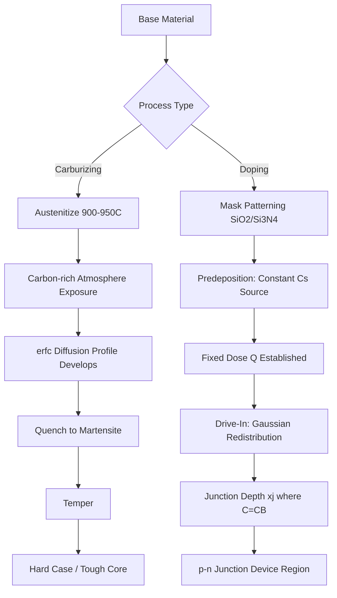

## Industrial Applications of Diffusion: Carburizing and Doping

### Overview

Solid-state diffusion — the thermally activated migration of atoms through a crystal lattice down a concentration gradient — underpins two industrially critical processes: carburizing (surface hardening of steel) and doping (controlled impurity introduction in semiconductors). Both exploit Fick's laws to engineer spatially varying composition profiles that a bulk process could not achieve.

### Fundamentals Recap

The governing relations are Fick's First and Second Laws.

Fick's First Law (steady-state flux):

$$J = -D\frac{\partial C}{\partial x}$$

Fick's Second Law (non-steady-state, the relevant regime for both applications):

$$\frac{\partial C}{\partial t} = D\frac{\partial^2 C}{\partial x^2}$$

The diffusivity $D$ follows an Arrhenius temperature dependence:

$$D = D_0 \exp\left(-\frac{Q_d}{RT}\right)$$

where $D_0$ is a pre-exponential factor, $Q_d$ is the activation energy for diffusion, $R$ is the gas constant, and $T$ is absolute temperature.

For a semi-infinite solid with constant surface concentration $C_s$ and uniform initial concentration $C_0$, the solution to Fick's Second Law is:

$$\frac{C_x - C_0}{C_s - C_0} = 1 - \text{erf}\left(\frac{x}{2\sqrt{Dt}}\right)$$

This erfc-based profile is the working equation behind both carburizing depth control and dopant profile design.

### Carburizing

**Key Points**

- Carburizing introduces carbon into the surface of low-carbon steel (typically 0.2 wt% C) to raise surface carbon content to 0.8–1.0 wt%, producing a hard, wear-resistant case over a tough, ductile core.
- Performed in the austenite phase field (typically 900–950°C) where the FCC lattice has much higher carbon solubility and diffusivity than ferrite.
- Common variants: gas carburizing (CO/CH₄-based atmosphere), pack carburizing (solid carbonaceous compound + energizer), liquid (salt bath) carburizing, and vacuum/plasma carburizing.
- After carburizing, parts are quenched and tempered so the high-carbon case transforms to hard martensite while the low-carbon core remains tougher, lower-hardenability material.

**Process Chemistry**

In gas carburizing, the active reaction at the steel surface is typically:

$$2CO \rightarrow C_{(Fe)} + CO_2$$

or, with methane-based enrichment:

$$CH_4 \rightarrow C_{(Fe)} + 2H_2$$

The nascent carbon dissolves interstitially into austenite, establishing the surface boundary condition $C_s$ used in the diffusion solution above.

**Case Depth Calculation**

Case depth (the distance to a defined carbon content, e.g., 0.4 wt%) is derived directly from the erfc solution. Rearranging:

$$x = 2\sqrt{Dt}\,\text{erf}^{-1}\left(1 - \frac{C_x - C_0}{C_s - C_0}\right)$$

Because $\text{erf}^{-1}(\cdot)$ is fixed once the target fraction is chosen, case depth scales as $x \propto \sqrt{Dt}$. This is the single most load-bearing relationship in carburizing process design: doubling case depth requires quadrupling time at fixed temperature, whereas raising temperature is far more efficient because $D$ scales exponentially with $T$.

**Example**

A 1020 steel part ($C_0 = 0.2$ wt%) is gas carburized at 927°C ($D \approx 1.28\times10^{-11}\ \text{m}^2/\text{s}$ for this system) with a surface concentration held at $C_s = 1.0$ wt%. Find the time required to reach $C_x = 0.4$ wt% at $x = 0.5\ \text{mm} = 5\times10^{-4}\ \text{m}$.

$$\frac{0.4 - 0.2}{1.0 - 0.2} = 0.25 = 1 - \text{erf}\left(\frac{x}{2\sqrt{Dt}}\right)$$

$$\text{erf}(z) = 0.75 \Rightarrow z \approx 0.8134$$

Solving for $t$:

$$t = \frac{x^2}{4Dz^2} = \frac{(5\times10^{-4})^2}{4(1.28\times10^{-11})(0.8134)^2} \approx 7.4\times10^{3}\ \text{s} \approx 2.05\ \text{hours}$$

[Inference: exact $D$ and $z$ values depend on the specific data table used; process engineers should verify against the applicable carbon-diffusion-in-austenite dataset for the alloy in question.]

**Metallurgical Outcomes**

- Post-quench case microstructure: martensite (plus retained austenite), often followed by tempering at 150–200°C to relieve quench stresses without significantly softening the case.
- Compressive residual stresses develop in the case due to the martensitic transformation's volume expansion, which is the primary mechanism behind carburizing's fatigue-life improvement (particularly bending and contact fatigue in gears and shafts).
- Related processes by analogy: nitriding (N diffusion, ferritic temperature, no quench required), carbonitriding (combined C and N), and boriding.

**Industrial Use Cases**

- Automotive/industrial gears, camshafts, and bearing races requiring wear-resistant surfaces with fatigue-resistant, tough cores.
- Components subject to rolling contact fatigue (bearings) benefit specifically from the compressive surface stress state.

### Doping (Semiconductor Diffusion)

**Key Points**

- Doping introduces controlled concentrations of electrically active impurities (dopants) into a semiconductor lattice — donors (e.g., P, As, Sb in Si) for n-type regions, acceptors (e.g., B, Al, Ga) for p-type regions.
- Two classical diffusion-based methods: predeposition (constant surface source) and drive-in (limited/fixed total dopant, redistribution diffusion).
- Diffusion doping predates and coexists with ion implantation; diffusion is still used for deep junctions, high-throughput low-cost processes, and certain power-device and solar-cell applications.
- Unlike carburizing's single-stage profile, junction depth in devices is usually engineered via a two-step predeposition + drive-in sequence, each governed by a different solution of Fick's Second Law.

**Predeposition Step**

Predeposition uses a constant-surface-concentration boundary condition (the semi-infinite solid solution above), typically at the solid solubility limit of the dopant in the semiconductor at the process temperature. The total dopant dose introduced per unit area, $Q$, after time $t_1$ at diffusivity $D_1$ is:

$$Q = \frac{2C_s\sqrt{D_1 t_1}}{\sqrt{\pi}}$$

**Drive-In Step**

The predeposited dose is redistributed with a fixed total quantity $Q$ (no additional surface source), giving a Gaussian profile:

$$C(x,t) = \frac{Q}{\sqrt{\pi D_2 t_2}}\exp\left(-\frac{x^2}{4D_2 t_2}\right)$$

**Junction Depth**

The junction depth $x_j$ is where the diffused dopant concentration equals the background (substrate) doping concentration $C_B$:

$$x_j = \sqrt{4D_2 t_2 \ln\left(\frac{C_s'}{C_B}\right)}$$

where $C_s'$ is the surface concentration after drive-in, $C_s' = Q/\sqrt{\pi D_2 t_2}$.

**Example**

Boron is predeposited into n-type Si at 900°C for 30 min at its solid solubility limit ($C_s \approx 2.5\times10^{20}\ \text{cm}^{-3}$, $D_1 \approx 2.3\times10^{-15}\ \text{cm}^2/\text{s}$ at 900°C — order-of-magnitude representative value). The predeposition dose:

$$Q = \frac{2(2.5\times10^{20})\sqrt{(2.3\times10^{-15})(1800)}}{\sqrt{\pi}} \approx 1.94\times10^{14}\ \text{cm}^{-2}$$

This dose is then driven in at a higher temperature (e.g., 1100°C, $D_2$ several orders of magnitude larger) for a chosen $t_2$ to reach the target junction depth against a given substrate concentration $C_B$, using the $x_j$ relation above.

[Inference: diffusivity and solubility values for dopant/host systems vary substantially with source and are strongly temperature- and concentration-dependent (concentration-dependent diffusivity effects are common at high doping levels, where the simple constant-$D$ erfc/Gaussian solutions become approximations); production values should be taken from validated process data, not textbook constants.]

**Practical Considerations**

- Dopant diffusion is anisotropic-adjacent in practice due to point-defect-mediated mechanisms (vacancy vs. interstitialcy diffusion), which can cause concentration-dependent $D$, particularly for P and B at high concentrations in Si.
- Diffusion doping largely coexists with ion implantation in modern IC fabrication: implantation sets a precise, shallow, well-controlled initial dose (Gaussian-like as-implanted profile), followed by a thermal anneal/drive-in step that is itself a diffusion process governed by the same equations above.
- Diffusion masking is achieved via SiO₂ or Si₃N₄ layers, which have much lower dopant diffusivity than bare Si, enabling selective-area doping (a direct analog to selective carburizing via copper plating or paste stop-off masks).

### Comparative Summary

| Aspect | Carburizing | Doping |
| --- | --- | --- |
| Diffusing species | Carbon | B, P, As, Sb, etc. |
| Host lattice | FCC austenite (Fe) | Diamond cubic (Si) |
| Driving boundary condition | Constant surface concentration (erfc) | Constant (predep) then fixed-dose (Gaussian, drive-in) |
| Typical temperature | 900–950°C | 900–1200°C |
| Governing scaling law | $x \propto \sqrt{Dt}$ | $x_j \propto \sqrt{Dt}$ |
| Post-process step | Quench + temper (martensite) | Anneal, oxidation, further processing |
| Functional goal | Mechanical: hardness, wear, fatigue | Electrical: p-n junction formation |

### Diagram: Concentration Profile Comparison (svg_diagram)

<svg xmlns="http://www.w3.org/2000/svg" viewBox="0 0 700 420">
<rect x="0" y="0" width="700" height="420" fill="white" />
<text x="350" y="25" font-size="16" text-anchor="middle" font-family="sans-serif" font-weight="bold">Diffusion Concentration Profiles (svg_diagram)</text>

<text x="150" y="50" font-size="13" text-anchor="middle" font-family="sans-serif" font-weight="bold">Carburizing (erfc)</text>

<line x1="60" y1="200" x2="260" y2="200" stroke="black" stroke-width="1.5" />

<line x1="60" y1="200" x2="60" y2="70" stroke="black" stroke-width="1.5" />

<text x="150" y="215" font-size="11" text-anchor="middle" font-family="sans-serif">Depth, x</text>

<text x="30" y="140" font-size="11" text-anchor="middle" font-family="sans-serif" transform="rotate(-90 30 140)">C(x)</text>

<path d="M 60 80 Q 120 90 150 130 Q 200 175 260 195" stroke="`#c0392b`" stroke-width="2.5" fill="none" />

<line x1="60" y1="195" x2="260" y2="195" stroke="#888" stroke-dasharray="4,3" />

<text x="65" y="70" font-size="10" font-family="sans-serif">Cs (surface)</text>

<text x="200" y="212" font-size="10" font-family="sans-serif">C0 (core)</text>

<text x="500" y="50" font-size="13" text-anchor="middle" font-family="sans-serif" font-weight="bold">Predeposition (erfc)</text>

<line x1="400" y1="200" x2="600" y2="200" stroke="black" stroke-width="1.5" />

<line x1="400" y1="200" x2="400" y2="70" stroke="black" stroke-width="1.5" />

<text x="500" y="215" font-size="11" text-anchor="middle" font-family="sans-serif">Depth, x</text>

<path d="M 400 80 Q 440 100 460 140 Q 490 180 600 198" stroke="`#2980b9`" stroke-width="2.5" fill="none" />

<text x="150" y="270" font-size="13" text-anchor="middle" font-family="sans-serif" font-weight="bold">Drive-In (Gaussian)</text>

<line x1="60" y1="400" x2="260" y2="400" stroke="black" stroke-width="1.5" />

<line x1="60" y1="400" x2="60" y2="290" stroke="black" stroke-width="1.5" />

<text x="150" y="415" font-size="11" text-anchor="middle" font-family="sans-serif">Depth, x</text>

<path d="M 60 400 Q 100 300 150 295 Q 200 300 260 400" stroke="`#27ae60`" stroke-width="2.5" fill="none" />

<line x1="150" y1="400" x2="150" y2="380" stroke="#888" stroke-dasharray="3,2" />

<text x="195" y="398" font-size="10" font-family="sans-serif">xj (junction)</text>

<line x1="60" y1="360" x2="260" y2="360" stroke="#888" stroke-dasharray="4,3" />

<text x="195" y="357" font-size="10" font-family="sans-serif">CB (background)</text>

<text x="500" y="270" font-size="13" text-anchor="middle" font-family="sans-serif" font-weight="bold">Junction Formation</text>

<line x1="400" y1="400" x2="600" y2="400" stroke="black" stroke-width="1.5" />

<line x1="400" y1="400" x2="400" y2="290" stroke="black" stroke-width="1.5" />

<path d="M 400 400 Q 440 300 490 297 Q 540 300 600 400" stroke="`#27ae60`" stroke-width="2" fill="none" />

<line x1="400" y1="350" x2="600" y2="350" stroke="`#8e44ad`" stroke-width="1.5" stroke-dasharray="2,2" />

<circle cx="475" cy="350" r="4" fill="`#c0392b`" />

<text x="475" y="335" font-size="9" text-anchor="middle" font-family="sans-serif">p-n junction</text>

<text x="405" y="345" font-size="9" font-family="sans-serif">n-type (CB)</text>

</svg>

### Process Flow Diagram

### Related Topics

- Fick's First and Second Laws: derivation and boundary condition selection
- Arrhenius behavior of diffusivity and activation energy determination via diffusion couples
- Nitriding, carbonitriding, and boriding as related surface-hardening diffusion processes
- Jominy hardenability testing and its interaction with case-hardened steel design
- Ion implantation vs. thermal diffusion doping trade-offs in modern semiconductor fabrication
- Kirkendall effect and interdiffusion in multi-component systems
- Concentration-dependent diffusivity and non-Fickian diffusion at high dopant concentrations
- Residual stress development from phase-transformation volume changes (case hardening)