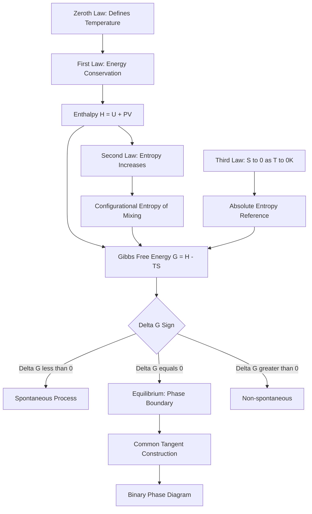

## Laws of Thermodynamics in Materials Systems

### Overview

The laws of thermodynamics provide the axiomatic foundation for predicting phase stability, reaction spontaneity, equilibrium composition, and energy exchange in materials systems. Materials science applies these laws primarily through state functions — internal energy, enthalpy, entropy, and free energy — to determine which microstructures and phases are thermodynamically favored under given conditions, independent of the kinetic pathway required to reach them.

### Zeroth Law

**Key Points**

- If system A is in thermal equilibrium with system C, and system B is in thermal equilibrium with system C, then A and B are in thermal equilibrium with each other.
- Establishes temperature as a well-defined, transitive state variable, which is the basis for constructing phase diagrams as functions of $T$.
- Without the Zeroth Law, temperature could not be treated as a single scalar quantity comparable across separate systems, undermining the entire framework of isothermal sections, tie-lines, and invariant reactions used in materials phase equilibria.

### First Law: Conservation of Energy

**Key Points**

- Energy cannot be created or destroyed, only converted between forms. For a closed system:

  $$dU = \delta Q - \delta W$$

  where $U$ is internal energy, $Q$ is heat added to the system, and $W$ is work done by the system.
- For materials processing at constant pressure (the common condition for most metallurgical operations), enthalpy $H = U + PV$ is the more convenient state function:

  $$dH = \delta Q_p$$
- Enthalpy changes quantify the energetics of phase transformations (latent heat of fusion $\Delta H_f$, heat of vaporization $\Delta H_v$), formation of compounds ($\Delta H_f^\circ$, standard enthalpy of formation), and mixing ($\Delta H_{mix}$).

**Application: Heat of Formation and Alloy Stability**

The enthalpy of mixing determines whether atoms in a binary system prefer clustering (like-atom bonding, $\Delta H_{mix} > 0$) or ordering (unlike-atom bonding, $\Delta H_{mix} < 0$). In the regular solution model:

$$\Delta H_{mix} = \Omega X_A X_B$$

where $\Omega$ is the interaction parameter and $X_A, X_B$ are mole fractions. This single term, combined with the entropy of mixing from the Second Law, produces the free-energy-composition curves that generate the entire architecture of binary phase diagrams.

**Example**

Calculate the heat released when 1 kg of pure iron solidifies. Given $\Delta H_f = 247\ \text{kJ/kg}$ for iron (latent heat of fusion):

$$Q = m \Delta H_f = (1\ \text{kg})(247\ \text{kJ/kg}) = 247\ \text{kJ}$$

This heat must be extracted by the mold/cooling system during casting solidification — directly relevant to casting design, solidification rate control, and resultant grain structure.

### Second Law: Entropy and Spontaneity

**Key Points**

- The total entropy of an isolated system never decreases over time; spontaneous processes increase the entropy of the universe:

  $$dS_{universe} \geq 0$$
- Entropy $S$ is a measure of disorder/randomness at the atomic scale, quantified statistically by the Boltzmann relation:

  $$S = k_B \ln \Omega$$

  where $k_B$ is Boltzmann's constant and $\Omega$ is the number of microstates (configurational, vibrational, or electronic) consistent with a given macrostate.

**Configurational Entropy of Mixing**

For an ideal solid solution of $N_A$ atoms of A and $N_B$ atoms of B randomly distributed on a lattice, the configurational entropy of mixing per mole is:

$$\Delta S_{mix} = -R(X_A \ln X_A + X_B \ln X_B)$$

This term is always positive (since $0 < X_A, X_B < 1$), meaning mixing always increases configurational entropy — the thermodynamic driving force behind solid solution formation and a key term opposing phase separation.

**Why This Matters for Materials**

The Second Law explains why:

- Diffusion proceeds down concentration gradients (increasing configurational entropy) even absent an external driving force.
- Perfectly ordered crystals are unattainable at any finite temperature — some equilibrium concentration of point defects (vacancies) always exists, because the entropy gain from disorder offsets the enthalpy cost of defect formation.
- Glass formation (rapid quenching bypassing crystallization) represents a kinetically trapped, higher-entropy, non-equilibrium state relative to the crystalline phase.

**Equilibrium Vacancy Concentration Example**

The equilibrium fraction of vacancies in a crystal balances the enthalpy cost of vacancy formation against the entropy gain:

$$\frac{n_v}{N} = \exp\left(-\frac{Q_v}{k_B T}\right)$$

For copper at 1000°C (1273 K) with $Q_v = 0.90\ \text{eV}$ and $k_B = 8.62\times10^{-5}\ \text{eV/K}$:

$$\frac{n_v}{N} = \exp\left(-\frac{0.90}{(8.62\times10^{-5})(1273)}\right) = \exp(-8.20) \approx 2.7\times10^{-4}$$

This means roughly 1 in 3,700 lattice sites is vacant at this temperature — a direct, quantitative consequence of the Second Law's entropy-enthalpy competition.

### Combined First and Second Law: Gibbs Free Energy

**Key Points**

- Gibbs free energy combines the First and Second Laws into the single most important state function in materials thermodynamics:

  $$G = H - TS$$
- At constant temperature and pressure, a process is spontaneous if and only if:

  $$\Delta G < 0$$
- Equilibrium is defined by $\Delta G = 0$; this is the condition used to construct every phase boundary and invariant reaction (eutectic, peritectic, eutectoid) on a phase diagram.

**Free Energy and Phase Diagrams**

For a binary system, molar Gibbs free energy of a solution phase combines the mechanical mixture term and the entropy-of-mixing term:

$$G = X_A G_A^\circ + X_B G_B^\circ + \Delta H_{mix} - T\Delta S_{mix}$$

Plotting $G$ vs. composition for each competing phase (liquid, $\alpha$, $\beta$) at a fixed temperature, and drawing common tangent lines between curves, generates the equilibrium phase boundaries directly. This construction — the common tangent method — is the thermodynamic basis of every binary phase diagram used in materials selection and process design.

**Melting Point from $\Delta G = 0$**

At the melting point, solid and liquid are in equilibrium, so $\Delta G_{fusion} = 0$:

$$\Delta G_f = \Delta H_f - T_m \Delta S_f = 0 \implies T_m = \frac{\Delta H_f}{\Delta S_f}$$

This relation is used to back-calculate entropy of fusion from measured melting points and latent heats, and underlies undercooling/superheating driving-force calculations in nucleation theory:

$$\Delta G_{v} \approx \frac{\Delta H_f \Delta T}{T_m}$$

where $\Delta T = T_m - T$ is the undercooling — this expression feeds directly into classical nucleation theory's critical nucleus size and activation barrier equations.

### Third Law: Absolute Entropy

**Key Points**

- The entropy of a perfect crystalline substance approaches zero as absolute temperature approaches zero:

  $$\lim_{T \to 0} S = 0 \quad \text{(for a perfect crystal)}$$
- This establishes an absolute reference point for entropy (unlike energy/enthalpy, which are only defined relative to a reference state), enabling tabulation of absolute standard entropies $S^\circ$ used in thermochemical databases (e.g., CALPHAD, JANAF tables).
- In practice, real materials retain residual entropy at $T = 0\ \text{K}$ if they are not perfect crystals — e.g., glasses, solid solutions with frozen-in configurational disorder, or crystals with frozen orientational disorder (e.g., CO) retain nonzero entropy, a deviation from ideal Third Law behavior. [Unverified: the magnitude of residual entropy is material- and processing-history-specific and is typically obtained calorimetrically rather than predicted from first principles for complex systems.]
- The Third Law underlies the vanishing of heat capacity as $T \to 0$, relevant to cryogenic materials behavior and low-temperature thermal property modeling.

### Summary Table

| Law | Statement | Key Materials Application |
| --- | --- | --- |
| Zeroth | Transitive thermal equilibrium defines temperature | Validity of phase diagrams as functions of $T$ |
| First | Energy is conserved; $dU = \delta Q - \delta W$ | Latent heats, formation enthalpies, casting heat balance |
| Second | Entropy of the universe increases; $dS \geq 0$ | Mixing entropy, defect equilibria, diffusion driving force |
| Combined (Gibbs) | $\Delta G < 0$ spontaneous, $\Delta G = 0$ equilibrium | Phase diagram construction, common tangent method |
| Third | $S \to 0$ as $T \to 0$ for a perfect crystal | Absolute entropy tabulation, CALPHAD databases |

### Diagram: Free Energy–Composition Curves and Common Tangent Construction (svg_diagram)

<svg xmlns="http://www.w3.org/2000/svg" viewBox="0 0 700 400">
<rect x="0" y="0" width="700" height="400" fill="white" />
<text x="350" y="25" font-size="16" text-anchor="middle" font-family="sans-serif" font-weight="bold">G vs Composition: Common Tangent Construction (svg_diagram)</text>
<line x1="80" y1="350" x2="620" y2="350" stroke="black" stroke-width="1.5" />
<line x1="80" y1="350" x2="80" y2="60" stroke="black" stroke-width="1.5" />
<text x="350" y="380" font-size="12" text-anchor="middle" font-family="sans-serif">Composition, X_B</text>
<text x="40" y="200" font-size="12" text-anchor="middle" font-family="sans-serif" transform="rotate(-90 40 200)">Gibbs Free Energy, G</text>

<text x="90" y="345" font-size="10" font-family="sans-serif">A (X=0)</text>

<text x="590" y="345" font-size="10" font-family="sans-serif">B (X=1)</text>

<path d="M 100 100 Q 250 250 400 180" stroke="#2980b9" stroke-width="2.5" fill="none" />
<text x="150" y="90" font-size="11" font-family="sans-serif" fill="#2980b9">G(solid, α)</text>

<path d="M 280 220 Q 450 270 580 110" stroke="#c0392b" stroke-width="2.5" fill="none" />
<text x="480" y="100" font-size="11" font-family="sans-serif" fill="#c0392b">G(liquid)</text>

<line x1="230" y1="228" x2="480" y2="197" stroke="#27ae60" stroke-width="2" stroke-dasharray="6,3" />
<circle cx="230" cy="228" r="4" fill="#27ae60" />
<circle cx="480" cy="197" r="4" fill="#27ae60" />
<text x="200" y="250" font-size="10" font-family="sans-serif" fill="#27ae60">X_solidus</text>
<text x="460" y="215" font-size="10" font-family="sans-serif" fill="#27ae60">X_liquidus</text>
<line x1="230" y1="228" x2="230" y2="350" stroke="#888" stroke-dasharray="2,2" />
<line x1="480" y1="197" x2="480" y2="350" stroke="#888" stroke-dasharray="2,2" />

<text x="330" y="320" font-size="10" font-family="sans-serif">Two-phase region (α + liquid)</text>

</svg>

### Process/Conceptual Flow Diagram

### Related Topics

- Regular solution model and interaction parameter $\Omega$ derivation
- CALPHAD methodology and thermodynamic database construction
- Classical nucleation theory: critical radius and activation energy barrier
- Ellingham diagrams for oxide/reduction reaction stability
- Point defect thermodynamics: vacancies, interstitials, Frenkel/Schottky defects
- Binary phase diagram construction from free-energy curves (eutectic, peritectic, eutectoid systems)
- Chemical potential and the Gibbs-Duhem relation in multicomponent equilibria
- Statistical mechanics foundations of the Boltzmann entropy relation