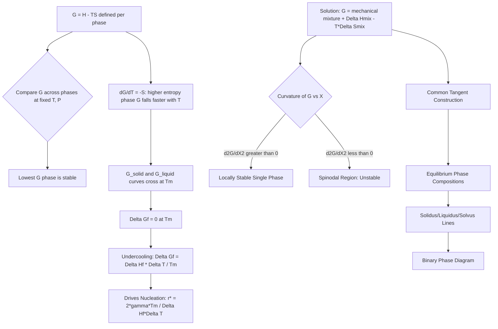

## Gibbs Free Energy and Phase Stability

### Overview

Gibbs free energy is the state function that governs phase stability at constant temperature and pressure — the conditions under which nearly all materials processing and service occur. A phase is thermodynamically stable relative to competing phases when its molar Gibbs free energy is lowest; phase transformations, phase diagrams, and microstructural evolution are all consequences of the system driving toward the configuration that minimizes total Gibbs free energy.

### Definition and Fundamental Relation

$$G = H - TS$$

where $H$ is enthalpy, $T$ is absolute temperature, and $S$ is entropy. Differentiating at constant composition:

$$dG = V\,dP - S\,dT$$

At constant pressure (the typical condition for materials processing), this reduces to:

$$\left(\frac{\partial G}{\partial T}\right)_P = -S$$

Since entropy $S > 0$ always, $G$ decreases with increasing temperature, and the slope of the $G$–$T$ curve becomes steeper (more negative) for phases with higher entropy — critically, the liquid phase has higher entropy than the solid phase, which is why $G_{liquid}$ falls faster than $G_{solid}$ as $T$ increases, eventually crossing it at the melting point.

**Criterion for Spontaneity and Equilibrium**

At constant $T$ and $P$:

- $\Delta G < 0$: spontaneous (forward) process
- $\Delta G = 0$: equilibrium between phases
- $\Delta G > 0$: non-spontaneous (reverse process is spontaneous)

### Free Energy vs. Temperature: Single-Component Systems

**Key Points**

- For a pure substance, plotting $G$ vs. $T$ for each phase (solid, liquid, vapor) produces curves whose intersections define the equilibrium transformation temperatures (melting point, boiling point).
- Below $T_m$: $G_{solid} < G_{liquid}$, so solid is stable.
- Above $T_m$: $G_{liquid} < G_{solid}$, so liquid is stable.
- At $T_m$: $G_{solid} = G_{liquid}$, and $\Delta G_{fusion} = 0$.

**Deriving the Driving Force for Solidification**

Since $\Delta G_f = \Delta H_f - T\Delta S_f$ and at $T_m$, $\Delta G_f = 0$, it follows that $\Delta S_f = \Delta H_f / T_m$. For a small undercooling $\Delta T = T_m - T$ below $T_m$, assuming $\Delta H_f$ and $\Delta S_f$ are approximately temperature-independent over the small interval:

$$\Delta G_f \approx \Delta H_f - T\left(\frac{\Delta H_f}{T_m}\right) = \Delta H_f\left(\frac{T_m - T}{T_m}\right) = \frac{\Delta H_f \Delta T}{T_m}$$

This is the volumetric free energy change that drives nucleation — it appears directly in the classical nucleation theory expression for the critical nucleus radius:

$$r^* = \frac{2\gamma T_m}{\Delta H_f \Delta T}$$

where $\gamma$ is the solid-liquid interfacial energy. This links the Second/combined-law free energy framework directly to kinetic nucleation behavior — larger undercooling produces a smaller critical radius and a larger population of viable nuclei, refining as-cast grain size.

**Example**

For pure nickel, $T_m = 1728\ \text{K}$, $\Delta H_f = 2756\ \text{J/cm}^3$. At an undercooling of $\Delta T = 50\ \text{K}$:

$$\Delta G_f = \frac{(2756)(50)}{1728} \approx 79.8\ \text{J/cm}^3$$

This is the thermodynamic driving force available for nucleation at that undercooling — larger $\Delta T$ increases $|\Delta G_f|$ roughly linearly, directly reducing the critical nucleus size and the associated activation energy barrier.

### Free Energy–Composition Curves: Multi-Component Systems

**Key Points**

- For solutions, molar Gibbs free energy includes a mechanical-mixture term and mixing terms:

  $$G = X_A G_A^\circ + X_B G_B^\circ + \Delta H_{mix} - T\Delta S_{mix}$$
- $\Delta S_{mix} = -R(X_A \ln X_A + X_B \ln X_B)$ is always positive and always lowers $G$ (stabilizing the mixed state) — this term alone would always favor complete solid solubility.
- $\Delta H_{mix} = \Omega X_A X_B$ can be positive (unfavorable mixing, tendency to phase-separate) or negative (favorable mixing, tendency to order/compound-form), and it competes against the $-T\Delta S_{mix}$ term.
- At low $T$, the enthalpy term dominates ($G$ curve can show a local hump if $\Delta H_{mix} > 0$, producing a miscibility gap). At high $T$, the entropy term dominates, and the $G$ curve becomes uniformly concave up (single-phase solution stable across all compositions).

**Phase Stability via Curvature**

The local shape of the $G$-composition curve determines local stability:

- $\frac{\partial^2 G}{\partial X^2} > 0$: locally stable (single phase persists against small composition fluctuations)
- $\frac{\partial^2 G}{\partial X^2} < 0$: locally unstable (spinodal region; any fluctuation spontaneously grows, driving spinodal decomposition without a nucleation barrier)
- $\frac{\partial^2 G}{\partial X^2} = 0$: spinodal boundary (inflection point)

This curvature criterion is the basis for distinguishing nucleation-and-growth transformations (metastable region, between binodal and spinodal) from spinodal decomposition (unstable region, inside the spinodal).

### The Common Tangent Construction

**Key Points**

- When two phases (e.g., $\alpha$ and $\beta$) can coexist at a given temperature, their relative stability across the full composition range is determined by comparing their $G$-composition curves.
- Where one curve lies entirely below the other, the lower-$G$ phase is stable at that composition.
- Where the curves cross or where a straight line can be drawn tangent to both curves simultaneously (the "common tangent"), the two points of tangency mark the equilibrium compositions of the two coexisting phases.
- Any overall composition between these two tangent points has a lower total free energy as a two-phase mixture (lying on the tangent line) than as a single homogeneous phase (lying on either curve) — this is the thermodynamic origin of two-phase regions on phase diagrams.
- The common tangent's points of contact, plotted at each temperature and connected across temperatures, generate the solidus and liquidus (or solvus) lines of the phase diagram directly.

**Lever Rule Connection**

Once the common tangent establishes phase compositions $X^\alpha$ and $X^\beta$ at a given overall composition $X_0$, the relative amounts (mass fractions) of each phase follow the lever rule, itself a consequence of mass balance consistent with the free-energy-minimizing equilibrium compositions:

$$f^\alpha = \frac{X^\beta - X_0}{X^\beta - X^\alpha}, \qquad f^\beta = \frac{X_0 - X^\alpha}{X^\beta - X^\alpha}$$

### Metastability and Activation Barriers

**Key Points**

- $\Delta G < 0$ indicates a transformation is thermodynamically favorable but says nothing about the rate — kinetically sluggish transformations can leave a system in a metastable state (local, not global, free energy minimum) indefinitely at low temperature.
- Metastable phases (e.g., martensite, retained austenite, many glasses and amorphous metals) exist because the activation energy barrier to reach the true equilibrium (lower-$G$) state is not surmounted under the given thermal conditions, even though $\Delta G_{overall} < 0$ for the transformation to the equilibrium phase.
- This is the conceptual bridge between thermodynamics (does a driving force exist?) and kinetics (can the system access it?) — a recurring theme across nucleation theory, diffusional transformations, and heat treatment design.

### Diagram: Free Energy vs. Temperature for Solid and Liquid Phases (svg_diagram)

<svg viewBox="0 0 700 400" xmlns="http://www.w3.org/2000/svg">
<rect x="0" y="0" width="700" height="400" fill="white"/>
<text x="350" y="25" font-size="16" text-anchor="middle" font-family="sans-serif" font-weight="bold">G vs T: Solid and Liquid Phases (svg_diagram)</text>
<line x1="80" y1="350" x2="620" y2="350" stroke="black" stroke-width="1.5"/>
<line x1="80" y1="350" x2="80" y2="60" stroke="black" stroke-width="1.5"/>
<text x="350" y="380" font-size="12" text-anchor="middle" font-family="sans-serif">Temperature, T</text>
<text x="40" y="200" font-size="12" text-anchor="middle" font-family="sans-serif" transform="rotate(-90 40 200)">Gibbs Free Energy, G</text>
<!-- Solid G curve: gentle negative slope -->
<line x1="90" y1="120" x2="600" y2="260" stroke="#2980b9" stroke-width="2.5"/>
<text x="500" y="240" font-size="11" font-family="sans-serif" fill="#2980b9">G_solid (slope = -S_solid)</text>
<!-- Liquid G curve: steeper negative slope, starts higher, crosses -->
<line x1="90" y1="180" x2="600" y2="140" stroke="#c0392b" stroke-width="2.5" transform="rotate(0)"/>
<path d="M 90 180 L 600 30" stroke="#c0392b" stroke-width="2.5" fill="none"/>
<text x="450" y="60" font-size="11" font-family="sans-serif" fill="#c0392b">G_liquid (slope = -S_liquid, steeper)</text>
<!-- intersection point Tm -->
<circle cx="330" cy="195" r="5" fill="black"/>
<line x1="330" y1="195" x2="330" y2="350" stroke="#888" stroke-dasharray="4,3"/>
<text x="330" y="365" font-size="11" text-anchor="middle" font-family="sans-serif">Tm</text>

<text x="150" y="100" font-size="10" font-family="sans-serif">Solid stable (G_solid < G_liquid)</text>

<text x="420" y="100" font-size="10" font-family="sans-serif">Liquid stable (G_liquid < G_solid)</text>

</svg>

### Process Flow Diagram

### Related Topics

- Classical nucleation theory: homogeneous vs. heterogeneous nucleation and critical radius
- Spinodal decomposition vs. nucleation-and-growth transformation mechanisms
- Regular solution model and the interaction parameter $\Omega$
- Binary phase diagram construction and the lever rule
- CALPHAD thermodynamic modeling and database-driven phase equilibrium calculation
- Metastable phases: martensite formation and glass transition as kinetically trapped states
- Ellingham diagrams and free energy of oxide formation
- Third Law absolute entropy and its role in tabulated $G^\circ$ values