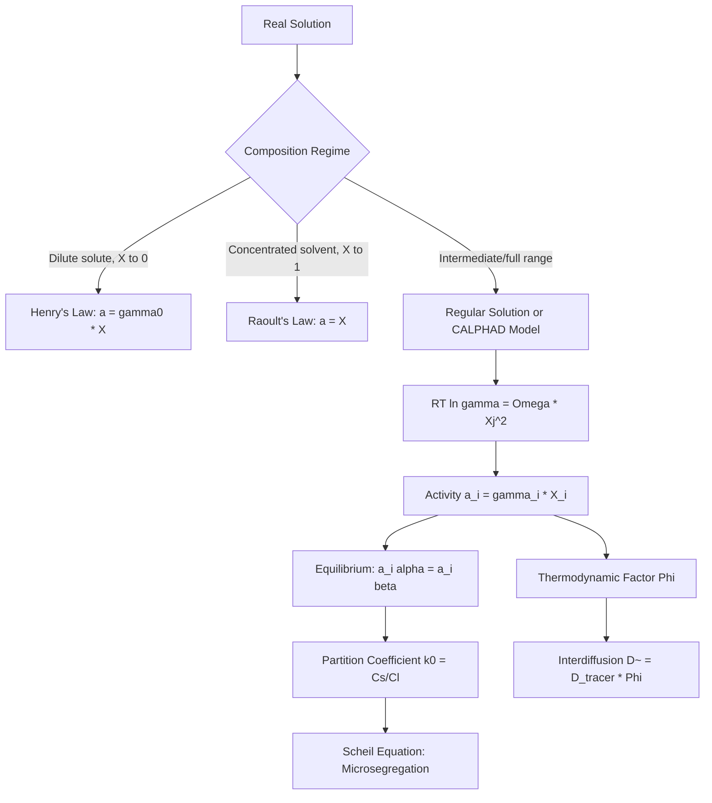

## Solution Thermodynamics and Activity

### Overview

Solution thermodynamics extends single-component free energy analysis to multi-component mixtures, introducing activity as the effective thermodynamic concentration that accounts for non-ideal atomic interactions. Activity replaces raw mole fraction in equilibrium and rate expressions whenever real solution behavior deviates from ideal mixing, making it essential for accurate phase equilibrium calculations, reaction equilibria (e.g., in extractive metallurgy), and diffusion analysis in concentrated alloys.

### Ideal Solutions

**Key Points**

- An ideal solution assumes: (1) atoms of different species are indistinguishable in terms of interaction energy ($\varepsilon_{AA} = \varepsilon_{BB} = \varepsilon_{AB}$), (2) zero enthalpy of mixing ($\Delta H_{mix} = 0$), and (3) mixing entropy is purely configurational and random.
- Raoult's Law describes ideal solution vapor pressure/activity behavior:

  $$a_i = X_i \quad \text{(ideal solution, all compositions)}$$
- Chemical potential in an ideal solution:

  $$\mu_i = \mu_i^\circ + RT\ln X_i$$
- True ideal solutions are rare in real materials systems (most metallic and ceramic solid solutions show at least some deviation), but the ideal model is the essential reference state against which real solution non-ideality is measured.

### Real Solutions and Activity

**Key Points**

- Activity $a_i$ is defined as the effective concentration that reproduces ideal-solution-form thermodynamic relations for a real solution:

  $$\mu_i = \mu_i^\circ + RT\ln a_i$$
- The activity coefficient $\gamma_i$ quantifies deviation from ideality:

  $$a_i = \gamma_i X_i$$
- $\gamma_i = 1$: ideal behavior at that composition.
- $\gamma_i > 1$: positive deviation from Raoult's law (like-atom bonding preferred, $\Delta H_{mix} > 0$ tendency, consistent with a clustering/phase-separation tendency).
- $\gamma_i < 1$: negative deviation from Raoult's law (unlike-atom bonding preferred, $\Delta H_{mix} < 0$ tendency, consistent with ordering/compound-formation tendency).

**Regular Solution Model**

The regular solution model assumes random atomic mixing (ideal configurational entropy) but nonzero enthalpy of mixing, giving:

$$RT\ln\gamma_A = \Omega X_B^2, \qquad RT\ln\gamma_B = \Omega X_A^2$$

This directly links the activity coefficient to the interaction parameter $\Omega$ introduced in enthalpy-of-mixing analysis, providing a compositional and temperature dependence for $\gamma_i$ rather than treating it as an empirical constant.

**Example**

For a regular solution with $\Omega = 8000\ \text{J/mol}$ at $T = 1200\ \text{K}$ and $X_B = 0.3$ (so $X_A = 0.7$):

$$RT\ln\gamma_A = \Omega X_B^2 = (8000)(0.3)^2 = 720\ \text{J/mol}$$

$$\ln\gamma_A = \frac{720}{(8.314)(1200)} = 0.0722 \implies \gamma_A \approx 1.075$$

$$a_A = \gamma_A X_A = (1.075)(0.7) \approx 0.752$$

The positive $\Omega$ produces $\gamma_A > 1$ (positive deviation), and the activity (0.752) exceeds what Raoult's law alone would predict (0.7) — a quantitative signature of the clustering tendency encoded in $\Omega > 0$.

### Henry's Law: Dilute Solution Behavior

**Key Points**

- For dilute solutes ($X_i \to 0$), activity becomes linear in composition but with a different proportionality constant than Raoult's law:

  $$a_i = \gamma_i^\circ X_i \quad \text{(Henry's law, dilute limit)}$$

  where $\gamma_i^\circ$ is the Henrian activity coefficient (constant only in the dilute limit).
- This is the regime relevant to interstitial solutes such as carbon in austenite, or trace dopants in a semiconductor host — both systems typically operate far from the concentrated-solution regime where Raoult's law applies to the solvent.
- The solvent (major component, $X_i \to 1$) obeys Raoult's law in the same dilute-solute limit, while the solute obeys Henry's law — both are limiting laws of the same underlying activity function, valid at opposite composition extremes.

### Activity and Phase Equilibrium

**Key Points**

- At equilibrium between phases $\alpha$ and $\beta$, chemical potentials (and therefore activities, referenced to the same standard state) of each component must be equal:

  $$a_i^\alpha \gamma_i^{\alpha,-1}... \Rightarrow \mu_i^\alpha = \mu_i^\beta \Rightarrow a_i^\alpha = a_i^\beta \quad \text{(same reference state)}$$
- This equality of activities (not raw concentrations) is the rigorous partitioning condition used in solidification segregation calculations, e.g., in deriving the equilibrium partition coefficient $k_0 = C_s/C_l$ used in the Scheil equation for non-equilibrium solidification.
- Activities also govern reaction equilibrium constants in metallurgical thermochemistry:

  $$K = \prod_i a_i^{\nu_i}$$

  used extensively in extractive metallurgy (e.g., slag-metal equilibria, oxide reduction reactions, Ellingham diagram construction) where reactant/product activities, not concentrations, determine the true equilibrium position.

### Excess Free Energy Formalism

**Key Points**

- Deviations from ideal solution behavior are formally captured by the excess Gibbs free energy $G^{xs}$:

  $$G = G^{ideal} + G^{xs}$$

  $$G^{xs} = RT(X_A \ln\gamma_A + X_B \ln\gamma_B)$$
- $G^{xs} = 0$ recovers the ideal solution; $G^{xs} \neq 0$ captures all non-ideal enthalpic and non-configurational entropic contributions in a single term.
- More sophisticated solution models (sub-regular, Redlich-Kister polynomial expansions, sublattice models used in CALPHAD) extend the simple regular-solution $\Omega X_A X_B$ term into composition-dependent polynomial expressions fit to experimental phase equilibrium and thermochemical data. [Unverified: specific polynomial coefficients are system-specific and obtained via thermodynamic assessment against experimental data, not derived from first principles for most engineering alloy systems.]

### Practical Application: Activity in Diffusion and Segregation

**Key Points**

- As established in chemical potential analysis, the rigorous diffusive flux depends on the chemical potential (hence activity) gradient, not the raw concentration gradient. Using the thermodynamic factor $\Phi$:

  $$\Phi = 1 + \frac{\partial \ln\gamma_i}{\partial \ln X_i}$$

  the interdiffusion coefficient relates to the intrinsic (tracer-based) diffusivity via $\tilde{D} = D_{tracer}\Phi$, meaning strongly non-ideal solutions (large deviations in $\gamma_i$ with composition) can show diffusivities substantially different from dilute-limit tracer diffusion measurements would suggest.
- In solidification, the equilibrium partition coefficient $k_0$, derived from equal-activity phase equilibrium, governs solute redistribution during freezing and directly determines microsegregation severity, predicted via the Scheil equation:

  $$C_s = k_0 C_0 (1 - f_s)^{k_0 - 1}$$

  where $f_s$ is fraction solidified — a direct downstream consequence of solution activity equilibrium.

### Summary Table

| Model | Assumption | Activity Relation | Typical Applicability |
| --- | --- | --- | --- |
| Ideal (Raoult) | No enthalpy of mixing, random mixing | $a_i = X_i$ | Reference state; rare in real alloys |
| Henry's Law | Dilute solute limit | $a_i = \gamma_i^\circ X_i$ | Interstitials, dopants, trace solutes |
| Regular Solution | Random mixing, $\Delta H_{mix} \neq 0$ | $RT\ln\gamma_i = \Omega X_j^2$ | First-order model for metallic solid solutions |
| Sub-regular/CALPHAD | Composition-dependent interaction terms | Polynomial $G^{xs}(X,T)$ | Engineering-accuracy multicomponent systems |

### Diagram: Activity vs. Composition — Raoult's and Henry's Law Limits (svg_diagram)

<svg xmlns="http://www.w3.org/2000/svg" viewBox="0 0 700 400">
<rect x="0" y="0" width="700" height="400" fill="white" />
<text x="350" y="25" font-size="16" text-anchor="middle" font-family="sans-serif" font-weight="bold">Activity vs Composition (svg_diagram)</text>
<line x1="80" y1="350" x2="620" y2="350" stroke="black" stroke-width="1.5" />
<line x1="80" y1="350" x2="80" y2="60" stroke="black" stroke-width="1.5" />
<text x="350" y="380" font-size="12" text-anchor="middle" font-family="sans-serif">X_B (mole fraction)</text>
<text x="40" y="200" font-size="12" text-anchor="middle" font-family="sans-serif" transform="rotate(-90 40 200)">Activity, a_B</text>
<text x="88" y="345" font-size="10" font-family="sans-serif">0</text>
<text x="600" y="345" font-size="10" font-family="sans-serif">1</text>

<line x1="80" y1="350" x2="600" y2="80" stroke="#888" stroke-width="1.5" stroke-dasharray="5,4" />
<text x="440" y="150" font-size="10" font-family="sans-serif" fill="#888">Ideal (Raoult's Law): a=X</text>

<path d="M 80 350 Q 250 260 400 160 Q 500 100 600 80" stroke="#c0392b" stroke-width="2.5" fill="none" />
<text x="200" y="230" font-size="10" font-family="sans-serif" fill="#c0392b">Real (positive deviation, gamma &gt; 1)</text>

<line x1="80" y1="350" x2="260" y2="220" stroke="#27ae60" stroke-width="2" stroke-dasharray="3,3" />
<text x="120" y="305" font-size="10" font-family="sans-serif" fill="#27ae60">Henry's Law (dilute tangent)</text>
<circle cx="80" cy="350" r="4" fill="black" />
<circle cx="600" cy="80" r="4" fill="black" />
</svg>

### Process Flow Diagram

### Related Topics

- Regular solution model and derivation of the interaction parameter $\Omega$
- CALPHAD sublattice models and Redlich-Kister polynomial excess free energy
- Scheil equation and microsegregation during non-equilibrium solidification
- Ellingham diagrams and activity in oxide reduction equilibria
- Chemical potential and the Gibbs-Duhem relation
- Ternary and multicomponent phase diagram construction
- Interdiffusion coefficients and the thermodynamic factor in Darken's equations
- Partition coefficient $k_0$ and its role in zone refining and crystal growth