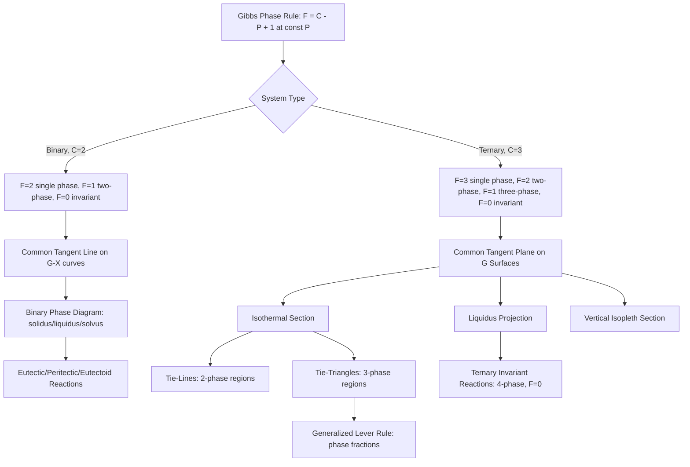

## Binary and Ternary Thermodynamic Systems

### Overview

Binary and ternary thermodynamic systems extend single-component free energy analysis to two- and three-component mixtures, where the Gibbs phase rule, common tangent/tangent-plane constructions, and multi-component chemical potential equality together determine phase stability, invariant reactions, and equilibrium microstructure. Binary systems are the working foundation of most engineering phase diagrams; ternary systems introduce compositional degrees of freedom that require isothermal sections, vertical sections, and liquidus projections to represent fully.

### The Gibbs Phase Rule

**Key Points**

- The Gibbs phase rule relates the number of independent intensive variables (degrees of freedom, $F$) to the number of components ($C$) and phases present ($P$) at equilibrium:

  $$F = C - P + 2$$
- The "+2" accounts for temperature and pressure as variable; for condensed systems at constant pressure (the standard assumption for solid/liquid metallurgical systems), this reduces to:

  $$F = C - P + 1$$
- For a binary system ($C=2$) at constant pressure: single phase gives $F=2$ (both $T$ and composition independently variable), two-phase equilibrium gives $F=1$ (composition of each phase fixed once $T$ is chosen — this is exactly what the common tangent construction determines), and three-phase equilibrium gives $F=0$ (invariant reaction, fixed $T$ and fixed compositions — e.g., the eutectic point).
- For a ternary system ($C=3$) at constant pressure: single phase gives $F=3$, two-phase gives $F=2$, three-phase gives $F=1$, and four-phase equilibrium gives $F=0$ (ternary invariant reaction).

### Binary Systems: Free Energy Framework Recap

**Key Points**

- Binary phase equilibrium is constructed from $G$-composition curves for each candidate phase (liquid, $\alpha$, $\beta$, intermetallic compounds) at each temperature, using the common tangent construction established in Gibbs Free Energy and Phase Stability.
- Three canonical binary invariant reactions, each satisfying $F=0$ at constant pressure:

$$\text{Eutectic:} \quad L \rightleftharpoons \alpha + \beta \quad \text{(cooling)}$$

$$\text{Peritectic:} \quad L + \alpha \rightleftharpoons \beta \quad \text{(cooling)}$$

$$\text{Eutectoid:} \quad \gamma \rightleftharpoons \alpha + \beta \quad \text{(cooling, all solid phases)}$$

- Each invariant reaction corresponds to a specific topology of the $G$-composition curves at the reaction temperature: at a eutectic, a single common tangent touches three curves ($L$, $\alpha$, $\beta$) simultaneously; below that temperature, the liquid curve rises above the two-phase tangent line entirely, and the system decomposes into $\alpha + \beta$.

**Example: Applying the Phase Rule to a Cooling Curve**

For a Cu-Ni binary isomorphous system (complete solid solubility, no invariant reactions), cooling an alloy of fixed composition from the liquid:

- Above liquidus: $P=1$ (liquid only), $F = 2 - 1 + 1 = 2$ — but composition is fixed by alloy choice, so only $T$ varies freely (one remaining practical degree of freedom).
- Between liquidus and solidus: $P=2$ (liquid + solid solution), $F = 2 - 2 + 1 = 1$ — for a chosen $T$ in this range, both phase compositions are uniquely fixed by the tie-line, consistent with there being one remaining degree of freedom (which was used to select $T$).
- Below solidus: $P=1$ (solid solution only), $F=2$ again.

This is why a binary isomorphous alloy freezes over a temperature range (not at a single point) — matching the "mushy zone" behavior central to segregation and casting defect analysis.

### Ternary Systems: Representation

**Key Points**

- Ternary composition is represented on a Gibbs triangle (equilateral triangle), where each vertex represents a pure component and each edge represents a binary subsystem; any interior point represents a ternary composition, read via the perpendicular-distance or parallel-line construction.
- Because temperature is an additional variable, full ternary equilibrium data require a three-dimensional space (triangular composition base + vertical temperature axis) — the ternary phase diagram is a "phase diagram prism" or "space model."
- Because 3D prisms are difficult to use directly, ternary data are typically presented as 2D sections:
  - **Isothermal sections**: horizontal slice at fixed $T$, showing phase regions as a function of composition only (most common working diagram for reading tie-lines and phase fractions at a specific process temperature).
  - **Vertical (isopleth) sections**: fixed ratio of two components (or fixed one component), with $T$ on the vertical axis — analogous to reading a "path" through the prism, but generally NOT usable with the lever rule (tie-lines in a vertical section rarely lie within the section plane).
  - **Liquidus projection**: projects the liquidus surface of the full 3D prism onto the base triangle, showing primary crystallization fields and monovariant (two-phase) reaction lines — essential for solidification path analysis in ternary alloys.

### Ternary Invariant Reactions

**Key Points**

- Ternary systems host invariant four-phase reactions ($F=0$ at constant pressure), the ternary analogs of binary eutectic/peritectic reactions:

$$\text{Ternary eutectic:} \quad L \rightleftharpoons \alpha + \beta + \gamma$$

$$\text{Ternary peritectic (Class II):} \quad L + \alpha \rightleftharpoons \beta + \gamma$$

- On the liquidus projection, these appear at the intersection of three monovariant (two-phase) boundary curves, each separating adjacent primary crystallization fields.
- Solidification path analysis in ternary systems follows the liquidus projection: as a liquid of given composition cools, its composition path moves along the liquidus surface (within a primary field, then along a monovariant line once a second solid phase forms) until reaching the invariant point, at which point (for a ternary eutectic) the remaining liquid solidifies isothermally into the three-phase mixture — directly analogous to, but geometrically more complex than, binary eutectic solidification.

### Tie-Triangles and the Lever Rule in Ternary Systems

**Key Points**

- In a three-phase region of an isothermal ternary section, equilibrium phase compositions are fixed at the three vertices of a "tie-triangle," and any overall composition within that triangle decomposes into all three phases.
- Phase fractions are determined by a generalized lever rule: the overall composition point divides the tie-triangle such that phase fraction is inversely proportional to the distance from the opposite vertex (equivalent to solving mass balance equations simultaneously for all three phases), a direct extension of the binary two-phase lever rule.
- In a two-phase region of an isothermal ternary section, tie-lines connect equilibrium compositions of the two phases, but — unlike binary tie-lines, which lie along the (single) composition axis — ternary tie-lines have an orientation within the triangle that must be determined experimentally or computationally (they are generally NOT parallel to any triangle edge).

### Free Energy Surface View (Ternary)

**Key Points**

- The ternary analog of the binary $G$-$X$ curve is a Gibbs free energy surface plotted over the composition triangle for each candidate phase.
- Equilibrium between multiple phases is determined by a common tangent plane touching all coexisting phase surfaces simultaneously — the direct 3D generalization of the binary common tangent line.
- The points of tangency, projected onto the composition triangle, give the tie-line or tie-triangle vertices used in the isothermal section — this is the rigorous thermodynamic origin of ternary phase diagrams, computed in practice via CALPHAD-type Gibbs energy minimization software rather than manual graphical construction.

### Practical Relevance

**Key Points**

- Most engineering alloys are not truly binary (e.g., low-alloy steels contain C, Mn, Si, Cr, etc.); ternary and higher-order systems are the practical reality, with binary diagrams serving as the pedagogical and first-order design foundation.
- Common ternary systems of direct industrial importance: Fe-C-Cr (stainless/tool steel design), Al-Cu-Mg (aerospace aluminum alloys), Ni-Cr-Al (superalloy oxidation-resistant coatings), and Sn-Ag-Cu (lead-free solder alloys).
- CALPHAD (CALculation of PHAse Diagrams) methodology extends Gibbs energy minimization to multicomponent (ternary and beyond) systems using assessed thermodynamic databases, enabling computational prediction of phase equilibria in commercial alloys well beyond what manual common-tangent/tangent-plane construction can practically handle.

### Diagram: Ternary Isothermal Section with Tie-Triangle (svg_diagram)

<svg xmlns="http://www.w3.org/2000/svg" viewBox="0 0 700 500">
<rect x="0" y="0" width="700" height="500" fill="white" />
<text x="350" y="25" font-size="16" text-anchor="middle" font-family="sans-serif" font-weight="bold">Ternary Isothermal Section (svg_diagram)</text>

<polygon points="350,60 130,420 570,420" fill="none" stroke="black" stroke-width="2" />
<text x="350" y="45" font-size="13" text-anchor="middle" font-family="sans-serif" font-weight="bold">C</text>
<text x="110" y="440" font-size="13" text-anchor="middle" font-family="sans-serif" font-weight="bold">A</text>
<text x="590" y="440" font-size="13" text-anchor="middle" font-family="sans-serif" font-weight="bold">B</text>

<path d="M 130 420 L 220 420 L 200 340 L 150 350 Z" fill="#aed6f1" fill-opacity="0.6" stroke="#2980b9" />
<text x="175" y="400" font-size="10" font-family="sans-serif">alpha</text>

<path d="M 570 420 L 460 420 L 480 350 L 530 340 Z" fill="#f5b7b1" fill-opacity="0.6" stroke="#c0392b" />
<text x="500" y="400" font-size="10" font-family="sans-serif">beta</text>

<path d="M 350 60 L 300 160 L 400 160 Z" fill="#d5f5e3" fill-opacity="0.6" stroke="#27ae60" />
<text x="350" y="130" font-size="10" font-family="sans-serif">L</text>

<polygon points="200,340 480,350 350,250" fill="#f9e79f" fill-opacity="0.7" stroke="#b7950b" stroke-width="2" />
<circle cx="200" cy="340" r="4" fill="black" />
<circle cx="480" cy="350" r="4" fill="black" />
<circle cx="350" cy="250" r="4" fill="black" />
<text x="330" y="290" font-size="10" font-family="sans-serif">alpha+beta+L</text>
<text x="380" y="240" font-size="9" font-family="sans-serif">(tie-triangle)</text>

<line x1="220" y1="380" x2="300" y2="310" stroke="#7d3c98" stroke-width="1.2" stroke-dasharray="3,2" />
<line x1="240" y1="370" x2="330" y2="300" stroke="#7d3c98" stroke-width="1.2" stroke-dasharray="3,2" />
<text x="260" y="330" font-size="9" font-family="sans-serif" fill="#7d3c98">tie-lines (alpha+L)</text>

<circle cx="340" cy="310" r="4" fill="#e74c3c" />
<text x="345" y="305" font-size="9" font-family="sans-serif">X0</text>
</svg>

### Process Flow Diagram

### Related Topics

- Gibbs Free Energy and Phase Stability: common tangent construction fundamentals
- CALPHAD methodology and multicomponent Gibbs energy minimization
- Solidification path analysis using liquidus projections
- Iron-Iron Carbide (Fe-Fe3C) phase diagram as a canonical binary eutectoid system
- Fe-C-Cr and Ni-Cr-Al ternary systems in alloy design
- Scheil equation extension to multicomponent non-equilibrium solidification
- Invariant reaction classification: eutectic, peritectic, eutectoid, and ternary Class I/II reactions
- Lever rule generalization to multi-phase and multicomponent systems