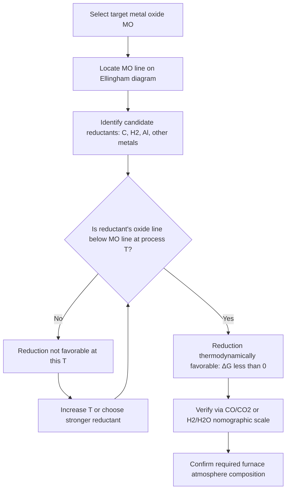

## Ellingham Diagrams

### Definition and Purpose

An Ellingham diagram is a graphical plot of the standard Gibbs free energy of formation ($\Delta G^\circ$) for metal oxides (or sulfides, chlorides, etc.) as a function of temperature. It provides a visual, quantitative tool for comparing the relative stability of compounds and predicting which reducing agent can reduce a given metal oxide at a specified temperature, without requiring repeated numerical calculation.

The diagram was developed by Harold Ellingham in 1944 and remains a foundational tool in extractive metallurgy, particularly for selecting reducing agents in smelting and analyzing corrosion resistance.

### Underlying Thermodynamic Basis

The reactions plotted are typically normalized to one mole of oxygen (O₂) consumed, so that different metal-oxide reactions can be compared on a common basis:

$$\frac{2x}{y}M + O_2 \rightarrow \frac{2}{y}M_xO_y$$

The Gibbs free energy change is related to enthalpy and entropy by:

$$\Delta G^\circ = \Delta H^\circ - T\Delta S^\circ$$

For the oxidation of a solid or liquid metal by gaseous oxygen, the reaction consumes one mole of gas and produces a solid oxide with negligible gas byproduct. This causes a large negative entropy change ($\Delta S^\circ < 0$) because gas is being "locked up" into a solid. Since $\Delta G^\circ = \Delta H^\circ - T\Delta S^\circ$ and $\Delta S^\circ$ is negative, $\Delta G^\circ$ becomes **less negative** (rises) as temperature increases. This is why nearly all lines on an Ellingham diagram slope upward with increasing $T$.

### Axes and Line Behavior

- **X-axis:** Temperature (°C or K)
- **Y-axis:** $\Delta G^\circ$ (kJ/mol O₂), typically negative values increasing upward (less stable oxides near the top, more stable near the bottom)

Because $\Delta H^\circ$ and $\Delta S^\circ$ are approximately constant over a given phase's temperature range, each line segment is approximately linear:

$$\Delta G^\circ(T) \approx \Delta H^\circ - T\Delta S^\circ$$

**Slope** = $-\Delta S^\circ$, so a steeper positive slope indicates a larger entropy decrease upon oxidation.

**Intercept** (at $T = 0$ K, extrapolated) = $\Delta H^\circ$ of formation of the oxide.

### Key Features of the Diagram

**Key Points**

- **Slope discontinuities (kinks):** A change in slope occurs at a phase transition (melting or boiling) of the metal or its oxide, since $\Delta S^\circ$ changes abruptly. A sharp increase in slope typically indicates the metal has melted or boiled, since the entropy of the metal reactant increases, making the overall $\Delta S^\circ$ of oxidation more negative.
- **Line for carbon oxidation (C → CO) is anomalous:** Unlike other metals, the reaction $2C + O_2 \rightarrow 2CO$ produces *more* moles of gas than it consumes, so $\Delta S^\circ > 0$. This gives the C/CO line a **negative slope** (it descends as temperature rises), which is the thermodynamic basis of carbothermic reduction becoming increasingly favorable at high temperature.
- **CO to CO₂ line** ($2CO + O_2 \rightarrow 2CO_2$) consumes 3 moles of gas to produce 2, so it slopes upward similarly to metal oxidation lines, but less steeply.
- **Lower position = more stable oxide.** A line lower on the diagram represents a more negative (more favorable) $\Delta G^\circ$, meaning that metal has a stronger affinity for oxygen.
- Order of decreasing oxide stability at typical temperatures (approximate, from most to least stable): Ca, Mg, Al, Ti, Si, Mn, Cr, Zn, Fe, Ni, Sn, Cu, Ag, Au (this ordering can shift with temperature due to differing slopes).

### Predicting Reduction Feasibility

**Rule:** A metal oxide can be reduced by any element whose oxidation line lies *below* it on the diagram at the temperature of interest, because that element's oxide is thermodynamically more stable (more negative $\Delta G^\circ$), meaning it will preferentially take up the oxygen.

Formally, for reduction of $MO$ by reductant $R$:

$$MO + R \rightarrow M + RO$$

$$\Delta G^\circ_{reaction} = \Delta G^\circ_{f}(RO) - \Delta G^\circ_{f}(MO)$$

Reduction is thermodynamically feasible when $\Delta G^\circ_{reaction} < 0$, i.e., when the $RO$ line lies below the $MO$ line at that temperature.

**Example**

Consider whether carbon can reduce iron oxide ($\text{FeO}$) at 1200°C:

- At 1200°C, the C → CO line lies below the Fe → FeO line.
- Therefore $\Delta G^\circ_f(\text{CO}) < \Delta G^\circ_f(\text{FeO})$ at this temperature, and the reaction

$$\text{FeO} + \text{C} \rightarrow \text{Fe} + \text{CO}$$

is spontaneous ($\Delta G^\circ < 0$), confirming that coke (carbon) can reduce iron oxide in a blast furnace at this temperature. This is precisely why carbon remains a viable reductant for iron ores despite carbon's line starting relatively high at low temperatures — its **negative slope crosses below** most metal lines as temperature increases, a crossover that does not occur for elements like aluminum or magnesium within practically achievable furnace temperatures.

### The Nozzle/Oxygen Partial Pressure Scale

Most Ellingham diagrams include auxiliary scales (nomographic scales) on the diagram's periphery for directly reading off:

- **Equilibrium $p_{O_2}$** (oxygen partial pressure) for a given oxide at a given temperature — obtained by drawing a line from a reference point (marked "O", at the origin analog) through the intersection of the oxide's line with the desired temperature, extended to the $p_{O_2}$ scale.
- **CO/CO₂ ratio scale**, used similarly to determine the gas composition needed to achieve a target reduction.
- **H₂/H₂O ratio scale**, analogous to the CO/CO₂ scale, useful for hydrogen reduction processes.

These nomographic scales let engineers determine the gas atmosphere composition required to reduce a specific oxide at a specific temperature, which is essential for controlling furnace atmospheres in practice.

### Diagram Structure (Illustration)

<svg xmlns="http://www.w3.org/2000/svg" viewBox="0 0 760 520" font-family="Helvetica, Arial, sans-serif">
<text x="380" y="25" text-anchor="middle" font-size="18" font-weight="bold" fill="#1a1a1a">Ellingham Diagram — Schematic (svg_diagram)</text>

<line x1="90" y1="470" x2="720" y2="470" stroke="#333" stroke-width="2" />
<line x1="90" y1="470" x2="90" y2="60" stroke="#333" stroke-width="2" />

<text x="400" y="500" text-anchor="middle" font-size="14" fill="#333">Temperature (°C) →</text>

<text x="35" y="270" text-anchor="middle" font-size="14" fill="#333" transform="rotate(-90 35 270)">ΔG° (kJ/mol O₂) — more negative ↓</text>

<line x1="90" y1="130" x2="720" y2="130" stroke="#999" stroke-width="1" stroke-dasharray="4,3" />
<text x="725" y="134" font-size="11" fill="#666">0</text>

<line x1="100" y1="440" x2="700" y2="400" stroke="#0b6e4f" stroke-width="2.5" />
<text x="705" y="400" font-size="12" fill="#0b6e4f" font-weight="bold">2Ca + O₂ → 2CaO</text>

<line x1="100" y1="410" x2="700" y2="330" stroke="#1f6feb" stroke-width="2.5" />
<text x="705" y="332" font-size="12" fill="#1f6feb" font-weight="bold">4/3 Al + O₂ → 2/3 Al₂O₃</text>

<line x1="100" y1="330" x2="700" y2="230" stroke="#b5541a" stroke-width="2.5" />
<text x="705" y="230" font-size="12" fill="#b5541a" font-weight="bold">2Fe + O₂ → 2FeO</text>

<line x1="100" y1="250" x2="700" y2="180" stroke="#a83279" stroke-width="2.5" />
<text x="705" y="182" font-size="12" fill="#a83279" font-weight="bold">4Cu + O₂ → 2Cu₂O</text>

<line x1="100" y1="360" x2="700" y2="150" stroke="#000000" stroke-width="2.5" stroke-dasharray="0" />
<text x="705" y="150" font-size="12" fill="#000000" font-weight="bold">2C + O₂ → 2CO</text>

<circle cx="430" cy="255" r="5" fill="red" />
<text x="440" y="250" font-size="11" fill="red">C/CO crosses Fe/FeO (reduction onset)</text>

<circle cx="400" cy="213" r="4" fill="#a83279" />
<text x="405" y="205" font-size="10" fill="#a83279">melting point kink</text>

<text x="100" y="486" font-size="11" fill="#333">0</text>

<text x="300" y="486" font-size="11" fill="#333">500</text>

<text x="500" y="486" font-size="11" fill="#333">1000</text>

<text x="690" y="486" font-size="11" fill="#333">1500</text>

</svg>

### Reduction Sequence Logic (Process Flow)

### Applications in Metallurgy

- **Blast furnace ironmaking:** Confirms carbon (as CO) can reduce iron oxides at furnace temperatures, and explains the layered thermodynamic zones (indirect reduction by CO at lower temperatures, direct reduction by solid C at higher temperatures near the bosh).
- **Aluminothermic (thermite) processes:** Explains why aluminum, whose oxide line lies very low (highly stable), can reduce oxides of iron, chromium, and manganese — used in Kroll-type and thermite welding processes.
- **Selection of reducing atmospheres:** Used to design gas compositions (CO/CO₂ or H₂/H₂O ratios) for sintering, annealing, and powder metallurgy to prevent unwanted oxidation or achieve controlled reduction.
- **Corrosion and oxidation resistance evaluation:** A metal whose oxide line sits very low is more prone to spontaneous oxidation (corrosion) in air; this partly explains why reactive metals like Al and Cr form stable, adherent, protective oxide films (passivation).
- **Extractive metallurgy route selection:** Helps decide whether pyrometallurgical (thermal reduction) or other routes (electrolytic, hydrometallurgical) are more economical for a given ore, since some oxides (e.g., Al₂O₃) require exceedingly high temperatures or non-carbon reduction (electrolysis, as in the Hall–Héroult process) since no economically available reductant's line falls below theirs at attainable furnace temperatures.

### Limitations

- Ellingham diagrams are constructed from standard-state thermodynamic data ($\Delta G^\circ$), so they predict thermodynamic feasibility only — they say nothing about reaction **kinetics** (rate). [Inference] A thermodynamically favorable reduction may still be impractically slow without adequate temperature, catalysis, or surface area.
- They assume unit activity for all pure condensed phases and standard partial pressures for gases; actual industrial conditions (impurities, non-ideal mixtures, non-standard pressures) will shift the effective equilibrium, requiring correction via the Gibbs free energy/reaction quotient relationship $\Delta G = \Delta G^\circ + RT\ln Q$.
- Diagrams are typically per mole of O₂, so care is needed when comparing compounds with different stoichiometric oxygen content; the diagram normalizes this, but raw enthalpy/entropy tables do not.
- Most standard diagrams do not account for solid solution effects, non-stoichiometric oxides, or alloying effects, which can shift real-world behavior from the idealized lines. [Inference]

### Related Topics

- Gibbs Free Energy and Chemical Equilibrium
- Standard Enthalpy and Entropy of Formation
- Blast Furnace Ironmaking and Direct/Indirect Reduction Zones
- Aluminothermic (Thermite) Reduction
- Kroll Process and Electrolytic Reduction (Hall–Héroult Process)
- Oxidation and High-Temperature Corrosion of Metals
- Richardson–Jeffes Diagram Nomographic Scales
- Pourbaix Diagrams (Electrochemical Stability Analog)
- Phase Diagrams and Metal-Oxide Systems