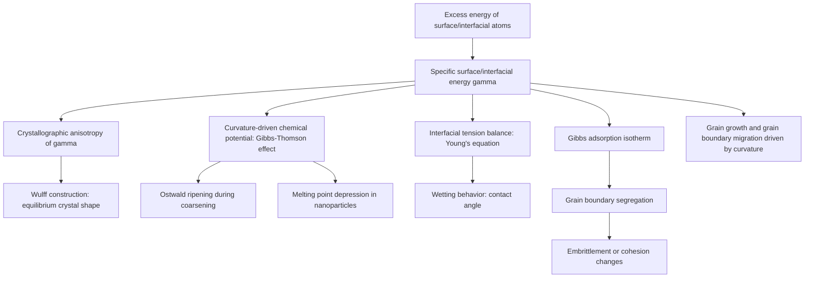

## Thermodynamics of Surfaces and Interfaces

### Origin of Surface Energy

Atoms at a surface or interface experience an asymmetric bonding environment compared to atoms in the bulk. A bulk atom is fully coordinated, surrounded by neighbors on all sides, and its bonds are, on average, fully satisfied. A surface atom has "dangling" or unsatisfied bonds on the side facing the surrounding phase (vacuum, gas, liquid, or another solid), leaving it in a higher energy state.

This excess energy, per unit area, associated with creating a surface is the **specific surface energy** ($\gamma$), typically expressed in J/m² (equivalent to N/m, allowing it to be interpreted as a surface tension in fluids).

### Thermodynamic Definition

Surface energy can be defined rigorously as the reversible work required to create a unit area of new surface at constant temperature, pressure, and composition:

$$\gamma = \left(\frac{\partial G}{\partial A}\right)_{T,P,n_i}$$

where $G$ is the Gibbs free energy of the system and $A$ is the surface area.

For a pure single-component solid or liquid, surface energy and surface tension are numerically equivalent. For solids, however, an important distinction arises between:

- **Surface stress ($f$):** the reversible work per unit area to elastically *stretch* an existing surface (changing interatomic spacing without creating new atomic sites)
- **Surface energy ($\gamma$):** the reversible work per unit area to *create* new surface (by cleaving or by bringing atoms from the bulk to the surface)

These are related by the **Shuttleworth equation**:

$$f_{ij} = \gamma \delta_{ij} + \frac{\partial \gamma}{\partial \varepsilon_{ij}}$$

where $\varepsilon_{ij}$ is the elastic surface strain. For liquids, $\partial \gamma / \partial \varepsilon_{ij} = 0$ (since a liquid surface can flow to accommodate strain without energy change), so surface stress equals surface tension. For solids, this term is generally non-zero, meaning surface stress and surface energy are distinct quantities.

### Interfacial Energy Types

**Key Points**

- **Solid–vapor interface ($\gamma_{SV}$):** Energy of a free solid surface exposed to vapor or vacuum; strongly dependent on crystallographic orientation (anisotropic).
- **Solid–liquid interface ($\gamma_{SL}$):** Relevant in solidification, wetting, and nucleation phenomena.
- **Solid–solid interface (grain boundary, $\gamma_{GB}$):** Energy associated with the mismatch between adjacent crystal lattices of differing orientation (or differing phase, in which case it is termed an interphase boundary).
- **Liquid–vapor interface ($\gamma_{LV}$):** The most commonly measured surface tension, e.g., for molten metals.

Grain boundary energies are typically lower than free surface energies for the same material (often roughly one-third to one-half of $\gamma_{SV}$), because a grain boundary still involves *some* bonding across the interface, whereas a free surface has none on the vacuum-facing side. [Inference — the precise ratio is material- and boundary-type-dependent.]

### Crystallographic Anisotropy and the Wulff Construction

Surface energy varies with crystallographic plane orientation because different planes have different atomic packing densities and hence different numbers of broken bonds per unit area. Low-index, densely packed planes (e.g., {111} in FCC) generally have the lowest surface energy, while high-index or loosely packed planes have higher surface energy.

This anisotropy governs the **equilibrium crystal shape**, determined by the **Wulff construction**: the equilibrium shape minimizes total surface free energy for a fixed volume, and is found geometrically by drawing perpendicular planes at a distance proportional to $\gamma(\theta)$ from a central point for every orientation $\theta$; the inner envelope of these planes defines the equilibrium shape.

$$G_{surface} = \sum_i \gamma_i A_i \rightarrow \text{minimized at constant } V$$

The Wulff theorem states that at equilibrium, the ratio of surface energy to distance from the center is constant for all facets:

$$\frac{\gamma_i}{h_i} = \text{constant}$$

where $h_i$ is the perpendicular distance from the Wulff point to facet $i$.

### Curvature Effects: The Young–Laplace and Gibbs–Thomson Relations

A curved interface generates a pressure difference across it, described by the **Young–Laplace equation**:

$$\Delta P = \gamma \left(\frac{1}{r_1} + \frac{1}{r_2}\right)$$

For a spherical particle of radius $r$ (where $r_1 = r_2 = r$):

$$\Delta P = \frac{2\gamma}{r}$$

This excess pressure raises the chemical potential (and hence the equilibrium solubility, vapor pressure, or melting point) of small particles relative to bulk material — the **Gibbs–Thomson effect**:

$$\Delta \mu = \frac{2\gamma V_m}{r}$$

where $V_m$ is the molar volume. Practically, this means:

- Small particles are thermodynamically less stable than large particles (higher chemical potential), driving **Ostwald ripening**, where large particles grow at the expense of small ones during coarsening/aging heat treatments.
- Small particles exhibit a **melting point depression** relative to bulk material, since the added surface energy contribution destabilizes the solid phase.
- The **critical nucleus size** in phase transformations (solidification, precipitation) is set by the competition between the favorable bulk free energy of the new phase and the unfavorable surface energy penalty of creating its interface — this underpins classical nucleation theory (covered under Nucleation and Growth Kinetics).

### Interfacial Tension Balance: Young's Equation and Wetting

When a liquid droplet rests on a solid surface in the presence of vapor, the three interfacial tensions ($\gamma_{SV}$, $\gamma_{SL}$, $\gamma_{LV}$) balance at the three-phase contact line, giving **Young's equation**:

$$\gamma_{SV} = \gamma_{SL} + \gamma_{LV}\cos\theta$$

where $\theta$ is the equilibrium **contact angle**.

- $\theta = 0°$: complete wetting
- $0° < \theta < 90°$: good/partial wetting
- $90° < \theta < 180°$: poor wetting
- $\theta = 180°$: complete non-wetting (rare, idealized limit)

**Example**

For a liquid braze alloy on a metal substrate with $\gamma_{SV} = 1.8\ \text{J/m}^2$, $\gamma_{SL} = 0.9\ \text{J/m}^2$, and $\gamma_{LV} = 1.2\ \text{J/m}^2$:

$$\cos\theta = \frac{\gamma_{SV} - \gamma_{SL}}{\gamma_{LV}} = \frac{1.8 - 0.9}{1.2} = 0.75 \implies \theta \approx 41.4°$$

This indicates favorable wetting, consistent with a good braze joint. Wetting behavior is central to soldering, brazing, casting infiltration (as in metal matrix composites), and liquid-phase sintering.

### Adsorption and the Gibbs Adsorption Isotherm

Solute species (impurities, alloying elements, or dopants) often segregate to surfaces or grain boundaries because doing so lowers the total interfacial energy — this is **interfacial segregation**, and its thermodynamics is described by the **Gibbs adsorption isotherm**:

$$d\gamma = -\sum_i \Gamma_i \, d\mu_i$$

or, for a binary system at constant temperature:

$$\Gamma_2 = -\frac{1}{RT}\left(\frac{\partial \gamma}{\partial \ln a_2}\right)_T$$

where $\Gamma_i$ is the surface excess concentration of species $i$ and $a_2$ is the activity of the solute. A negative $d\gamma/d\ln a$ (i.e., surface energy decreases as solute activity increases) implies positive segregation ($\Gamma_2 > 0$) — the solute preferentially accumulates at the interface.

**Metallurgical relevance:**

- **Grain boundary segregation** of elements like phosphorus, sulfur, or boron can dramatically alter grain boundary cohesion, contributing to phenomena such as temper embrittlement in steels.
- **Surfactant-like behavior of trace elements** (e.g., sulfur in liquid steel or iron) can reduce surface tension and alter weld pool fluid flow (the basis of the "Marangoni effect" in welding metallurgy, where surface-tension-driven flow reverses direction depending on surface-active element content).

### Surface Energy Contribution to Total Free Energy of Small Systems

For a system with significant surface-area-to-volume ratio (nanoparticles, thin films, fine powders), the total Gibbs free energy must include a surface term:

$$G = G_{bulk} + \gamma A$$

As particle size decreases, $A/V$ scales as $1/r$, so the surface energy contribution becomes proportionally more significant — this is the fundamental reason nanoscale materials often show altered phase stability, reactivity, and sintering behavior relative to their bulk counterparts.

### Interfacial Energy and Microstructural Evolution (Schematic)

### Grain Growth Driving Force

Grain boundaries themselves possess interfacial energy, and curved boundaries experience a net force per unit area (pressure) driving them toward their center of curvature, analogous to the Young–Laplace relation:

$$P = \frac{2\gamma_{GB}}{r}$$

This is the thermodynamic driving force for **grain growth** during annealing: boundaries migrate to reduce total grain boundary area (and hence total interfacial energy), with smaller grains (higher curvature) shrinking and larger grains growing, in direct analogy to Ostwald ripening in dispersed particle systems.

### Illustration: Surface Energy Anisotropy and Wulff Shape

<svg xmlns="http://www.w3.org/2000/svg" viewBox="0 0 700 420" font-family="Helvetica, Arial, sans-serif">
<text x="350" y="25" text-anchor="middle" font-size="18" font-weight="bold" fill="#1a1a1a">Wulff Construction — Equilibrium Crystal Shape (svg_diagram)</text>

<circle cx="350" cy="230" r="4" fill="#333" />
<text x="360" y="225" font-size="11" fill="#333">Wulff point</text>

<line x1="350" y1="230" x2="350" y2="100" stroke="#1f6feb" stroke-width="1.5" stroke-dasharray="3,3" />
<line x1="350" y1="230" x2="470" y2="150" stroke="#1f6feb" stroke-width="1.5" stroke-dasharray="3,3" />
<line x1="350" y1="230" x2="500" y2="230" stroke="#1f6feb" stroke-width="1.5" stroke-dasharray="3,3" />
<line x1="350" y1="230" x2="470" y2="310" stroke="#1f6feb" stroke-width="1.5" stroke-dasharray="3,3" />
<line x1="350" y1="230" x2="350" y2="360" stroke="#1f6feb" stroke-width="1.5" stroke-dasharray="3,3" />
<line x1="350" y1="230" x2="230" y2="310" stroke="#1f6feb" stroke-width="1.5" stroke-dasharray="3,3" />
<line x1="350" y1="230" x2="200" y2="230" stroke="#1f6feb" stroke-width="1.5" stroke-dasharray="3,3" />
<line x1="350" y1="230" x2="230" y2="150" stroke="#1f6feb" stroke-width="1.5" stroke-dasharray="3,3" />

<polygon points="350,130 440,175 470,230 440,285 350,330 260,285 230,230 260,175" fill="rgba(11,110,79,0.15)" stroke="`#0b6e4f`" stroke-width="3" />

<text x="350" y="105" text-anchor="middle" font-size="10" fill="`#1f6feb`">γ(100)</text>

<text x="490" y="150" text-anchor="middle" font-size="10" fill="`#1f6feb`">γ(110)</text>

<text x="520" y="234" text-anchor="middle" font-size="10" fill="`#1f6feb`">γ(111)</text>

<text x="350" y="395" text-anchor="middle" font-size="12" fill="#333">Inner envelope of perpendicular planes = equilibrium (Wulff) shape</text>

</svg>

### Applications in Materials Science and Engineering

- **Sintering of powders:** Surface energy reduction drives neck growth and densification during solid-state and liquid-phase sintering.
- **Nucleation control:** Interfacial energy between nucleus and matrix determines nucleation barriers in solidification, precipitation hardening, and phase transformations.
- **Thin-film growth modes:** The relative magnitudes of film surface energy, substrate surface energy, and film–substrate interfacial energy determine whether growth proceeds via Frank–van der Merwe (layer-by-layer), Volmer–Weber (island), or Stranski–Krastanov (layer-then-island) modes.
- **Grain boundary engineering:** Manipulating grain boundary character distribution (e.g., increasing the fraction of low-energy special/coincidence boundaries) to improve resistance to intergranular corrosion, cracking, and embrittlement.
- **Composite and coating adhesion:** Wetting and interfacial energy govern reinforcement–matrix bonding in composites and coating adhesion in thermal spray or CVD/PVD processes.
- **Nanoparticle stability and catalysis:** High surface-area-to-volume ratios in nanoparticles increase surface energy contributions to overall stability and reactivity, relevant to catalyst design and nanoparticle sintering resistance.

### Limitations and Practical Considerations

- Most interfacial energy values are difficult to measure directly for solids (unlike liquids, where techniques such as the pendant drop or Wilhelmy plate method are well established); solid surface/grain boundary energies are often inferred indirectly via methods like the zero-creep technique, dihedral angle measurements at triple junctions, or computational (DFT) estimation. [Unverified — precise experimental values vary significantly across sources and measurement techniques.]
- Real surfaces are rarely in true thermodynamic equilibrium; contamination, adsorbed species, oxide layers, and surface reconstruction can significantly alter effective surface energies from idealized calculated or clean-surface values.
- The Young equation assumes a smooth, homogeneous, rigid, non-reactive solid surface; real surface roughness and chemical heterogeneity require corrections such as the Wenzel or Cassie–Baxter models for accurate contact angle prediction. [Inference — these corrections are widely used but represent an extension beyond classical Young's equation.]

### Related Topics

- Nucleation and Growth Kinetics
- Grain Boundary Structure and Coincidence Site Lattice (CSL) Theory
- Sintering Mechanisms and Densification
- Wetting, Capillarity, and the Marangoni Effect
- Precipitation Hardening and Interfacial Coherency (Coherent, Semi-Coherent, Incoherent Interfaces)
- Thin-Film Growth Modes (Frank–van der Merwe, Volmer–Weber, Stranski–Krastanov)
- Ostwald Ripening and Microstructural Coarsening
- Grain Growth and Recrystallization
- Solidification Theory and Dendritic Growth