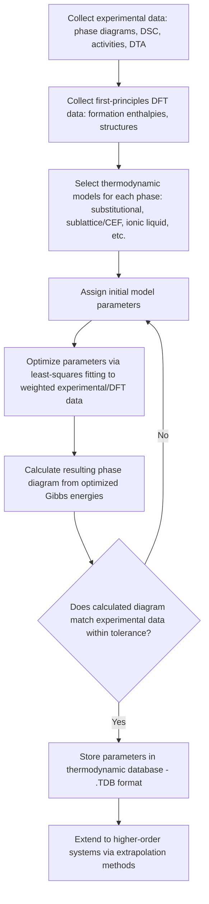

## CALPHAD Approach to Thermodynamic Modeling

### Definition and Core Philosophy

CALPHAD (**CALculation of PHAse Diagrams**) is a semi-empirical methodology for modeling the thermodynamic properties of multicomponent systems by describing the Gibbs free energy of each individual phase as a mathematical function of composition, temperature, and pressure. Rather than deriving phase behavior from first-principles quantum mechanics alone, CALPHAD fits model parameters to a combination of experimental data (phase diagrams, calorimetry, activity measurements) and, increasingly, first-principles (DFT) calculations, then uses those Gibbs energy functions to compute equilibrium phase diagrams, phase fractions, and thermochemical properties for systems and conditions that were never directly measured.

The central premise is that if the Gibbs free energy of every phase in a system is known as a function of $T$, $P$, and composition, the complete equilibrium phase diagram — and all associated thermodynamic quantities — can be computed by Gibbs energy minimization, without needing to measure the diagram experimentally for every possible alloy composition.

### Historical Context and Development

The approach originated from the work of Larry Kaufman in the 1970s, building on the foundational thermodynamic framework established by Van Laar and others earlier in the 20th century, and was formalized through the founding of the CALPHAD organization and its associated journal. It has since become the dominant methodology in computational thermodynamics for alloy design, underlying commercial and open-source software packages (e.g., Thermo-Calc, Pandat, FactSage, and the open-source OpenCalphad).

### The Gibbs Energy Description of a Phase

For each phase, a Gibbs energy model $G^\phi(T, P, x_i)$ is constructed, typically decomposed into physically meaningful contributions:

$$G^\phi = G^\phi_{ref} + G^\phi_{ideal} + G^\phi_{excess} + G^\phi_{magnetic} + \ldots$$

**Key Points**

- **Reference term ($G_{ref}$):** A composition-weighted sum of the Gibbs energies of the pure components in that phase structure, often expressed via the **Gibbs energy function** relative to a defined reference state (commonly the Standard Element Reference, SER — each element's enthalpy in its stable form at 298.15 K and 1 bar).
- **Ideal mixing term ($G_{ideal}$):** The configurational entropy contribution from random mixing of atoms on lattice sites:

$$G_{ideal} = RT\sum_i x_i \ln x_i$$

- **Excess term ($G_{excess}$):** Describes non-ideal interactions between components, most commonly using a **Redlich–Kister polynomial** expansion:

$$G_{excess} = x_1 x_2 \sum_{\nu=0}^{n} {}^{\nu}L_{1,2}(x_1 - x_2)^\nu$$

where the interaction parameters ${}^{\nu}L_{1,2}$ are themselves temperature-dependent (typically expressed as $L = a + bT$) and are fitted to experimental or first-principles data.

- **Magnetic contribution ($G_{magnetic}$):** For ferromagnetic/antiferromagnetic systems (e.g., Fe, Ni, Co-containing alloys), an additional term (commonly the **Inden–Hillert–Jarl model**) captures the magnetic ordering contribution to the free energy, which is significant near the Curie or Néel temperature.

### Sublattice (Compound Energy Formalism) Modeling

Many phases — particularly intermetallics, carbides, and ordered solutions — have distinct crystallographic sublattices on which different species preferentially reside. CALPHAD handles this using the **Compound Energy Formalism (CEF)**, representing a phase as:

$$(A,B)_a(C,D)_b\ldots$$

where each sublattice can be occupied by a mixture of species with site fractions $y_i^{(s)}$ constrained by:

$$\sum_i y_i^{(s)} = 1 \quad \text{for each sublattice } s$$

**Example**

The FCC-based ordered phase in Ni-Al systems (relevant to Ni-based superalloy γ′ precipitates, Ni₃Al) can be modeled with a two-sublattice formalism such as $(\text{Ni,Al})_{0.75}(\text{Ni,Al})_{0.25}$, allowing the model to capture both the disordered FCC solid solution and the ordered L1₂ structure within a single unified Gibbs energy description, with an ordering energy term that vanishes when both sublattices have identical occupancy (recovering the disordered state).

This formalism is essential for describing order–disorder transformations and provides continuity between ordered and disordered forms of the same underlying lattice, avoiding the need for separate, disconnected phase descriptions.

### Parameter Assessment (Optimization) Workflow

Constructing a CALPHAD database for a system involves a systematic **assessment** procedure:

Lower-order systems (unary, binary, ternary) are assessed first and stored in a thermodynamic database (commonly a `.TDB` file format), and higher-order multicomponent systems are then constructed by combining and extrapolating lower-order binary and ternary descriptions using established geometric extrapolation models (e.g., Muggianu, Kohler, or Toop methods) for the excess Gibbs energy, supplemented with any measurable higher-order interaction terms.

### Equilibrium Calculation: Gibbs Energy Minimization

Once a thermodynamic database exists, the equilibrium phase assemblage at any given $T$, $P$, and overall composition is found by minimizing the total Gibbs energy of the system:

$$G_{total} = \sum_\phi n^\phi G^\phi(T,P,x^\phi) \rightarrow \text{minimum}$$

subject to mass balance constraints:

$$\sum_\phi n^\phi x_i^\phi = n_i^{overall} \quad \text{for each component } i$$

This is a constrained nonlinear optimization problem solved numerically (commonly via a Lagrangian or Newton–Raphson-based minimization scheme), determining simultaneously: which phases are stable, their amounts (phase fractions), and their individual compositions.

### Outputs Obtainable from a CALPHAD Calculation

**Key Points**

- Binary, ternary, and multicomponent equilibrium phase diagrams (isothermal sections, vertical/isopleth sections, liquidus projections)
- Phase fraction vs. temperature plots (e.g., Scheil–Gulliver solidification simulation for non-equilibrium cooling)
- Thermochemical properties: enthalpy of formation/mixing, heat capacity, activity coefficients
- Driving forces for nucleation of specific phases (used as input to kinetic/precipitation models)
- Coupling with kinetic simulation tools (e.g., DICTRA for diffusion-controlled transformations, or phase-field models) for microstructure evolution prediction

### Illustrative Application: Scheil Solidification Simulation

The **Scheil–Gulliver model**, a widely used non-equilibrium solidification approximation built on a CALPHAD database, assumes:

- Complete diffusional mixing in the liquid at every temperature step
- Zero diffusion in already-solidified phases (no back-diffusion)
- Local equilibrium maintained at the solid–liquid interface at each temperature step

This yields a modified lever-rule-type calculation performed incrementally over small temperature decrements, tracking the evolving liquid composition as solidification proceeds — producing predictions of microsegregation, non-equilibrium solidus temperatures, and terminal (last-to-solidify) phases, which are critical for predicting hot-cracking susceptibility and microstructure in as-cast and additively manufactured alloys. [Inference — Scheil predictions represent one limiting case; real solidification often falls between the equilibrium (lever rule) and Scheil limits due to finite solid-state diffusion.]

### Diagram: CALPHAD Model Hierarchy

<svg xmlns="http://www.w3.org/2000/svg" viewBox="0 0 720 460" font-family="Helvetica, Arial, sans-serif">
<text x="360" y="28" text-anchor="middle" font-size="18" font-weight="bold" fill="#1a1a1a">CALPHAD Gibbs Energy Model Structure (svg_diagram)</text>
<rect x="260" y="55" width="200" height="45" rx="6" fill="#1f6feb" opacity="0.15" stroke="#1f6feb" stroke-width="2" />
<text x="360" y="83" text-anchor="middle" font-size="13" font-weight="bold" fill="#1f6feb">G_phase(T,P,x)</text>
<line x1="360" y1="100" x2="150" y2="160" stroke="#666" stroke-width="1.5" />
<line x1="360" y1="100" x2="320" y2="160" stroke="#666" stroke-width="1.5" />
<line x1="360" y1="100" x2="480" y2="160" stroke="#666" stroke-width="1.5" />
<line x1="360" y1="100" x2="620" y2="160" stroke="#666" stroke-width="1.5" />
<rect x="60" y="160" width="180" height="55" rx="6" fill="#0b6e4f" opacity="0.12" stroke="#0b6e4f" stroke-width="2" />
<text x="150" y="183" text-anchor="middle" font-size="11" font-weight="bold" fill="#0b6e4f">Reference term</text>
<text x="150" y="200" text-anchor="middle" font-size="10" fill="#0b6e4f">SER pure element data</text>
<rect x="240" y="160" width="160" height="55" rx="6" fill="#0b6e4f" opacity="0.12" stroke="#0b6e4f" stroke-width="2" />
<text x="320" y="183" text-anchor="middle" font-size="11" font-weight="bold" fill="#0b6e4f">Ideal mixing term</text>
<text x="320" y="200" text-anchor="middle" font-size="10" fill="#0b6e4f">RT Σ xi ln(xi)</text>
<rect x="420" y="160" width="160" height="55" rx="6" fill="#b5541a" opacity="0.12" stroke="#b5541a" stroke-width="2" />
<text x="500" y="183" text-anchor="middle" font-size="11" font-weight="bold" fill="#b5541a">Excess term</text>
<text x="500" y="200" text-anchor="middle" font-size="10" fill="#b5541a">Redlich-Kister L(T)</text>
<rect x="540" y="160" width="150" height="55" rx="6" fill="#a83279" opacity="0.12" stroke="#a83279" stroke-width="2" />
<text x="615" y="183" text-anchor="middle" font-size="11" font-weight="bold" fill="#a83279">Magnetic term</text>
<text x="615" y="200" text-anchor="middle" font-size="10" fill="#a83279">Inden-Hillert-Jarl</text>
<line x1="500" y1="215" x2="500" y2="255" stroke="#666" stroke-width="1.5" />
<rect x="380" y="255" width="240" height="50" rx="6" fill="#555" opacity="0.1" stroke="#555" stroke-width="2" />
<text x="500" y="278" text-anchor="middle" font-size="11" font-weight="bold" fill="#333">Parameters fitted via</text>
<text x="500" y="294" text-anchor="middle" font-size="10" fill="#333">Assessment (optimization)</text>
<line x1="500" y1="305" x2="500" y2="345" stroke="#666" stroke-width="1.5" />
<rect x="360" y="345" width="280" height="50" rx="6" fill="#1a1a1a" opacity="0.08" stroke="#1a1a1a" stroke-width="2" />
<text x="500" y="368" text-anchor="middle" font-size="11" font-weight="bold" fill="#1a1a1a">Stored in Thermodynamic</text>
<text x="500" y="384" text-anchor="middle" font-size="10" fill="#1a1a1a">Database (.TDB file)</text>
<line x1="500" y1="395" x2="500" y2="425" stroke="#666" stroke-width="1.5" />
<text x="500" y="440" text-anchor="middle" font-size="11" fill="#333">Gibbs Energy Minimization → Phase Diagram / Equilibria</text>
</svg>

### Applications in Alloy Design and Process Engineering

- **Integrated Computational Materials Engineering (ICME):** CALPHAD serves as the thermodynamic backbone linking composition selection to predicted microstructure and, subsequently, mechanical properties, enabling accelerated alloy development cycles.
- **Superalloy design:** Predicting γ/γ′ phase fractions, solvus temperatures, and topologically close-packed (TCP) phase formation risk in Ni-based superalloys.
- **Additive manufacturing process design:** Coupling CALPHAD with Scheil solidification and solidification-path modeling to predict cracking susceptibility, segregation, and printability of new alloy compositions.
- **Steel and light-alloy design:** Predicting solvus/solidus/liquidus temperatures, carbide/precipitate equilibria, and heat treatment windows.
- **Diffusion simulations:** Providing thermodynamic mobility/driving-force input to kinetic software (e.g., DICTRA) for modeling homogenization, carburization, and diffusion-couple experiments.
- **Multicomponent database extrapolation:** Enabling exploration of vast, previously unmeasured composition spaces in high-throughput and combinatorial alloy design efforts (including high-entropy alloys).

### Limitations

- CALPHAD predictions are only as reliable as the underlying assessed database; extrapolation into compositional or temperature regions lacking experimental or DFT input data carries elevated uncertainty. [Inference]
- Metastable phases, kinetically trapped states, and non-equilibrium microstructures (common in rapid solidification or additive manufacturing) are not directly predicted by pure equilibrium CALPHAD calculations and require supplementary kinetic modeling (e.g., Scheil, phase-field, or DICTRA coupling).
- High-order multicomponent extrapolations (quaternary and beyond) from lower-order assessed systems can introduce compounding error, particularly when higher-order interaction terms have not been explicitly measured or assessed. [Inference]
- Model quality is sensitive to the consistency and quality of the experimental/computational data used in assessment; conflicting literature data can lead to assessor-dependent parameter sets and version-to-version database differences.

### Related Topics

- Gibbs Free Energy Minimization and Phase Equilibrium
- Binary and Ternary Phase Diagrams
- Redlich–Kister Polynomial and Regular Solution Models
- Compound Energy Formalism and Sublattice Modeling
- Scheil–Gulliver Non-Equilibrium Solidification
- DICTRA and Diffusion-Controlled Transformation Simulation
- Integrated Computational Materials Engineering (ICME)
- First-Principles (DFT) Methods in Materials Thermodynamics
- High-Entropy Alloy Thermodynamics