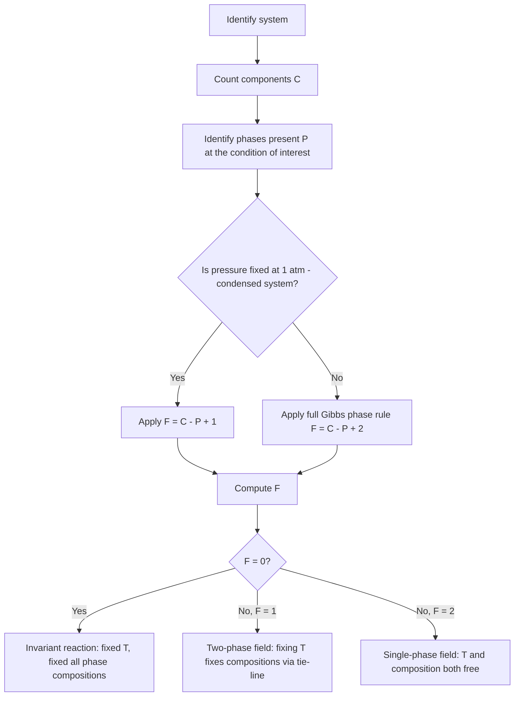

## The Phase Rule and Equilibrium Concepts

### Thermodynamic Foundation of Equilibrium

A system is in **thermodynamic equilibrium** when it has no tendency to change spontaneously with time under the prevailing external conditions. Full equilibrium requires simultaneous satisfaction of three sub-conditions:

- **Thermal equilibrium:** uniform temperature throughout the system (no net heat flow)
- **Mechanical equilibrium:** uniform pressure, or balanced mechanical forces (no net volume change)
- **Chemical equilibrium:** no net change in chemical composition of any phase; equivalently, the chemical potential of each component is equal in every phase in which it is present:

$$\mu_i^{\alpha} = \mu_i^{\beta} = \ldots = \mu_i^{\pi} \quad \text{for every component } i$$

This equality of chemical potentials across coexisting phases is the fundamental criterion determining phase coexistence and is the basis from which the phase rule is derived.

### Definitions: Components, Phases, and Degrees of Freedom

**Key Points**

- **Phase:** A physically distinct, homogeneous, mechanically separable portion of a system with uniform physical and chemical properties throughout (e.g., liquid, a specific solid solution, a specific intermetallic compound). Two immiscible liquids count as two phases; two solid solutions of different crystal structure or composition count as separate phases even if adjacent.
- **Component:** The minimum number of independently variable chemical species required to completely specify the composition of every phase in the system. For a simple metallic system with no compound formation, components are usually the constituent elements (e.g., a Cu–Ni system has 2 components). If a stable compound forms with fixed stoichiometry, it may sometimes be treated as an independent component in specific contexts, though standard practice usually retains the elements as components unless the system is more naturally described otherwise.
- **Degrees of freedom (F):** The number of intensive variables (such as temperature, pressure, and composition variables) that can be independently changed without altering the number or identity of phases present at equilibrium. Also called the **variance** of the system.

### The Gibbs Phase Rule

Formulated by J. Willard Gibbs, the phase rule relates the number of components ($C$), phases ($P$), and degrees of freedom ($F$) at equilibrium:

$$F = C - P + 2$$

The "+2" accounts for the two external variables typically considered: temperature and pressure. Each phase introduces $(C-1)$ independent composition variables (since mole fractions in each phase sum to 1), giving a total of $P(C-1) + 2$ variables, while equilibrium between $P$ phases imposes $(P-1)$ independent equality constraints on the chemical potential of each of the $C$ components, i.e., $C(P-1)$ constraints. Subtracting constraints from variables:

$$F = [P(C-1) + 2] - C(P-1) = C - P + 2$$

**For condensed systems** (metallic and ceramic systems where the vapor phase is negligible and pressure is fixed at 1 atm, which is standard practice in most metallurgical phase diagrams), pressure is not treated as a free variable, reducing the rule to the **condensed phase rule**:

$$F = C - P + 1$$

This is the form most commonly applied when reading binary temperature–composition phase diagrams in materials science, since these diagrams are conventionally constructed at constant (atmospheric) pressure.

### Applying the Phase Rule: Worked Examples

**Example**

*Pure metal solidification* ($C = 1$): At the melting point, solid and liquid coexist ($P = 2$).

$$F = C - P + 1 = 1 - 2 + 1 = 0$$

Zero degrees of freedom means the melting point occurs at a single, fixed temperature for a pure metal at constant pressure — consistent with the observed thermal arrest (flat plateau) on a cooling curve.

**Example**

*Binary eutectic system* ($C = 2$, e.g., a simple binary alloy A–B with a eutectic reaction): At the eutectic point, three phases coexist simultaneously (liquid, solid $\alpha$, solid $\beta$), so $P = 3$.

$$F = C - P + 1 = 2 - 3 + 1 = 0$$

Zero degrees of freedom confirms that the eutectic reaction occurs at a single, invariant temperature (the eutectic temperature) and at a single, fixed liquid composition (the eutectic composition) — this invariant point appears as a horizontal line on the phase diagram and produces a distinct thermal arrest during cooling.

**Example**

*Binary single-phase liquid region* ($C = 2$, $P = 1$, single liquid phase):

$$F = 2 - 1 + 1 = 2$$

Two degrees of freedom means both temperature and composition can be independently varied within the single-phase liquid region without any phase change occurring — consistent with this region being an open, two-dimensional area on the phase diagram.

**Example**

*Binary two-phase region* (e.g., liquid + solid coexisting, $C = 2$, $P = 2$):

$$F = 2 - 2 + 1 = 1$$

One degree of freedom means that once temperature is fixed within a two-phase region, the compositions of both coexisting phases are automatically fixed (determined by the tie-line endpoints at that temperature) — this is the thermodynamic justification for the **lever rule** and **tie-line** construction used to read phase compositions and fractions off a binary phase diagram.

### Correspondence Between Phase Rule and Diagram Geometry

| Degrees of Freedom ($F$) | Geometric Feature (Binary, Condensed) | Physical Meaning |
| --- | --- | --- |
| 2 | Area (single-phase field) | T and composition both independently variable |
| 1 | Line/boundary (two-phase region interior, or a phase boundary curve) | Fixing T fixes phase compositions via tie-line |
| 0 | Point (invariant reaction: eutectic, peritectic, eutectoid, monotectic) | Fixed T and fixed compositions of all phases |

This table is a general rule of thumb for interpreting any binary condensed-system phase diagram: as more phases come into coexistence, the variance decreases, and the corresponding diagram feature collapses from a two-dimensional field to a one-dimensional boundary to a zero-dimensional invariant point.

### Invariant Reactions and Zero-Variance Points

Because $F = 0$ at invariant points in binary systems, these reactions proceed at constant temperature with fixed phase compositions, producing sharp features in cooling curves and characteristic horizontal isotherms on phase diagrams. Common invariant reaction types include:

- **Eutectic:** $L \rightarrow \alpha + \beta$ (liquid decomposes into two solid phases on cooling)
- **Peritectic:** $L + \alpha \rightarrow \beta$ (liquid reacts with an existing solid phase to form a new solid phase)
- **Eutectoid:** $\gamma \rightarrow \alpha + \beta$ (a solid phase decomposes into two different solid phases, entirely in the solid state — e.g., the eutectoid reaction in the Fe–Fe₃C system forming pearlite)
- **Peritectoid:** $\alpha + \beta \rightarrow \gamma$ (two solid phases react to form a third solid phase)
- **Monotectic:** $L_1 \rightarrow L_2 + \alpha$ (one liquid decomposes into a second, different liquid and a solid phase)

### Phase Rule Application Flow

### Duhem's Theorem

A related concept, **Duhem's theorem**, states that for any closed system of fixed total composition (specified overall masses of each component), the equilibrium state is completely determined by specifying any two independent intensive or extensive variables, regardless of the number of phases or components present. This complements the phase rule: while the phase rule describes the *variance* of intensive state variables at a given equilibrium, Duhem's theorem addresses how a closed system's total equilibrium state (including phase amounts) is fixed once any two variables are specified.

### Illustration: Phase Rule Geometry on a Binary Phase Diagram

<svg xmlns="http://www.w3.org/2000/svg" viewBox="0 0 720 460" font-family="Helvetica, Arial, sans-serif">
<text x="360" y="26" text-anchor="middle" font-size="18" font-weight="bold" fill="#1a1a1a">Phase Rule Geometry — Binary Eutectic Diagram (svg_diagram)</text>

<line x1="80" y1="410" x2="640" y2="410" stroke="#333" stroke-width="2" />
<line x1="80" y1="410" x2="80" y2="60" stroke="#333" stroke-width="2" />
<text x="360" y="440" text-anchor="middle" font-size="13" fill="#333">Composition (%B) →</text>
<text x="35" y="235" text-anchor="middle" font-size="13" fill="#333" transform="rotate(-90 35 235)">Temperature →</text>

<path d="M 100 90 L 340 320 L 580 100" fill="none" stroke="#1f6feb" stroke-width="2.5" />

<path d="M 100 90 L 140 380" fill="none" stroke="#0b6e4f" stroke-width="2" />
<path d="M 580 100 L 540 380" fill="none" stroke="#0b6e4f" stroke-width="2" />

<line x1="140" y1="320" x2="540" y2="320" stroke="#b5541a" stroke-width="3" />
<circle cx="340" cy="320" r="5" fill="red" />

<text x="360" y="150" text-anchor="middle" font-size="12" fill="`#1f6feb`" font-weight="bold">L (F=2, single phase)</text>

<text x="200" y="230" text-anchor="middle" font-size="11" fill="#333">L + α (F=1)</text>

<text x="500" y="230" text-anchor="middle" font-size="11" fill="#333">L + β (F=1)</text>

<text x="115" y="250" text-anchor="middle" font-size="11" fill="`#0b6e4f`" font-weight="bold">α (F=2)</text>

<text x="600" y="250" text-anchor="middle" font-size="11" fill="`#0b6e4f`" font-weight="bold">β (F=2)</text>

<text x="340" y="365" text-anchor="middle" font-size="11" fill="#333">α + β (F=1)</text>

<text x="345" y="310" text-anchor="middle" font-size="11" fill="red" font-weight="bold">Eutectic point (F=0)</text>

<text x="360" y="430" text-anchor="middle" font-size="10" fill="#333">Composition scale (0–100% B)</text>

</svg>

### Practical Applications and Interpretation

- **Reading phase diagrams:** The phase rule provides the rigorous justification for why single-phase regions are areas, two-phase regions require tie-lines (not arbitrary point readings), and invariant reactions appear as fixed horizontal lines rather than temperature ranges.
- **Cooling curve interpretation:** Predicts and explains thermal arrests (plateaus, indicating $F=0$) versus changes in cooling rate (slope changes, indicating entry into a two-phase, $F=1$ region) during solidification analysis.
- **Alloy and process design:** Determines how many independent variables (temperature, composition) a metallurgist can adjust while maintaining a desired phase assemblage — critical for heat treatment window design and quality control specifications.
- **Ternary and higher-order systems:** The generalized phase rule extends directly to ternary ($C=3$) and multicomponent systems, underlying the interpretation of isothermal sections, vertical sections, and liquidus projections used in complex alloy systems (and forming the conceptual basis connecting to CALPHAD-based multicomponent equilibrium calculations).

### Limitations and Careful Considerations

- The phase rule describes **equilibrium** conditions only; it makes no statement about the rate at which equilibrium is reached, and real cooling processes (especially rapid cooling) frequently produce metastable, non-equilibrium microstructures not predicted by equilibrium phase diagrams. [Inference]
- Component counting requires care in systems with intermediate compounds, ionic species, or when additional constraints (e.g., fixed stoichiometric ratios) apply; miscounting components is a common source of error in phase rule application. [Inference — correct component counting depends on the specific system and chosen basis, and conventions can vary by source.]
- The standard condensed phase rule assumes pressure has negligible effect on condensed-phase equilibria (justified because solid/liquid molar volumes are small, making $\int V\,dP$ terms negligible over normal pressure ranges); at very high pressures, the full phase rule with pressure as a variable must be used.

### Related Topics

- Binary Phase Diagrams and the Lever Rule
- Ternary Phase Diagrams and Isothermal Sections
- Invariant Reactions (Eutectic, Peritectic, Eutectoid, Monotectic, Peritectoid)
- Cooling Curve Analysis and Thermal Arrests
- Duhem's Theorem
- CALPHAD Approach to Thermodynamic Modeling
- Solid Solutions and Intermediate Phases
- Iron–Iron Carbide (Fe–Fe₃C) Phase Diagram