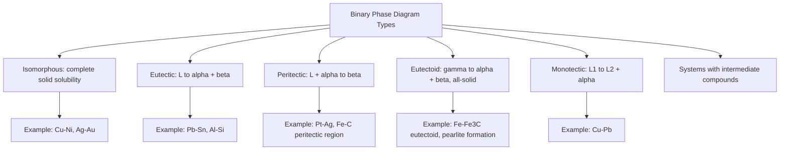

## Unary and Binary Phase Diagrams

### Purpose and Definition

A phase diagram is a graphical map of the equilibrium phases present in a system as a function of controlling variables — typically temperature, pressure, and/or composition. It is the direct graphical embodiment of the Gibbs phase rule and Gibbs free energy minimization: every point on the diagram represents the phase assemblage that minimizes total system free energy under those specific conditions. Phase diagrams are the foundational reference tool for alloy design, heat treatment specification, solidification analysis, and microstructural control.

### Unary (One-Component) Phase Diagrams

A unary phase diagram describes a single-component system ($C = 1$) as a function of the two independent field variables, temperature ($T$) and pressure ($P$), since no composition variable exists.

**Key Points**

- **Regions (fields):** Single-phase areas (e.g., solid, liquid, vapor, or distinct solid allotropes) where $F = C - P + 2 = 1 - 1 + 2 = 2$; both $T$ and $P$ can vary independently within the field without changing the phase.
- **Boundary curves:** Two-phase coexistence lines (e.g., solid–liquid, liquid–vapor, solid–vapor) where $F = 1 - 2 + 2 = 1$; specifying either $T$ or $P$ along the curve automatically fixes the other.
- **Triple point:** A unique point where three phases coexist simultaneously (e.g., solid, liquid, and vapor of the same substance), where $F = 1 - 3 + 2 = 0$; both $T$ and $P$ are uniquely fixed.
- **Critical point:** The terminus of the liquid–vapor boundary curve, beyond which liquid and vapor become indistinguishable (a single supercritical fluid phase).

**Clausius–Clapeyron Relation for Boundary Curve Slopes**

The slope of any two-phase boundary curve on a unary $P$–$T$ diagram is governed by the Clausius–Clapeyron equation:

$$\frac{dP}{dT} = \frac{\Delta H_{trans}}{T\Delta V_{trans}}$$

where $\Delta H_{trans}$ is the latent heat of the phase transformation and $\Delta V_{trans}$ is the volume change accompanying it. This explains, for example, why the solid–liquid boundary for most metals has a steep positive slope (small $\Delta V$ upon melting), whereas materials that expand upon freezing (like water) show a boundary with negative slope.

**Example — Iron's Unary Diagram (Allotropy)**

Pure iron exhibits multiple solid allotropes as a function of temperature at 1 atm: $\alpha$-Fe (BCC, ferrite, stable below ~912°C), $\gamma$-Fe (FCC, austenite, stable ~912–1394°C), and $\delta$-Fe (BCC, stable ~1394–1538°C, the melting point), before melting to liquid. Each allotropic transition is itself a zero-variance point at fixed pressure (since $F = C - P + 1 = 1 - 2 + 1 = 0$ for the condensed form of the phase rule), meaning each transformation temperature is sharply defined at 1 atm. This polymorphism is the physical basis for iron and steel heat treatment (the $\alpha \leftrightarrow \gamma$ transformation enables quenching, tempering, and the entire hardenability framework of steel metallurgy).

### Binary (Two-Component) Phase Diagrams

For binary systems ($C = 2$), pressure is conventionally fixed at 1 atm (condensed phase rule, $F = C - P + 1$), allowing the diagram to be presented as a two-dimensional temperature–composition ($T$–$x$) map, which is the standard format used throughout physical metallurgy.

**Key Points**

- **Single-phase fields (areas):** $F = 2 - 1 + 1 = 2$; temperature and composition both independently variable.
- **Two-phase fields (areas bounded by two curves, e.g., $L + \alpha$):** $F = 2 - 2 + 1 = 1$; fixing temperature fixes both phase compositions via the tie-line.
- **Invariant points (horizontal lines at $F = 0$):** Represent three-phase equilibria at a fixed temperature and fixed compositions for all three phases.

### Classification of Binary Systems

**Isomorphous systems (complete solid and liquid solubility):**

Components are completely miscible in both liquid and solid states across the entire composition range (e.g., Cu–Ni, Ag–Au). The diagram consists of a single lens-shaped two-phase region ($L + \alpha$) bounded above by the **liquidus** (temperature above which the system is fully liquid) and below by the **solidus** (temperature below which the system is fully solid), with no eutectic or other invariant reaction.

**Eutectic systems (limited solid solubility):**

Two solid solution phases ($\alpha$, $\beta$) form with only partial mutual solubility, and the liquid decomposes at the eutectic point into both solids simultaneously:

$$L \rightarrow \alpha + \beta \quad \text{(at the eutectic temperature } T_E\text{, eutectic composition } C_E\text{)}$$

Common examples include Pb–Sn (traditional solder systems) and Al–Si.

**Peritectic systems:**

A liquid reacts with a pre-existing solid phase upon cooling to form a new, different solid phase:

$$L + \alpha \rightarrow \beta \quad \text{(at the peritectic temperature)}$$

Peritectic reactions occur when the two components have significantly different melting points, and are common in systems such as Pt–Ag and portions of the Fe–C (Fe–Fe₃C) diagram (the $\delta$-ferrite/austenite peritectic near 1495°C).

**Eutectoid systems:**

An entirely solid-state analog of the eutectic reaction, where one solid phase decomposes into two different solid phases on cooling:

$$\gamma \rightarrow \alpha + \beta$$

The classic example is the eutectoid reaction in the Fe–Fe₃C system at 727°C, where austenite ($\gamma$) transforms to pearlite (a lamellar mixture of ferrite $\alpha$ and cementite Fe₃C) — the microstructural foundation of conventional steel heat treatment.

**Monotectic systems:**

A liquid phase decomposes into a second, compositionally distinct liquid plus a solid phase:

$$L_1 \rightarrow L_2 + \alpha$$

Occurs in systems with a **miscibility gap** in the liquid state (limited liquid–liquid solubility), such as Cu–Pb.

**Systems with intermediate phases/compounds:**

Many real binary systems contain one or more intermediate solid phases (intermetallic compounds or ordered solid solutions) with their own distinct crystal structure, appearing as separate single-phase fields (often narrow, near-vertical "line compounds" for stoichiometric intermetallics) between the terminal solid solutions.

### The Lever Rule

Within any two-phase region, the relative mass fractions of the two coexisting phases at a given overall composition $C_0$ and temperature are calculated using the **lever rule**, derived from mass balance:

$$W_\alpha = \frac{C_\beta - C_0}{C_\beta - C_\alpha}, \qquad W_\beta = \frac{C_0 - C_\alpha}{C_\beta - C_\alpha}$$

where $C_\alpha$ and $C_\beta$ are the compositions of the $\alpha$ and $\beta$ phases at the tie-line endpoints for that temperature, and $C_0$ is the overall (nominal) alloy composition.

**Example**

For a Cu–Ni isomorphous alloy of overall composition $C_0 = 35\text{ wt\% Ni}$ at a temperature where the tie-line gives $C_\alpha(\text{solid}) = 42.5\text{ wt\% Ni}$ and $C_L(\text{liquid}) = 31.5\text{ wt\% Ni}$:

$$W_L = \frac{C_\alpha - C_0}{C_\alpha - C_L} = \frac{42.5 - 35}{42.5 - 31.5} = \frac{7.5}{11} \approx 0.68$$

$$W_\alpha = 1 - W_L \approx 0.32$$

indicating the alloy at this temperature is approximately 68 wt% liquid and 32 wt% solid.

### Diagram: Classification Overview

### Illustration: Unary Diagram Schematic (Iron)

<svg xmlns="http://www.w3.org/2000/svg" viewBox="0 0 640 420" font-family="Helvetica, Arial, sans-serif">
<text x="320" y="26" text-anchor="middle" font-size="17" font-weight="bold" fill="#1a1a1a">Unary P–T Diagram — Schematic (svg_diagram)</text>
<line x1="80" y1="380" x2="580" y2="380" stroke="#333" stroke-width="2" />
<line x1="80" y1="380" x2="80" y2="60" stroke="#333" stroke-width="2" />
<text x="330" y="405" text-anchor="middle" font-size="13" fill="#333">Temperature →</text>
<text x="35" y="220" text-anchor="middle" font-size="13" fill="#333" transform="rotate(-90 35 220)">Pressure →</text>

<line x1="260" y1="380" x2="300" y2="80" stroke="#1f6feb" stroke-width="2.5" />

<path d="M 300 80 Q 400 200 470 340" fill="none" stroke="#b5541a" stroke-width="2.5" />

<line x1="260" y1="380" x2="140" y2="180" stroke="#0b6e4f" stroke-width="2.5" />
<circle cx="260" cy="380" r="5" fill="red" />
<text x="230" y="398" font-size="11" fill="red">Triple point</text>
<circle cx="470" cy="340" r="4" fill="#333" />
<text x="480" y="343" font-size="10" fill="#333">Critical point</text>

<text x="160" y="250" font-size="12" fill="`#0b6e4f`" font-weight="bold">Solid</text>

<text x="350" y="150" font-size="12" fill="`#1f6feb`" font-weight="bold">Liquid</text>

<text x="480" y="270" font-size="12" fill="`#b5541a`" font-weight="bold">Vapor</text>

</svg>

### Illustration: Binary Eutectic Diagram with Tie-Line

<svg xmlns="http://www.w3.org/2000/svg" viewBox="0 0 680 440" font-family="Helvetica, Arial, sans-serif">
<text x="340" y="26" text-anchor="middle" font-size="17" font-weight="bold" fill="#1a1a1a">Binary Eutectic Diagram — Tie-Line and Lever Rule (svg_diagram)</text>
<line x1="80" y1="400" x2="620" y2="400" stroke="#333" stroke-width="2" />
<line x1="80" y1="400" x2="80" y2="70" stroke="#333" stroke-width="2" />
<text x="350" y="425" text-anchor="middle" font-size="13" fill="#333">Composition (%B) →</text>
<path d="M 100 90 L 330 300 L 560 100" fill="none" stroke="#1f6feb" stroke-width="2.5" />
<path d="M 100 90 L 150 370" fill="none" stroke="#0b6e4f" stroke-width="2" />
<path d="M 560 100 L 500 370" fill="none" stroke="#0b6e4f" stroke-width="2" />
<line x1="150" y1="300" x2="500" y2="300" stroke="#b5541a" stroke-width="3" />

<line x1="230" y1="200" x2="400" y2="200" stroke="red" stroke-width="1.5" stroke-dasharray="5,3" />
<circle cx="230" cy="200" r="4" fill="red" />
<circle cx="400" cy="200" r="4" fill="red" />
<circle cx="300" cy="200" r="4" fill="black" />
<text x="230" y="190" font-size="10" fill="red" text-anchor="middle">Cα</text>
<text x="400" y="190" font-size="10" fill="red" text-anchor="middle">CL</text>
<text x="300" y="215" font-size="10" fill="black" text-anchor="middle">C0</text>

<text x="340" y="140" text-anchor="middle" font-size="12" fill="`#1f6feb`" font-weight="bold">L</text>

<text x="200" y="250" text-anchor="middle" font-size="11" fill="#333">L + α</text>

<text x="440" y="250" text-anchor="middle" font-size="11" fill="#333">L + β</text>

<text x="120" y="330" text-anchor="middle" font-size="11" fill="`#0b6e4f`" font-weight="bold">α</text>

<text x="560" y="330" text-anchor="middle" font-size="11" fill="`#0b6e4f`" font-weight="bold">β</text>

<text x="330" y="315" text-anchor="middle" font-size="10" fill="#333">Eutectic</text>

</svg>

### Interpreting Cooling Curves

Cooling curves (temperature vs. time during slow, near-equilibrium cooling) directly reflect phase diagram features via the phase rule: passing through a single-phase region shows continuous, uninterrupted cooling; entering a two-phase region ($F=1$) shows a change in the slope of the cooling curve (due to latent heat release as the second phase forms, slowing the cooling rate); passing through an invariant reaction ($F=0$) produces a flat thermal arrest (plateau) at constant temperature until the reaction fully completes.

### Applications in Materials Engineering

- **Alloy selection and heat treatment design:** Phase diagrams define the temperature windows for solutionizing, homogenization, aging/precipitation hardening, and annealing treatments.
- **Solidification processing:** Predicting microsegregation, dendritic solidification range (the gap between liquidus and solidus), and hot-tearing susceptibility, which scale with the width of the two-phase $L+\alpha$ freezing range.
- **Solder and joining alloy design:** Eutectic compositions (e.g., near-eutectic Sn–Pb or lead-free Sn–Ag–Cu solders) are selected specifically because they solidify at the lowest possible fixed temperature with minimal freezing range.
- **Steel metallurgy:** The Fe–Fe₃C (or Fe–C) diagram, containing peritectic, eutectic, and eutectoid reactions, underlies essentially the entire framework of conventional steel heat treatment, hardenability, and microstructure control (pearlite, bainite, martensite formation logic begins from this equilibrium map).
- **Quality control and failure analysis:** Identifying unexpected phases or segregation patterns by comparing observed microstructures against the equilibrium predictions of the relevant phase diagram.

### Limitations

- Binary phase diagrams represent **equilibrium** states only; real processing (casting, welding, rapid solidification) frequently produces metastable microstructures, cored (segregated) grains, and non-equilibrium phase fractions not directly predicted by the equilibrium lever rule. [Inference]
- Most published binary diagrams are experimentally assessed at or near atmospheric pressure; behavior under significantly different pressure conditions is not captured unless separately documented.
- Reading a phase diagram assumes sufficient time for diffusion to reach local equilibrium at the given temperature; in practice, especially for solid-state transformations, kinetic limitations may prevent full equilibrium from being reached within realistic timeframes. [Inference]

### Related Topics

- The Phase Rule and Equilibrium Concepts
- Ternary Phase Diagrams
- Iron–Iron Carbide (Fe–Fe₃C) Phase Diagram
- Lever Rule and Tie-Line Construction
- Solidification Theory and Coring/Microsegregation
- CALPHAD Approach to Thermodynamic Modeling
- Precipitation Hardening and Age Hardening Heat Treatments
- Clausius–Clapeyron Relation