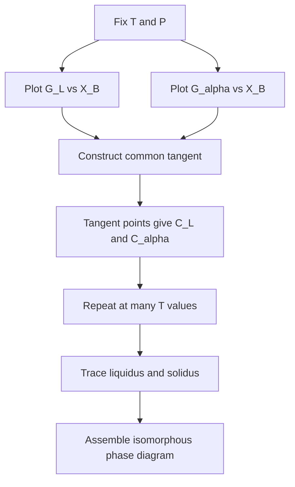
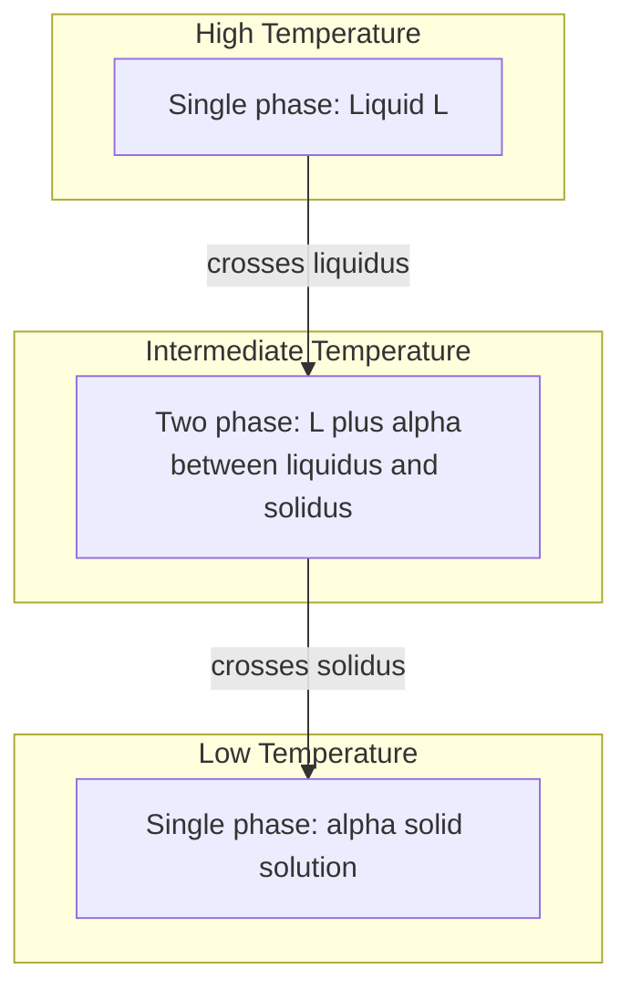
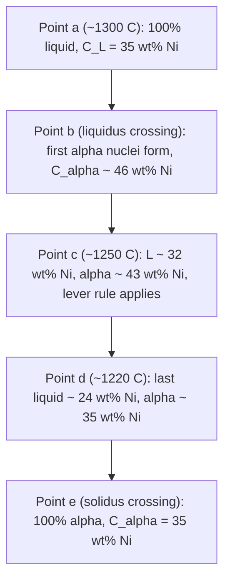
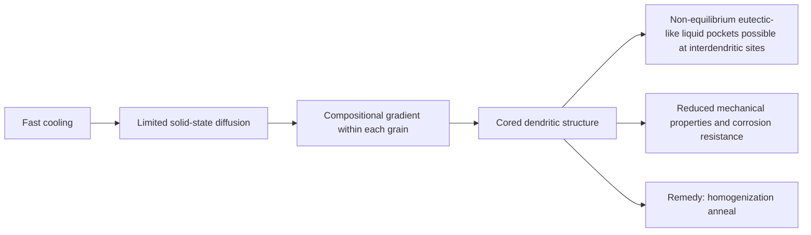
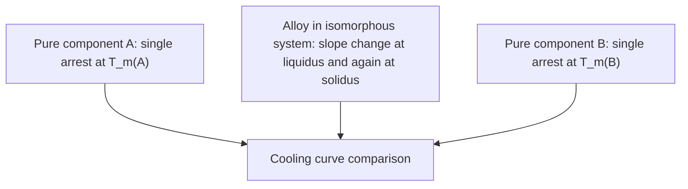
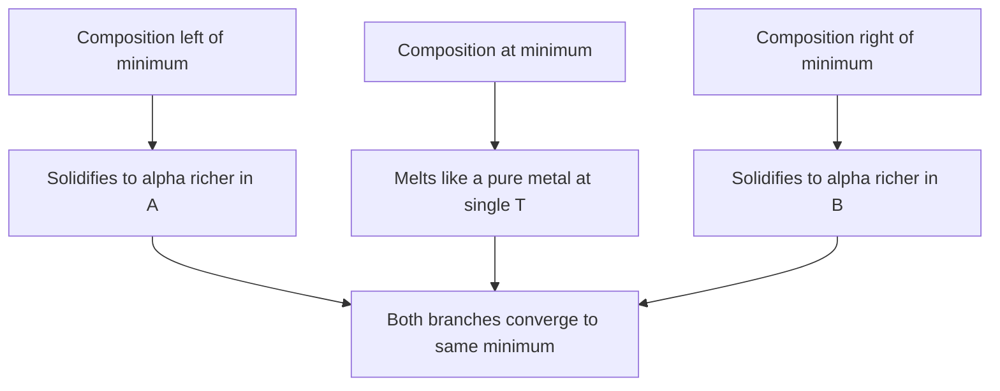

## Isomorphous Systems

Isomorphous binary systems are the simplest class of alloy phase diagrams: the two components are completely soluble in each other in both the liquid and the solid state, so only one solid phase ($\alpha$) exists across the entire composition range. The Cu–Ni system is the canonical example, and it underlies the foundational concepts used to read every other phase diagram: phase boundaries, tie lines, the lever rule, and non-equilibrium coring.

### Definition and Scope

An **isomorphous system** is a binary system (components A and B) in which:

- A single liquid phase ($L$) is stable at high temperature for all compositions.
- A single solid phase ($\alpha$), a substitutional solid solution with a common crystal structure, is stable at low temperature for all compositions.
- A two-phase region ($L + \alpha$) separates them, bounded by the **liquidus** (above which the alloy is fully liquid) and the **solidus** (below which it is fully solid).
- No eutectic, peritectic, intermetallic compound, or miscibility gap occurs in the equilibrium diagram.

The term "isomorphous" reflects that the solid solution has the same lattice type over the full composition range, with the solute atoms randomly occupying sites of the host lattice.

**Key Points**

- Two phases exist in equilibrium in the two-phase field: $L$ and $\alpha$.
- Pure components melt at a single temperature (a point on each vertical axis); alloys solidify over a temperature range.
- The number of phases and their compositions and amounts are determined uniquely by temperature and overall composition (at fixed pressure).

### Thermodynamic Basis

At constant temperature and pressure, equilibrium corresponds to the minimum of the total Gibbs free energy of the system. For a binary solution phase $\phi$:

$$G^{\phi} = X_A \mu_A^{\phi} + X_B \mu_B^{\phi}$$

where $X_i$ is the mole fraction and $\mu_i$ the chemical potential of component $i$.

For an ideal solution:

$$G^{\phi} = X_A G_A^{0,\phi} + X_B G_B^{0,\phi} + RT\left(X_A \ln X_A + X_B \ln X_B\right)$$

For a regular solution, an excess term is added:

$$G^{\phi} = X_A G_A^{0,\phi} + X_B G_B^{0,\phi} + \Omega X_A X_B + RT\left(X_A \ln X_A + X_B \ln X_B\right)$$

where $\Omega$ is the interaction parameter. Complete solid solubility (isomorphism) requires $\Omega$ to be small (near zero or modestly positive) so the solid free energy curve has a single minimum without a common-tangent split inside the solid.

**Equilibrium condition (common tangent construction)**

Two phases $L$ and $\alpha$ coexist at temperature $T$ when the chemical potentials of each component are equal in both phases:

$$\mu_A^{L} = \mu_A^{\alpha}, \qquad \mu_B^{L} = \mu_B^{\alpha}$$

Geometrically, this is the common tangent to the $G^L(X_B)$ and $G^{\alpha}(X_B)$ curves. The tangent points give the equilibrium compositions $C_L$ and $C_\alpha$ (the liquidus and solidus compositions at $T$).



### Hume-Rothery Conditions for Complete Solid Solubility

Complete substitutional solid solubility over the whole composition range generally requires that all of the following are satisfied (they are necessary conditions; satisfying them does not by itself guarantee isomorphism):

| Condition | Requirement | Cu–Ni Check |
| --- | --- | --- |
| **Atomic size** | Radius difference less than about 15% | Cu 0.128 nm, Ni 0.125 nm (about 2.4%) |
| **Crystal structure** | Same crystal structure for both pure components | Both FCC |
| **Valence** | Same or similar valence | Cu 1+ (and 2+), Ni 2+ |
| **Electronegativity** | Small difference (avoid compound formation) | Cu 1.9, Ni 1.8 |

Other isomorphous pairs frequently cited include Au–Ag, Au–Pt, Ge–Si, Mo–W, and Ti–Zr ($\beta$ phase, high temperature) [Inference: exact completeness of solubility for some pairs depends on the assessed data source]. Ceramic analogues include NiO–MgO and Al₂O₃–Cr₂O₃.

### Anatomy of an Isomorphous Phase Diagram



The generic diagram, with temperature on the vertical axis and composition (wt% or at% of B) on the horizontal axis, has these features:

<svg xmlns="http://www.w3.org/2000/svg" viewBox="0 0 600 420" width="600" height="420" font-family="sans-serif" font-size="13">
<title>Isomorphous Phase Diagram Schematic (svg_diagram)</title>
<text x="300" y="24" text-anchor="middle" font-size="15" font-weight="bold">Isomorphous Binary Phase Diagram (svg_diagram)</text>
<line x1="70" y1="50" x2="70" y2="350" stroke="black" stroke-width="2" />
<line x1="70" y1="350" x2="530" y2="350" stroke="black" stroke-width="2" />
<path d="M70,90 C200,110 340,150 530,240" fill="none" stroke="#c0392b" stroke-width="3" />
<path d="M70,90 C160,150 330,220 530,240" fill="none" stroke="#2980b9" stroke-width="3" />
<text x="300" y="100" fill="#c0392b" font-weight="bold">Liquidus</text>
<text x="330" y="230" fill="#2980b9" font-weight="bold">Solidus</text>
<text x="140" y="80" font-weight="bold">Liquid (L)</text>
<text x="270" y="170" font-weight="bold">L + α</text>
<text x="230" y="300" font-weight="bold">α (solid solution)</text>
<text x="70" y="372" text-anchor="middle">A</text>
<text x="530" y="372" text-anchor="middle">B</text>
<text x="300" y="392" text-anchor="middle">Composition (wt% B)</text>
<text x="20" y="200" transform="rotate(-90 20,200)" text-anchor="middle">Temperature</text>
<text x="75" y="84" font-size="11">T_m(A)</text>
<text x="440" y="235" font-size="11">T_m(B)</text>
</svg>

**Regions**

- **Above the liquidus:** single-phase liquid.
- **Between the liquidus and the solidus:** two-phase $L + \alpha$.
- **Below the solidus:** single-phase $\alpha$.

### Gibbs Phase Rule Application

For a binary system at constant pressure (the condensed-phase form of the rule):

$$F = C - P + 1$$

with $C = 2$ components:

| Region | Phases $P$ | Degrees of freedom $F$ | Meaning |
| --- | --- | --- | --- |
| Liquid or $\alpha$ single-phase | 1 | 2 | Both $T$ and composition can vary independently |
| $L + \alpha$ two-phase | 2 | 1 | Fixing $T$ fixes both phase compositions |
| Pure component melting point | 2 (C=1) | 0 | Invariant; isothermal arrest on cooling curve |

The pure-component melting point is invariant ($F = 1 - 2 + 1 = 0$), so pure metals show a thermal arrest, whereas alloys in the two-phase region cool through a change in slope with no flat plateau.

### Reading the Diagram: The Three Questions

For any point defined by temperature $T$ and overall alloy composition $C_0$, three questions are answered in order:

1. **Which phases are present?** Locate the point on the diagram.
2. **What are the compositions of the phases?**
   - One-phase region: the phase composition equals $C_0$.
   - Two-phase region: construct a horizontal **tie line** at $T$; its intersections with the phase boundaries give $C_L$ (liquidus side) and $C_\alpha$ (solidus side).
3. **What are the relative amounts of the phases?** Apply the **lever rule** (below).

### Tie Line and Lever Rule

At temperature $T$ in the two-phase region, with overall composition $C_0$, liquid composition $C_L$ and solid composition $C_\alpha$ (all in the same units), a mass balance yields:

$$W_L = \frac{C_\alpha - C_0}{C_\alpha - C_L}, \qquad W_\alpha = \frac{C_0 - C_L}{C_\alpha - C_L}$$


$$W_L + W_\alpha = 1$$

The "lever" is the tie line with its fulcrum at $C_0$. Each phase fraction equals the length of the opposite lever arm divided by the total tie-line length.

**Derivation**

Conservation of total mass:

$$W_L + W_\alpha = 1$$

Conservation of component B:

$$W_L C_L + W_\alpha C_\alpha = C_0$$

Substituting $W_L = 1 - W_\alpha$:

$$(1 - W_\alpha) C_L + W_\alpha C_\alpha = C_0 \;\Rightarrow\; W_\alpha = \frac{C_0 - C_L}{C_\alpha - C_L}$$

**Note on units:** With compositions in wt%, the lever rule gives mass fractions. With compositions in at%, it gives mole (atom) fractions. Converting between mass and volume fractions requires phase densities:

$$V_\alpha = \frac{W_\alpha/\rho_\alpha}{W_\alpha/\rho_\alpha + W_L/\rho_L}$$

### Worked Example: Cu–Ni System

The Cu–Ni diagram has $T_m(\text{Cu}) = 1085\,^\circ\text{C}$ and $T_m(\text{Ni}) = 1455\,^\circ\text{C}$. Approximate values commonly used in textbook problems:

**Example**

Alloy: 35 wt% Ni–65 wt% Cu at $1250\,^\circ\text{C}$.

From the diagram (approximate textbook readings):

- $C_L \approx 32$ wt% Ni
- $C_\alpha \approx 43$ wt% Ni
- $C_0 = 35$ wt% Ni

Phase compositions: $L$ with 32 wt% Ni and $\alpha$ with 43 wt% Ni.

Phase fractions:

$$W_L = \frac{43 - 35}{43 - 32} = \frac{8}{11} \approx 0.73$$


$$W_\alpha = \frac{35 - 32}{43 - 32} = \frac{3}{11} \approx 0.27$$

**Output**

| Quantity | Value |
| --- | --- |
| Phases present | $L + \alpha$ |
| $C_L$ | about 32 wt% Ni |
| $C_\alpha$ | about 43 wt% Ni |
| $W_L$ | about 0.73 |
| $W_\alpha$ | about 0.27 |

[Inference: the composition values are graphical readings from a standard textbook Cu–Ni diagram; values from assessed thermodynamic databases may differ by 1–2 wt%.]

**Mass of phases for a 10 kg charge**

$$m_L = 0.73 \times 10 = 7.3\ \text{kg}, \qquad m_\alpha = 0.27 \times 10 = 2.7\ \text{kg}$$

### Equilibrium Solidification (Slow Cooling)

Consider a 35 wt% Ni alloy cooled extremely slowly from the liquid state through the two-phase region.



**Sequence of events**

| Stage | Temperature | Phases | Liquid composition | Solid composition |
| --- | --- | --- | --- | --- |
| a | above liquidus | $L$ | 35 | none |
| b | at liquidus | $L$ (with first $\alpha$) | about 35 | about 46 |
| c | mid two-phase | $L + \alpha$ | about 32 | about 43 |
| d | just above solidus | $L$ (trace) $+ \alpha$ | about 24 | about 35 |
| e | at or below solidus | $\alpha$ | none | 35 |

**Key features of equilibrium solidification**

- The first solid to form is **richer in the higher-melting component** (Ni) than the overall alloy.
- The remaining liquid becomes progressively **enriched in the lower-melting component** (Cu).
- Both phase compositions shift continuously along the liquidus and solidus, requiring **complete diffusion in the solid** to maintain uniform $C_\alpha$ at each temperature.
- The final solid has the **overall alloy composition**, homogeneous throughout.
- The amount of $\alpha$ increases from 0 at the liquidus to 1 at the solidus.

### Non-Equilibrium Solidification: Coring

Equilibrium requires solid-state diffusion to keep pace with cooling. In practice, diffusion in the solid is far slower than in the liquid (solid-state diffusivities in metals are typically many orders of magnitude lower than liquid diffusivities near the melting point). Under realistic cooling rates:

- Each newly deposited $\alpha$ layer has a composition dictated by the current $T$, but earlier layers **do not re-equilibrate**.
- The **average solid composition** lags behind the equilibrium solidus and is displaced toward the higher-melting component.
- Solidification finishes at a **temperature below the equilibrium solidus**, since the lever rule applied to the non-uniform average solid composition yields an extended two-phase range.
- The resulting microstructure is **cored**: dendrite centres are Ni-rich, and interdendritic regions (last to freeze) are Cu-rich.



**Consequences of coring**

- Compositional heterogeneity leads to **local variations in hardness, corrosion behavior, and etching response**.
- Interdendritic regions with a lower melting temperature can begin to melt if the casting is reheated, a phenomenon called **hot shortness** or **incipient melting**.
- Mechanical properties, especially ductility and toughness, can be degraded.

**Remedy: homogenization anneal**

Reheat the casting to a temperature just below the solidus (to avoid incipient melting) and hold long enough for diffusion to eliminate the concentration gradient. A rule of thumb for time scale is the diffusion length:

$$x \approx \sqrt{D t}, \qquad D = D_0 \exp\!\left(-\frac{Q}{RT}\right)$$

where $x$ is on the order of the secondary dendrite arm spacing (typically tens of micrometres). Because $D$ depends exponentially on temperature, homogenization at the highest safe temperature is most effective.

### Scheil–Gulliver Model (Limiting Non-Equilibrium Case)

The **Scheil–Gulliver equation** describes solidification with:

1. Complete mixing in the liquid.
2. **No diffusion** in the solid.
3. Local equilibrium at the solid–liquid interface.
4. A constant partition coefficient $k = C_s/C_L$ (linear liquidus and solidus).

$$C_s = k\, C_0 \,(1 - f_s)^{k-1}$$


$$C_L = C_0 \,(1 - f_s)^{k-1}$$

where $f_s$ is the fraction solidified and $C_0$ is the initial liquid composition. The equilibrium partition coefficient is:

$$k = \frac{C_\alpha}{C_L} \quad \text{(at the interface)}$$

For an isomorphous system where solute lowers the melting point of the matrix, $k < 1$. Where solute raises the melting point, $k > 1$. In Cu–Ni, Ni raises the melting point of Cu, so with Cu as the "matrix" description the bookkeeping reverses; it is standard to treat the dilute-solute limit of each end of the diagram separately.

**Key Points**

- For $k < 1$, the Scheil equation predicts $C_L \to \infty$ as $f_s \to 1$, which physically means the last liquid can reach an eutectic composition if one exists (or the model breaks down when the liquid saturates).
- A Scheil model always predicts **more segregation** than equilibrium and **less** than what would occur in the absence of any liquid-phase mixing.
- Intermediate cases are handled by the **Brody–Flemings** model, which includes a back-diffusion parameter $\alpha' = D_s t_f / L^2$, where $D_s$ is the solid-state diffusivity, $t_f$ the local solidification time, and $L$ a characteristic length (half the dendrite arm spacing) [Inference: parameter definitions vary slightly between references].

**Comparison of limiting solidification models**

| Feature | Equilibrium (lever rule) | Scheil–Gulliver | Brody–Flemings |
| --- | --- | --- | --- |
| Solid diffusion | Complete | None | Partial (parameterized) |
| Liquid mixing | Complete | Complete | Complete |
| Final solidus | Equilibrium solidus | Below equilibrium solidus | Between the two |
| Segregation | None | Maximum | Intermediate |

### Cooling Curves for Isomorphous Alloys



| Sample | Cooling-curve signature |
| --- | --- |
| Pure metal | Horizontal plateau at $T_m$ (latent heat released at constant $T$) |
| Isomorphous alloy | Kink at liquidus (slope decreases as latent heat begins to release), kink at solidus (slope steepens as solidification completes); no plateau |

Cooling curves at several compositions are the classical experimental route (thermal analysis) to construct the liquidus and solidus of an isomorphous diagram.

### Property–Composition Relationships in Solid Solutions

Within the single-phase $\alpha$ region, properties vary smoothly with composition:

**Solid-solution strengthening**

Yield strength and hardness increase with solute concentration, typically reaching a maximum near the middle of the composition range in a fully miscible system, then decreasing toward the other pure component. A common empirical form for dilute solutions is:

$$\Delta\sigma_y = k_s\, c^{n}$$

with $n \approx 1/2$ (Labusch) or $2/3$ (Fleischer) depending on the model, and $c$ the solute concentration [Inference: the applicable exponent is model- and alloy-dependent].

**Electrical resistivity**

Resistivity of a random solid solution follows **Nordheim's rule**:

$$\rho = \rho_0 + A\, X_A X_B$$

where $\rho_0$ is the pure-metal contribution and $A$ is an alloy-specific constant. This yields a parabolic curve with a maximum near 50 at%. The Cu–Ni system is used in commercial resistance alloys; Constantan (about 55 wt% Cu–45 wt% Ni) is notable for a **near-zero temperature coefficient of resistivity** [Inference: exact composition range varies by standard].

**Ductility and toughness**

Ductility generally decreases with solute addition but remains high in FCC solid solutions such as Cu–Ni, which retain good formability.

### Industrial and Technological Relevance

| Alloy / system | Application | Isomorphous relevance |
| --- | --- | --- |
| Cu–Ni (cupronickel, 70/30, 90/10) | Marine heat exchangers, coinage, desalination tubing | Single-phase FCC, excellent corrosion resistance, good ductility |
| Constantan (Cu–Ni ~ 45 wt% Ni) | Strain gauges, thermocouples | Low temperature coefficient of resistivity |
| Monel (Ni-rich Ni–Cu) | Chemical processing, marine hardware | Single-phase $\alpha$ across the Ni-rich range |
| Au–Ag (and Au–Ag–Cu) | Jewelry | Colour tunable by composition |
| Si–Ge | Semiconductor alloys, thermoelectrics | Complete solubility; bandgap tuning |
| Mo–W | High-temperature structural parts | Both BCC, near-complete miscibility |
| NiO–MgO (ceramic) | Refractories | Isomorphous oxide system |

**Casting and processing implications**

- Because solidification occurs over a **range** of temperature, castings are prone to **dendritic segregation, microporosity, and hot tearing**.
- Wider liquidus–solidus gaps lead to a wider **mushy zone**, making feeding difficult.
- Single crystal or directional solidification techniques for solid-solution alloys rely on controlled thermal gradients $G$ and growth rates $R$ to stabilize a planar or cellular front.

### Constitutional Supercooling (Brief)

Under steady-state directional solidification with $k < 1$, a solute-enriched boundary layer forms ahead of the interface. The interface is stable (planar) if the imposed temperature gradient satisfies:

$$\frac{G}{R} \geq \frac{m_L C_0 (1 - k)}{k\, D_L}$$

where $m_L$ is the liquidus slope, $D_L$ the solute diffusivity in the liquid, $G$ the temperature gradient in the liquid at the interface, and $R$ the growth rate. Below this threshold, the planar front breaks down into cells and dendrites, which is the origin of coring in most real castings.

### Common Pitfalls and Misconceptions

- **Compositions vs. amounts:** The tie-line endpoints give **compositions** of the phases; the lever rule gives **amounts**. They are not interchangeable.
- **Lever direction:** The fraction of a phase is the length of the lever arm **on the opposite side** of the alloy composition from that phase.
- **Units:** Do not mix wt% and at% when applying the lever rule; convert first if necessary:

$$X_B = \frac{C_B/A_B}{C_B/A_B + C_A/A_A}$$

with $C$ in wt% and $A$ the atomic mass.

- **Single-phase regions:** Do not apply the lever rule; the phase fraction is 1.
- **Equilibrium assumption:** Real castings depart from equilibrium; expect coring unless a homogenization anneal follows.
- **Diagram artifacts:** The solidus and liquidus meet only at the pure-component ends (for a simple isomorphous diagram without a maximum or minimum).

### Variants: Isomorphous Systems with Congruent Points

Some solid-solution systems show a **maximum or minimum** in the liquidus and solidus where they touch tangentially (a **congruent point**), for example Au–Cu (minimum) and certain Ni–Pt or Pb–Tl variants [Inference: which specific pairs exhibit the minimum depends on the assessed diagram version].

- At the congruent composition, the alloy melts or solidifies **isothermally like a pure component** ($F = 0$ in the sense that $C_L = C_\alpha$ at a single temperature).
- Such diagrams can be viewed as **two isomorphous diagrams joined back-to-back**.
- A minimum (positive deviation from ideality in the liquid and solid, $\Omega > 0$) is more common than a maximum.

**Example: minimum-melting system**



### Computational Approach

Isomorphous liquidus/solidus and phase fractions are readily computed. A simple Python illustration using the lever rule and linear boundaries:

```python
import numpy as np

# Simplified linear liquidus/solidus for a hypothetical A-B isomorphous system
T_mA, T_mB = 1085.0, 1455.0  # melting points (deg C), Cu and Ni

def liquidus(x_B):
    # Illustrative curved boundary (not a fitted Cu-Ni curve)
    return T_mA + (T_mB - T_mA) * (x_B ** 0.8)

def solidus(x_B):
    return T_mA + (T_mB - T_mA) * (x_B ** 1.3)

def lever_rule(C0, CL, Ca):
    W_alpha = (C0 - CL) / (Ca - CL)
    W_L = 1.0 - W_alpha
    return W_L, W_alpha

# Find CL and Ca at a given T by root finding on the boundaries
from scipy.optimize import brentq

T = 1250.0
CL = brentq(lambda x: liquidus(x) - T, 0.0, 1.0)
Ca = brentq(lambda x: solidus(x) - T, 0.0, 1.0)
C0 = 0.35

W_L, W_alpha = lever_rule(C0, CL, Ca)
print(f"C_L = {CL:.3f}, C_alpha = {Ca:.3f}")
print(f"W_L = {W_L:.3f}, W_alpha = {W_alpha:.3f}")
```

**Output** (behavior varies with the chosen boundary functions; these are illustrative, not fitted Cu–Ni data):

The script reports the liquid and solid compositions at 1250 °C for the toy boundaries, then applies the lever rule. For rigorous work, use assessed CALPHAD databases (for example via Thermo-Calc, Pandat, or open-source pycalphad with a TDB file) rather than hand-coded curves.

**Scheil simulation sketch**

```python
import numpy as np

def scheil_Cs(C0, k, fs):
    return k * C0 * (1.0 - fs) ** (k - 1.0)

fs = np.linspace(0, 0.95, 20)
Cs = scheil_Cs(C0=0.05, k=0.6, fs=fs)  # dilute-solute illustration
```

This applies only where a constant $k$ is a reasonable approximation (dilute alloys near one end of the diagram); across the full composition range of Cu–Ni, $k$ varies with composition and a CALPHAD-based Scheil calculation is preferable.

### Experimental Determination of Isomorphous Diagrams

| Technique | What it measures | Boundary determined |
| --- | --- | --- |
| Thermal analysis (cooling curves) | Slope changes / arrests vs. time | Liquidus and solidus |
| Differential thermal analysis / DSC | Heat flow vs. temperature | Liquidus and solidus |
| Metallography of quenched samples | Phases present after quench from $T$ | Phase-field limits |
| X-ray diffraction (lattice parameter vs. composition) | Vegard's law behavior of $\alpha$ | Confirms solid solution across range |
| Electron probe microanalysis (EPMA) | Local composition at phase interfaces | Tie-line endpoints |
| Diffusion couples | Concentration profiles at interfaces | Phase compositions, interdiffusion |

**Vegard's law** for a substitutional solid solution:

$$a_{\alpha} \approx X_A\, a_A + X_B\, a_B$$

Deviations from linearity indicate non-ideal mixing (ordering or clustering tendencies).

### Summary of Key Relationships

**Conclusion**

Isomorphous systems are defined by complete miscibility in both liquid and solid states, with a lens-shaped two-phase region bounded by the liquidus and solidus. Equilibrium relationships (tie lines, the lever rule, and the phase rule) determine phase compositions and fractions; kinetic limitations in the solid produce coring in real castings, which is mitigated by homogenization anneals. The Hume-Rothery rules explain why systems like Cu–Ni exhibit this behavior, and the same tools apply to more complex diagrams as building blocks.

| Concept | Expression |
| --- | --- |
| Phase rule (constant $P$) | $F = C - P + 1$ |
| Lever rule (liquid) | $W_L = (C_\alpha - C_0)/(C_\alpha - C_L)$ |
| Lever rule (solid) | $W_\alpha = (C_0 - C_L)/(C_\alpha - C_L)$ |
| Equilibrium condition | $\mu_i^L = \mu_i^\alpha$ |
| Scheil solid composition | $C_s = k C_0 (1 - f_s)^{k-1}$ |
| Homogenization length | $x \approx \sqrt{Dt}$ |

**Next Steps**

- Eutectic systems and the eutectic reaction
- Peritectic and monotectic reactions
- Intermetallic compounds and line compounds in phase diagrams
- Ternary isomorphous systems and isothermal sections
- CALPHAD modelling and thermodynamic databases
- Microstructural evolution: dendrite arm spacing and solidification modelling
- Solid-state diffusion and homogenization kinetics
- Solid-solution strengthening mechanisms (Fleischer, Labusch)

**Related Topics**

- Hume-Rothery rules and solid solubility
- Gibbs free energy–composition diagrams and the common tangent construction
- Lever rule and tie-line calculations in two-phase regions
- Coring, segregation, and homogenization heat treatment
- Directional solidification and constitutional supercooling
- Cu–Ni alloys: cupronickel, Monel, and Constantan