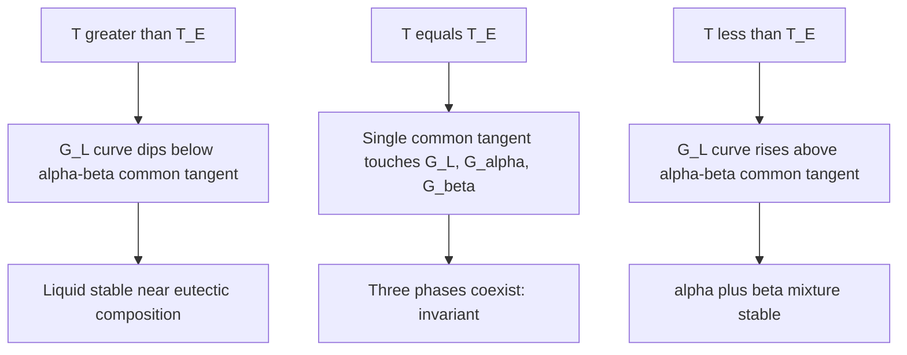
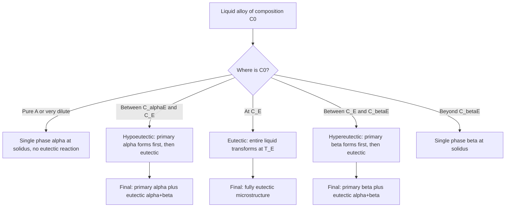
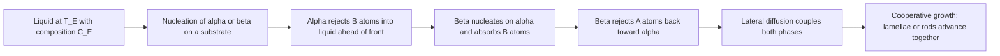

## Eutectic Systems


Eutectic systems are binary (or higher-order) alloy systems in which two components have limited or negligible mutual solid solubility and the liquidus curves of the two components descend to meet at a single, lowest-melting composition. At that composition, the **eutectic point**, a single liquid transforms isothermally and reversibly into two distinct solid phases. The Pb–Sn (solder), Al–Si (casting), Fe–C (cast iron, metastable Fe–Fe₃C), and Ag–Cu systems are canonical examples. Eutectic behavior underlies soldering, brazing, casting alloys, cast irons, and directionally solidified in-situ composites.

### Definition and Scope

A **eutectic reaction** is an invariant reaction on cooling in which one liquid phase decomposes into two solid phases at a fixed temperature and composition:

$$L(C_E) \;\xrightleftharpoons[\text{heating}]{\text{cooling}}\; \alpha(C_{\alpha E}) + \beta(C_{\beta E})$$

The word "eutectic" derives from the Greek for "easily melted." Key characteristics:

- The eutectic composition $C_E$ has the **lowest melting temperature** in the system (for simple eutectic systems).
- The reaction is **invariant** at constant pressure ($F = 0$), so it proceeds **isothermally** at $T_E$.
- The two product phases nucleate and grow cooperatively, typically forming a **fine lamellar or rod-like** microstructure.
- The solid phases $\alpha$ and $\beta$ are terminal solid solutions (rich in components A and B respectively) or, in some systems, pure components or intermetallic compounds.

**Key Points**

- Three phases coexist at the eutectic temperature: $L$, $\alpha$, $\beta$.
- The eutectic isotherm is a horizontal line connecting the three compositions $C_{\alpha E}$, $C_E$, $C_{\beta E}$.
- Alloys of any composition between $C_{\alpha E}$ and $C_{\beta E}$ pass through the eutectic isotherm and undergo the eutectic reaction to some degree.

### Thermodynamic Basis

At constant $T$ and $P$, equilibrium corresponds to the minimum Gibbs free energy. In a eutectic system, the solid solution phases have a **positive enthalpy of mixing** (regular-solution parameter $\Omega_\alpha, \Omega_\beta > 0$), which limits mutual solubility and produces a miscibility gap in the solid state, while the liquid remains more nearly ideal.

For a regular solution:

$$G^{\phi} = X_A G_A^{0,\phi} + X_B G_B^{0,\phi} + \Omega^{\phi} X_A X_B + RT\left(X_A \ln X_A + X_B \ln X_B\right)$$

**Common-tangent condition at the eutectic temperature**

At $T_E$, a single straight line is tangent simultaneously to the free-energy curves of $L$, $\alpha$, and $\beta$:

$$\mu_A^{L} = \mu_A^{\alpha} = \mu_A^{\beta}, \qquad \mu_B^{L} = \mu_B^{\alpha} = \mu_B^{\beta}$$

Above $T_E$, the liquid curve lies below the common tangent between $\alpha$ and $\beta$ in the central composition range. Below $T_E$, it lies above, and the two-solid-phase mixture is stable.



**Melting-point depression**

For dilute solutions, the liquidus slope near each pure component follows the van 't Hoff relation:

$$\frac{dT_L}{dX_B} \approx -\frac{R T_m^2}{\Delta H_f}\,(1 - k)$$

where $T_m$ is the melting point of the solvent, $\Delta H_f$ its molar enthalpy of fusion, and $k$ the partition coefficient. Because $k < 1$ in eutectic systems (solute is rejected into the liquid), both liquidus curves fall from their respective pure-component melting points and intersect at the eutectic.

### Phase Rule Analysis

For a binary system at constant pressure:

$$F = C - P + 1$$

| Region | Phases | $P$ | $F$ | Meaning |
| --- | --- | --- | --- | --- |
| $L$, $\alpha$, or $\beta$ | 1 | 1 | 2 | $T$ and composition vary independently |
| $L+\alpha$, $L+\beta$, $\alpha+\beta$ | 2 | 2 | 1 | Fixing $T$ fixes both phase compositions |
| Eutectic isotherm | $L+\alpha+\beta$ | 3 | 0 | Invariant: $T$ and all three compositions fixed |

The zero degrees of freedom explains the **thermal arrest (plateau)** on a cooling curve at $T_E$.

### Anatomy of a Simple Eutectic Phase Diagram

<svg xmlns="http://www.w3.org/2000/svg" viewBox="0 0 640 440" width="640" height="440" font-family="sans-serif" font-size="13">
<title>Simple Eutectic Phase Diagram (svg_diagram)</title>
<text x="320" y="24" text-anchor="middle" font-size="15" font-weight="bold">Simple Binary Eutectic Diagram (svg_diagram)</text>
<line x1="80" y1="50" x2="80" y2="370" stroke="black" stroke-width="2" />
<line x1="80" y1="370" x2="560" y2="370" stroke="black" stroke-width="2" />
<line x1="560" y1="50" x2="560" y2="370" stroke="black" stroke-width="2" />
<path d="M80,90 L300,250" fill="none" stroke="#c0392b" stroke-width="3" />
<path d="M560,110 L300,250" fill="none" stroke="#c0392b" stroke-width="3" />
<path d="M80,90 L80,90 L130,320" fill="none" stroke="#2980b9" stroke-width="3" />
<path d="M130,320 L130,320" fill="none" stroke="#2980b9" stroke-width="3" />
<line x1="130" y1="250" x2="510" y2="250" stroke="#27ae60" stroke-width="3" />
<path d="M80,90 L130,250" fill="none" stroke="#2980b9" stroke-width="3" />
<path d="M560,110 L510,250" fill="none" stroke="#2980b9" stroke-width="3" />
<path d="M130,250 L100,370" fill="none" stroke="#8e44ad" stroke-width="2.5" />
<path d="M510,250 L535,370" fill="none" stroke="#8e44ad" stroke-width="2.5" />
<line x1="300" y1="250" x2="300" y2="370" stroke="#7f8c8d" stroke-width="1.5" stroke-dasharray="5,4" />
<text x="270" y="130" font-weight="bold">Liquid (L)</text>
<text x="120" y="170" font-weight="bold">L + α</text>
<text x="430" y="170" font-weight="bold">L + β</text>
<text x="88" y="300" font-weight="bold">α</text>
<text x="530" y="300" font-weight="bold">β</text>
<text x="270" y="320" font-weight="bold">α + β</text>
<text x="296" y="244" text-anchor="end" fill="#27ae60" font-weight="bold">E</text>
<text x="330" y="243" fill="#27ae60" font-size="12">T_E (eutectic isotherm)</text>
<text x="80" y="392" text-anchor="middle">A</text>
<text x="560" y="392" text-anchor="middle">B</text>
<text x="300" y="410" text-anchor="middle">Composition (wt% B)</text>
<text x="26" y="210" transform="rotate(-90 26,210)" text-anchor="middle">Temperature</text>
<text x="120" y="270" font-size="11">C_αE</text>
<text x="304" y="385" font-size="11">C_E</text>
<text x="495" y="270" font-size="11">C_βE</text>
</svg>

**Features**

| Feature | Description |
| --- | --- |
| **Liquidus** | Two curves descending from $T_m(A)$ and $T_m(B)$ to the eutectic point $E$ |
| **Solidus** | Boundaries below the $L+\alpha$ and $L+\beta$ fields, ending on the eutectic isotherm |
| **Solvus** | Lines bounding the terminal solid solutions $\alpha$ and $\beta$, showing decreasing solubility with falling temperature |
| **Eutectic isotherm** | Horizontal line at $T_E$ spanning $C_{\alpha E}$ to $C_{\beta E}$ |
| **Eutectic point $E$** | The invariant point $(C_E, T_E)$ where the liquidus curves meet |

### Reading Eutectic Diagrams

The same three-question procedure applies as for isomorphous systems:

1. **Which phases are present** at the given $(T, C_0)$?
2. **What are their compositions?** Use a horizontal tie line in two-phase fields; read boundary compositions at its ends.
3. **What are their fractions?** Apply the lever rule.

**Lever rule (general)**

For overall composition $C_0$ in a two-phase field with phase compositions $C_1$ and $C_2$ (tie line endpoints):

$$W_1 = \frac{C_2 - C_0}{C_2 - C_1}, \qquad W_2 = \frac{C_0 - C_1}{C_2 - C_1}$$

Each fraction equals the opposite lever arm divided by the total tie-line length. Use wt% for mass fractions and at% for mole fractions.

### Worked System: Pb–Sn

Reference values (standard textbook figures; commonly cited approximations):

| Quantity | Value |
| --- | --- |
| $T_m(\text{Pb})$ | 327 °C |
| $T_m(\text{Sn})$ | 232 °C |
| $T_E$ | 183 °C |
| $C_E$ | about 61.9 wt% Sn |
| $C_{\alpha E}$ (max solubility of Sn in Pb) | about 19 wt% Sn |
| $C_{\beta E}$ (max solubility of Pb in Sn) | about 97.5 wt% Sn |

[Inference: values are rounded textbook readings; assessed CALPHAD data may differ by a fraction of a wt%.]

**Example**

Alloy: 40 wt% Sn–60 wt% Pb, cooled from the liquid.

**At 250 °C** (in the $L+\alpha$ field; liquid composition on the liquidus about 46 wt% Sn, $\alpha$ about 12 wt% Sn, textbook readings):

$$W_L = \frac{40 - 12}{46 - 12} = \frac{28}{34} \approx 0.82, \qquad W_\alpha = \frac{46 - 40}{46 - 12} = \frac{6}{34} \approx 0.18$$

**Just above the eutectic isotherm (183 °C + $\delta$):** $L$ at 61.9 wt% Sn, $\alpha$ at 19 wt% Sn:

$$W_L = \frac{40 - 19}{61.9 - 19} = \frac{21}{42.9} \approx 0.49, \qquad W_\alpha = \frac{61.9 - 40}{61.9 - 19} = \frac{21.9}{42.9} \approx 0.51$$

The 0.49 liquid fraction will transform to the eutectic mixture.

**Just below the eutectic isotherm (183 °C − $\delta$):** $\alpha$ at 19 wt% Sn and $\beta$ at 97.5 wt% Sn:

$$W_\alpha^{\text{total}} = \frac{97.5 - 40}{97.5 - 19} = \frac{57.5}{78.5} \approx 0.73, \qquad W_\beta = \frac{40 - 19}{97.5 - 19} = \frac{21}{78.5} \approx 0.27$$

**Microconstituent fractions** (a distinction unique to eutectic systems):

- **Primary (proeutectic) $\alpha$**: the $\alpha$ present just above $T_E$, $W_{\alpha'} \approx 0.51$.
- **Eutectic microconstituent**: the liquid that transforms at $T_E$, $W_e \approx 0.49$.

**Output**

| Quantity (just below $T_E$) | Value |
| --- | --- |
| Phases | $\alpha + \beta$ |
| Total $W_\alpha$ | about 0.73 |
| Total $W_\beta$ | about 0.27 |
| Primary $\alpha$ (microconstituent) | about 0.51 |
| Eutectic microconstituent | about 0.49 |
| $\alpha$ inside the eutectic | $0.73 - 0.51 \approx 0.22$ of the total |

Phases and microconstituents are different concepts: a **phase** is a physically distinct region of uniform structure and composition ($\alpha$, $\beta$), whereas a **microconstituent** is an identifiable feature of the microstructure (primary $\alpha$, eutectic).

### Solidification Paths by Composition Range



| Composition | Name | Microstructure just below $T_E$ |
| --- | --- | --- |
| $C_0 < C_{\alpha E}$ (dilute) | Solid solution alloy | Single-phase $\alpha$ (possible $\beta$ precipitates on further cooling below the solvus) |
| $C_{\alpha E} < C_0 < C_E$ | **Hypoeutectic** | Primary $\alpha$ + eutectic $(\alpha+\beta)$ |
| $C_0 = C_E$ | **Eutectic** | 100% eutectic $(\alpha+\beta)$ |
| $C_E < C_0 < C_{\beta E}$ | **Hypereutectic** | Primary $\beta$ + eutectic $(\alpha+\beta)$ |
| $C_0 > C_{\beta E}$ | Solid solution alloy | Single-phase $\beta$ |

**Microconstituent fractions (general)**

For a hypoeutectic alloy just below $T_E$:

$$W_{\alpha'} = \frac{C_E - C_0}{C_E - C_{\alpha E}}, \qquad W_{e} = \frac{C_0 - C_{\alpha E}}{C_E - C_{\alpha E}}$$

For a hypereutectic alloy:

$$W_{\beta'} = \frac{C_0 - C_E}{C_{\beta E} - C_E}, \qquad W_{e} = \frac{C_{\beta E} - C_0}{C_{\beta E} - C_E}$$

**Total phase fractions from the eutectic-isotherm lever rule** (any $C_{\alpha E} \le C_0 \le C_{\beta E}$):

$$W_\alpha = \frac{C_{\beta E} - C_0}{C_{\beta E} - C_{\alpha E}}, \qquad W_\beta = \frac{C_0 - C_{\alpha E}}{C_{\beta E} - C_{\alpha E}}$$

### Solidification of the Eutectic Composition

At $C_0 = C_E$, cooling from the liquid follows:

1. **Above $T_E$:** homogeneous liquid.
2. **At $T_E$:** isothermal arrest while $L \rightarrow \alpha + \beta$ proceeds; latent heat release holds the temperature constant.
3. **Below $T_E$:** fully solid two-phase aggregate, cooling continues.

**Cooling-curve signatures**

| Alloy type | Signature |
| --- | --- |
| Pure metal | Single plateau at $T_m$ |
| Eutectic composition | Single plateau at $T_E$ (behaves like a pure component) |
| Hypo- or hypereutectic | Slope change at the liquidus, then a plateau at $T_E$ whose length scales with the eutectic fraction |
| Dilute solid solution | Slope changes at liquidus and solidus, no plateau |

The **length of the eutectic plateau** is proportional to the eutectic microconstituent fraction $W_e$, providing a classical thermal-analysis method to locate $C_E$ (Tammann plot).

### Eutectic Microstructures

Cooperative growth of $\alpha$ and $\beta$ from the liquid produces a wide range of morphologies. The eutectic front advances while each phase rejects the solute the other phase needs, which sets up **lateral diffusion** across the front.

| Morphology | Description | Typical systems |
| --- | --- | --- |
| **Lamellar** | Alternating parallel plates of $\alpha$ and $\beta$ | Pb–Sn, Al–Al₂Cu, Cd–Zn |
| **Rod (fibrous)** | One phase forms rods in a matrix of the other, typically when its volume fraction is below about 0.28 [Inference: threshold from Jackson–Hunt-type arguments; depends on interfacial energies] | Al–Al₃Ni, Cu–Cu₂Mg |
| **Globular / irregular (anomalous)** | Non-faceted/faceted couple; irregular growth | Al–Si, Fe–C (graphite in gray iron) |
| **Divorced eutectic** | Phases separate spatially rather than growing cooperatively | Hypoeutectic alloys with little eutectic liquid |

**Jackson–Hunt model (regular lamellar and rod eutectics)**

The steady-state growth relation between growth rate $v$, lamellar spacing $\lambda$, and undercooling $\Delta T$ is:

$$\Delta T = K_1 v \lambda + \frac{K_2}{\lambda}$$

- The first term is the **diffusion undercooling** (solute transport laterally across the front).
- The second term is the **capillarity (curvature) undercooling** (interfacial energy).

Minimizing $\Delta T$ at fixed $v$ gives the extremum spacing:

$$\lambda^2 v = \frac{K_2}{K_1} = \text{constant}$$


$$\Delta T_{\min} \propto \sqrt{v}$$

**Key Points**

- Spacing decreases as growth rate increases: $\lambda \propto v^{-1/2}$.
- Finer eutectic spacing yields higher strength (Hall–Petch-like behavior).
- $K_1$ and $K_2$ depend on liquidus slopes, diffusivity, interfacial energies, and phase fractions [Inference: numerical values are alloy-specific].

**Formation of the two morphologies (schematic)**



### Hypoeutectic and Hypereutectic Solidification (Detailed)

Consider a hypoeutectic Pb–Sn alloy at 40 wt% Sn:

| Stage | Temperature | Phases | Description |
| --- | --- | --- | --- |
| 1 | above liquidus (about 235 °C) | $L$ | Homogeneous liquid |
| 2 | at liquidus | $L$ + first $\alpha$ | Primary $\alpha$ (Pb-rich) begins to form, often dendritic |
| 3 | between liquidus and $T_E$ | $L + \alpha$ | $\alpha$ grows and enriches in Sn along the solidus; $L$ enriches along the liquidus toward $C_E$ |
| 4 | just above $T_E$ | $L$ (61.9 wt% Sn) + $\alpha$ (19 wt% Sn) | Remaining liquid has reached the eutectic composition |
| 5 | at $T_E$ | $L \rightarrow \alpha + \beta$ | Isothermal eutectic reaction |
| 6 | below $T_E$ | $\alpha_{\text{primary}} + (\alpha+\beta)_{\text{eutectic}}$ | Frozen microstructure; $\beta$ precipitates may form in $\alpha$ as solubility falls along the solvus |

**Solvus and precipitation**

Below $T_E$, the terminal solubility decreases along the solvus. On slow cooling, excess solute precipitates from $\alpha$ as $\beta$ (and vice versa). This provides the basis for **precipitation hardening** in eutectic-type systems that have a steeply sloping solvus (such as Al–Cu).

### Non-Equilibrium Solidification in Eutectic Systems

Real castings depart from the equilibrium lever rule when solid-state diffusion is slow:

- **Coring** in primary $\alpha$ dendrites: centres are enriched in the higher-melting component; interdendritic liquid is enriched in the lower-melting component.
- **Non-equilibrium eutectic**: Under Scheil-like conditions, the last liquid can reach $C_E$ even for alloys whose equilibrium composition lies **within** the single-phase $\alpha$ field (i.e., $C_0 < C_{\alpha E}$). This produces a **non-equilibrium eutectic** (small volume fraction) at grain boundaries and interdendritic sites.
- **Incipient melting** on reheating: Reheating a cored alloy above $T_E$ melts these eutectic pockets, causing loss of strength ("burning" or hot shortness).

**Scheil–Gulliver estimate of eutectic fraction**

For a dilute alloy with constant partition coefficient $k < 1$ and linear liquidus, Scheil gives the liquid composition $C_L = C_0 (1 - f_s)^{k-1}$. The eutectic forms when $C_L$ reaches $C_E$:

$$f_s^{*} = 1 - \left(\frac{C_0}{C_E}\right)^{1/(1-k)}$$


$$f_e = 1 - f_s^{*} = \left(\frac{C_0}{C_E}\right)^{1/(1-k)}$$

where $f_e$ is the fraction of non-equilibrium eutectic [Inference: valid only for dilute alloys where a constant $k$ and linear liquidus are acceptable; CALPHAD-based Scheil is preferred for accuracy].

**Remedy:** homogenization anneal just below $T_E$ (or the non-equilibrium solidus) to dissolve the non-equilibrium eutectic and eliminate coring, with diffusion length $x \approx \sqrt{Dt}$.

### Variants of Eutectic-Type Diagrams

| Variant | Description | Example |
| --- | --- | --- |
| **Simple eutectic with negligible solid solubility** | Terminal phases are nearly pure A and B | Bi–Cd, Si–Al (very low Al solubility in Si) |
| **Eutectic with extensive terminal solubility** | Wide $\alpha$ and $\beta$ fields | Pb–Sn, Ag–Cu |
| **Eutectic with intermediate phases** | Several eutectics separated by intermetallic compounds | Mg–Pb (Mg₂Pb), Al–Cu (Al₂Cu, $\theta$) |
| **Divorced eutectic** | Spatially separated phases | Low-eutectic-fraction alloys |
| **Eutectoid (solid-state analogue)** | $\gamma \rightarrow \alpha + \text{Fe}_3\text{C}$ (pearlite) | Fe–C |
| **Monotectic** | $L_1 \rightarrow \alpha + L_2$ (liquid-miscibility gap) | Cu–Pb |
| **Peritectic** (contrast) | $L + \alpha \rightarrow \beta$ | Pt–Ag, Fe–C (at 1493 °C, $\delta$ ferrite) |

**Comparison of three-phase invariant reactions**

| Reaction | Form on cooling | Geometry at the isotherm |
| --- | --- | --- |
| **Eutectic** | $L \rightarrow \alpha + \beta$ | Liquid in the centre, two solids at the ends ("Y" pointing down) |
| **Eutectoid** | $\gamma \rightarrow \alpha + \beta$ | Solid in the centre, two solids at the ends |
| **Peritectic** | $L + \alpha \rightarrow \beta$ | One phase at one end, liquid at the other, new solid in the middle-ish |
| **Monotectic** | $L_1 \rightarrow L_2 + \alpha$ | Two liquids and a solid |
| **Syntectic** | $L_1 + L_2 \rightarrow \alpha$ | Two liquids converge into one solid |

### Case Study: Al–Si Casting Alloys

Al–Si is a simple eutectic system with very limited solid solubility of Si in Al (about 1.65 wt% at 577 °C, decreasing at lower temperatures) and negligible solubility of Al in Si.

| Quantity | Approximate value |
| --- | --- |
| $T_E$ | about 577 °C |
| $C_E$ | about 12.6 wt% Si |
| Terminal solubility of Si in Al | about 1.65 wt% at $T_E$ |
| $T_m(\text{Al})$ | 660 °C |
| $T_m(\text{Si})$ | 1414 °C |

[Inference: values are commonly cited round numbers; assessed data may differ slightly.]

**Classification and microstructure**

- **Hypoeutectic (below about 12 wt% Si):** primary $\alpha$-Al dendrites + Al–Si eutectic.
- **Eutectic (about 12–13 wt% Si):** coarse acicular (needle-like) Si plates in Al.
- **Hypereutectic (above about 13 wt% Si):** primary polyhedral Si crystals + eutectic, used in wear-resistant engine blocks and pistons.

**Modification:** Adding trace amounts of Na or Sr (or rapid cooling) refines the eutectic Si from coarse plates to a fine fibrous morphology, greatly improving ductility. Phosphorus additions refine primary Si in hypereutectic alloys.

**Key Points**

- Al–Si has excellent **castability** due to a low melting temperature, small freezing range near $C_E$, and low shrinkage.
- The eutectic Si morphology (faceted, non-isotropic) is why modification is needed, compared with non-faceted lamellar systems like Pb–Sn.

### Case Study: Pb–Sn Solder

Near-eutectic Pb–Sn solders (63Sn–37Pb) exploit the low $T_E$ of 183 °C.

- The eutectic composition melts and solidifies at a single temperature, minimizing the **pasty range** in which joints are mechanically weak and vulnerable to disturbance.
- Non-eutectic compositions (for example 60Sn–40Pb or 50Sn–50Pb) are used where a **pasty range** is helpful for wiping joints in plumbing.
- Lead-free alternatives (for example Sn–3Ag–0.5Cu, "SAC305", $T_E$ about 217 °C) are ternary near-eutectic alloys used for regulatory reasons; Sn–Cu and Sn–Ag are their binary sub-eutectics [Inference: quoted temperatures are approximate and composition-dependent].

**Lead-free consequences:** Higher $T_E$ raises reflow temperatures, increasing thermal stress on components, and coarsening behavior and tin whisker growth become reliability concerns.

### Case Study: Fe–C Cast Irons (Eutectic at 4.3 wt% C)

In the **Fe–Fe₃C metastable diagram**, the eutectic reaction is:

$$L\,(4.30\ \text{wt\% C}) \rightarrow \gamma\,(2.14\ \text{wt\% C}) + \text{Fe}_3\text{C}\,(6.67\ \text{wt\% C}) \quad \text{at } 1147\,^\circ\text{C}$$

The eutectic microconstituent is **ledeburite**. In the **stable Fe–graphite diagram**, the eutectic occurs at a slightly higher temperature (about 1153 °C) and produces $\gamma$ + graphite [Inference: exact values depend on the source and whether silicon is present].

| Cast iron | Typical carbon | Eutectic product | Notes |
| --- | --- | --- | --- |
| White iron | about 2.5–4.3 wt% | Ledeburite ($\gamma$/pearlite + Fe₃C) | Hard, brittle, wear-resistant |
| Gray iron | about 2.5–4.0 wt% (with Si about 1–3 wt%) | $\gamma$ + flake graphite | Good damping and machinability |
| Ductile (nodular) iron | Similar, with Mg or Ce treatment | $\gamma$ + spheroidal graphite | High strength and ductility |

Silicon promotes graphite formation over cementite; fast cooling and low Si promote white iron.

### Directional Solidification of Eutectics (In-Situ Composites)

Controlled directional solidification of lamellar or rod eutectics produces **aligned in-situ composites**:

- The $\alpha$ matrix and $\beta$ reinforcement grow simultaneously with aligned orientation and a strong interface.
- Examples: Ni–Ni₃Al–Ni₃Nb, Co–TaC, Al–Al₃Ni, and eutectic ceramics (Al₂O₃–ZrO₂ and Al₂O₃–YAG).
- Applications: turbine blade materials, high-temperature structural ceramics [Inference: exact application status varies by material and development stage].

**Growth conditions**

Maintaining a planar eutectic front requires a high temperature-gradient-to-growth-rate ratio. The stability criterion parallels constitutional supercooling:

$$\frac{G}{v} \ge \frac{\Delta T_0}{D_L}$$

where $\Delta T_0$ is the equilibrium freezing range and $D_L$ the liquid diffusivity. Below this threshold, the planar front breaks into **eutectic colonies** (cells) with boundaries where lamellar orientation changes.

### Property–Structure Relationships

| Feature | Effect |
| --- | --- |
| Finer eutectic spacing $\lambda$ | Higher strength and hardness (roughly $\sigma_y \propto \lambda^{-1/2}$) |
| Higher volume fraction of eutectic | Greater fluidity and castability, lower ductility if a brittle phase is involved |
| Primary dendrite arm spacing (DAS) | Finer DAS yields better strength and fatigue life |
| Brittle second phase (for example Si, Fe₃C) | Reduces ductility unless modified or spheroidized |
| Coarse eutectic | Reduced strength; susceptible to creep and coarsening in service |

**Rule of mixtures (rough estimate for aligned lamellar composites)**

$$\sigma_c \approx W_\alpha \sigma_\alpha + W_\beta \sigma_\beta$$

with the caveat that constraint effects, interface strength, and orientation strongly influence the real value [Inference: this is a first-order bound, not a design equation].

### Computational Approach

**Lever-rule and microconstituent calculator (Python)**

```python
def eutectic_fractions(C0, C_aE, C_E, C_bE):
    """
    Returns phase and microconstituent fractions just below T_E.
    All compositions in the same units (e.g., wt% of component B).
    """
    if not (C_aE <= C0 <= C_bE):
        raise ValueError("C0 must lie between C_aE and C_bE to cross the eutectic isotherm.")

    # Total phase fractions from the eutectic-isotherm lever rule
    W_alpha = (C_bE - C0) / (C_bE - C_aE)
    W_beta = (C0 - C_aE) / (C_bE - C_aE)

    # Microconstituent fractions
    if C0 <= C_E:  # hypoeutectic (or eutectic)
        W_primary = (C_E - C0) / (C_E - C_aE)
        W_eut = 1.0 - W_primary
        primary = "alpha"
    else:          # hypereutectic
        W_primary = (C0 - C_E) / (C_bE - C_E)
        W_eut = 1.0 - W_primary
        primary = "beta"

    return {
        "W_alpha_total": W_alpha,
        "W_beta_total": W_beta,
        f"W_primary_{primary}": W_primary,
        "W_eutectic": W_eut,
    }

# Pb-Sn example (composition in wt% Sn)
result = eutectic_fractions(C0=40.0, C_aE=19.0, C_E=61.9, C_bE=97.5)
for k, v in result.items():
    print(f"{k}: {v:.3f}")
```

**Output** (for the Pb–Sn example above; values follow directly from the inputs):



```
W_alpha_total: 0.732
W_beta_total: 0.268
W_primary_alpha: 0.510
W_eutectic: 0.490
```

**Jackson–Hunt spacing scaling**

```python
import numpy as np

def eutectic_spacing(v, lam_ref, v_ref):
    """Scale lamellar spacing using lambda^2 * v = const."""
    return lam_ref * np.sqrt(v_ref / v)

# If lambda = 2.0 um at v = 10 um/s, spacing at v = 40 um/s:
print(eutectic_spacing(40.0, 2.0, 10.0))  # 1.0 um
```

For quantitative work, use CALPHAD tools (Thermo-Calc, Pandat, or open-source **pycalphad** with a `.tdb` database) to compute liquidus, solidus, eutectic points, and Scheil solidification paths.

### Experimental Determination

| Technique | Measured quantity | Information gained |
| --- | --- | --- |
| Thermal analysis (cooling curves) | Arrests and slope changes | Liquidus, eutectic temperature, $C_E$ (via Tammann plot) |
| DTA / DSC | Endothermic and exothermic peaks | $T_E$, liquidus, solvus |
| Metallography (optical, SEM) | Microconstituents and morphology | Hypo/hypereutectic classification, spacing |
| XRD | Lattice parameters and phase identification | Solvus and solubility limits (Vegard-type behavior) |
| EPMA / EDS | Local composition | Tie-line endpoints, coring profiles |
| Quench and anneal studies | Phase fields after equilibration | Solvus and solidus positions |
| Electrical resistivity vs. $T$ | Discontinuities at boundaries | Solvus determination |

### Common Pitfalls

- **Phase vs. microconstituent:** Below $T_E$ there are two phases ($\alpha$, $\beta$) but up to three microconstituents (primary $\alpha$ or $\beta$, and eutectic).
- **Which side of $C_E$:** Hypo means "below $C_E$" (primary phase is $\alpha$); hyper means "above $C_E$" (primary phase is $\beta$).
- **Lever-rule inside the isotherm:** At $T_E$ exactly, all three phases coexist; apply the lever rule just above or just below $T_E$ and state which.
- **Terminal solid solutions:** Alloys with $C_0 < C_{\alpha E}$ do **not** undergo the equilibrium eutectic reaction, although non-equilibrium cooling can produce a small eutectic fraction.
- **Units:** Convert consistently between wt% and at% before using the lever rule.
- **Eutectic ≠ minimum-melting solid solution:** A congruent minimum in an isomorphous system has a single solid phase; a eutectic has two.
- **Eutectic is not always the strongest composition:** Mechanical properties depend on microstructure scale and phase properties, not only on the eutectic fraction.

### Summary

**Conclusion**

Eutectic systems are defined by an invariant reaction, $L \rightleftharpoons \alpha + \beta$, at the lowest-melting composition of the system. The phase rule, tie lines, and the lever rule determine phase compositions and amounts, while the distinction between hypoeutectic, eutectic, and hypereutectic alloys governs the resulting microconstituents. Cooperative growth yields characteristic lamellar or rod microstructures whose scale follows $\lambda^2 v = \text{const}$, and non-equilibrium effects such as coring and non-equilibrium eutectic have direct practical consequences in casting, soldering, and heat treatment.

| Concept | Expression |
| --- | --- |
| Eutectic reaction | $L \rightarrow \alpha + \beta$ at $T_E$, $C_E$ |
| Phase rule (constant $P$) | $F = C - P + 1$; $F = 0$ at the eutectic |
| Total $\alpha$ below $T_E$ | $W_\alpha = (C_{\beta E} - C_0)/(C_{\beta E} - C_{\alpha E})$ |
| Primary $\alpha$ (hypoeutectic) | $W_{\alpha'} = (C_E - C_0)/(C_E - C_{\alpha E})$ |
| Eutectic microconstituent (hypoeutectic) | $W_e = (C_0 - C_{\alpha E})/(C_E - C_{\alpha E})$ |
| Jackson–Hunt | $\lambda^2 v = \text{const}$, $\Delta T \propto \sqrt{v}$ |
| Scheil eutectic fraction (dilute) | $f_e = (C_0/C_E)^{1/(1-k)}$ |

**Next Steps**

- Peritectic and peritectoid reactions
- Eutectoid transformations and the Fe–Fe₃C diagram (pearlite, bainite, martensite)
- Intermetallic compounds and multi-eutectic diagrams
- Ternary eutectic systems and liquidus projections
- Precipitation hardening and solvus-based heat treatments
- CALPHAD modelling and pycalphad workflows
- Directional solidification and in-situ composites
- Solder metallurgy, reliability, and lead-free alloys

**Related Topics**

- Isomorphous systems and the lever rule
- Gibbs free energy–composition curves and the common tangent
- Solidification and constitutional supercooling
- Cast irons and the Fe–C diagram
- Al–Si casting alloys and modification
- Microstructure–property relationships in two-phase alloys