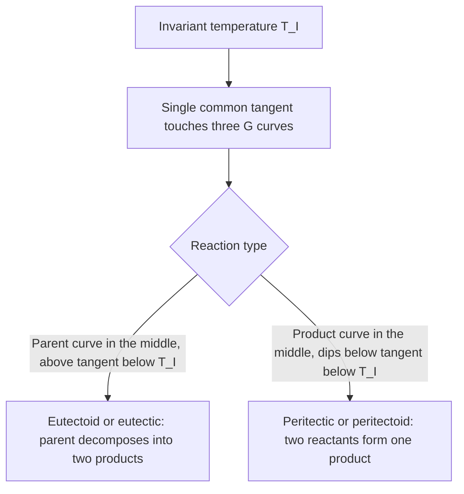
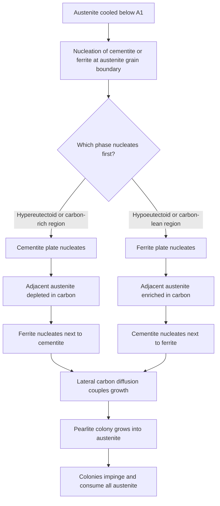
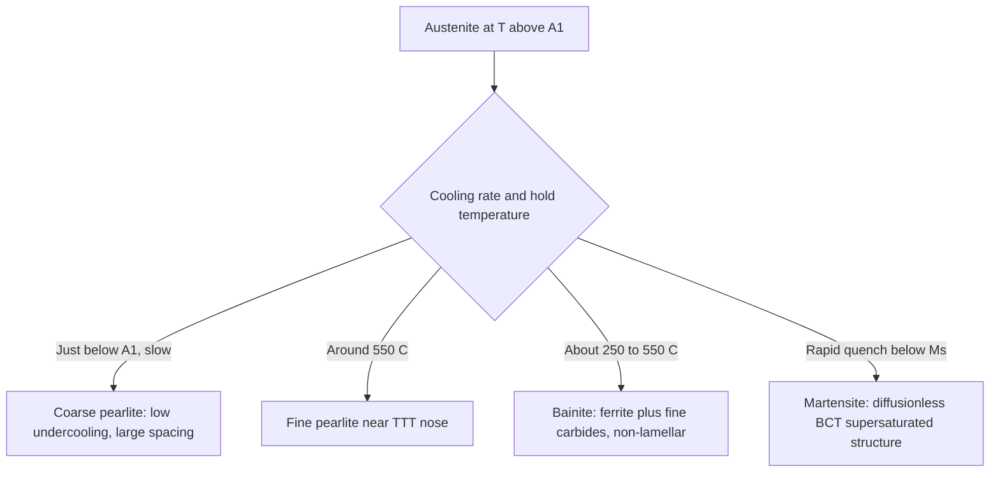
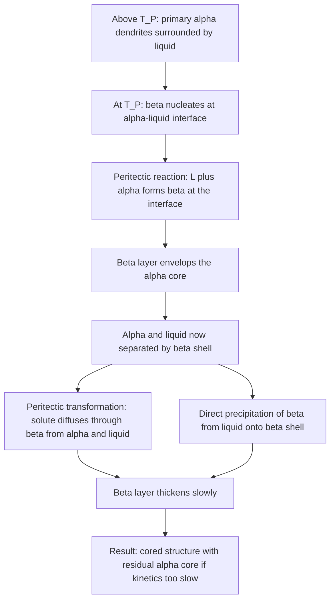

## Eutectoid and Peritectic Reactions


Eutectoid and peritectic reactions are two of the invariant (three-phase) reactions that appear on binary phase diagrams, alongside the eutectic, monotectic, and syntectic reactions. The **eutectoid** reaction is a solid-state analogue of the eutectic: a single solid phase decomposes on cooling into two new solid phases, and it underlies the pearlite, bainite, and martensite microstructures that dominate steel technology. The **peritectic** reaction involves a liquid and a solid reacting to form a second, different solid, and it controls solidification behavior in steels, bronzes, and many intermetallic systems. Both reactions are governed by the same thermodynamic principles (common-tangent equilibrium, the phase rule, the lever rule) but differ sharply in kinetics and microstructural consequences.

### Definition and Scope

Invariant reactions in binary systems occur at a fixed temperature and fixed phase compositions (at constant pressure) because three phases coexist and $F = 0$.

**Eutectoid reaction** (one solid transforms into two solids on cooling):

$$\gamma \;\xrightleftharpoons[\text{heating}]{\text{cooling}}\; \alpha + \beta$$

**Peritectic reaction** (a liquid and a solid transform into a different solid on cooling):

$$L + \alpha \;\xrightleftharpoons[\text{heating}]{\text{cooling}}\; \beta$$

The names derive from Greek roots: "eutectoid" means "eutectic-like" (the reaction resembles a eutectic but begins with a solid), and "peritectic" means "melting around," reflecting the way the product phase typically forms as a layer surrounding the primary solid.

**Key Points**

- Both reactions are **isothermal** and have zero degrees of freedom at constant pressure.
- The eutectoid is **entirely solid-state**; kinetics are controlled by solid-state diffusion and nucleation, so the reaction is sluggish and highly sensitive to cooling rate.
- The peritectic involves a **liquid** and a **solid**; the product phase forms at the liquid–solid interface and then thickens by slow solid-state diffusion through itself.
- A eutectic and a eutectoid have the same "Y" geometry on the diagram, but the top phase is liquid in the eutectic and solid in the eutectoid.

### Comparison of Three-Phase Invariant Reactions

| Reaction | Cooling reaction | Parent phase(s) | Product phase(s) | Example |
| --- | --- | --- | --- | --- |
| **Eutectic** | $L \rightarrow \alpha + \beta$ | 1 liquid | 2 solids | Pb–Sn at 183 °C |
| **Eutectoid** | $\gamma \rightarrow \alpha + \beta$ | 1 solid | 2 solids | Fe–C at 727 °C |
| **Peritectic** | $L + \alpha \rightarrow \beta$ | liquid + solid | 1 solid | Fe–C at 1493 °C |
| **Peritectoid** | $\alpha + \beta \rightarrow \gamma$ | 2 solids | 1 solid | Some Ag–Al, Cu–Sn-type systems |
| **Monotectic** | $L_1 \rightarrow L_2 + \alpha$ | 1 liquid | liquid + solid | Cu–Pb |
| **Syntectic** | $L_1 + L_2 \rightarrow \alpha$ | 2 liquids | 1 solid | Na–Zn (textbook example) |

[Inference: the peritectoid and syntectic examples are commonly cited in textbooks; specific assessed reaction assignments vary between database versions.]

### Geometry on the Phase Diagram

Recognizing an invariant reaction from its geometry is a core skill. At the invariant isotherm, three phase-field boundaries meet at a point and the horizontal line joins three compositions.

- **Eutectic / eutectoid:** the middle composition (the reactant) sits at the apex of a downward-pointing "V"; the reactant phase field lies **above** the isotherm and the two product phases lie **below** it at either end.
- **Peritectic / peritectoid:** the product phase's composition is **between** the two reactants on the isotherm, and the product phase field sits **below** the isotherm's midpoint region, with a reactant phase field on each side above.

<svg xmlns="http://www.w3.org/2000/svg" viewBox="0 0 700 460" width="700" height="460" font-family="sans-serif" font-size="13">
<title>Eutectoid vs Peritectic Geometry (svg_diagram)</title>
<text x="350" y="22" text-anchor="middle" font-size="15" font-weight="bold">Eutectoid (left) vs Peritectic (right) Geometry (svg_diagram)</text>

<line x1="40" y1="60" x2="40" y2="380" stroke="black" stroke-width="2" />
<line x1="40" y1="380" x2="320" y2="380" stroke="black" stroke-width="2" />
<path d="M40,120 L150,250" fill="none" stroke="#c0392b" stroke-width="3" />
<path d="M320,150 L190,250" fill="none" stroke="#c0392b" stroke-width="3" />
<line x1="60" y1="250" x2="300" y2="250" stroke="#27ae60" stroke-width="3" />
<path d="M60,250 L48,380" fill="none" stroke="#8e44ad" stroke-width="2.5" />
<path d="M300,250 L312,380" fill="none" stroke="#8e44ad" stroke-width="2.5" />
<path d="M150,250 L170,250" fill="none" stroke="#c0392b" stroke-width="3" />
<text x="140" y="140" font-weight="bold">γ</text>
<text x="70" y="200" font-weight="bold">α + γ</text>
<text x="215" y="200" font-weight="bold">γ + β</text>
<text x="60" y="320" font-weight="bold">α</text>
<text x="280" y="320" font-weight="bold">β</text>
<text x="150" y="320" font-weight="bold">α + β</text>
<text x="160" y="243" text-anchor="middle" fill="#27ae60" font-weight="bold">E'</text>
<text x="180" y="270" font-size="11" fill="#27ae60">T_eutectoid</text>
<text x="180" y="410" text-anchor="middle">Composition</text>

<line x1="380" y1="60" x2="380" y2="380" stroke="black" stroke-width="2" />
<line x1="380" y1="380" x2="670" y2="380" stroke="black" stroke-width="2" />
<path d="M380,110 L470,240" fill="none" stroke="#c0392b" stroke-width="3" />
<path d="M670,90 L560,190" fill="none" stroke="#c0392b" stroke-width="3" />
<line x1="420" y1="240" x2="600" y2="240" stroke="#27ae60" stroke-width="3" />
<path d="M560,190 L520,240" fill="none" stroke="#c0392b" stroke-width="3" />
<path d="M420,240 L410,380" fill="none" stroke="#8e44ad" stroke-width="2.5" />
<path d="M600,240 L620,380" fill="none" stroke="#8e44ad" stroke-width="2.5" />
<text x="440" y="120" font-weight="bold">L</text>
<text x="420" y="200" font-weight="bold">α + L</text>
<text x="590" y="180" font-weight="bold">β + L</text>
<text x="392" y="320" font-weight="bold">α</text>
<text x="640" y="320" font-weight="bold">β</text>
<text x="500" y="320" font-weight="bold">α + β</text>
<text x="520" y="233" text-anchor="middle" fill="#27ae60" font-weight="bold">P</text>
<text x="530" y="262" font-size="11" fill="#27ae60">T_peritectic</text>
<text x="525" y="410" text-anchor="middle">Composition</text>
</svg>

**Reading the geometry**

| Feature | Eutectoid | Peritectic |
| --- | --- | --- |
| Position of reactant phase field | Directly above the isotherm at its centre | Reactants at the two ends (liquid above one, solid at the other end) |
| Product phases | Two solids at the ends of the isotherm | One solid at the centre of the isotherm |
| Liquid involvement | None | Liquid is a reactant |

### Thermodynamic Basis

At constant $T$ and $P$, equilibrium corresponds to the minimum Gibbs free energy. For a binary solution phase $\phi$ modelled as a regular solution:

$$G^{\phi} = X_A G_A^{0,\phi} + X_B G_B^{0,\phi} + \Omega^{\phi} X_A X_B + RT\left(X_A \ln X_A + X_B \ln X_B\right)$$

**Common-tangent condition at an invariant temperature**

For any invariant three-phase reaction at temperature $T_I$, a single straight line is tangent to the free-energy curves of all three phases $\phi_1, \phi_2, \phi_3$:

$$\mu_A^{\phi_1} = \mu_A^{\phi_2} = \mu_A^{\phi_3}, \qquad \mu_B^{\phi_1} = \mu_B^{\phi_2} = \mu_B^{\phi_3}$$

**Eutectoid:** Above $T_E'$, the free-energy curve of the parent phase $\gamma$ lies below the $\alpha$–$\beta$ common tangent in the central composition range. Below $T_E'$, it lies above, so the two-phase mixture $\alpha + \beta$ is stable.

**Peritectic:** Above $T_P$, the free-energy curve of the liquid $L$ and solid $\alpha$ share a stable common tangent (the two-phase $L + \alpha$ field spans the intermediate composition). Below $T_P$, the curve of the new solid $\beta$ drops below the $L$–$\alpha$ common tangent in the intermediate composition range, so $\beta$ becomes stable and consumes $L$ and $\alpha$.



**Driving force**

The driving force for the transformation is the free-energy difference between the parent state and the product state at the transformation temperature. For undercooling $\Delta T = T_I - T$ below the invariant temperature, a first-order approximation is:

$$\Delta G_v \approx \frac{\Delta H_v\, \Delta T}{T_I}$$

where $\Delta H_v$ is the enthalpy change of the reaction per unit volume. This linear relationship is the standard basis for nucleation-rate estimates near $T_I$ [Inference: valid for small undercooling; large undercoolings require the full $\Delta C_p$ correction].

### Phase Rule Analysis

For a binary system at constant pressure:

$$F = C - P + 1$$

| Region | Phases $P$ | Degrees of freedom $F$ | Consequence |
| --- | --- | --- | --- |
| Single-phase field | 1 | 2 | $T$ and composition vary independently |
| Two-phase field | 2 | 1 | Fixing $T$ fixes both phase compositions |
| Invariant isotherm (eutectoid or peritectic) | 3 | 0 | $T$ and all three compositions fixed |

The zero degrees of freedom means the reaction proceeds at constant temperature, producing a **thermal arrest** on a cooling curve whose duration scales with the amount of material transforming (though solid-state reactions release so little latent heat that the arrest is often weak and requires sensitive dilatometry or DSC).

### The Eutectoid Reaction

#### Fundamentals

In the eutectoid reaction, a single solid solution (the parent, called $\gamma$ in the Fe–C notation) becomes unstable below $T_E'$ and decomposes:

$$\gamma\,(C_{\gamma}) \rightarrow \alpha\,(C_{\alpha}) + \beta\,(C_{\beta})$$

Because all three phases are solid, nucleation occurs preferentially at **grain boundaries** and other defects in the parent phase, and growth is limited by **solid-state diffusion**. The product microstructure is typically a fine, **cooperative lamellar** aggregate analogous to a eutectic, but on a much finer scale.

**Composition classification (relative to $C_{E'}$, the eutectoid composition)**

| Composition | Name | Primary (proeutectoid) phase |
| --- | --- | --- |
| $C_{\alpha} < C_0 < C_{E'}$ | **Hypoeutectoid** | Proeutectoid $\alpha$ |
| $C_0 = C_{E'}$ | **Eutectoid** | None (100% eutectoid product) |
| $C_{E'} < C_0 < C_{\beta}$ | **Hypereutectoid** | Proeutectoid $\beta$ |

Proeutectoid means "before the eutectoid": the phase that forms in the $\gamma + \alpha$ or $\gamma + \beta$ field on cooling between the upper phase boundary and the eutectoid isotherm.

#### The Fe–Fe₃C Eutectoid (Steels)

The most technologically important eutectoid is that of the iron–iron carbide (Fe–Fe₃C) metastable system:

$$\gamma\,(0.76\ \text{wt\% C}) \rightarrow \alpha\,(0.022\ \text{wt\% C}) + \text{Fe}_3\text{C}\,(6.70\ \text{wt\% C}) \quad \text{at } 727\,^\circ\text{C}$$

Here $\gamma$ is **austenite** (FCC), $\alpha$ is **ferrite** (BCC), and Fe₃C is **cementite** (orthorhombic). The eutectoid microconstituent is **pearlite**, a lamellar aggregate of alternating ferrite and cementite plates.

| Quantity | Approximate value |
| --- | --- |
| $T_{E'}$ (A₁ temperature) | 727 °C |
| $C_{E'}$ (eutectoid composition) | about 0.76 wt% C |
| Max solubility of C in $\alpha$ (at 727 °C) | about 0.022 wt% C |
| C content of Fe₃C | 6.67–6.70 wt% C |
| Max solubility of C in $\gamma$ (at 1147 °C) | about 2.14 wt% C |

[Inference: values are widely cited textbook figures; different assessed sources differ in the second decimal place, and some quote 0.77 wt% C for the eutectoid composition.]

**Structure of the Fe–C steel region**

<svg xmlns="http://www.w3.org/2000/svg" viewBox="0 0 640 440" width="640" height="440" font-family="sans-serif" font-size="13">
<title>Fe-Fe3C Eutectoid Region Schematic (svg_diagram)</title>
<text x="320" y="22" text-anchor="middle" font-size="15" font-weight="bold">Fe–Fe3C Steel Region, Eutectoid (svg_diagram)</text>
<line x1="70" y1="50" x2="70" y2="370" stroke="black" stroke-width="2" />
<line x1="70" y1="370" x2="590" y2="370" stroke="black" stroke-width="2" />
<path d="M70,110 L200,250" fill="none" stroke="#c0392b" stroke-width="3" />
<path d="M590,80 L330,250" fill="none" stroke="#c0392b" stroke-width="3" />
<path d="M70,250 L590,250" fill="none" stroke="#27ae60" stroke-width="3" />
<path d="M70,250 L90,370" fill="none" stroke="#8e44ad" stroke-width="2.5" />
<text x="380" y="140" font-weight="bold">γ (austenite)</text>
<text x="90" y="175" font-weight="bold">α + γ</text>
<text x="430" y="200" font-weight="bold">γ + Fe3C</text>
<text x="120" y="330" font-weight="bold">α + Fe3C</text>
<text x="80" y="315" font-size="11">α</text>
<text x="265" y="243" text-anchor="middle" fill="#27ae60" font-weight="bold">0.76 wt% C</text>
<text x="530" y="243" fill="#27ae60" font-size="12">727 °C</text>
<text x="330" y="395" text-anchor="middle">wt% C (increasing to right)</text>
<text x="24" y="210" transform="rotate(-90 24,210)" text-anchor="middle">Temperature</text>
</svg>

**Classification of steels by carbon content**

| Class | Carbon range (wt%) | Microstructure below 727 °C (slow cooling) |
| --- | --- | --- |
| Hypoeutectoid steel | 0.022 – 0.76 | Proeutectoid ferrite + pearlite |
| Eutectoid steel | 0.76 | 100% pearlite |
| Hypereutectoid steel | 0.76 – 2.14 | Proeutectoid cementite (often at grain boundaries) + pearlite |

#### Lever-Rule Calculations for the Eutectoid

**Above the eutectoid isotherm (hypoeutectoid steel):** proeutectoid $\alpha$ and $\gamma$ coexist:

$$W_{\alpha'} = \frac{C_{E'} - C_0}{C_{E'} - C_{\alpha}}, \qquad W_{\gamma} = \frac{C_0 - C_{\alpha}}{C_{E'} - C_{\alpha}}$$

The austenite fraction $W_{\gamma}$ just above $T_{E'}$ becomes pearlite on cooling through the isotherm.

**Below the isotherm:** total phase fractions from the eutectoid-isotherm lever:

$$W_{\alpha} = \frac{C_{\text{Fe}_3\text{C}} - C_0}{C_{\text{Fe}_3\text{C}} - C_{\alpha}}, \qquad W_{\text{Fe}_3\text{C}} = \frac{C_0 - C_{\alpha}}{C_{\text{Fe}_3\text{C}} - C_{\alpha}}$$

**Example**

A 0.40 wt% C steel, slowly cooled from the austenite field.

*Just above 727 °C* (using $C_\alpha = 0.022$, $C_{E'} = 0.76$):

$$W_{\alpha'} = \frac{0.76 - 0.40}{0.76 - 0.022} = \frac{0.36}{0.738} \approx 0.488, \qquad W_{\gamma} = 1 - 0.488 = 0.512$$

So the microstructure will contain about 49% proeutectoid ferrite and about 51% pearlite.

*Just below 727 °C* (using $C_{\text{Fe}_3\text{C}} = 6.70$):

$$W_{\alpha}^{\text{total}} = \frac{6.70 - 0.40}{6.70 - 0.022} = \frac{6.30}{6.678} \approx 0.943, \qquad W_{\text{Fe}_3\text{C}} = 1 - 0.943 = 0.057$$

**Output**

| Quantity | Value |
| --- | --- |
| Proeutectoid $\alpha$ (microconstituent) | about 0.49 |
| Pearlite (microconstituent) | about 0.51 |
| Total ferrite (phase) | about 0.94 |
| Cementite (phase) | about 0.06 |
| Ferrite inside pearlite | about $0.94 - 0.49 = 0.45$ |

**Pearlite composition check.** In pearlite itself, the ferrite-to-cementite mass ratio is:

$$\frac{W_{\alpha}}{W_{\text{Fe}_3\text{C}}}\Bigg|_{\text{pearlite}} = \frac{6.70 - 0.76}{0.76 - 0.022} = \frac{5.94}{0.738} \approx 8.05$$

Thus pearlite is about 89% ferrite and 11% cementite by mass, yet the cementite plates are thin and the ferrite plates are thicker, consistent with the mass ratio (the volume ratio is similar because the densities are close).

#### Pearlite Formation Mechanism



Cooperative growth requires carbon to redistribute over a distance on the order of the interlamellar spacing $S_0$, which makes the reaction diffusion-controlled.

**Interlamellar spacing**

Zener's maximum-growth-rate argument gives a relationship between spacing and undercooling. The critical (minimum) spacing at which the free-energy reduction is entirely consumed by creating interface area is:

$$S_c = \frac{2\sigma_{\alpha\beta} T_{E'}}{\Delta H_v\, \Delta T}$$

where $\sigma_{\alpha\beta}$ is the ferrite–cementite interfacial energy, $\Delta H_v$ the enthalpy of transformation per unit volume, and $\Delta T$ the undercooling. Growth at maximum rate occurs at

$$S_{\text{opt}} = 2 S_c$$

Therefore:

$$S_{\text{opt}} \propto \frac{1}{\Delta T}$$

**Key Points**

- Larger undercooling gives **finer pearlite** (smaller $S_0$).
- Finer pearlite is **harder and stronger**, with mechanical strength roughly following $\sigma_y \propto S_0^{-1/2}$ (Hall–Petch-like behavior) [Inference: empirical scaling; exponents vary by steel and study].
- Very fine pearlite formed near the "nose" of the TTT curve is sometimes called **fine pearlite**; coarse pearlite forms at low undercooling, just below 727 °C.

**Growth rate (Zener–Hillert type)**

For volume-diffusion-controlled growth:

$$v = \frac{D_C}{S_0}\,\frac{\Delta C}{\Delta C_{\text{ref}}}\left(1 - \frac{S_c}{S_0}\right)$$

which reduces to $v \propto D_C\,\Delta T^2$ at the optimal spacing [Inference: the exact prefactors depend on whether volume or boundary diffusion controls, and on the model variant].

#### Time–Temperature–Transformation Behavior

The eutectoid reaction is best understood kinetically through the **TTT (isothermal transformation) diagram**, which plots the time to begin and finish transformation as a function of temperature.



The TTT curve has a characteristic "C" (or "nose") shape because two opposing effects act as temperature falls:

1. **Driving force** for transformation increases with undercooling.
2. **Atomic mobility** (diffusivity) decreases with falling temperature.

The transformation is fastest near the nose (about 550 °C for plain carbon eutectoid steel) [Inference: nose temperature is approximate and depends on alloying elements].

| Product | Formation regime | Mechanism | Relative hardness |
| --- | --- | --- | --- |
| Coarse pearlite | 650–727 °C | Diffusional, cooperative | Low |
| Fine pearlite | about 550–650 °C | Diffusional, cooperative | Medium |
| Upper bainite | about 350–550 °C | Diffusional-displacive, feathery ferrite + carbides between laths | Medium-high |
| Lower bainite | about 250–350 °C | Carbide precipitation inside ferrite plates | High |
| Martensite | below $M_s$ (about 220 °C for 0.8 wt% C) | Diffusionless shear | Very high |

[Inference: transformation temperature ranges depend strongly on composition and alloying additions.]

Martensite is not a product of the equilibrium eutectoid reaction: it is a metastable, diffusionless product that appears on the TTT/CCT diagram when the eutectoid decomposition is bypassed.

#### Effect of Alloying Elements on the Eutectoid

Alloying elements shift both the eutectoid temperature and composition in Fe–C:

| Element type | Effect on $T_{E'}$ | Effect on $C_{E'}$ | Examples |
| --- | --- | --- | --- |
| **Austenite stabilizers** | Lower $T_{E'}$ | Lower $C_{E'}$ | Ni, Mn, Co (Co is an exception, raising $T_{E'}$) |
| **Ferrite stabilizers** | Raise $T_{E'}$ | Lower $C_{E'}$ | Cr, Mo, W, Si, Ti, V |

Nearly all alloying elements **lower** the eutectoid carbon content [Inference: the direction is well established for common alloying elements; magnitude requires a calculated diagram].

They also generally **delay** the pearlite and bainite reactions (shifting the TTT nose to longer times), which raises **hardenability**.

#### Other Eutectoid Systems

| System | Reaction | Approx. temperature | Significance |
| --- | --- | --- | --- |
| Fe–C (metastable) | $\gamma \rightarrow \alpha + \text{Fe}_3\text{C}$ | 727 °C | Steels, pearlite |
| Cu–Al (aluminium bronzes) | $\beta \rightarrow \alpha + \gamma_2$ | about 565 °C | Aluminium bronzes; slow cooling can produce brittle $\gamma_2$ |
| Cu–Sn (bronzes) | $\beta \rightarrow \alpha + \delta$ | about 520 °C [Inference: sluggish; often not reached in practice] | Bronze microstructures |
| Ti–Cr, Ti–Cu (Ti alloys) | $\beta \rightarrow \alpha + \text{TiX}$ | varies | $\beta$-eutectoid-forming titanium alloys |
| Zr–Nb | $\beta \rightarrow \alpha + \beta'$-type | varies | Nuclear cladding alloys [Inference: exact reaction depends on the assessed diagram] |

### The Peritectic Reaction

#### Fundamentals

In a peritectic reaction, a liquid of composition $C_L$ and a primary solid $\alpha$ of composition $C_{\alpha}$ react at $T_P$ to form a new solid $\beta$ of composition $C_{\beta}$:

$$L\,(C_L) + \alpha\,(C_{\alpha}) \rightarrow \beta\,(C_{\beta})$$

In the ideal equilibrium case, both parent phases are fully consumed if the overall alloy composition equals $C_{\beta}$. If the overall composition lies on either side, one reactant is consumed first and the other remains.

**Classification of compositions on a peritectic diagram**

| Composition range | Result just below $T_P$ |
| --- | --- |
| $C_0 < C_{\alpha}$ | Solidifies as $\alpha$ only, no peritectic reaction |
| $C_{\alpha} < C_0 < C_{\beta}$ | Excess $\alpha$ remains after all $L$ is consumed: $\alpha + \beta$ |
| $C_0 = C_{\beta}$ | Complete transformation: 100% $\beta$ |
| $C_{\beta} < C_0 < C_L$ | Excess $L$ remains after all $\alpha$ is consumed; $L$ then transforms to $\beta$ on further cooling |
| $C_0 > C_L$ | Solidifies as $\beta$ only, with no peritectic reaction |

#### Lever-Rule Calculations for the Peritectic

For $C_{\alpha} < C_0 < C_{\beta}$ (excess $\alpha$ after the reaction), the phase fractions just below $T_P$ come from the $\alpha$–$\beta$ tie line:

$$W_{\alpha} = \frac{C_{\beta} - C_0}{C_{\beta} - C_{\alpha}}, \qquad W_{\beta} = \frac{C_0 - C_{\alpha}}{C_{\beta} - C_{\alpha}}$$

Just above $T_P$, the fractions of $L$ and $\alpha$ come from the $\alpha$–$L$ tie line:

$$W_{\alpha}^{+} = \frac{C_L - C_0}{C_L - C_{\alpha}}, \qquad W_L^{+} = \frac{C_0 - C_{\alpha}}{C_L - C_{\alpha}}$$

**Example**

Take the Fe–C peritectic (in the Fe–Fe₃C-related high-temperature region) at 1493 °C with:

$$L\,(0.53\ \text{wt\% C}) + \delta\,(0.09\ \text{wt\% C}) \rightarrow \gamma\,(0.17\ \text{wt\% C})$$

[Inference: these are commonly cited textbook values; different sources report 0.09/0.17/0.53 wt% C, and small differences appear in assessed databases.]

For a 0.12 wt% C steel ($C_{\delta} < C_0 < C_{\gamma}$):

*Just above 1493 °C:*

$$W_{\delta}^{+} = \frac{0.53 - 0.12}{0.53 - 0.09} = \frac{0.41}{0.44} \approx 0.93, \qquad W_L^{+} = 1 - 0.93 = 0.07$$

*Just below 1493 °C:*

$$W_{\delta} = \frac{0.17 - 0.12}{0.17 - 0.09} = \frac{0.05}{0.08} \approx 0.63, \qquad W_{\gamma} = 1 - 0.63 = 0.37$$

**Output**

| State | Phases | Fractions |
| --- | --- | --- |
| Just above $T_P$ | $\delta + L$ | $W_\delta \approx 0.93$, $W_L \approx 0.07$ |
| Just below $T_P$ | $\delta + \gamma$ | $W_\delta \approx 0.63$, $W_\gamma \approx 0.37$ |

Approximately 30% of the total mass converts from $\delta$ to $\gamma$ by combining with the liquid, and all the liquid is consumed. Because the liquid fraction is small, this alloy is called **hypoperitectic** (composition below the peritectic point $C_{\gamma}$ in the sense of being to the left of the peritectic composition of the product).

#### Peritectic Microstructure Evolution

The peritectic reaction is inherently **sluggish** because, once the product phase $\beta$ forms a layer around the primary $\alpha$, the two parent phases are **physically separated** by the $\beta$ shell. Further reaction requires solute to diffuse **through the $\beta$ layer**.



**Three mechanisms controlling completion** (commonly distinguished in the literature):

| Mechanism | Description | Rate control |
| --- | --- | --- |
| **Peritectic reaction** | Direct $L + \alpha \rightarrow \beta$ at three-phase contact | Very fast but occurs only while all three phases meet |
| **Peritectic transformation** | Solid-state diffusion through $\beta$ to convert $\alpha$ into $\beta$ | Slow; diffusion through the product layer |
| **Direct solidification of $\beta$** | $\beta$ grows from $L$ once the $\alpha$ is enveloped | Controlled by heat extraction and undercooling below the liquidus of $\beta$ |

The rate of the peritectic transformation follows a parabolic thickening law:

$$x_{\beta}^2 = K t \quad\Rightarrow\quad x_{\beta} = \sqrt{K t}$$

where $K$ is proportional to the interdiffusion coefficient in $\beta$ and to a driving-force term related to the composition gap [Inference: the parabolic form is characteristic of diffusion through a planar layer; the exact $K$ requires assessed diffusivity data].

**Consequences of incomplete peritectic reaction**

- **Retained $\alpha$ cores** in a $\beta$ matrix (non-equilibrium microstructure).
- **Residual liquid** transforming later to $\beta$ with a different composition, leading to microsegregation.
- **Compositional inhomogeneity** that persists through processing unless homogenized.

#### Peritectic Effects in Steel Solidification

The peritectic in Fe–C is technologically important because the associated $\delta \rightarrow \gamma$ volume contraction and the sensitivity to carbon content affect **continuous casting**.

- The peritectic reaction is accompanied by a **substantial volume change** as BCC $\delta$-ferrite transforms to denser FCC $\gamma$-austenite.
- Steels with carbon contents near the **peritectic range** (about 0.09–0.17 wt% C, with the most sensitive range near 0.10–0.14 wt% C in industrial practice) tend to form a **thin, uneven initial shell** in the mold, because the shell contracts and pulls away from the mold wall, reducing heat transfer locally.
- This can cause **longitudinal surface cracks (depressions)**, breakouts, and quality problems.
- Mold-powder design (higher crystallinity, slower heat extraction) and mold-taper/flux control are common countermeasures [Inference: the exact sensitive carbon range and mitigation practice vary by plant and grade].

| Carbon (wt%) | Solidification path (equilibrium, Fe–C) |
| --- | --- |
| Below about 0.09 | $L \rightarrow L + \delta \rightarrow \delta \rightarrow \delta + \gamma \rightarrow \gamma$ (peritectic bypassed) |
| 0.09 – 0.17 (hypoperitectic to peritectic) | $L \rightarrow L + \delta$, peritectic reaction at 1493 °C, then $\delta + \gamma$ or $\gamma$ |
| 0.17 – 0.53 (hyperperitectic) | $L \rightarrow L + \delta$, peritectic reaction consumes $\delta$, remaining $L \rightarrow \gamma$ |
| Above about 0.53 | $L \rightarrow L + \gamma$ directly (no $\delta$, no peritectic) |

[Inference: exact boundaries depend on the assessed diagram and on alloying elements, which shift the peritectic point.]

#### Other Peritectic Systems

| System | Reaction | Approx. temperature | Significance |
| --- | --- | --- | --- |
| Fe–C | $L + \delta \rightarrow \gamma$ | 1493 °C | Steel casting, surface quality |
| Cu–Zn (brasses) | $L + \beta \rightarrow \gamma$ etc. (multiple peritectics) | about 900 °C and lower | Brass metallurgy, $\alpha$/$\beta$ structures |
| Cu–Sn (bronzes) | $L + \alpha \rightarrow \beta$ | about 798 °C | Bronze casting; inverse segregation |
| Pt–Ag | $L + \alpha \rightarrow \beta$ | about 1186 °C | Classic textbook peritectic |
| Al–Ti | $L + \text{TiAl}_3\,\text{(or Ti solid)} \rightarrow \ldots$ | about 665 °C (Al-rich side) | Grain refinement in Al (Al–Ti–B master alloys) |
| Ti–Al (gamma-TiAl) | Multiple peritectics ($L + \beta \rightarrow \alpha$) | about 1460 °C | Solidification path of $\gamma$-TiAl alloys |
| Y–Ba–Cu–O | $\text{Y}_2\text{BaCuO}_5 + L \rightarrow \text{YBa}_2\text{Cu}_3\text{O}_{7-x}$ | about 1000 °C | Melt-textured superconductors |

[Inference: temperatures and reaction assignments are approximate textbook or literature values and vary with database and pressure/atmosphere, particularly for oxides.]

**Al–Ti grain refinement.** The Al-rich peritectic $L + \text{TiAl}_3 \rightarrow \alpha\text{-Al}$ at about 665 °C, at roughly 0.15 wt% Ti (peritectic composition), is the basis for grain refinement of aluminium by Ti additions: $\text{TiAl}_3$ particles (or TiB₂ with boron) act as heterogeneous nucleants for $\alpha$-Al [Inference: the detailed nucleation mechanism is still discussed in the literature].

### Non-Equilibrium Behavior and Segregation

**Eutectoid non-equilibrium**

- On rapid cooling, the eutectoid reaction is **suppressed**; austenite may persist below $T_{E'}$ (supercooled austenite) until it transforms to bainite or martensite.
- Under continuous cooling, the transformation temperatures are **lower** than the equilibrium $A_1$ and the microstructure is a mixture whose proportions depend on the cooling rate (read from a CCT diagram).
- Hypoeutectoid steels cooled rapidly show **less proeutectoid ferrite** than the equilibrium lever rule predicts because there is not enough time for it to form (leading to a shift of the effective eutectoid composition, sometimes called a "pseudo-eutectoid" range).

**Peritectic non-equilibrium**

- Retained primary $\alpha$ cores (the **peritectic coring** described above).
- Fast cooling suppresses the peritectic reaction, so the alloy may follow a **metastable extension** of the $L + \alpha$ liquidus or solidus. Extended metastable phases can form when the peritectic is bypassed at high undercooling (as in rapid solidification), potentially skipping the peritectic phase altogether.
- **Homogenization annealing** below the peritectic temperature promotes diffusion through $\beta$ and eliminates cored structures.

**Scheil-type reasoning for the peritectic**

In a Scheil simulation (no solid diffusion, complete liquid mixing), the primary $\alpha$ never re-equilibrates, and the liquid follows its liquidus to the peritectic isotherm. The peritectic reaction then consumes liquid at the interface but cannot transform the interior of $\alpha$. This predicts **more residual $\alpha$** and a different terminal solidification path than the equilibrium lever-rule calculation [Inference: quantitative Scheil predictions for peritectic systems typically require CALPHAD software that handles the peritectic step explicitly].

### Property and Processing Consequences

**Eutectoid**

| Microstructure | Hardness / strength | Ductility | Typical use |
| --- | --- | --- | --- |
| Coarse pearlite | Lower | Higher | Normalized steels, general structural |
| Fine pearlite | Higher | Lower than coarse | Rails, wire (cold-drawn pearlitic steel wire) |
| Proeutectoid ferrite + pearlite | Intermediate; more ferrite means lower strength, higher ductility | Higher | Low- and medium-carbon structural steels |
| Proeutectoid cementite network | Brittle grain-boundary film | Very low | Avoided in hypereutectoid steels by controlled cooling or spheroidizing |
| Spheroidite (spheroidized cementite) | Soft | Very high | Machinable high-carbon steels |

**Heat-treatment relevance**

- **Full annealing** heats above $A_3$ (hypoeutectoid) or $A_1$ (hypereutectoid), then furnace-cools to produce coarse pearlite.
- **Normalizing** air-cools from above $A_3$ or $A_{cm}$ to produce finer pearlite.
- **Spheroidizing** holds just below $A_1$ (or cycles around it) to spheroidize cementite.
- **Patenting** (isothermal hold near the nose) of high-carbon wire gives fine pearlite for drawing to very high strength.

**Peritectic**

| Issue | Consequence |
| --- | --- |
| Steel casting | Surface depressions and cracks near the peritectic carbon range |
| Bronze and brass | Segregation and cored dendrites; hot shortness from residual liquid pockets |
| Superconductors (YBCO) | Peritectic decomposition dictates melt-processing routes and $\text{Y}_2\text{BaCuO}_5$ inclusions |
| Ti–Al intermetallics | Peritectic solidification paths determine texture and segregation |
| Grain refinement (Al–Ti) | Peritectic-type nucleation exploited for fine equiaxed grains |

### Computational Approach

**Lever-rule utilities for eutectoid and peritectic calculations (Python)**

```python
def eutectoid_fractions(C0, C_a, C_E, C_b):
    """
    Fractions for a hypoeutectoid or hypereutectoid alloy just below the
    eutectoid isotherm. Compositions in the same units (e.g., wt% C).
    C_a: alpha composition at the isotherm (left end)
    C_E: eutectoid composition
    C_b: second product phase composition (right end, e.g., Fe3C)
    """
    W_alpha_total = (C_b - C0) / (C_b - C_a)
    W_beta_total = 1.0 - W_alpha_total

    if C0 <= C_E:  # hypoeutectoid: proeutectoid alpha
        W_pro = (C_E - C0) / (C_E - C_a)
        pro_name = "proeutectoid_alpha"
    else:          # hypereutectoid: proeutectoid beta (e.g., cementite)
        W_pro = (C0 - C_E) / (C_b - C_E)
        pro_name = "proeutectoid_beta"

    W_pearlite_like = 1.0 - W_pro
    return {
        "W_alpha_total": W_alpha_total,
        "W_beta_total": W_beta_total,
        pro_name: W_pro,
        "W_eutectoid_microconstituent": W_pearlite_like,
    }

# 0.40 wt% C steel (Fe-Fe3C values)
res = eutectoid_fractions(C0=0.40, C_a=0.022, C_E=0.76, C_b=6.70)
for k, v in res.items():
    print(f"{k}: {v:.3f}")


def peritectic_fractions(C0, C_a, C_b, C_L):
    """
    Fractions just above and just below the peritectic isotherm for
    C_a < C0 < C_b (hypoperitectic, excess alpha after reaction).
    Compositions: alpha=C_a, product beta=C_b, liquid=C_L.
    """
    if not (C_a < C0 < C_b):
        raise ValueError("Function assumes C_a < C0 < C_b (hypoperitectic).")

    above = {
        "W_alpha": (C_L - C0) / (C_L - C_a),
        "W_L": (C0 - C_a) / (C_L - C_a),
    }
    below = {
        "W_alpha": (C_b - C0) / (C_b - C_a),
        "W_beta": (C0 - C_a) / (C_b - C_a),
    }
    return above, below

# Fe-C peritectic: delta=0.09, gamma=0.17, L=0.53 wt% C; alloy 0.12 wt% C
above, below = peritectic_fractions(C0=0.12, C_a=0.09, C_b=0.17, C_L=0.53)
print("Above T_P:", {k: round(v, 3) for k, v in above.items()})
print("Below T_P:", {k: round(v, 3) for k, v in below.items()})
```

**Output** (values follow directly from the inputs; textbook Fe–C compositions used):



```
W_alpha_total: 0.943
W_beta_total: 0.057
proeutectoid_alpha: 0.488
W_eutectoid_microconstituent: 0.512
Above T_P: {'W_alpha': 0.932, 'W_L': 0.068}
Below T_P: {'W_alpha': 0.625, 'W_beta': 0.375}
```

**Parabolic peritectic-layer growth**

```python
import numpy as np

def peritectic_layer_thickness(K, t):
    """x = sqrt(K t): diffusion-controlled peritectic transformation layer."""
    return np.sqrt(K * t)

# Illustrative only: K in um^2/s
K = 0.5
for t in [10, 100, 1000]:
    print(t, "s ->", round(peritectic_layer_thickness(K, t), 2), "um")
```

For quantitative predictions, use CALPHAD software (Thermo-Calc, Pandat, or the open-source **pycalphad** with an assessed `.tdb` file) to compute invariant temperatures, phase fractions, Scheil paths, and driving forces; DICTRA-type tools handle diffusion-controlled peritectic and eutectoid kinetics.

### Experimental Determination

| Technique | What it detects | Application |
| --- | --- | --- |
| Thermal analysis / DTA / DSC | Endothermic (heating) or exothermic (cooling) arrests | Eutectoid and peritectic temperatures (peritectic thermal effects are often larger than eutectoid ones) |
| Dilatometry | Length change vs. temperature | Eutectoid reaction ($\gamma \rightarrow \alpha$ involves a volume change), TTT/CCT construction |
| High-temperature XRD or neutron diffraction | Phase identification in situ | Following the eutectoid and peritectic in real time |
| Quench-and-anneal metallography | Frozen microstructure | Locating phase boundaries and reaction products |
| EPMA / EDS | Local composition | Tie-line ends, coring in peritectic microstructures |
| Directional solidification and quench (DSQ) | Solid–liquid interface morphology | Peritectic reaction mechanisms and interface structure |
| In-situ synchrotron X-ray imaging | Time-resolved transformation | Peritectic and pearlite growth [Inference: availability depends on beamline access] |

### Common Pitfalls

- **Eutectoid vs. eutectic geometry confusion:** The diagram shape is identical; the difference is that the top phase is **solid** in a eutectoid and **liquid** in a eutectic.
- **Peritectic vs. eutectic geometry confusion:** In a peritectic, the invariant point sits at the end (not the centre) of the horizontal isotherm structure with the product phase composition inside the two reactant compositions.
- **Phases vs. microconstituents:** Below $T_{E'}$, steels contain two **phases** (ferrite and cementite) but the **microconstituents** are proeutectoid ferrite (or cementite) and pearlite.
- **Equilibrium assumption:** Pearlite spacing, the amount of proeutectoid phase, and peritectic completion all depend on cooling rate; the lever rule gives the equilibrium limit.
- **Peritectic completion:** Assuming the peritectic reaction goes to completion in a casting is incorrect in most cases; coring is the rule rather than the exception.
- **Units:** Use wt% and at% consistently in the lever rule; convert if required.
- **Martensite is not on the equilibrium diagram:** It is a metastable product and appears on TTT/CCT diagrams instead.
- **Hypo- and hyper- naming:** For eutectoids, the terms refer to composition relative to the **eutectoid** composition; for peritectics, the terms **hypoperitectic** and **hyperperitectic** are relative to the peritectic composition (and their definitions differ slightly between textbooks) [Inference: naming conventions vary by source].

### Summary

**Conclusion**

The eutectoid reaction ($\gamma \rightarrow \alpha + \beta$) and the peritectic reaction ($L + \alpha \rightarrow \beta$) are three-phase invariant reactions with zero degrees of freedom at constant pressure. The eutectoid is a solid-state, diffusion-controlled, cooperative decomposition that sets the foundation of steel metallurgy (pearlite, bainite, martensite, hardenability). The peritectic combines a liquid with a solid to form a new solid, is limited by diffusion through the product layer, and leads to characteristic coring, retained parent phases, and industrially important casting problems in steels and other alloys. Lever-rule calculations give equilibrium phase and microconstituent fractions, but real microstructures are dictated by kinetics, which is why TTT/CCT diagrams, Scheil reasoning, and homogenization heat treatments are essential companions to the equilibrium diagram.

| Concept | Expression |
| --- | --- |
| Eutectoid reaction | $\gamma \rightarrow \alpha + \beta$ at $T_{E'}$, $C_{E'}$ |
| Peritectic reaction | $L + \alpha \rightarrow \beta$ at $T_P$ |
| Phase rule (constant $P$) | $F = C - P + 1$; $F = 0$ at both invariant reactions |
| Proeutectoid $\alpha$ (hypoeutectoid) | $W_{\alpha'} = (C_{E'} - C_0)/(C_{E'} - C_{\alpha})$ |
| Total ferrite in Fe–Fe₃C | $W_\alpha = (6.70 - C_0)/(6.70 - 0.022)$ |
| Optimal pearlite spacing | $S_{\text{opt}} = 2 S_c = 4\sigma T_{E'}/(\Delta H_v \Delta T)$ |
| Peritectic layer growth | $x_\beta = \sqrt{K t}$ |
| Peritectic lever (below $T_P$) | $W_\alpha = (C_\beta - C_0)/(C_\beta - C_\alpha)$ |

**Next Steps**

- The Fe–Fe₃C diagram in full detail (ferrite, austenite, cementite, ledeburite, $A_{cm}$, $A_3$ lines)
- TTT and CCT diagrams and hardenability
- Bainite and martensite transformations
- Precipitation hardening and solvus-based heat treatments
- Peritectoid, monotectic, and syntectic reactions
- Continuous casting metallurgy and peritectic steel grades
- Rapid solidification and metastable phase selection
- CALPHAD modelling, DICTRA, and pycalphad workflows

**Related Topics**

- Eutectic systems and the lever rule
- Isomorphous systems and coring
- Gibbs free energy–composition curves and the common tangent
- Solid-state diffusion and homogenization kinetics
- Heat treatment of steels (annealing, normalizing, quenching, tempering)
- Solidification of steels and continuous casting