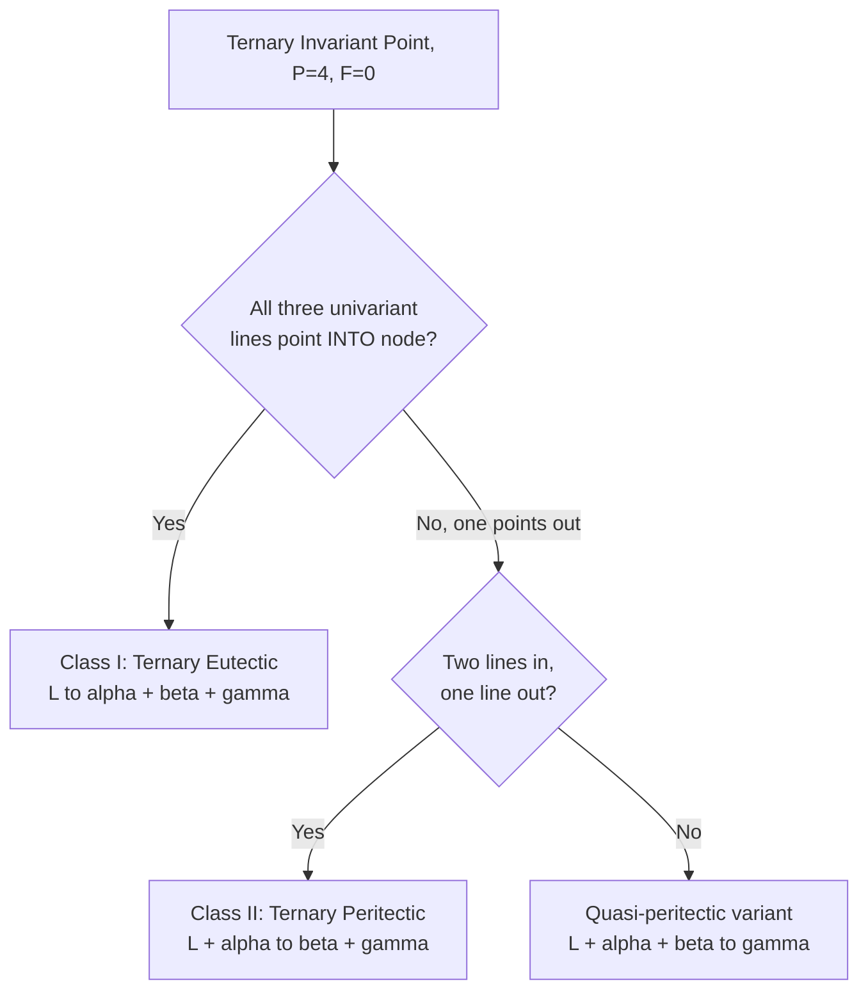
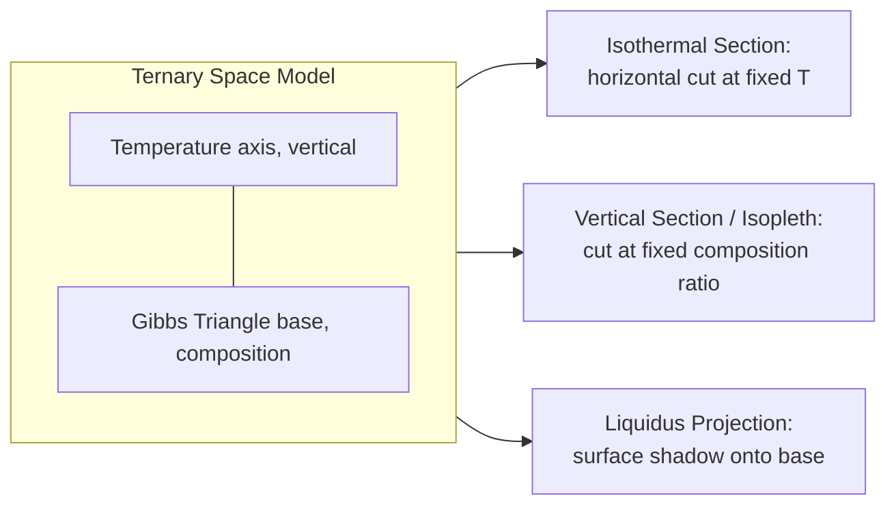

## Ternary Phase Diagrams

### Definition and Purpose

A ternary phase diagram represents the equilibrium phase relationships in a three-component (C=3) system as a function of composition, at a fixed temperature and pressure (isothermal, isobaric section), or as a series of such sections stacked to show temperature dependence. These diagrams extend binary phase diagram principles to systems where three independent chemical species interact, which is the norm in most engineering alloys (e.g., Fe-Cr-Ni stainless steels, Al-Cu-Mg aerospace alloys).

### Gibbs Phase Rule for Ternary Systems

$$F=C-P+2$$

For a condensed ternary system at constant pressure, the pressure degree of freedom is removed:

$$F=C-P+1=4-P$$

where $F$ is degrees of freedom, $C=3$ is the number of components, and $P$ is the number of phases present.

**Key Points**

- Single-phase field ($P=1$): $F=3$ (temperature + two independent composition variables)
- Two-phase field ($P=2$): $F=2$
- Three-phase field ($P=3$): $F=1$ (invariant at fixed T on an isothermal section)
- Four-phase equilibrium ($P=4$): $F=0$, invariant reaction (analogous to binary eutectic)

### The Gibbs Triangle

Composition is plotted on an equilateral triangle (Gibbs triangle), where each vertex represents a pure component (A, B, C = 100%) and each edge represents the corresponding binary system (A-B, B-C, A-C).

**Key Points**

- Any point inside the triangle represents a unique ternary composition summing to 100%
- Lines parallel to a given side represent constant percentage of the component at the opposite vertex
- Reading composition: draw lines parallel to each side from the point of interest; the intercepts give the percentages of each component

Raw SVG illustration of a Gibbs triangle with composition-reading construction lines:

<svg xmlns="http://www.w3.org/2000/svg" viewBox="0 0 420 380">
<title>Gibbs Triangle Composition Construction (svg_diagram)</title>
<polygon points="210,30 30,340 390,340" fill="none" stroke="#333" stroke-width="2" />
<text x="210" y="20" text-anchor="middle" font-size="14" font-weight="bold">C</text>
<text x="20" y="355" text-anchor="middle" font-size="14" font-weight="bold">A</text>
<text x="400" y="355" text-anchor="middle" font-size="14" font-weight="bold">B</text>
<circle cx="210" cy="230" r="4" fill="red" />
<text x="220" y="225" font-size="11" fill="red">P (40A-30B-30C)</text>
<line x1="210" y1="230" x2="102" y2="230" stroke="#0077cc" stroke-dasharray="4,3" />
<line x1="210" y1="230" x2="318" y2="230" stroke="#0077cc" stroke-dasharray="4,3" />
<line x1="210" y1="230" x2="234" y2="340" stroke="#0077cc" stroke-dasharray="4,3" />
<text x="60" y="345" font-size="10">A axis %</text>
<text x="340" y="345" font-size="10">B axis %</text>
<text x="245" y="200" font-size="10">C axis %</text>
</svg>

### Isothermal Sections

An isothermal section is a horizontal "slice" through the three-dimensional ternary temperature-composition space at a fixed temperature, projected onto the Gibbs triangle. This is the most common representation used in practice.

**Key Points**

- Single-phase regions are areas bounded by solvus/liquidus curves
- Two-phase regions contain **tie-lines** (conodes) connecting the compositions of the two coexisting phases in equilibrium
- Three-phase regions appear as a **tie-triangle**, with each vertex fixed at the composition of one of the three coexisting phases; any overall composition inside the triangle decomposes into those three fixed-composition phases in proportions given by the lever rule

### Tie-Lines and the Lever Rule in Two-Phase Regions

Within a two-phase field, tie-lines are generally **not parallel** to the triangle edges and their orientation must be determined experimentally or computationally (unlike binary isotherms, where the horizontal tie-line direction is fixed by geometry).

For an overall composition $O$ lying on a tie-line between phase $\alpha$ (composition $X_\alpha$) and phase $\beta$ (composition $X_\beta$), the mass fractions are given by the lever rule applied along the tie-line:

$$f_\alpha=\frac{\overline{O\beta}}{\overline{\alpha\beta}},\quad f_\beta=\frac{\overline{\alpha O}}{\overline{\alpha\beta}}$$

where the bars denote line-segment lengths measured along the tie-line.

### Three-Phase Triangles (Tie-Triangles)

When three phases coexist in equilibrium in an isothermal section, their compositions are represented by a triangle whose vertices are fixed. Any bulk composition inside this triangle splits into the three vertex-phase compositions.

**Example**

For a bulk composition $O$ inside a three-phase triangle with vertices $\alpha$, $\beta$, $\gamma$, the mass fraction of each phase is found by the ternary lever rule (center-of-mass / barycentric method):

$$f_\alpha=\frac{\text{Area}(O\beta\gamma)}{\text{Area}(\alpha\beta\gamma)},\quad f_\beta=\frac{\text{Area}(O\alpha\gamma)}{\text{Area}(\alpha\beta\gamma)},\quad f_\gamma=\frac{\text{Area}(O\alpha\beta)}{\text{Area}(\alpha\beta\gamma)}$$

### Liquidus Projections

For solidification analysis, a **liquidus projection** shows the liquidus surface of a ternary system projected onto the composition triangle, with isotherms (contour lines of constant liquidus temperature) drawn on it. Primary crystallization fields (regions where a specific solid phase is the first to solidify) are separated by **univariant lines** (valleys where two solid phases coexist with liquid).

**Key Points**

- Univariant lines represent $P=3$ (liquid + two solids), $F=1$ at fixed pressure — temperature and liquid composition move together along the line
- Arrows on univariant lines indicate the direction of falling temperature
- Intersections of univariant lines are ternary invariant points (eutectic, peritectic-type reactions)

### Ternary Invariant Reactions

At $P=4$ (three solids + liquid, or other four-phase combinations), $F=0$: the reaction occurs at one fixed temperature and fixed phase compositions.

- **Ternary eutectic**: $L\rightarrow\alpha+\beta+\gamma$
- **Ternary peritectic**: $L+\alpha\rightarrow\beta+\gamma$
- **Quasi-peritectic (Class II)**: $L+\alpha+\beta\rightarrow\gamma$

Distinguishing eutectic-type from peritectic-type reactions requires examining the direction of the univariant line arrows converging on the invariant point relative to the tie-triangle geometry.

Mermaid diagram summarizing the classification of ternary invariant reactions:

### Vertical Sections (Isopleths)

A vertical section (isopleth or "polythermal section") is a 2D slice through the 3D ternary prism at constant ratio of two components (or along an arbitrary composition line), with temperature on the vertical axis. It resembles a binary phase diagram but with critical caveats:

**Key Points**

- Phase boundary lines in an isopleth are generally **not tie-lines** — the tie-lines usually do not lie in the plane of the section
- The lever rule **cannot** be applied directly on an isopleth in the two-phase region unless the tie-line happens to lie within the section plane
- Isopleths are primarily used to visualize which phases are present and transformation temperatures along a specific alloy composition path (e.g., a fixed-ratio alloy series), not for quantitative phase-fraction calculations

### Reading a Ternary Isothermal Section: Worked Example

**Example**

Consider a hypothetical A-B-C system isothermal section at 800°C containing a two-phase ($\alpha+\beta$) region. An alloy with bulk composition $O$ = 50A-30B-20C lies inside this field.

1. Locate $O$ on the Gibbs triangle
2. Identify (from the diagram or database) the tie-line passing through $O$, with endpoints $\alpha$ = 70A-10B-20C and $\beta$ = 20A-60B-20C
3. Measure segment lengths along the tie-line: $\overline{O\beta}$ and $\overline{\alpha O}$
4. Apply the lever rule: $f_\alpha=\overline{O\beta}/\overline{\alpha\beta}$, $f_\beta=\overline{\alpha O}/\overline{\alpha\beta}$

[Inference] In practice, tie-line endpoints are obtained from thermodynamic databases (e.g., CALPHAD/Thermo-Calc) rather than manual measurement, since experimental tie-line data is sparse for most ternary systems and interpolation/extrapolation carries uncertainty.

### Space Model (3D Representation)

The full ternary system is represented as a triangular prism with composition on the base (Gibbs triangle) and temperature on the vertical axis. Liquidus and solidus surfaces are 3D surfaces within this prism. Isothermal sections are horizontal cuts; vertical sections (isopleths) are vertical cuts; liquidus projections are the shadow of the liquidus surface cast onto the base.

### Applications in Materials Science & Metallurgy

**Key Points**

- **Fe-Cr-Ni**: austenitic/ferritic stainless steel phase selection, Schaeffler-type diagrams for weld microstructure prediction
- **Al-Cu-Mg / Al-Zn-Mg**: precipitation-hardenable aerospace alloys, determining solvus boundaries for solutionizing heat treatments
- **Ceramic systems** (e.g., SiO₂-Al₂O₃-CaO): refractory and glass-ceramic design, determining liquidus temperatures for processing windows
- **Solder alloys** (Sn-Ag-Cu): identifying low-melting eutectic compositions for electronics assembly
- **CALPHAD modeling**: modern ternary (and higher-order) diagrams are computed via Gibbs energy minimization across all phases rather than purely experimental construction, enabling extrapolation into multicomponent commercial alloys

### Common Pitfalls

- Assuming tie-lines are parallel to a triangle edge (only true in special symmetric cases)
- Applying the binary lever rule directly on a vertical section without confirming the tie-line lies in-plane
- Misreading composition by not drawing all three construction lines parallel to the correct opposite side
- Confusing a liquidus projection isotherm with an actual two-phase field boundary — the projection shows only the liquidus temperature contour, not sub-liquidus phase boundaries

**Related Topics**

- Binary Eutectic and Peritectic Systems
- Gibbs Phase Rule Applications
- CALPHAD Method and Thermodynamic Databases
- Schaeffler and WRC-1992 Diagrams for Stainless Steel Welds
- Solidification Paths and Scheil-Gulliver Simulation
- Quaternary Phase Diagram Representation (Composition Tetrahedron)