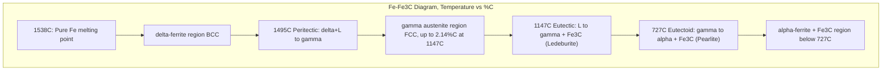

## The Iron-Iron Carbide Phase Diagram

### Definition and Scope

The Fe-Fe₃C (iron-iron carbide) phase diagram is a metastable binary phase diagram describing the equilibrium (and near-equilibrium) phases formed between iron and carbon over the composition range 0-6.67 wt% C, where 6.67 wt% C corresponds to stoichiometric cementite, Fe₃C. It is the foundational diagram for understanding steel and cast iron microstructures, heat treatment, and mechanical property development.

**Key Points**

- The diagram is technically **metastable**, not a true equilibrium diagram — the true stable equilibrium system is Fe-Graphite (relevant primarily to gray cast irons)
- Fe₃C (cementite) is a metastable compound; given sufficient time/temperature it can decompose into Fe + graphite, but under normal cooling rates this decomposition is kinetically suppressed
- Composition axis is conventionally plotted in wt% carbon (0 to 6.67%), sometimes extended with an atomic % axis

### Allotropes of Pure Iron

Iron exhibits polymorphism, which underlies the entire diagram's structure:

**Key Points**

- **δ-ferrite** (BCC): stable from 1394°C to 1538°C (melting point)
- **γ-iron / austenite** (FCC): stable from 912°C to 1394°C
- **α-ferrite** (BCC): stable below 912°C
- The BCC→FCC→BCC sequence on cooling arises because FCC packing is thermodynamically favored at intermediate temperatures due to entropy/vibrational effects, [Inference] though the precise electronic/magnetic origin (loss of ferromagnetism near the Curie point interacts with the α/γ transformation) is a more advanced solid-state physics topic beyond simple packing arguments

### Principal Phases

| Phase | Crystal Structure | Max Carbon Solubility | Stability Range |
| --- | --- | --- | --- |
| α-ferrite | BCC | 0.022 wt% C at 727°C | Room temp to 912°C |
| δ-ferrite | BCC | 0.09 wt% C at 1495°C | 1394°C to 1538°C |
| γ-austenite | FCC | 2.14 wt% C at 1147°C | 912°C to 1394°C |
| Fe₃C (cementite) | Orthorhombic | 6.67 wt% C (stoichiometric) | Stable (metastable) to ~1227°C decomposition |

**Key Points**

- Carbon occupies interstitial octahedral sites; FCC austenite has larger octahedral interstices than BCC ferrite, explaining austenite's much higher carbon solubility (2.14% vs. 0.022%)
- Cementite is hard and brittle (~800-1000 HV), while ferrite is soft and ductile — the balance between these two phases governs steel mechanical properties

### Invariant Reactions

Three invariant reactions occur in the Fe-Fe₃C system, each satisfying $F=0$ per the phase rule at fixed pressure ($F=C-P+1$, $C=2$, $P=3$):

**Peritectic Reaction** (1495°C, 0.17 wt% C)

$$\delta(0.09\%C)+L(0.53\%C)\rightarrow\gamma(0.17\%C)$$

**Eutectic Reaction** (1147°C, 4.30 wt% C) — forms **ledeburite**

$$L(4.30\%C)\rightarrow\gamma(2.14\%C)+Fe_3C(6.67\%C)$$

**Eutectoid Reaction** (727°C, 0.76 wt% C) — forms **pearlite**

$$\gamma(0.76\%C)\rightarrow\alpha(0.022\%C)+Fe_3C(6.67\%C)$$

**Key Points**

- The eutectoid reaction is the single most important transformation in steel metallurgy — it produces pearlite, the lamellar α-ferrite/cementite microconstituent
- The eutectoid temperature (727°C) is denoted $A_1$; the line is often called the "lower critical temperature"
- The eutectic point (1147°C, 4.30% C) marks the minimum melting point of the Fe-C system in the cast iron range

### Critical Temperature Lines (Steel Nomenclature)

- **A₁**: eutectoid temperature, 727°C (constant across all compositions)
- **A₃**: γ/(γ+α) phase boundary, varies with composition, decreasing from 912°C (pure Fe) down to 727°C at the eutectoid composition
- **Acm**: γ/(γ+Fe₃C) boundary for hypereutectoid steels, rising from 727°C at 0.76% C up to 1147°C at 2.14% C

**Key Points**

- The subscript "c" (e.g., Ac1, Ac3) denotes heating (French *chauffage*); "r" (Ar1, Ar3) denotes cooling (*refroidissement*) — actual transformation temperatures lag the equilibrium lines due to thermal hysteresis, with heating values slightly above and cooling values slightly below equilibrium
- These lines define the austenitizing temperatures required before quenching or normalizing heat treatments

### Composition-Based Classification

**Key Points**

- **Steels**: 0.008-2.14 wt% C
  - Hypoeutectoid: 0.008-0.76 wt% C (ferrite + pearlite at room temp)
  - Eutectoid: 0.76 wt% C (100% pearlite)
  - Hypereutectoid: 0.76-2.14 wt% C (pearlite + proeutectoid cementite)
- **Cast Irons**: 2.14-6.67 wt% C (practically 2-4 wt% C for commercial alloys)
  - Hypoeutectic: 2.14-4.30 wt% C
  - Eutectic: 4.30 wt% C
  - Hypereutectic: 4.30-6.67 wt% C

### Microstructural Evolution: Hypoeutectoid Steel Cooling Path

**Example**

For a 0.4 wt% C steel cooled slowly from the austenite region:

1. Above A₃: fully austenitic (single phase γ)
2. Crossing A₃: proeutectoid α-ferrite nucleates at austenite grain boundaries and grows
3. At A₁ (727°C): remaining austenite (now enriched to 0.76% C by ferrite rejection of carbon) transforms via the eutectoid reaction into pearlite
4. Below A₁: final microstructure = proeutectoid ferrite (grain boundary/blocky) + pearlite (lamellar α+Fe₃C)

The relative amount of proeutectoid ferrite vs. pearlite is found via the lever rule at a temperature just above 727°C, using the A₃ and eutectoid compositions as tie-line endpoints.

### Microstructural Evolution: Hypereutectoid Steel Cooling Path

**Example**

For a 1.2 wt% C steel:

1. Above Acm: fully austenitic
2. Crossing Acm: proeutectoid cementite forms at austenite grain boundaries (network morphology — a source of brittleness if continuous)
3. At A₁: remaining austenite (depleted to 0.76% C) transforms to pearlite
4. Final microstructure: grain-boundary cementite network + pearlite

**Key Points**

- Continuous proeutectoid cementite networks in hypereutectoid steels are undesirable for toughness; spheroidizing heat treatments are used to break up this network into discrete carbide particles

### Lever Rule Application at the Eutectoid

**Example**

For a 0.4 wt% C steel just below 727°C, fraction of proeutectoid ferrite and pearlite:

$$f_{pearlite}=\frac{C_0-C_\alpha}{C_{eutectoid}-C_\alpha}=\frac{0.40-0.022}{0.76-0.022}\approx0.512$$

$$f_{proeutectoid\ \alpha}=1-f_{pearlite}\approx0.488$$

where $C_0$ is the alloy composition, $C_\alpha=0.022\%$ is the ferrite solubility limit, and $C_{eutectoid}=0.76\%$.

### Phase Diagram Schematic

### Cast Iron Microstructures

**Key Points**

- **White cast iron**: rapid cooling suppresses graphite formation; follows metastable Fe-Fe₃C diagram fully; hard, brittle, wear-resistant (contains ledeburite)
- **Gray cast iron**: slower cooling + Si addition promotes graphite flake formation per the stable Fe-graphite system, not this metastable diagram
- **Ledeburite**: the eutectic mixture (γ+Fe₃C at formation, transforms to pearlite+Fe₃C below 727°C, sometimes called "transformed ledeburite")

[Inference] The exact graphitization tendency in real cast irons depends strongly on silicon content, cooling rate, and inoculation practice — the Fe-Fe₃C diagram alone does not predict gray vs. white solidification; the Fe-Si-C ternary system or empirical carbon-equivalent formulas are typically used for that prediction in practice.

### Practical Significance for Heat Treatment

**Key Points**

- **Annealing/Normalizing**: austenitizing above A₃ (hypoeutectoid) or above A₁ with partial dissolution (hypereutectoid), then controlled cooling
- **Quenching**: rapid cooling from austenite suppresses the eutectoid reaction, instead producing martensite (a metastable, supersaturated, body-centered tetragonal phase) — martensite formation is **not** shown on this equilibrium diagram, requiring instead a Time-Temperature-Transformation (TTT) or Continuous-Cooling-Transformation (CCT) diagram
- The Fe-Fe₃C diagram gives equilibrium/near-equilibrium information only; it cannot predict cooling-rate-dependent microstructures like martensite or bainite

### Common Pitfalls

- Treating the diagram as fully stable/equilibrium (it is metastable relative to Fe-graphite)
- Attempting to read martensite or bainite formation directly off this diagram — these require TTT/CCT diagrams instead
- Confusing Acm with A₃ — Acm applies only above 0.76% C (hypereutectoid), A₃ only below (hypoeutectoid)
- Forgetting thermal hysteresis: actual transformation temperatures (Ac/Ar) differ from equilibrium (A) values depending on heating vs. cooling and rate

**Related Topics**

- Time-Temperature-Transformation (TTT) Diagrams
- Continuous-Cooling-Transformation (CCT) Diagrams
- Martensitic Transformation and Hardenability
- Pearlite, Bainite, and Martensite Microstructures
- Heat Treatment of Steels (Annealing, Normalizing, Quenching, Tempering)
- Cast Iron Classification (Gray, White, Ductile, Malleable)
- Fe-Graphite Stable Equilibrium System