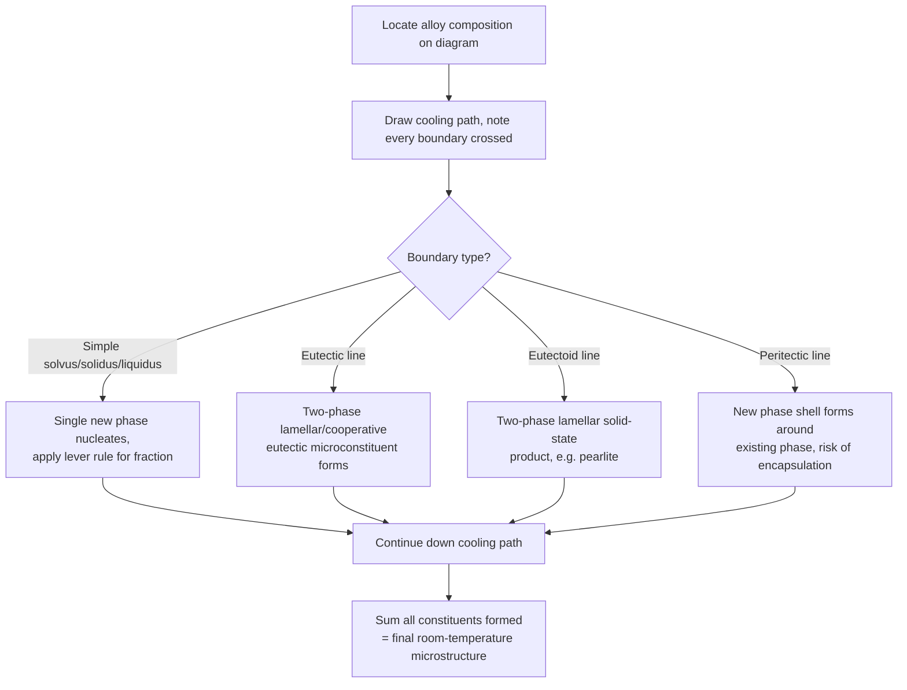

## Interpreting Microstructure from Phase Diagrams

### Purpose and Scope

Phase diagrams are equilibrium maps of which phases exist at given compositions and temperatures, but the practical skill required in materials engineering is translating a diagram plus a **cooling path** into a predicted **microstructure**: phase identities, morphologies, relative amounts, and spatial arrangement. This is the bridge between thermodynamics (phase diagrams) and materials properties (which depend on microstructure).

**Key Points**

- A phase diagram alone tells you *what* phases exist at equilibrium; it does not tell you *how* they are arranged (grain size, lamellar spacing, particle morphology) — that depends on kinetics (nucleation, growth, diffusion rates) not captured on the diagram
- Microstructure interpretation requires combining: (1) the equilibrium phase diagram, (2) the lever rule for phase fractions, (3) knowledge of the specific solid-state or solidification reaction type, and (4) qualitative understanding of cooling-rate effects

### General Procedure for Reading a Cooling Path

**Next Steps**

1. Draw a vertical line at the alloy's overall composition on the phase diagram
2. Identify every phase boundary line this vertical line crosses as temperature decreases
3. At each crossing, note: which reaction occurs (simple boundary crossing vs. invariant reaction), what new phase(s) nucleate, and at what morphology/location they typically appear (grain boundary, dendritic, lamellar)
4. Between boundaries, apply the lever rule at representative temperatures to track evolving phase fractions and compositions
5. At any invariant reaction line (eutectic, eutectoid, peritectic), identify the resulting two-phase microconstituent and its characteristic morphology
6. Assemble the final room-temperature microstructure as the sum of all constituents formed along the path, noting proeutectic/proeutectoid phases retain their earlier morphology while later reactions overprint the remaining matrix

### Single-Phase Solidification (Isomorphous Systems)

**Example**

In a binary isomorphous system (complete solid and liquid solubility, e.g., Cu-Ni), an alloy cooled from the liquid:

- Crosses the liquidus: solid solution nucleates as dendrites, initially cored (composition varies from dendrite core to edge) under non-equilibrium cooling
- Crosses the solidus: solidification complete, single-phase polycrystalline microstructure
- **Coring** (a kinetic, non-equilibrium effect) is invisible on the equilibrium diagram itself but is a critical practical consequence of the S-shaped solidus/liquidus gap — homogenization annealing is required to remove it

[Inference] The degree of coring observed in practice depends on cooling rate and the width of the liquidus-solidus gap at a given composition; the diagram indicates the *tendency* (gap width) but not the *magnitude* of coring for a specific process.

### Eutectic Systems: Microconstituent Identification

**Key Points**

- **Hypoeutectic** alloys: proeutectic (primary) phase forms first as dendrites, followed by eutectic mixture in the remaining interdendritic liquid at the eutectic temperature
- **Eutectic** composition: 100% eutectic microconstituent, characteristic lamellar (or other cooperative) morphology of the two phases
- **Hypereutectic** alloys: proeutectic phase of the *other* solid forms first, followed by eutectic in the remainder

**Example**

For a hypoeutectic Pb-Sn alloy (e.g., 40 wt% Sn, eutectic at 61.9 wt% Sn):

1. Above liquidus: liquid only
2. Between liquidus and eutectic temperature (183°C): primary α (Pb-rich) dendrites grow, liquid composition moves along the liquidus toward the eutectic point
3. At 183°C: remaining liquid (now at eutectic composition) transforms via $L\rightarrow\alpha+\beta$, forming lamellar eutectic in the interdendritic regions
4. Final microstructure: primary α dendrites embedded in a lamellar α+β eutectic matrix

Lever rule at a temperature just above the eutectic gives the fraction of primary α vs. remaining liquid (which becomes eutectic):

$$f_{primary\ \alpha}=\frac{C_{eutectic}-C_0}{C_{eutectic}-C_\alpha},\quad f_{eutectic}=\frac{C_0-C_\alpha}{C_{eutectic}-C_\alpha}$$

### Eutectoid Systems: Microconstituent Identification

The eutectoid reaction ($\gamma\rightarrow\alpha+\beta$, solid-state) produces the same lever-rule logic as eutectic but entirely in the solid state, generally yielding finer, more diffusion-limited morphologies (e.g., pearlite lamellae) since solid-state diffusion is orders of magnitude slower than liquid diffusion.

**Key Points**

- Proeutectoid phase forms at prior-phase grain boundaries (not as free-floating dendrites, since no liquid is present)
- The eutectoid product (e.g., pearlite) forms as alternating lamellae nucleating from grain boundaries or inclusions, growing inward
- Lamellar spacing is inversely related to undercooling below the eutectoid temperature: faster cooling → finer spacing → higher strength (Hall-Petch-like strengthening)

### Peritectic Systems: Microconstituent Identification

**Key Points**

- Peritectic reaction: $L+\alpha\rightarrow\beta$ (solid + liquid combine to form a new solid)
- Because the new phase β forms as a shell around pre-existing α particles, it can isolate untransformed α from further contact with liquid, kinetically suppressing complete transformation — a classic source of **non-equilibrium microstructure** (retained primary phase inside peritectic-product shells) even under moderately slow cooling
- This diffusion-controlled encapsulation effect is the primary reason peritectic systems are difficult to homogenize and are less commonly exploited for controlled microstructure design compared to eutectic/eutectoid systems

### Effect of Cooling Rate (Beyond Equilibrium Diagram Limits)

**Key Points**

- Equilibrium diagrams strictly apply only for infinitely slow cooling; real processing always introduces some degree of non-equilibrium behavior
- **Coring** (isomorphous systems): composition gradients within grains from dendritic solidification
- **Non-equilibrium phase retention**: metastable phases (e.g., retained austenite, martensite in steels) are not predicted by equilibrium diagrams at all — separate transformation-kinetics diagrams (TTT/CCT) are required
- **Grain refinement**: faster cooling generally produces finer-scale microstructures (smaller dendrite arm spacing, finer eutectic/eutectoid lamellae, smaller grains) due to higher nucleation rates outpacing growth rates — this is a kinetic effect layered on top of, not shown by, the equilibrium diagram

[Inference] Quantitative prediction of cooling-rate effects on scale (e.g., secondary dendrite arm spacing vs. cooling rate) typically requires empirical correlations such as $\lambda\propto t_f^{-n}$ (solidification time relationship) rather than anything derivable from the phase diagram itself.

### Worked Example: Full Microstructure Prediction

**Example**

For a hypereutectoid Fe-C steel at 1.0 wt% C, slow-cooled from full austenitization:

| Temperature Region | Reaction | Resulting Microstructure Feature |
| --- | --- | --- |
| Above Acm (~800°C) | Single-phase γ | Uniform austenite grains |
| Crossing Acm | Proeutectoid Fe₃C nucleates | Grain-boundary cementite network begins forming |
| Between Acm and A₁ | Continued Fe₃C growth, γ composition moves along Acm line toward 0.76% C | Network thickens; austenite grain interiors depleted toward eutectoid composition |
| At A₁ (727°C) | Eutectoid: γ(0.76%C)→α+Fe₃C | Remaining austenite transforms to lamellar pearlite |
| Room temperature | — | Grain-boundary cementite network + pearlite matrix |

Lever rule (just above 727°C) for proeutectoid cementite fraction:

$$f_{Fe_3C,\ proeutectoid}=\frac{C_0-C_{eutectoid}}{C_{Fe_3C}-C_{eutectoid}}=\frac{1.0-0.76}{6.67-0.76}\approx0.041$$

### Diagram-to-Microstructure Decision Flow

### Common Pitfalls

- Forgetting that proeutectic/proeutectoid morphology (dendritic vs. grain-boundary) depends on whether the reaction occurs from liquid or from a prior solid phase
- Applying the lever rule across an invariant reaction line itself (it is only valid within a two-phase field, using the field's own boundary compositions as endpoints)
- Ignoring peritectic encapsulation effects and assuming complete transformation under normal cooling rates
- Treating the equilibrium diagram as sufficient for predicting martensite, bainite, or other diffusionless/kinetically-controlled products — these require TTT/CCT diagrams, not the equilibrium phase diagram alone
- Neglecting that coring and dendritic segregation are invisible on the diagram itself but are major practical consequences of the liquidus-solidus gap shape

**Next Steps**

- Time-Temperature-Transformation (TTT) Diagrams
- Continuous-Cooling-Transformation (CCT) Diagrams
- Dendritic Solidification and Coring
- Homogenization and Diffusion Annealing
- Pearlite Lamellar Spacing and Strengthening Mechanisms
- Peritectic Reaction Kinetics and Encapsulation