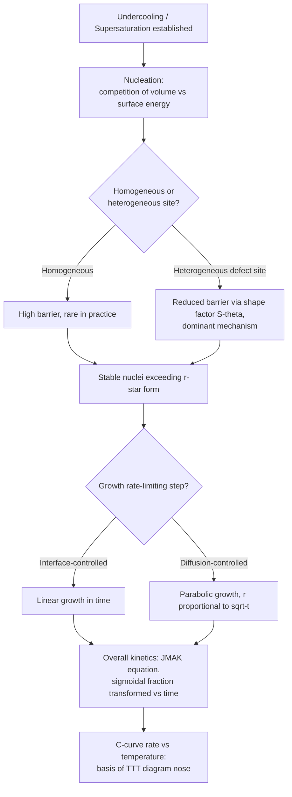

## Nucleation and Growth Theory

### Definition and Scope

Nucleation and growth theory describes the kinetic pathway by which a new phase forms from a parent phase — the initial formation of stable sub-microscopic clusters (nucleation) followed by their subsequent enlargement (growth). This framework underlies solidification, solid-state phase transformations, precipitation, recrystallization, and glass crystallization, and provides the physical basis for transformation-rate diagrams (TTT/CCT) used throughout physical metallurgy.

**Key Points**

- Nucleation and growth are governed by different rate-limiting physics: nucleation is controlled by the competition between volume free energy reduction and interfacial energy cost; growth is typically controlled by diffusion (long-range) or interface attachment kinetics (short-range)
- The overall transformation rate is a convolution of both processes, described macroscopically by the Johnson-Mehl-Avrami-Kolmogorov (JMAK) equation

### Homogeneous Nucleation

**Thermodynamics of Cluster Formation**

When a new phase β nucleates within a uniform parent phase α, the total free energy change for forming a spherical embryo of radius $r$ is:

$$\Delta G=\frac{4}{3}\pi r^3\Delta G_v+4\pi r^2\gamma$$

where $\Delta G_v$ is the volumetric free energy change per unit volume (negative, driving force) and $\gamma$ is the interfacial energy per unit area (positive, energy penalty).

**Key Points**

- The volume term scales as $r^3$ and favors growth (negative contribution)
- The surface term scales as $r^2$ and opposes growth (positive contribution)
- Competition between these produces an energy maximum at a **critical radius** $r^*$

**Critical Radius and Critical Energy Barrier**

Differentiating $\Delta G(r)$ and setting $d(\Delta G)/dr=0$:

$$r^*=-\frac{2\gamma}{\Delta G_v}$$

$$\Delta G^*=\frac{16\pi\gamma^3}{3(\Delta G_v)^2}$$

**Key Points**

- Embryos smaller than $r^*$ are unstable and tend to shrink/redissolve (reducing total free energy)
- Embryos larger than $r^*$ are stable nuclei that will continue to grow spontaneously, lowering system free energy
- $\Delta G^*$ is the **nucleation barrier** — the activation energy that must be overcome by thermal fluctuation for a stable nucleus to form

### Undercooling Dependence

The volumetric driving force is approximately proportional to undercooling below the equilibrium transformation temperature $T_e$:

$$\Delta G_v\approx\frac{\Delta H_f\Delta T}{T_e}$$

where $\Delta H_f$ is the latent heat of transformation and $\Delta T=T_e-T$ is the undercooling.

Substituting into the critical radius and barrier expressions:

$$r^*=-\frac{2\gamma T_e}{\Delta H_f\Delta T}$$

$$\Delta G^*=\frac{16\pi\gamma^3T_e^2}{3(\Delta H_f)^2(\Delta T)^2}$$

**Key Points**

- Both $r^*$ and $\Delta G^*$ decrease as undercooling increases (inverse and inverse-square relationships respectively)
- This explains why nucleation rate increases sharply with increasing undercooling: larger undercooling makes smaller, more probable clusters already exceed the critical size
- At $\Delta T=0$ (equilibrium), $r^*\rightarrow\infty$ and $\Delta G^*\rightarrow\infty$ — nucleation cannot occur exactly at the equilibrium transformation temperature, confirming that finite undercooling/superheating is always required in practice

### Homogeneous Nucleation Rate

The steady-state nucleation rate combines the thermodynamic barrier with an atomic mobility (diffusion) term:

$$N=N_0\exp\left(-\frac{\Delta G^*}{k_BT}\right)\exp\left(-\frac{Q_d}{k_BT}\right)$$

where $N_0$ is a pre-exponential factor related to atomic vibration frequency and available nucleation sites, $Q_d$ is the activation energy for atomic diffusion across the interface, and $k_B$ is Boltzmann's constant.

**Key Points**

- The first exponential term (thermodynamic) increases with undercooling
- The second exponential term (kinetic/diffusion) decreases with undercooling (diffusion slows as temperature drops)
- The product of these two competing exponentials produces a characteristic **C-curve** (nose-shaped) nucleation rate vs. temperature behavior, which is the physical origin of TTT diagram noses

Raw SVG illustration of the competing exponential terms producing a C-curve:

<svg xmlns="http://www.w3.org/2000/svg" viewBox="0 0 460 320">
<title>Nucleation Rate C-Curve from Competing Terms (svg_diagram)</title>
<line x1="60" y1="280" x2="420" y2="280" stroke="#333" stroke-width="2" />
<line x1="60" y1="20" x2="60" y2="280" stroke="#333" stroke-width="2" />
<text x="230" y="305" text-anchor="middle" font-size="12">Nucleation Rate, N</text>
<text x="20" y="150" text-anchor="middle" font-size="12" transform="rotate(-90 20 150)">Temperature</text>
<path d="M 70 40 C 150 60, 180 150, 260 200 C 320 230, 380 250, 410 260" fill="none" stroke="#cc3300" stroke-width="2.5" />
<text x="130" y="55" font-size="10" fill="#cc3300">Thermodynamic term rising</text>
<text x="280" y="255" font-size="10" fill="#cc3300">Diffusion term limiting</text>
<circle cx="240" cy="185" r="4" fill="blue" />
<text x="250" y="180" font-size="10" fill="blue">Max N (C-curve nose)</text>
</svg>

### Heterogeneous Nucleation

In practice, nucleation almost always occurs preferentially at pre-existing defects (grain boundaries, dislocations, inclusions, free surfaces) rather than homogeneously within the bulk, because these sites reduce the effective interfacial energy penalty.

**Key Points**

- The critical radius $r^*$ is **unchanged** by heterogeneous nucleation (still depends only on $\gamma$ and $\Delta G_v$)
- The critical energy barrier is reduced by a geometric **shape factor** $S(\theta)$ dependent on the wetting angle $\theta$ between the new phase and the nucleation site:

$$\Delta G^*_{het}=\Delta G^*_{hom}\cdot S(\theta),\quad S(\theta)=\frac{(2+\cos\theta)(1-\cos\theta)^2}{4}$$

- $S(\theta)$ ranges from 0 (perfect wetting, $\theta=0$, negligible barrier) to 1 (no wetting, $\theta=180°$, reduces to homogeneous case)
- Because $S(\theta)<1$ for any finite wetting angle, heterogeneous nucleation always has a lower barrier and dominates in real materials — homogeneous nucleation is rarely observed except in exceptionally clean, defect-free systems or specific controlled experiments

### Growth Kinetics

Once stable nuclei form, they grow at a rate controlled by one of two limiting mechanisms:

**Key Points**

- **Interface-controlled growth**: rate-limited by atomic attachment kinetics at the phase boundary; growth rate is roughly independent of particle size, often linear in time
- **Diffusion-controlled growth**: rate-limited by long-range diffusion of solute to/from the growing interface; growth rate typically follows a parabolic relationship, $r\propto\sqrt{t}$, because the diffusion field must extend progressively further as the particle grows
- Most solid-state precipitation and solidification of alloys (as opposed to pure metals) are diffusion-controlled, since composition partitioning between phases requires long-range solute transport

**Example**

For diffusion-controlled growth of a spherical precipitate, the growth rate can be approximated (simplified parabolic growth law) as:

$$r(t)=k\sqrt{Dt}$$

where $D$ is the diffusion coefficient of the rate-limiting solute and $k$ is a dimensionless constant depending on the supersaturation.

### Overall Transformation Kinetics: JMAK Equation

Combining nucleation rate and growth rate over the full transformation gives the fraction transformed, $y$, as a function of time — the Johnson-Mehl-Avrami-Kolmogorov equation:

$$y=1-\exp(-kt^n)$$

**Key Points**

- $k$ is a temperature-dependent rate constant incorporating both nucleation and growth rates
- $n$ (the Avrami exponent) depends on the nucleation mechanism (constant rate vs. site saturation) and growth dimensionality (1D, 2D, or 3D growth); typical values range from ~1 to ~4
- The resulting sigmoidal (S-shaped) transformation curve — slow initially (few nuclei, small particles), accelerating (nucleation continues + existing particles grow), then decelerating (impingement/particle overlap and solute depletion) — is characteristic of essentially all nucleation-and-growth transformations
- Plotting $\ln[-\ln(1-y)]$ vs. $\ln t$ linearizes the JMAK equation, allowing experimental determination of $k$ and $n$ from slope and intercept

### Temperature Dependence and the TTT Diagram Connection

**Key Points**

- The rate constant $k$ in the JMAK equation is itself governed by the same competing thermodynamic/kinetic exponentials as the nucleation rate, producing the characteristic **C-curve** shape (fastest transformation at intermediate temperature, slower at both high and low temperature)
- At high temperature (low undercooling): slow transformation due to low nucleation driving force, despite fast diffusion
- At low temperature (high undercooling): slow transformation due to sluggish diffusion, despite high nucleation driving force
- At intermediate temperature (the "nose" of the C-curve): fastest overall transformation, where both nucleation driving force and diffusion mobility are reasonably favorable simultaneously
- This is the direct physical origin of the nose shape seen on TTT diagrams for reactions such as pearlite formation in steel

### Practical Manifestations

**Key Points**

- **Steel pearlite/bainite formation**: classic JMAK/C-curve behavior, directly plotted as TTT diagrams
- **Precipitation hardening** (age hardening): nucleation and diffusion-controlled growth of precipitates (e.g., GP zones in Al-Cu) — aging time/temperature curves follow the same underlying theory
- **Grain refinement via inoculation**: heterogeneous nucleation agents deliberately added to castings to increase nucleation site density and reduce grain size
- **Recrystallization**: nucleation of strain-free grains at deformation-induced defect sites, followed by boundary migration (growth), also described by JMAK-type kinetics

[Inference] While the classical JMAK framework captures the general sigmoidal transformation behavior well for many systems, real transformations often deviate from ideal JMAK assumptions (e.g., non-random nucleation site distribution, overlapping diffusion fields, changing nucleation rate during transformation), so fitted $n$ values are sometimes non-integer and not always strictly interpretable via the idealized mechanistic assumptions.

### Common Pitfalls

- Assuming homogeneous nucleation is the typical case in real materials — heterogeneous nucleation dominates in essentially all practical engineering situations
- Forgetting that $r^*$ is unchanged by heterogeneous nucleation; only the energy barrier changes
- Misinterpreting the Avrami exponent $n$ as having a single universal physical meaning — it is mechanism- and geometry-dependent and must be determined per system
- Confusing interface-controlled (linear, $r\propto t$) and diffusion-controlled (parabolic, $r\propto\sqrt{t}$) growth laws
- Treating nucleation rate as monotonically increasing with undercooling — the C-curve behavior means rate eventually decreases again at very high undercooling due to diffusion limitations

**Related Topics**

- TTT (Time-Temperature-Transformation) Diagrams
- CCT (Continuous-Cooling-Transformation) Diagrams
- Precipitation Hardening and Aging Kinetics
- Recrystallization and Grain Growth
- Diffusion in Solids (Fick's Laws, Diffusion Coefficients)
- Solidification: Nucleation in Castings and Grain Refinement