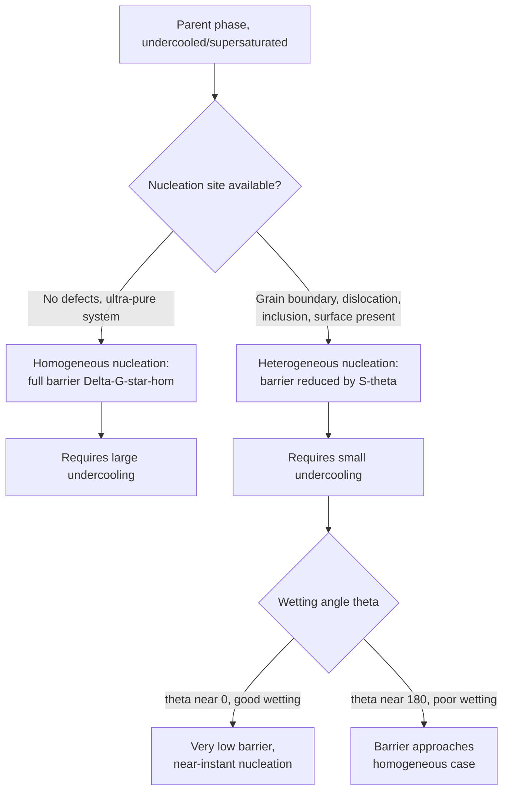

## Homogeneous versus Heterogeneous Nucleation

### Definition and Scope

Homogeneous and heterogeneous nucleation are the two mechanistic pathways by which a new phase forms within a parent phase, distinguished by whether nucleation occurs uniformly throughout the bulk material or preferentially at pre-existing structural defects and interfaces. This comparison is central to understanding why real transformation rates and microstructures differ dramatically from idealized bulk-nucleation predictions.

**Key Points**

- **Homogeneous nucleation**: nuclei form randomly and uniformly at any location within a compositionally and structurally uniform parent phase, with no preferential sites
- **Heterogeneous nucleation**: nuclei form preferentially at existing defects — grain boundaries, dislocations, stacking faults, inclusions, container walls, free surfaces — where the local energy barrier to nucleation is reduced
- Heterogeneous nucleation dominates in essentially all practical engineering situations; homogeneous nucleation is largely an idealized limiting case, observed mainly in exceptionally pure, defect-free systems or controlled laboratory experiments (e.g., electromagnetically levitated melts)

### Homogeneous Nucleation: Energetics

The total free energy change for forming a spherical embryo of radius $r$ within a uniform parent phase:

$$\Delta G_{hom}=\frac{4}{3}\pi r^3\Delta G_v+4\pi r^2\gamma$$

Resulting in a critical radius and energy barrier:

$$r^*=-\frac{2\gamma}{\Delta G_v},\quad\Delta G^*_{hom}=\frac{16\pi\gamma^3}{3(\Delta G_v)^2}$$

**Key Points**

- $\Delta G_v$ (negative) is the volumetric driving force; $\gamma$ (positive) is the interfacial energy between the new phase and parent phase
- Because the entire interfacial energy penalty $\gamma$ must be paid to create the embryo, $\Delta G^*_{hom}$ is comparatively large
- Large undercooling is required before the thermodynamic driving force is sufficient to overcome this barrier at an appreciable rate — pure metals cooled under highly controlled, defect-free conditions can be undercooled by tens to over a hundred degrees before homogeneous nucleation occurs

### Heterogeneous Nucleation: Energetics

When nucleation occurs on a pre-existing surface (e.g., a flat mold wall or inclusion), the embryo forms as a spherical cap rather than a full sphere, characterized by a wetting (contact) angle $\theta$ between the new phase and the substrate.

**Key Points**

- The critical radius $r^*$ is **identical** to the homogeneous case — it depends only on $\gamma$ (new phase/parent phase interfacial energy) and $\Delta G_v$, not on the nucleation site geometry
- Only the **volume** of material needed to reach that critical radius is reduced (because part of the embryo's "surface" is replaced by the pre-existing substrate interface), which lowers the total energy barrier

The heterogeneous barrier is related to the homogeneous barrier by a geometric shape factor:

$$\Delta G^*_{het}=\Delta G^*_{hom}\cdot S(\theta)$$

$$S(\theta)=\frac{(2+\cos\theta)(1-\cos\theta)^2}{4}$$

### The Wetting Angle and Shape Factor

**Key Points**

- $\theta$ is determined by the balance of three interfacial energies at the triple junction: substrate/parent ($\gamma_{SL}$), substrate/new phase ($\gamma_{SN}$), and new phase/parent ($\gamma_{NL}$), via Young's equation: $\gamma_{SL}=\gamma_{SN}+\gamma_{NL}\cos\theta$
- $\theta=180°$ (no wetting): $S(\theta)=1$, heterogeneous barrier equals homogeneous barrier (substrate provides no benefit)
- $\theta=90°$: $S(\theta)=0.5$, barrier is halved
- $\theta=0°$ (perfect wetting): $S(\theta)=0$, barrier vanishes entirely — nucleation is essentially instantaneous once any driving force exists
- Since $S(\theta)\le1$ for all physically realizable wetting angles, heterogeneous nucleation is **never** thermodynamically disadvantaged relative to homogeneous nucleation, which is why it is always observed preferentially when suitable sites are present

Raw SVG illustration comparing homogeneous embryo (full sphere) and heterogeneous embryo (spherical cap on substrate):

<svg xmlns="http://www.w3.org/2000/svg" viewBox="0 0 480 260">
<title>Homogeneous vs Heterogeneous Nucleation Geometry (svg_diagram)</title>
<circle cx="120" cy="130" r="55" fill="none" stroke="#0077cc" stroke-width="2.5" />
<text x="120" y="210" text-anchor="middle" font-size="12">Homogeneous: full sphere</text>
<text x="120" y="225" text-anchor="middle" font-size="11">theta = 180 deg, S = 1</text>
<line x1="300" y1="180" x2="460" y2="180" stroke="#333" stroke-width="2" />
<path d="M 320 180 A 50 50 0 0 1 420 180 Z" fill="none" stroke="#cc3300" stroke-width="2.5" />
<text x="370" y="230" text-anchor="middle" font-size="12">Heterogeneous: spherical cap</text>
<text x="370" y="245" text-anchor="middle" font-size="11">theta less than 180, S less than 1</text>
<text x="370" y="165" text-anchor="middle" font-size="10" fill="#cc3300">theta</text>
</svg>

### Nucleation Rate Comparison

Both mechanisms follow the same general rate-equation form, differing in the barrier term:

$$N_{hom}=N_{0,hom}\exp\left(-\frac{\Delta G^*_{hom}}{k_BT}\right)\exp\left(-\frac{Q_d}{k_BT}\right)$$

$$N_{het}=N_{0,het}\exp\left(-\frac{\Delta G^*_{hom}\cdot S(\theta)}{k_BT}\right)\exp\left(-\frac{Q_d}{k_BT}\right)$$

**Key Points**

- Because $S(\theta)<1$ reduces the exponent's magnitude (less negative), $N_{het}\gg N_{hom}$ at equivalent undercooling for any finite wetting angle
- Heterogeneous nucleation therefore requires substantially **less undercooling** to achieve a comparable nucleation rate — this is why real solidification and solid-state transformations proceed at undercoolings far smaller than homogeneous theory would predict
- The pre-exponential factor $N_{0,het}$ is also typically different (scales with density of available heterogeneous sites rather than atomic density in the bulk), though the exponential barrier reduction is the dominant effect

### Practical Comparison Table

| Aspect | Homogeneous | Heterogeneous |
| --- | --- | --- |
| Nucleation site | Uniform, anywhere in bulk | Grain boundaries, dislocations, inclusions, surfaces |
| Critical radius $r^*$ | $-2\gamma/\Delta G_v$ | Same as homogeneous |
| Energy barrier | $\Delta G^*_{hom}$ (full) | $\Delta G^*_{hom}\cdot S(\theta)$ (reduced) |
| Required undercooling | Large (tens to ~100°C+ for metals) | Small (often only a few °C to ~20°C) |
| Prevalence in practice | Rare, requires exceptional purity | Dominant mechanism in virtually all real materials |
| Site density control | Not applicable | Engineered via inoculants, cold work, alloying |

### Engineering Exploitation: Grain Refinement

**Example**

In aluminum casting, deliberate addition of Al-Ti-B grain refiner introduces TiB₂ particles that act as highly effective heterogeneous nucleation sites (low wetting angle with the solidifying α-Al phase), dramatically increasing nucleation site density. This produces many more, much smaller grains than would form via sparse heterogeneous nucleation on native oxide films or mold walls alone, improving strength, ductility, and casting soundness through fine, equiaxed grain structure.

**Key Points**

- **Inoculation** (casting): deliberately adding particles with favorable (low) wetting angle to the solidifying phase, to promote heterogeneous nucleation and refine grain size
- **Cold work prior to recrystallization**: increases dislocation density, providing more heterogeneous nucleation sites for strain-free recrystallized grains, refining final grain size
- **Precipitation hardening alloy design**: some alloying additions or pre-precipitation clusters (e.g., GP zones in Al-Cu) act as heterogeneous nucleation catalysts for the strengthening precipitate phase

### Consequence for Undercooling and Microstructure

**Key Points**

- Because heterogeneous nucleation dominates, the *observed* undercooling required for transformation to initiate in real materials is governed by the density and effectiveness (wetting angle) of available heterogeneous sites, not by the theoretical homogeneous nucleation barrier
- Controlling heterogeneous site density is therefore a primary practical lever for controlling grain size and microstructural scale — more effective/numerous heterogeneous sites → higher effective nucleation rate at a given undercooling → finer microstructure
- [Inference] In highly purified or rapidly solidified systems where heterogeneous sites are deliberately minimized (e.g., some metallic glass processing, containerless processing techniques), nucleation behavior can approach the homogeneous limit, permitting much larger undercoolings before transformation onset — though achieving true homogeneous conditions in engineering alloys is generally impractical

### Common Pitfalls

- Assuming the critical radius $r^*$ differs between homogeneous and heterogeneous nucleation — it does not; only the barrier and required embryo volume change
- Believing heterogeneous nucleation is a "special case" or minor correction — in nearly all real engineering materials it is the dominant, expected mechanism
- Treating wetting angle as a fixed material constant independent of processing — surface chemistry, oxide films, and inoculant particle selection all influence $\theta$ and thus nucleation effectiveness
- Confusing site density (number of heterogeneous nucleation sites available) with site potency (how low $\theta$ is for a given site) — both independently affect the resulting nucleation rate and final grain size
- Assuming that because $S(\theta)\le1$, heterogeneous nucleation is always fast — a poorly wetting substrate ($\theta$ close to 180°) still requires substantial undercooling, only marginally less than the homogeneous case

**Related Topics**

- Nucleation and Growth Theory (Overview)
- Grain Refinement and Inoculation Practices in Casting
- TTT and CCT Diagrams
- Recrystallization Nucleation Mechanisms
- Precipitation Hardening: Nucleation of Strengthening Phases