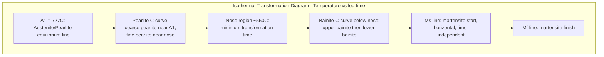

## Time-Temperature-Transformation Diagrams

### Definition and Purpose

A Time-Temperature-Transformation (TTT) diagram, also called an isothermal transformation (IT) diagram, plots the time required for a phase transformation to begin and complete at a series of constant (isothermal) holding temperatures, following rapid quench from the parent phase. TTT diagrams are the primary experimental/kinetic tool for predicting microstructure resulting from isothermal heat treatments, most classically for the austenite decomposition reactions in steel.

**Key Points**

- Axes: temperature (vertical, typically log or linear) vs. time (horizontal, always logarithmic, spanning seconds to days)
- Constructed by austenitizing a series of small specimens, rapidly quenching each to a chosen holding temperature, holding for varying times, then quenching to room temperature and examining the resulting microstructure (often supplemented by dilatometry or magnetic measurements to detect transformation onset/completion)
- Strictly valid only for **isothermal** holds — the diagram does not directly apply to continuous cooling (that requires a separate CCT diagram)

### General Diagram Features

**Key Points**

- **C-curve (nose) shape**: reflects the competing thermodynamic driving force (increasing with undercooling) and atomic mobility/diffusion (decreasing with undercooling), as derived from nucleation and growth theory
- **Start line**: time at which the transformation first becomes detectable (e.g., 1% transformed) at a given temperature
- **Finish line**: time at which transformation is essentially complete (e.g., 99% transformed) at that temperature
- **Nose (knee) of the C-curve**: the temperature of minimum transformation time — the most kinetically favorable temperature, where both driving force and diffusion rate are simultaneously favorable
- Above and below the nose, longer times are required to initiate transformation, approaching infinite time as temperature approaches the equilibrium transformation temperature (top) or as diffusion becomes negligibly slow (bottom, approaching $M_s$ region in steels)

### The Classic Steel TTT Diagram (Eutectoid Composition)

For a eutectoid (0.76 wt% C) plain carbon steel, austenitized and then isothermally held at various temperatures below A₁ (727°C):

**Key Points**

- **Just below A₁ (e.g., 650-700°C)**: coarse pearlite forms — large interlamellar spacing, relatively soft
- **Mid-range (e.g., 550-600°C, near the nose)**: fine pearlite forms — small interlamellar spacing, higher strength/hardness; fastest overall transformation kinetics
- **Below the pearlite nose (~550°C down to $M_s$)**: bainite forms instead of pearlite
  - **Upper bainite** (~400-550°C): feathery morphology, ferrite laths with cementite particles between laths
  - **Lower bainite** (~250-400°C): acicular (needle-like) morphology, fine carbides precipitated within the ferrite laths themselves, generally tougher than upper bainite at comparable strength
- **Below $M_s$ (martensite start temperature)**: austenite transforms to martensite **athermally** (time-independent, diffusionless, controlled only by temperature) rather than by nucleation-and-growth kinetics — martensite formation is NOT part of the C-curve and is represented as horizontal lines ($M_s$, $M_{50}$, $M_f$) on the diagram

### Why Martensite Differs from the C-Curve Reactions

**Key Points**

- Pearlite and bainite formation are diffusion-dependent, nucleation-and-growth transformations — hence time-dependent (C-curve behavior)
- Martensite formation is a diffusionless, shear-type (military) transformation — the fraction of martensite formed depends only on how far below $M_s$ the sample is cooled, not on time held at that temperature
- This is why $M_s$, $M_{50}$ (50% martensite), and $M_f$ (martensite finish) are drawn as horizontal lines on a TTT diagram rather than following the C-curve shape

### Bay Region and Diagram Shape Variants

**Key Points**

- In plain carbon eutectoid steels, the pearlite and bainite C-curves often merge into a single continuous curve
- In many alloy steels, a **"bay"** (region of relative kinetic stability) appears between the pearlite nose and the bainite nose, where austenite is comparatively slow to transform by either mechanism — this bay is exploited in practice to allow enough time for quenching operations (e.g., austempering, martempering) to reach the desired isothermal hold temperature before transformation begins
- [Inference] The presence and depth of the bay depends strongly on alloying content (particularly elements like Mo, Cr that retard pearlite formation more than bainite formation); the degree of separation is alloy-specific and generally determined experimentally rather than predicted from first principles alone

### Effect of Alloying Elements

**Key Points**

- Most substitutional alloying elements (Cr, Ni, Mo, Mn) shift the entire C-curve to **longer times** (to the right), improving hardenability by making it easier to bypass the nose with practical cooling rates
- Some elements (e.g., Co) can shift the curve to shorter times, reducing hardenability
- Alloying can also separate the pearlite and bainite noses into distinct curves with an intervening bay, as noted above
- Carbon content shifts $M_s$ and $M_f$ temperatures downward as carbon increases, and also affects the position and height of the C-curve nose

### Reading a TTT Diagram: Isothermal Heat Treatment Paths

**Example**

For a eutectoid steel treated by **austempering**:

1. Austenitize above A₁
2. Rapidly quench to an isothermal hold temperature within the bainite range (e.g., 350°C), fast enough to avoid crossing the pearlite C-curve
3. Hold isothermally until the bainite transformation start and finish lines are both crossed (fully bainitic)
4. Cool to room temperature (no further transformation occurs since austenite is already consumed)

Resulting microstructure: 100% bainite, avoiding the quench-crack risk associated with direct martensitic quenching while still achieving useful strength/toughness combinations.

**Example**

For **isothermal annealing**:

1. Austenitize above A₁
2. Rapidly quench to a temperature just below A₁ (e.g., 700°C)
3. Hold until pearlite start and finish lines are crossed
4. Cool to room temperature

Resulting microstructure: coarse pearlite, soft and machinable.

### TTT Diagram Schematic (Eutectoid Steel)

### Interpreting Cooling Curves Overlaid on TTT Diagrams

**Key Points**

- A cooling curve overlaid on the TTT diagram shows temperature vs. time for a given quench; wherever this curve intersects a C-curve start line, that transformation begins
- If the cooling curve avoids the nose entirely (cools fast enough to bypass the pearlite/bainite noses) and reaches $M_s$ while still fully austenitic, the result is **100% martensite**
- If the curve is slower and crosses into the pearlite or bainite field before reaching $M_s$, partial or complete diffusional transformation occurs first, and only the remaining untransformed austenite (if any) converts to martensite on further cooling — this can produce mixed microstructures (e.g., pearlite + martensite)
- **Critical cooling rate**: the minimum cooling rate that just avoids the nose of the C-curve, producing fully martensitic microstructure — this rate is a key hardenability metric

[Inference] Strictly, overlaying a continuous-cooling curve directly on a TTT (isothermal) diagram is an approximation; because continuous cooling changes temperature during the transformation itself rather than holding constant, the true continuous-cooling transformation start/finish times are shifted (generally to longer times, lower temperatures) relative to the isothermal TTT curve — this discrepancy is precisely why CCT diagrams are constructed separately for continuous-cooling process design, rather than relying on TTT diagrams directly for that purpose.

### TTT vs. CCT: Key Distinction

| Aspect | TTT Diagram | CCT Diagram |
| --- | --- | --- |
| Cooling condition | Isothermal hold | Continuous cooling |
| Primary use | Austempering, martempering, isothermal anneal design | Predicting microstructure from quenching/normalizing/air cooling |
| C-curve position | Reference/baseline | Shifted to longer times, slightly lower temperatures relative to TTT |
| Bainite nose | Often reachable | Often "cut off" — continuous cooling may bypass bainite formation entirely in plain carbon steels |

### Common Pitfalls

- Applying a TTT diagram directly to a continuously cooled process without accounting for the systematic shift relative to CCT behavior
- Assuming martensite formation is time-dependent like pearlite/bainite — it is athermal and diffusionless, governed by temperature alone (below $M_s$) not holding time
- Forgetting that the diagram assumes a specific prior austenitizing condition (grain size, homogeneity); coarser austenite grain size generally shifts C-curves to longer times (fewer heterogeneous nucleation sites at boundaries)
- Misreading the nose temperature as universal — its position is highly composition- and alloy-specific and must be read from the specific diagram for that steel grade
- Neglecting that TTT diagrams are constructed for one specific starting composition/austenitizing condition; they cannot be directly extrapolated to a different alloy without re-determination

**Related Topics**

- Continuous-Cooling-Transformation (CCT) Diagrams
- Nucleation and Growth Theory
- Martensitic Transformation Crystallography
- Hardenability and the Jominy End-Quench Test
- Austempering and Martempering Heat Treatments
- Bainite Microstructure: Upper vs. Lower Bainite