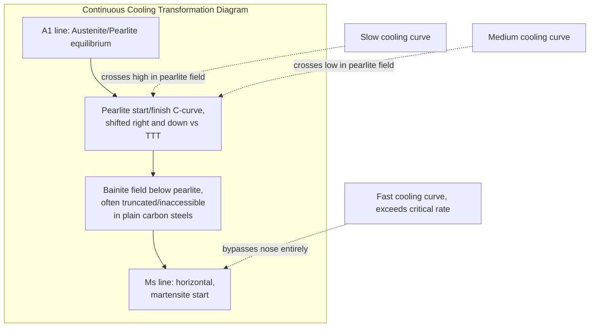

## Continuous Cooling Transformation Diagrams

### Definition and Purpose

A Continuous-Cooling-Transformation (CCT) diagram plots the transformation start and finish behavior of a parent phase (typically austenite) as it is cooled continuously at various controlled cooling rates, rather than held isothermally. CCT diagrams are the practically relevant tool for predicting microstructure resulting from real heat treatment processes — quenching, normalizing, air cooling, furnace cooling — since almost all industrial cooling operations are continuous rather than isothermal.

**Key Points**

- Axes: temperature (vertical) vs. time (horizontal, logarithmic), identical layout convention to TTT diagrams
- Constructed experimentally by cooling specimens at a series of constant (or characteristic industrial) cooling rates from the austenitizing temperature and recording transformation start/finish via dilatometry, thermal analysis, or interrupted quench-and-section metallography
- A family of cooling-rate curves (straight or curved lines from top-left to bottom-right, since temperature decreases as time increases) is superimposed on the diagram; each curve's intersections with the transformation fields indicate the resulting microstructure for that cooling rate

### Relationship to TTT Diagrams

**Key Points**

- CCT curves are derived from the same underlying nucleation-and-growth kinetics as TTT curves but are **not simply the same diagram reused** — because temperature changes continuously during transformation, the effective transformation start/finish times are shifted relative to the isothermal case
- **The CCT C-curve is shifted to longer times and slightly lower temperatures** compared to the corresponding TTT diagram for the same steel, because during continuous cooling, some time is spent at higher temperatures where nucleation is slower before reaching the more favorable (faster) transformation temperatures
- In many plain carbon steels, the bainite transformation field is **displaced or "cut off"** on the CCT diagram — continuous cooling curves that would intersect the pearlite field consume the remaining austenite before the cooling path can reach the bainite region, meaning bainite may not form at all under continuous cooling even though it appears reachable on the TTT diagram for the same steel
- [Inference] The degree of nose-shift and bainite field truncation is composition-dependent; in some alloy steels (particularly those with elements that separate the pearlite and bainite noses into distinct curves with an intervening bay) bainite remains readily accessible under continuous cooling, so this "cutoff" behavior should not be assumed universal without consulting the specific diagram

### General Diagram Features

**Key Points**

- **Pearlite field**: bounded by start and finish curves; slower cooling rates intersect at higher temperatures, producing coarse pearlite; faster rates intersect lower, producing fine pearlite
- **Bainite field**: below the pearlite field, may or may not be reachable depending on alloy and cooling rate, as noted above
- **$M_s$ line**: horizontal, marking the athermal martensite start temperature — reached whenever a cooling curve passes below this line while austenite remains untransformed
- **Critical cooling rate**: the specific cooling curve that just misses (is tangent to) the nose of the transformation C-curve; any faster cooling rate produces 100% martensite; any slower rate intersects the diffusional transformation field and produces some fraction of pearlite/bainite before the remainder (if any) transforms to martensite

### Reading a CCT Diagram: Cooling Rate to Microstructure

**Example**

For a eutectoid plain-carbon steel CCT diagram with several superimposed cooling curves (e.g., corresponding to furnace cooling, air cooling, oil quench, water quench):

1. **Slowest curve (furnace cooling)**: intersects the pearlite field at high temperature → coarse pearlite, fully transformed before reaching lower temperatures
2. **Intermediate curve (air cooling/normalizing)**: intersects the pearlite field at a somewhat lower temperature → finer pearlite
3. **Faster curve (oil quench)**: may partially intersect the pearlite/bainite field, transforming only part of the austenite, with the remainder transforming to martensite below $M_s$ → mixed pearlite (or bainite) + martensite microstructure
4. **Fastest curve (water quench), exceeding critical cooling rate**: bypasses the nose entirely, remains fully austenitic until reaching $M_s$ → fully martensitic microstructure

### Diagram Schematic

### Critical Cooling Rate and Hardenability

**Key Points**

- The critical cooling rate is a key quantitative hardenability parameter: steels with C-curves shifted further right (via alloying) have **lower** critical cooling rates, meaning slower, more practical cooling (e.g., oil or even air quench) is sufficient to achieve a fully martensitic structure
- This directly connects CCT behavior to the Jominy end-quench hardenability test, where the range of cooling rates experienced along the bar length corresponds to different positions on the CCT diagram, producing a hardness profile that reflects the same underlying transformation kinetics
- Section size effects (thick vs. thin parts) matter because different locations within a real component cool at different rates (surface faster, core slower); a single component can therefore exhibit a range of microstructures/hardness from surface to center predictable via the CCT diagram combined with knowledge of local cooling rate at each location

### Effect of Alloying Elements

**Key Points**

- Same general trends as for TTT diagrams: most substitutional alloying elements (Cr, Ni, Mo, Mn) shift CCT curves to longer times, lowering the critical cooling rate and improving hardenability (ability to form martensite even at slower, more practical cooling rates, and in thicker sections)
- Alloying can also affect whether the bainite field remains accessible under continuous cooling or is effectively cut off by the pearlite reaction consuming the austenite first
- Grain size of the prior austenite also shifts the CCT curve position: coarser austenite grains (fewer boundary nucleation sites) shift curves to longer times, similarly improving hardenability by making martensite easier to achieve — [Inference] though coarse grain size is generally undesirable for toughness, so this hardenability benefit is normally balanced against other property requirements in alloy/process design rather than exploited in isolation

### Practical Application: Process Design

**Example**

Selecting a quenchant for a given steel and section size using a CCT diagram:

1. Determine the actual cooling rate the component's critical section (often the slowest-cooling location, e.g., the center of a thick section) will experience for candidate quenching media (water, oil, air, polymer quenchant)
2. Overlay or compare this cooling rate against the CCT diagram's critical cooling rate
3. Select the mildest quenchant whose cooling rate still exceeds the critical rate at the critical section — this minimizes quench-related distortion and cracking risk while still achieving the required martensitic (or bainitic, for lower-risk applications) microstructure
4. If no practical quenchant achieves adequate cooling rate at the section's core, alloy substitution (higher hardenability grade) is typically required rather than more aggressive quenching, which would risk cracking

### Common Pitfalls

- Using a TTT diagram to predict continuous-cooling microstructure directly — the curves are shifted and the bainite field may behave very differently
- Assuming a specific cooling medium (e.g., "oil quench") always intersects the same location on every steel's CCT diagram — the required cooling rate to avoid the nose is alloy-specific, so the same quenchant can produce martensite in one grade and pearlite/bainite mixtures in another
- Neglecting section-size/location effects — a single quenching operation can produce different CCT-predicted microstructures at the surface versus the core of the same part due to differing local cooling rates
- Forgetting that $M_s$ itself is composition-dependent (particularly carbon content) and is not identical across different steel grades even when the diagrams look superficially similar
- Assuming bainite is always accessible under continuous cooling — in many plain carbon steels it is effectively bypassed, unlike on the corresponding TTT diagram

**Related Topics**

- Time-Temperature-Transformation (TTT) Diagrams
- Hardenability and the Jominy End-Quench Test
- Quenching Media Selection and Quench Severity
- Martensitic Transformation and Tempering
- Section-Size Effects in Heat-Treated Components
- Nucleation and Growth Theory