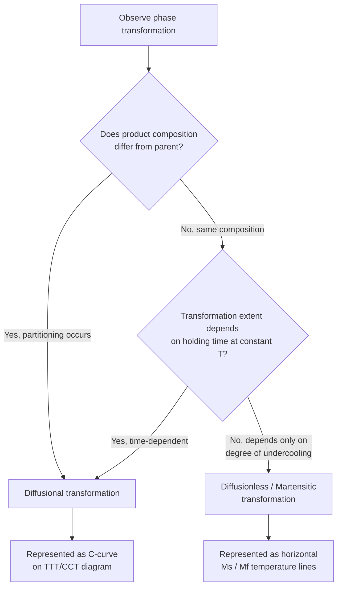

## Diffusional versus Diffusionless Transformations

### Definition and Scope

Solid-state phase transformations are broadly classified by whether long-range atomic diffusion is required to accomplish the compositional and structural change from parent to product phase. This classification is fundamental because it determines the transformation's kinetics (time-dependent vs. temperature-dependent only), its response to cooling rate, the resulting microstructural morphology, and which type of transformation diagram (TTT/CCT vs. temperature-only) is appropriate for prediction.

**Key Points**

- **Diffusional transformations**: proceed via long-range atomic movement (substitutional or interstitial diffusion), are inherently time-dependent, and can be suppressed by sufficiently rapid cooling
- **Diffusionless transformations**: proceed via coordinated, short-range atomic shear/shuffle with no compositional change and no long-range diffusion; occur essentially instantaneously once a critical temperature is reached, and cannot be suppressed by cooling rate alone (only by preventing the parent phase from reaching the transformation temperature, e.g., by transforming it first via a diffusional path)

### Diffusional Transformations: Characteristics

**Key Points**

- Require atoms to migrate over distances typically much larger than one interatomic spacing to achieve the compositional partitioning between product phases
- Rate-limited by atomic mobility (diffusion coefficient $D$), which is strongly temperature-dependent via an Arrhenius relationship: $D=D_0\exp(-Q/RT)$
- Governed by classical nucleation and growth theory; transformation extent follows the JMAK (Avrami) equation, $y=1-\exp(-kt^n)$, and is explicitly time-dependent at a given temperature
- Represented on **TTT/CCT diagrams**, since the transformation fraction depends on both time and temperature
- Product phases generally differ in composition from the parent phase (partitioning occurs)

**Example**

Pearlite formation in steel ($\gamma\rightarrow\alpha+Fe_3C$) is a classic diffusional transformation: carbon must partition between the low-carbon ferrite (0.022 wt% C) and high-carbon cementite (6.67 wt% C) lamellae, requiring substantial interstitial carbon diffusion. Holding at a given temperature for longer times allows more transformation; the reaction can be entirely suppressed by cooling fast enough to bypass the pearlite C-curve nose.

### Diffusionless (Martensitic) Transformations: Characteristics

**Key Points**

- Atoms move cooperatively by less than one interatomic spacing, via a coordinated shear (military) mechanism, preserving nearest-neighbor relationships — no long-range diffusion, no compositional change (product has the same composition as parent)
- Occurs athermally: the transformed fraction depends only on **how far below the start temperature** ($M_s$ in steels) the material is cooled, not on time held at any given temperature
- Extremely rapid — transformation velocities approach the speed of sound in the material; individual martensite plates/laths form in fractions of a microsecond
- Cannot be represented meaningfully on a time-axis diagram; instead shown as **horizontal, temperature-only lines** ($M_s$, $M_{50}$, $M_f$) on TTT/CCT diagrams, since time plays no role
- Produces characteristic morphologies (plates, laths) with distinctive crystallographic orientation relationships (habit planes) between parent and product lattices, rather than the lamellar or particulate morphologies typical of diffusional products

**Example**

Martensite formation in steel ($\gamma\rightarrow\alpha'$, supersaturated body-centered tetragonal) occurs by diffusionless shear as austenite is cooled below $M_s$. The carbon originally dissolved in the FCC austenite has no time to diffuse out and remains trapped interstitially, distorting the BCC lattice into body-centered tetragonal and producing the characteristic high hardness of untempered martensite. Because no diffusion occurs, martensite has the *same overall carbon content* as the parent austenite from which it formed.

### Comparative Table

| Aspect | Diffusional | Diffusionless (Martensitic) |
| --- | --- | --- |
| Atomic mechanism | Long-range diffusion (substitutional/interstitial) | Coordinated shear, <1 interatomic spacing |
| Composition change | Yes, partitioning between phases | No, product matches parent composition |
| Time dependence | Strong (rate = f(time, temperature)) | None (athermal; f(temperature) only) |
| Representation | TTT/CCT C-curves | Horizontal $M_s$/$M_f$ lines |
| Suppressible by fast cooling? | Yes (bypass the nose) | No (only by avoiding the parent phase reaching $M_s$ region while untransformed, which is itself irrelevant since martensite forms *because* cooling reaches $M_s$) |
| Typical rate | Seconds to hours (temperature-dependent) | Near-instantaneous (~sound velocity) |
| Example product | Pearlite, bainite (partially), proeutectoid ferrite/cementite | Martensite (steel), shape-memory alloy product phase |

### The Intermediate Case: Bainite

**Key Points**

- Bainite formation is often described as having **mixed character**: the ferritic component forms via a diffusionless (shear) mechanism similar to martensite, but is followed or accompanied by diffusional carbon partitioning to precipitate carbides
- [Inference] The precise mechanistic classification of bainite (fully diffusional nucleation-and-growth vs. displacive ferrite formation with diffusional carbide precipitation) has historically been, and to some extent remains, a debated topic in physical metallurgy; the "displacive with diffusional carbide formation" description is the more widely taught model but should not be presented as a fully settled mechanistic consensus
- Practically, bainite is treated as time-and-temperature dependent (hence it appears on TTT/CCT C-curves like pearlite) despite its partial diffusionless character, because the overall transformation rate is still governed by the diffusional carbide precipitation step

### Reversibility

**Key Points**

- Many diffusionless transformations are **crystallographically reversible** — cooling below $M_s$ produces the product phase, and upon reheating above a reverse transformation temperature ($A_s$/$A_f$), the parent phase can be recovered with minimal or no net atomic rearrangement beyond the reverse shear. This reversibility underlies **shape-memory alloys** (e.g., Ni-Ti/Nitinol), where the diffusionless austenite↔martensite transformation is exploited for shape recovery and superelasticity
- Diffusional transformations are generally **not directly reversible** in this crystallographic sense — reheating a diffusional product (e.g., pearlite) back through the transformation temperature does not simply reverse the original shear path; instead, it proceeds via a new nucleation-and-growth sequence (e.g., pearlite → austenite on reheating, itself also diffusional)

### Decision Flow: Classifying a Transformation

### Practical Consequences for Heat Treatment

**Key Points**

- Diffusional transformations can be **suppressed** by sufficiently rapid quenching (bypassing the C-curve nose), enabling retention of the parent phase (e.g., retained austenite) or forcing the diffusionless pathway (martensite) instead
- Diffusionless transformations **cannot be suppressed by cooling rate** — once temperature drops below $M_s$, martensite forms essentially instantly regardless of how fast or slow the cooling through that specific temperature range occurs; the only way to avoid it is to prevent the parent phase from being present when $M_s$ is reached (e.g., by first transforming it diffusionally to pearlite/bainite via a slow cool or isothermal hold at higher temperature)
- This asymmetry is the basis for heat treatments like austempering (deliberately using an isothermal diffusional/bainitic hold to obtain bainite instead of the diffusionless martensite pathway) and interrupted quenching (martempering), which manage the interaction between the two transformation types

### Common Pitfalls

- Assuming all solid-state transformations can be predicted purely from a time-temperature (TTT/CCT-style) diagram — diffusionless transformations require a fundamentally different (temperature-only) representation
- Believing martensite formation can be slowed or suppressed by controlling cooling rate through the $M_s$-$M_f$ range — it cannot; only preventing austenite from reaching that temperature range untransformed can avoid martensite
- Treating bainite as purely diffusional or purely diffusionless — it exhibits genuinely mixed character and is best understood as an intermediate case
- Assuming diffusionless transformations always involve no property change relative to the parent — despite no compositional change, martensite in steel is dramatically harder than austenite due to lattice distortion (supersaturated interstitial carbon) and substructure (high dislocation/twin density), not compositional partitioning
- Confusing "diffusionless" with "instantaneous and complete at any undercooling" — the *fraction transformed* still depends on how far below $M_s$ the material is cooled (via the $M_s$-$M_{50}$-$M_f$ progression), even though it does not depend on time

**Related Topics**

- Martensitic Transformation Crystallography and Habit Planes
- Time-Temperature-Transformation (TTT) Diagrams
- Continuous-Cooling-Transformation (CCT) Diagrams
- Bainite Formation Mechanisms (Upper and Lower Bainite)
- Shape-Memory Alloys and Superelasticity
- Nucleation and Growth Theory