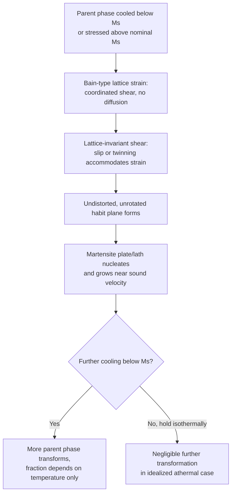

## Martensitic Transformations

### Definition and Scope

A martensitic transformation is a diffusionless, shear-dominated solid-state phase transformation in which the crystal structure changes via cooperative, coordinated atomic movements of less than one interatomic spacing, with no long-range diffusion and no change in chemical composition between parent and product phases. The term originates from steel metallurgy (martensite, named after Adolf Martens) but the mechanism is general and occurs in numerous non-ferrous systems, ceramics, and shape-memory alloys.

**Key Points**

- Parent phase (in steel: austenite, FCC) transforms to product phase (in steel: martensite, body-centered tetragonal) via a **shear-dominant lattice distortion**, not nucleation-and-growth diffusion
- Transformation is **athermal**: the fraction transformed depends only on the degree of undercooling below the start temperature $M_s$, not on time held at any given temperature
- Occurs at extremely high velocity, with individual martensite units (plates or laths) forming in microseconds, at speeds approaching the speed of sound in the material
- No compositional partitioning occurs — the product phase inherits the exact same overall composition as the parent

### Crystallographic Framework: The Bain Strain (Steel Example)

**Key Points**

- The **Bain model** describes the minimum-strain path for transforming FCC austenite into BCT (body-centered tetragonal) martensite via a homogeneous lattice deformation, without requiring atoms to break and reform bonds via diffusion
- The FCC unit cell contains an embedded, distorted BCT cell; compression along one axis and expansion along the other two converts this embedded cell into the martensite BCT structure
- Carbon atoms originally dissolved interstitially in FCC octahedral sites become trapped in specific octahedral sites of the BCT lattice upon transformation, causing the characteristic **tetragonal distortion** ($c/a>1$) that scales with carbon content
- [Inference] The Bain strain alone does not fully describe the observed habit plane and orientation relationships seen experimentally; actual martensitic transformation additionally involves lattice-invariant shear (slip or twinning) superimposed on the Bain strain to minimize the overall strain energy and produce an undistorted, unrotated habit plane — this more complete phenomenological theory (e.g., Wechsler-Lieberman-Read or Bowles-Mackenzie theory) is more mathematically involved than the basic Bain model typically introduced first

### Habit Plane and Orientation Relationships

**Key Points**

- The **habit plane** is the crystallographic plane along which the martensite plate/lath forms and lies, remaining essentially undistorted and unrotated relative to the parent lattice — this macroscopic invariant plane is a defining geometric feature of martensitic transformations
- Specific **orientation relationships** (e.g., Kurdjumov-Sachs, Nishiyama-Wassermann in steels) describe the crystallographic correspondence between parent and product lattice directions/planes, reflecting the coordinated (non-random) nature of the atomic shear
- These orientation relationships and habit planes are experimentally measurable via electron diffraction and are used to distinguish martensitic transformations from diffusional ones, which show no such fixed crystallographic correspondence

### Athermal Kinetics: $M_s$, $M_{50}$, $M_f$

**Key Points**

- $M_s$ (martensite start): the temperature at which martensite first begins to form on cooling
- $M_{50}$: temperature at which 50% of the parent phase has transformed
- $M_f$ (martensite finish): temperature at which transformation is essentially complete (in practice, some retained parent phase, e.g., retained austenite, often persists even below $M_f$ due to stabilization effects)
- Because the transformation is athermal, these are represented as **horizontal, temperature-only lines** on TTT/CCT diagrams — time plays no role in determining the transformed fraction at a given temperature
- Holding at any temperature between $M_s$ and $M_f$ for extended time does **not** increase the transformed fraction (in the idealized case); only further cooling does — though some real systems show minor isothermal martensite formation as a secondary, time-dependent addition to the dominant athermal component

### Composition Dependence of $M_s$ (Steel)

**Key Points**

- $M_s$ decreases with increasing carbon content and with most substitutional alloying additions (Mn, Cr, Ni, Mo) — higher-alloy steels require deeper undercooling to begin martensite formation
- Empirical relationships (e.g., the Andrews equation) are commonly used to estimate $M_s$ from composition for plain and low-alloy steels; [Inference] such empirical formulas are fitted to specific composition ranges and steel families, so extrapolation outside their validated range carries increasing uncertainty
- Very high carbon or highly alloyed compositions can depress $M_s$ (and especially $M_f$) below room temperature, leading to significant **retained austenite** in the as-quenched microstructure — a practically important consideration since retained austenite is typically softer and can be dimensionally unstable (transforming further under subsequent stress or cold treatment)

### Microstructural Morphology

**Key Points**

- **Lath martensite**: forms in low-to-medium carbon steels (typically <0.6 wt% C); parallel packets of fine laths, relatively high toughness for a given hardness
- **Plate (lenticular) martensite**: forms in higher-carbon and many alloy steels; individual plates form at various orientations, often containing internal twinning as the lattice-invariant shear mode, generally more brittle than lath martensite at comparable hardness
- Substructure (dislocation density in lath martensite, internal twinning in plate martensite) is the primary strengthening mechanism, in addition to interstitial solid-solution (carbon) strengthening — this combination is what makes untempered martensite extremely hard but also brittle

### Effect on Mechanical Properties

**Key Points**

- As-quenched martensite is characteristically very hard and brittle, due to the combination of supersaturated interstitial carbon (solid-solution strengthening/lattice distortion) and high internal defect density (dislocations/twins) from the shear transformation
- Because of this brittleness, martensite is almost never used in the as-quenched condition for structural applications — **tempering** (reheating below $A_1$) is used to allow limited diffusion of carbon out of solution, forming fine carbides and relieving internal stresses, trading some hardness for substantially improved toughness
- The degree of tempering response depends on the original martensite morphology, carbon content, and alloying (some alloying elements produce **secondary hardening** during tempering via alloy carbide precipitation)

### Stress-Assisted and Strain-Induced Martensite

**Key Points**

- Applied stress can shift the effective $M_s$ temperature upward, allowing martensite to form above the nominal (stress-free) $M_s$ — this is termed **stress-assisted martensite**
- In some systems (notably metastable austenitic stainless steels and TRIP steels), plastic deformation itself can directly induce martensite formation even well above $M_s$, termed **strain-induced martensite** — this underlies the TRIP (transformation-induced plasticity) strengthening mechanism, where deformation-triggered martensite formation absorbs energy and delays necking, improving both strength and ductility simultaneously

### Reversibility and Shape-Memory Behavior

**Key Points**

- Many martensitic transformations are crystallographically **reversible**: heating the product phase above a reverse-transformation start temperature ($A_s$) and finish temperature ($A_f$) recovers the parent phase via the reverse shear pathway
- This reversibility, combined with the coordinated (non-diffusional) nature of the transformation, underlies **shape-memory alloys** (e.g., Ni-Ti/Nitinol, Cu-Zn-Al): deformation of the martensitic (low-temperature) phase can be recovered by heating above $A_f$, restoring the original parent-phase shape
- **Superelasticity** (pseudoelasticity) arises when stress-induced martensite forms and reverts upon unloading at a temperature above $A_f$, producing large recoverable strains without permanent plastic deformation — a direct mechanical consequence of the reversible martensitic transformation mechanism

### Non-Ferrous and Non-Metallic Examples

**Key Points**

- **Ni-Ti (Nitinol)**: cubic B2 (austenite) ↔ monoclinic B19' (martensite), exploited for medical devices (stents, orthodontic wires) and actuators
- **Zirconia (ZrO₂) ceramics**: tetragonal-to-monoclinic martensitic transformation is exploited in **transformation-toughened zirconia**, where stress at a crack tip induces local martensitic transformation with an associated volume expansion that places the crack tip in compression, impeding crack propagation
- [Inference] While the same general diffusionless/shear framework applies across these systems, the specific crystallography, transformation temperatures, and hysteresis behavior differ substantially by material system and should not be assumed transferable from the steel case without system-specific data

### Transformation Mechanism Summary

### Common Pitfalls

- Assuming martensite formation can be controlled or slowed via cooling rate through the $M_s$-$M_f$ range — it is athermal, not time-dependent, so rate through that range does not affect the fraction transformed at a given temperature (only the final temperature reached matters)
- Believing martensite always has a fixed composition equal to the alloy's nominal composition — this is true only in the sense that no partitioning occurs *during* the transformation itself; the parent phase composition just prior to transformation (which may have been altered by prior diffusional reactions) is what carries over
- Confusing tempering (a subsequent diffusional treatment applied to already-formed martensite) with the martensitic transformation itself (which remains diffusionless)
- Treating $M_s$ as a fixed material constant independent of stress state — stress-assisted and strain-induced martensite formation are well-documented deviations from the nominal thermal $M_s$
- Assuming all martensitic transformations are irreversible — many are fully reversible and this reversibility is the basis of shape-memory and superelastic behavior

**Related Topics**

- Diffusional versus Diffusionless Transformations
- Time-Temperature-Transformation (TTT) Diagrams
- Tempering of Martensite and Secondary Hardening
- Shape-Memory Alloys and Superelasticity
- TRIP Steels and Transformation-Induced Plasticity
- Retained Austenite and Cryogenic Treatment