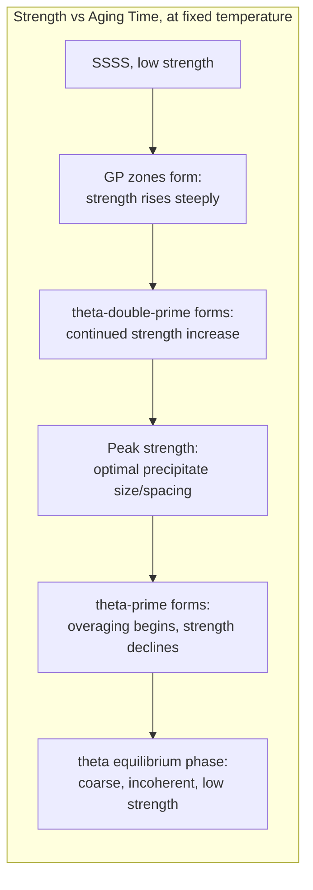

## Precipitation and Age Hardening Kinetics

### Definition and Scope

Precipitation (age) hardening is a strengthening mechanism in which a supersaturated solid solution decomposes over time to form a fine dispersion of second-phase particles that impede dislocation motion. The kinetics of this decomposition — nucleation, growth, and coarsening of the precipitate sequence — determine the resulting strength, and the process is deliberately controlled through a solution treatment, quench, and aging heat-treatment sequence.

**Key Points**

- Requires an alloy system with a solubility limit that **decreases with decreasing temperature**, so that a phase soluble at high temperature becomes supersaturated on rapid cooling
- Three-step process: (1) **solution treatment** — heat into the single-phase field to dissolve the solute; (2) **quench** — rapid cool to retain a supersaturated solid solution (SSSS) at room temperature; (3) **aging** — reheat to an intermediate temperature (or hold at room temperature, "natural aging") to allow controlled precipitation
- Classic systems: Al-Cu, Al-Zn-Mg, Al-Mg-Si (aerospace/structural aluminum alloys), Ni-based superalloys (γ' precipitation), Cu-Be, some Mg alloys

### Requirement: Decreasing Solubility with Temperature

**Key Points**

- The relevant phase diagram region must show a solvus line sloping such that solid solubility of the solute in the matrix decreases as temperature drops
- At the solution treatment temperature, the alloy composition lies within the single-phase (α) field; upon quenching to room temperature, the same composition lies within the α+β two-phase field at equilibrium, but the quench is too fast for the equilibrium second phase to form — producing a metastable, supersaturated single-phase solid solution
- This supersaturation is the thermodynamic driving force for subsequent precipitation during aging

### Precipitation Sequence (Classic Al-Cu Example)

Precipitation rarely proceeds directly to the equilibrium phase; instead it typically passes through a sequence of metastable transition structures, each providing progressively different strengthening contributions:

$$SSSS\rightarrow GP\ zones\rightarrow\theta''\rightarrow\theta'\rightarrow\theta\ (Al_2Cu,\ equilibrium)$$

**Key Points**

- **GP (Guinier-Preston) zones**: fully coherent, solute-rich clusters/plates, only a few atomic layers thick, forming very early in aging with minimal interfacial energy penalty (full coherency)
- **θ'' (intermediate)**: larger, still coherent, more ordered transition structure
- **θ' (intermediate)**: semi-coherent, larger particles, partial loss of coherency strain
- **θ (Al₂Cu, equilibrium)**: fully incoherent equilibrium precipitate, largest particle size, least effective strengthener per unit volume fraction
- Each transition structure has a different, generally lower, interfacial and strain energy barrier to nucleation than the equilibrium phase directly, which is why the sequence proceeds through metastable states rather than nucleating the equilibrium phase immediately — [Inference] this preference for sequential metastable-phase nucleation is generally explained by classical nucleation theory (lower effective $\Delta G^*$ for coherent, low-interfacial-energy structures), though the full sequence and relative stability of each transition phase is alloy-system-specific and determined experimentally

### Coherency and Strengthening Mechanisms

**Key Points**

- **Fully coherent** precipitates (e.g., GP zones): lattice planes continuous across the interface, but the mismatch in atomic spacing between precipitate and matrix creates a **coherency strain field** extending into the surrounding matrix
- **Semi-coherent** precipitates: partial lattice matching maintained via periodic interfacial dislocations, some coherency strain relieved
- **Incoherent** precipitates (equilibrium phase): no lattice continuity across the interface, minimal coherency strain, but larger particle size and interparticle spacing
- Dislocations interact with precipitates via two competing mechanisms depending on coherency and size:
  - **Shearing** (cutting through coherent/semi-coherent precipitates): dominant when precipitates are small and coherent, requires overcoming coherency strain and/or order-strengthening (for ordered precipitates)
  - **Bowing/looping (Orowan mechanism)**: dominant when precipitates are larger and incoherent, dislocations bow around particles and leave behind dislocation loops, with resistance inversely proportional to interparticle spacing

### The Overaging Phenomenon and Peak Strength

**Key Points**

- Strength initially **increases** with aging time/temperature as the precipitate density and strengthening contribution build up (coherent GP zones and early transition structures)
- Strength reaches a **peak** at some intermediate aging condition — this represents the optimal balance where precipitates are numerous, small, and provide maximum resistance to dislocation motion (often corresponding to a transition between shearing-dominated and looping-dominated mechanisms)
- Beyond the peak, strength **decreases** with continued aging — this is **overaging**, caused by precipitate coarsening (Ostwald ripening): larger precipitates grow at the expense of smaller ones (reducing total particle number density and increasing interparticle spacing), driven by minimization of total interfacial energy, ultimately transitioning to the incoherent equilibrium phase which is a comparatively weak strengthener due to large spacing

### Aging Curve: Hardness/Strength vs. Time

### Temperature-Time Interdependence

**Key Points**

- Higher aging temperatures accelerate all stages of the sequence (faster diffusion), reaching peak strength sooner, but often at a **lower peak strength** than a lower-temperature aging treatment, because faster kinetics tend to favor coarser precipitate distributions and can partially bypass the finest, most effective transition structures
- Lower aging temperatures produce slower kinetics, longer times to peak strength, but can achieve a **higher peak strength** due to finer, more numerous precipitates forming before coarsening becomes significant
- **Natural aging** (room temperature): occurs over days to years in some alloys (e.g., Al-Cu alloys continue to naturally age significantly after quenching), relevant to structural stability of components in service
- **Artificial aging**: deliberate reheating to an intermediate temperature (commonly 120-200°C for aluminum alloys) to accelerate the process to a practical industrial timescale

### Retrogression and Re-Aging (RRA)

**Key Points**

- A specialized processing sequence used in some high-strength aluminum alloys: a peak-aged (T6) component is briefly exposed to a higher "retrogression" temperature (partially dissolving/modifying the finest precipitates without fully reverting to solid solution), then re-aged at the original lower temperature
- [Inference] RRA is reported to improve stress-corrosion cracking resistance relative to T6 while retaining strength closer to peak-aged levels, though the precise microstructural mechanism and the degree of benefit are alloy- and process-specific and are typically validated experimentally for a given component rather than assumed universally applicable

### Nucleation and Growth Kinetics Applied to Aging

**Key Points**

- The overall aging kinetics follow the same JMAK/Avrami-type sigmoidal transformation behavior as other nucleation-and-growth transformations, though "transformation fraction" here refers to precipitate volume fraction formed, and the practically relevant output is usually hardness/strength rather than phase fraction directly
- GP zone formation is often **homogeneous** nucleation (uniformly distributed through the matrix, since coherency strain minimizes the interfacial energy penalty sufficiently for bulk nucleation to be competitive)
- Later transition structures and the equilibrium phase more commonly nucleate **heterogeneously**, at dislocations, grain boundaries, or on existing GP zones/earlier transition-phase particles, consistent with the generally higher interfacial energy of less-coherent structures
- Quench rate strongly affects subsequent aging kinetics: insufficient quench rate allows some precipitation to occur during cooling itself (rather than being fully retained as SSSS), consuming solute and reducing the supersaturation available for controlled aging — this is why solution-treated alloys are typically specified with a required minimum quench rate

### Practical Engineering Applications

**Key Points**

- **Al 2xxx series** (Al-Cu, e.g., 2024): aerospace structural applications, classic GP zone → θ' → θ sequence
- **Al 6xxx series** (Al-Mg-Si): automotive/architectural extrusions, moderate strength with good formability and corrosion resistance, precipitation sequence involves Mg-Si co-clusters and β'/β'' transition phases
- **Al 7xxx series** (Al-Zn-Mg-Cu, e.g., 7075): highest-strength aerospace aluminum alloys, η'/η precipitation sequence
- **Ni-based superalloys**: γ' (Ni₃Al, ordered L1₂ coherent precipitate) provides exceptional high-temperature strength retention in turbine components; unlike aluminum alloys, γ' remains largely coherent and stable to very high service temperatures, which is central to superalloy performance
- **Temper designations** (aluminum): T4 (naturally aged/solution treated), T6 (artificially aged to peak strength), T7 (overaged, for improved stress-corrosion resistance at some cost to peak strength)

### Common Pitfalls

- Assuming maximum aging time always produces maximum strength — overaging reduces strength past the peak
- Confusing coherent strengthening (shearing mechanism, favors small closely-spaced particles) with Orowan strengthening (bowing mechanism, favors larger widely-spaced particles) — these represent opposite trends with respect to particle size, and the aging curve peak often corresponds to the transition point between them
- Treating the precipitation sequence as alloy-independent — the specific transition phases (GP zones, θ'', θ', etc.) and their designations are system-specific and do not directly transfer between alloy families (e.g., Al-Cu vs. Al-Mg-Si sequences differ)
- Neglecting natural aging effects — some alloys continue to age significantly at room temperature after quenching, which can affect formability (if forming is delayed after quench) or final properties if not accounted for in process scheduling
- Assuming higher aging temperature always reaches higher strength faster — it typically reaches peak strength faster but often at a lower peak value than optimized lower-temperature aging

**Related Topics**

- Nucleation and Growth Theory
- Dislocation-Precipitate Interaction Mechanisms (Orowan, Shearing)
- Solid-Solution Strengthening
- Aluminum Alloy Temper Designations (T4, T6, T7)
- Ni-Based Superalloy Microstructure and Gamma-Prime Strengthening
- Overaging and Stress-Corrosion Cracking Resistance