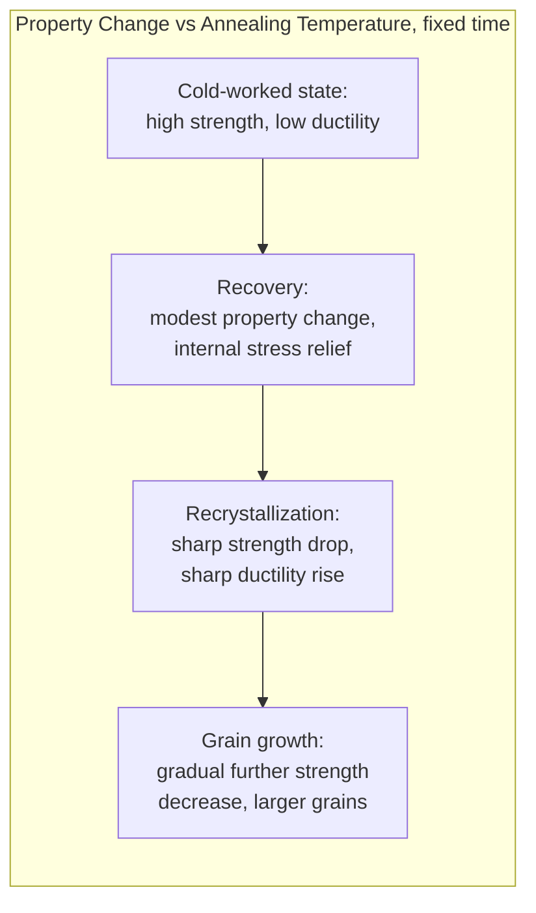
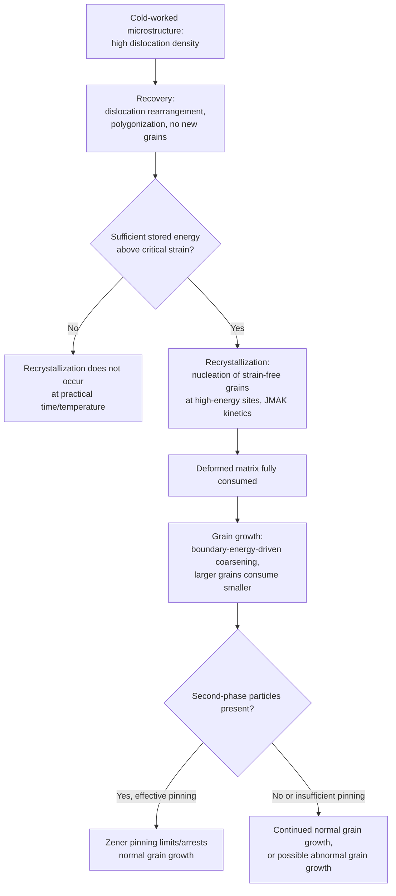

## Recovery, Recrystallization, and Grain Growth

### Definition and Scope

Recovery, recrystallization, and grain growth are the three sequential (though sometimes overlapping) thermally activated processes by which a cold-worked (plastically deformed) metal reduces its stored strain energy upon annealing. Together they describe the full restoration sequence from a high-dislocation-density deformed state back toward a lower-energy, strain-free microstructure, and they govern the final grain size, texture, and mechanical properties of wrought and annealed metal products.

**Key Points**

- Driving force for all three processes is the reduction of stored energy: dislocation strain energy (recovery, recrystallization) and grain boundary surface energy (grain growth)
- The three stages occur in sequence with increasing time/temperature during annealing, though recovery and early recrystallization can overlap somewhat
- Occurs in essentially all metals following cold working (rolling, drawing, forging below the recrystallization temperature) as part of standard processing to restore ductility for further forming or to achieve target final properties

### Cold Work and Stored Energy

**Key Points**

- Plastic deformation at temperatures below roughly 0.3-0.4 $T_m$ (homologous temperature, where $T_m$ is absolute melting point) increases dislocation density dramatically (from ~10⁶-10⁸ mm⁻² in annealed metal to ~10¹²-10¹⁴ mm⁻² after heavy cold work) and introduces other defects (vacancies, stacking faults, deformation twins in some metals)
- This stored energy (a few percent of the total deformation work, the majority being dissipated as heat) is the thermodynamic driving force for subsequent annealing behavior
- Cold work increases strength and hardness (strain/work hardening) while decreasing ductility — annealing restores ductility at the cost of the cold-worked strength increment

### Stage 1: Recovery

**Key Points**

- Occurs at relatively low annealing temperatures, before recrystallization begins
- Involves **rearrangement and partial annihilation of dislocations** without migration of high-angle grain boundaries — no new strain-free grains form
- Key sub-mechanisms: annihilation of dislocations of opposite sign, **polygonization** (dislocations rearrange into low-angle sub-boundaries, forming a subgrain structure), and point-defect (vacancy) annihilation
- Mechanical property changes during recovery are relatively modest — some reduction in strength/hardness and increase in ductility, but most of the cold-worked strength is retained
- Electrical conductivity and some physical properties can recover substantially even during this stage, since point-defect annihilation strongly affects electron scattering, while mechanical strength (governed more by dislocation density/arrangement) changes less dramatically
- Recovery is useful industrially as **stress-relief annealing** — reducing internal stresses and improving dimensional stability/corrosion resistance while largely retaining the cold-worked strength level

### Stage 2: Recrystallization

**Key Points**

- Involves **nucleation and growth of new, strain-free grains** within the deformed (or recovered/polygonized) microstructure, consuming the high-dislocation-density matrix
- New grains nucleate preferentially at regions of highest local stored energy/lattice curvature: existing grain boundaries, deformation bands, and other heterogeneities — this is a heterogeneous nucleation process, directly analogous to heterogeneous nucleation in other phase transformations
- Growth of the new grains proceeds by migration of high-angle grain boundaries, consuming the surrounding deformed matrix, driven by the stored strain energy difference (strain-free new grain vs. highly dislocated deformed matrix) rather than by grain-boundary-energy minimization (which becomes the dominant driving force only later, in grain growth)
- Follows classic nucleation-and-growth (JMAK/Avrami) sigmoidal kinetics, since it is a genuine nucleation-and-growth transformation, just entirely within one solid phase
- Produces a **dramatic drop in strength/hardness and increase in ductility**, since dislocation density falls essentially back to annealed levels once recrystallization is complete

### Recrystallization Temperature

**Key Points**

- The recrystallization temperature is **not a fixed physical constant** but is conventionally defined as the temperature at which a given material recrystallizes to completion in approximately one hour under specified conditions — it is process- and definition-dependent, not an intrinsic thermodynamic transition temperature (unlike, e.g., a melting point)
- Commonly approximated as roughly 0.3-0.5 $T_m$ (absolute homologous temperature) for pure metals, though this is a rule of thumb rather than a precise prediction
- **Key factors lowering recrystallization temperature**: increasing prior cold work (more stored energy, more nucleation sites), higher purity (fewer solute atoms to pin boundaries/dislocations), and larger initial grain size effects vary by mechanism
- **Key factors raising recrystallization temperature**: alloying/solute additions (solute drag on migrating boundaries and dislocations), second-phase particles (Zener pinning of boundaries), lower prior cold work
- A **minimum critical amount of prior cold work** (typically a few percent strain) is required for recrystallization to occur at all within practical time/temperature ranges — insufficient stored energy cannot drive nucleation of new grains

### Effect of Cold Work Amount on Recrystallized Grain Size

**Key Points**

- Greater prior cold work generally produces a **finer recrystallized grain size**, because higher stored energy increases the nucleation rate more than it increases the growth rate, favoring numerous small nuclei that impinge on each other sooner
- Conversely, only lightly cold-worked material (just above the critical minimum strain) recrystallizes to a small number of nuclei that grow into a **very coarse grain structure** — this is generally undesirable and is typically avoided in practice by ensuring adequate deformation before annealing
- This relationship (cold work amount vs. resulting recrystallized grain size, at fixed annealing temperature/time) is often summarized in **recrystallization diagrams** (three-dimensional plots of grain size vs. percent cold work vs. annealing temperature)

### Recovery and Recrystallization: Property Evolution Summary

### Stage 3: Grain Growth

**Key Points**

- Once recrystallization is complete (deformed matrix fully consumed by new strain-free grains), continued annealing at temperature causes the new grains themselves to grow further — this is **grain growth**, driven purely by reduction of total grain boundary surface energy (larger grains, less total boundary area per unit volume)
- Mechanism: grain boundaries, which are curved due to the random polycrystalline arrangement, migrate toward their center of curvature — larger grains (with boundaries curved toward the smaller neighboring grains) tend to grow at the expense of smaller neighbors, which shrink and eventually disappear
- Grain growth is generally undesirable for most engineering applications, since larger grain size reduces strength (per the Hall-Petch relationship: $\sigma_y=\sigma_0+k_yd^{-1/2}$) and can degrade toughness and surface finish (orange-peel effect in sheet forming)

### Grain Growth Kinetics

**Key Points**

- Idealized (parabolic) grain growth law: $d^2-d_0^2=Kt$, or more generally $d^n-d_0^n=Kt$ where the exponent $n$ (ideally 2, but often experimentally found closer to 2-4) reflects deviations from the idealized boundary-migration model due to solute drag and particle pinning
- Grain growth rate follows Arrhenius temperature dependence via the boundary migration activation energy, so higher temperature and longer time both promote larger final grain size
- **Zener pinning**: fine, dispersed second-phase particles can pin grain boundaries, limiting or arresting grain growth once the boundary curvature-driven force is balanced by the particle pinning force — exploited deliberately in some alloys (e.g., microalloyed steels with fine carbonitride precipitates) to control grain size during processing and in-service exposure

### Abnormal (Secondary) Grain Growth

**Key Points**

- Under some conditions (e.g., strong Zener pinning that suppresses normal grain growth almost everywhere, combined with a few grains that locally escape pinning, or strong texture/boundary-energy anisotropy effects), a small number of grains grow **abnormally large** relative to the surrounding fine matrix — this is termed **abnormal or secondary grain growth**, distinct from normal (uniform) grain growth
- [Inference] Abnormal grain growth is generally considered undesirable for uniform property control, though it is deliberately exploited in a small number of specialized applications (e.g., production of large single-crystal-like grains in electrical steels via texture-controlled secondary recrystallization) — the mechanisms enabling controlled exploitation versus problematic occurrence are process-specific and not fully generalizable

### Recrystallization Texture

**Key Points**

- New grains formed during recrystallization do not necessarily have random crystallographic orientation — preferential nucleation and/or growth of certain orientations relative to the deformed matrix can produce a **recrystallization texture**, which may differ from (or reinforce) the prior deformation texture
- Texture affects anisotropy of mechanical and physical properties (e.g., earing in deep-drawn cups, magnetic anisotropy in electrical steels) and is a significant practical consideration in sheet metal processing
- [Inference] The specific mechanisms governing which orientations are favored (oriented nucleation vs. oriented growth selection) remain, to some extent, debated in the recrystallization literature depending on the specific alloy system and deformation mode, so texture prediction is generally supported by experimental characterization (e.g., EBSD, pole figures) rather than purely theoretical prediction

### Sequential Process Overview

### Practical Applications

**Key Points**

- **Process annealing**: intermediate anneals between cold-rolling passes to restore ductility for further deformation without cracking
- **Full/final annealing**: producing a soft, ductile final product condition with controlled, typically fine, grain size
- **Stress-relief annealing**: exploiting recovery alone (lower temperature, shorter time) to reduce residual stress while retaining most cold-worked strength, used when full softening is undesirable
- **Grain size control in microalloyed steels**: deliberate use of fine carbonitride (Nb, Ti, V) precipitates to pin austenite grain boundaries during hot rolling and subsequent processing, producing fine final ferrite grain size and improved strength/toughness combination
- **Electrical steel processing**: controlled secondary recrystallization exploited to develop strong texture (Goss texture) for minimizing magnetic core losses in transformer steels

### Common Pitfalls

- Confusing recovery with recrystallization — recovery involves no new grain nucleation/high-angle boundary migration and produces only modest property change; recrystallization produces the dramatic softening
- Assuming recrystallization temperature is a fixed material property like a melting point — it is conventionally defined (e.g., 1-hour completion criterion) and depends strongly on prior cold work amount and purity/alloying
- Assuming more annealing time/temperature is always beneficial — excessive time/temperature beyond recrystallization completion leads to grain growth, which generally degrades strength (Hall-Petch) and can degrade toughness
- Forgetting the minimum critical cold work requirement — insufficient deformation will not recrystallize at practical annealing conditions, or may produce very coarse, undesirable grain structure if only marginally above the threshold
- Treating grain growth kinetics as always following an ideal $n=2$ parabolic law — real systems frequently show higher effective exponents due to solute drag and particle pinning effects

**Related Topics**

- Nucleation and Growth Theory
- Hall-Petch Relationship and Grain Size Strengthening
- Cold Working and Strain Hardening
- Zener Pinning and Second-Phase Particle Effects
- Texture Development in Metals (Deformation and Recrystallization Texture)
- Microalloyed Steel Processing and Grain Refinement