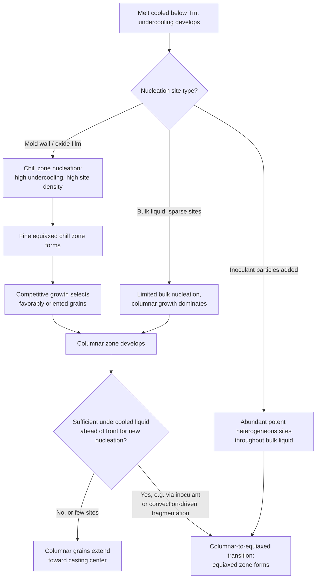

## Nucleation During Solidification

### Definition and Scope

Nucleation during solidification is the initial formation of stable solid clusters (nuclei) within a liquid melt as it cools below its equilibrium melting/freezing temperature, representing the first stage of the liquid-to-solid transformation. This process directly determines the initial grain density and, combined with subsequent growth, the final as-cast grain structure — a primary lever for controlling mechanical properties in castings and welds.

**Key Points**

- Applies the same general homogeneous/heterogeneous nucleation framework as solid-state nucleation, but with the liquid phase as parent and specific practical considerations unique to solidification (mold walls, inoculant particles, convection)
- Nucleation rate and undercooling behavior during solidification directly determine whether a casting develops a coarse or fine, columnar or equiaxed grain structure
- Solidification nucleation is overwhelmingly **heterogeneous** in practical castings — homogeneous nucleation in liquid metals requires undercoolings on the order of hundreds of degrees, essentially never achieved except in specialized containerless/rapid-solidification experiments

### Homogeneous Nucleation in Liquids

The same thermodynamic framework as general nucleation theory applies, with the volumetric driving force expressed via undercooling below the equilibrium melting point $T_m$:

$$\Delta G_v\approx\frac{\Delta H_f\Delta T}{T_m}$$

$$r^*=-\frac{2\gamma_{SL}}{\Delta G_v}=\frac{2\gamma_{SL}T_m}{\Delta H_f\Delta T},\quad\Delta G^*=\frac{16\pi\gamma_{SL}^3T_m^2}{3(\Delta H_f)^2(\Delta T)^2}$$

where $\gamma_{SL}$ is the solid-liquid interfacial energy and $\Delta H_f$ is the latent heat of fusion.

**Key Points**

- Both $r^*$ and $\Delta G^*$ decrease sharply as undercooling $\Delta T$ increases, consistent with general nucleation theory
- For pure metals, homogeneous nucleation theory predicts undercoolings on the order of $0.2T_m$ (hundreds of degrees for most metals) would be required for observable homogeneous nucleation rates — far greater than the few degrees of undercooling typically observed in real castings
- This large discrepancy between homogeneous theory and observed practical undercooling is the primary evidence that real solidification nucleates heterogeneously

### Heterogeneous Nucleation in Solidification

**Key Points**

- Mold walls, refractory inclusions, oxide films, and deliberately added inoculant particles all serve as heterogeneous nucleation substrates, reducing the effective energy barrier via the same shape-factor mechanism as general heterogeneous nucleation theory: $\Delta G^*_{het}=\Delta G^*_{hom}\cdot S(\theta)$
- The wetting angle $\theta$ between the solidifying metal and a given substrate determines nucleation potency — substrates with low $\theta$ (good wetting, often associated with close crystallographic lattice matching between substrate and solidifying phase) are much more effective nucleation catalysts
- Mold wall nucleation is typically the dominant mechanism at the casting surface (chill zone), while nucleation on suspended inclusions/inoculant particles can occur throughout the bulk liquid

### Undercooling Regimes in a Casting

**Key Points**

- **Constitutional and thermal undercooling** both contribute to driving nucleation and subsequent growth, but nucleation specifically requires localized undercooling sufficient to exceed the heterogeneous barrier at available substrate sites
- At the mold wall, heat extraction is rapid, producing high local undercooling and high nucleation site density (from both high $\Delta T$ and abundant heterogeneous wall/oxide sites) — resulting in a fine-grained **chill zone**
- In the bulk liquid interior, undercooling is generally lower (slower heat extraction, further from the chill surface) and heterogeneous sites are sparser (unless inoculant particles are present), typically leading to fewer, larger grains unless nucleation is deliberately promoted

### Classic As-Cast Grain Structure: Three Zones

**Example**

A typical sand or permanent-mold casting of a pure metal or alloy develops three characteristic zones from surface to center, directly attributable to spatially varying nucleation and growth conditions:

1. **Chill zone**: thin layer of fine, randomly oriented equiaxed grains at the mold wall, resulting from high undercooling and abundant heterogeneous nucleation sites (mold surface plus rapid initial heat extraction)
2. **Columnar zone**: long, elongated grains growing inward from the chill zone, aligned roughly parallel to the direction of maximum heat flow (perpendicular to the mold wall) — this zone forms via *competitive growth* rather than new nucleation, as favorably oriented grains from the chill zone outgrow neighbors whose fastest-growth crystallographic direction is misaligned with the heat flow direction
3. **Equiaxed zone** (central/core region): randomly oriented, roughly equiaxed grains in the casting interior, forming from nucleation events in the remaining undercooled liquid ahead of the advancing columnar front — often assisted by dendrite fragments swept into the bulk liquid by convection, which act as additional heterogeneous (or effectively homogeneous-composition) nucleation sites

Raw SVG illustration of the three-zone as-cast grain structure:

<svg xmlns="http://www.w3.org/2000/svg" viewBox="0 0 420 320">
<title>Three-Zone As-Cast Grain Structure (svg_diagram)</title>
<rect x="20" y="20" width="380" height="280" fill="none" stroke="#333" stroke-width="3" />
<rect x="20" y="20" width="380" height="20" fill="#cccccc" />
<text x="210" y="15" text-anchor="middle" font-size="11">Mold wall</text>
<text x="210" y="35" text-anchor="middle" font-size="9">Chill zone: fine equiaxed grains</text>
<g stroke="#0077cc" stroke-width="1.5">
<line x1="60" y1="45" x2="60" y2="180" />
<line x1="110" y1="45" x2="110" y2="200" />
<line x1="160" y1="45" x2="160" y2="190" />
<line x1="260" y1="45" x2="260" y2="190" />
<line x1="310" y1="45" x2="310" y2="200" />
<line x1="360" y1="45" x2="360" y2="180" />
</g>
<text x="210" y="115" text-anchor="middle" font-size="9" fill="#0077cc">Columnar zone: elongated grains</text>
<circle cx="150" cy="240" r="15" fill="none" stroke="#cc3300" />
<circle cx="200" cy="260" r="12" fill="none" stroke="#cc3300" />
<circle cx="250" cy="235" r="16" fill="none" stroke="#cc3300" />
<circle cx="180" cy="220" r="10" fill="none" stroke="#cc3300" />
<circle cx="230" cy="270" r="13" fill="none" stroke="#cc3300" />
<text x="210" y="290" text-anchor="middle" font-size="9" fill="#cc3300">Equiaxed zone: randomly oriented grains</text>
</svg>

### Factors Determining Zone Extent

**Key Points**

- **Pouring temperature (superheat)**: higher superheat delays the onset of bulk undercooling, tends to promote a larger columnar zone at the expense of the equiaxed zone
- **Alloy composition (constitutional supercooling tendency)**: alloys with wider freezing ranges and strong constitutional undercooling ahead of the growth front tend to promote greater equiaxed zone formation, since the undercooled liquid zone ahead of the interface is more extensive
- **Mold thermal conductivity**: higher mold conductivity (e.g., metal molds vs. sand molds) increases cooling rate and undercooling, generally producing finer grains overall and can influence the columnar-to-equiaxed transition (CET) location
- **Melt agitation/convection**: promotes dendrite arm fragmentation (mechanically detaching secondary dendrite arms), providing additional nucleation-equivalent sites in the bulk liquid, favoring equiaxed grain formation over columnar
- **Grain refiner (inoculant) additions**: deliberately introduce highly potent heterogeneous nucleation sites distributed throughout the melt, dramatically increasing nucleation density in the bulk and promoting a fully equiaxed, fine-grained structure while suppressing columnar growth

### The Columnar-to-Equiaxed Transition (CET)

**Key Points**

- The CET is the point (in time/position) where growth shifts from the directionally competitive columnar mode to nucleation-dominated equiaxed growth in the melt ahead of the columnar front
- Occurs when the density and growth rate of equiaxed grains nucleating in the undercooled liquid ahead of the columnar tips becomes sufficient to "block" further columnar advance, effectively isolating the columnar front from continued growth
- [Inference] Predicting the precise CET location from first principles requires coupling nucleation kinetics, growth kinetics, and the local thermal/constitutional undercooling profile — practical CET prediction models (e.g., Hunt's analytical criterion) exist but generally require calibration against experimental data for a specific alloy/process combination rather than being purely predictive from generic thermophysical properties alone

### Grain Refinement Practice

**Example**

In commercial aluminum casting, Al-Ti-B master alloy rods are added to the melt just before casting. The TiB₂ particles (and associated peritectic Al₃Ti reaction at the particle surface, in the classical "peritectic hulk" model) provide numerous, highly potent (low wetting angle) heterogeneous nucleation sites distributed throughout the bulk liquid. This suppresses columnar growth almost entirely, producing a fine, fully equiaxed grain structure throughout the casting cross-section, which improves feeding during solidification (reducing porosity/shrinkage defects), improves mechanical property uniformity, and reduces hot-tearing susceptibility.

**Key Points**

- Similar grain refinement approaches (using potent heterogeneous nucleant particles) are used across many casting alloy systems (e.g., Mg alloys with Zr additions), though the specific nucleant chemistry and mechanism are alloy-system-specific
- Grain refinement is distinct from, though sometimes combined with, modification treatments (e.g., Sr or Na modification of eutectic Si morphology in Al-Si alloys), which affect eutectic microstructure rather than primary grain nucleation

### Nucleation-to-Microstructure Flow

### Common Pitfalls

- Assuming homogeneous nucleation is relevant to typical castings — practical undercoolings (a few degrees) are far too small for homogeneous nucleation theory to apply; heterogeneous nucleation on walls, inclusions, or inoculants dominates almost universally
- Treating the columnar zone as forming via new nucleation events — it forms via competitive growth selection from chill-zone grains, not fresh nucleation
- Assuming grain refiner additions work by simply "seeding" solid particles that survive into the final structure — the dominant mechanism is provision of highly potent heterogeneous nucleation catalysts (often via a specific peritectic or epitaxial relationship with the solidifying phase), not mechanical seeding alone
- Ignoring convection and dendrite fragmentation as a nucleation-equivalent mechanism for the equiaxed zone — mechanically detached dendrite arms transported into undercooled liquid can behave as additional effective nucleation sites
- Assuming CET position is a fixed material property — it depends strongly on process parameters (pouring temperature, mold conductivity, melt agitation, inoculation practice), not composition alone

**Related Topics**

- Homogeneous versus Heterogeneous Nucleation
- Dendritic Growth and Constitutional Supercooling
- Grain Refinement and Inoculation Practice
- Columnar-to-Equiaxed Transition Models
- Coring and Microsegregation in As-Cast Alloys
- Solidification of Eutectic Systems