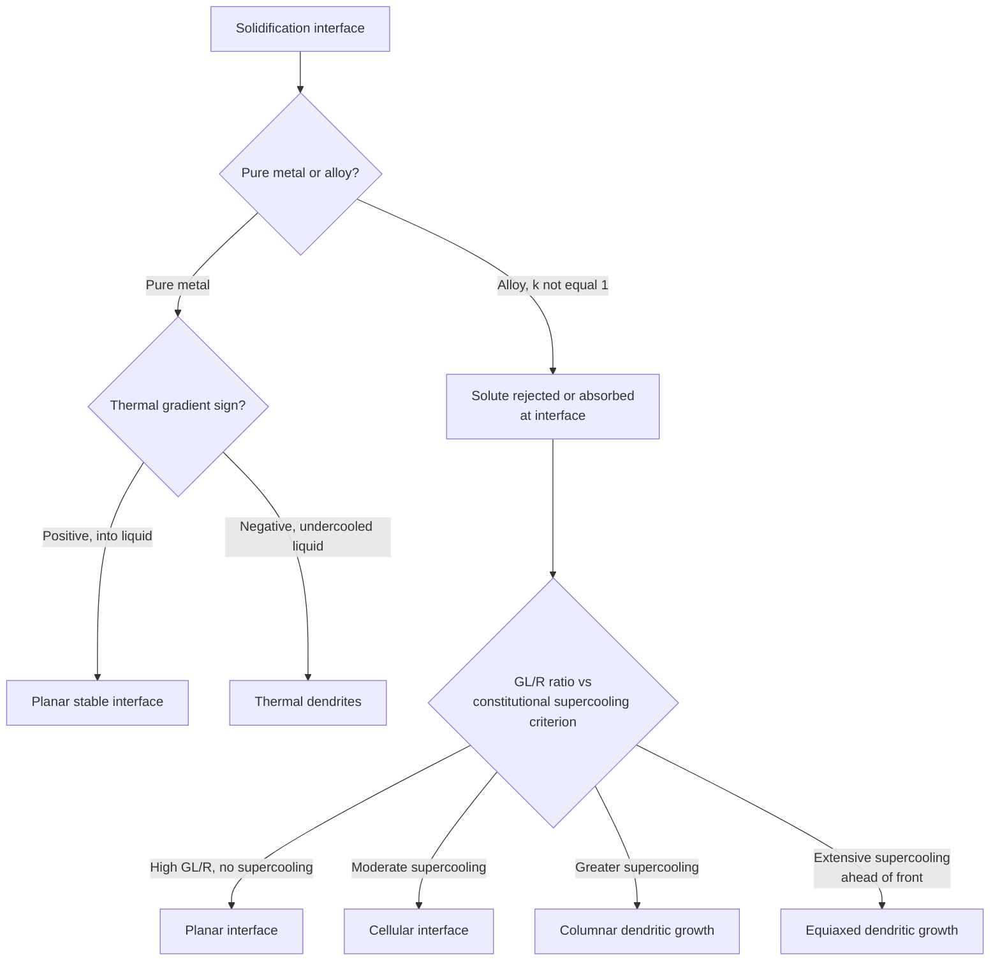

## Solidification of Pure Metals versus Alloys

### Definition and Scope

The solidification behavior of pure metals differs fundamentally from that of alloys due to the presence (or absence) of solute partitioning between liquid and solid phases. Pure metals solidify at a single fixed temperature with a planar or dendritic interface controlled purely by thermal conditions, while alloys solidify over a temperature range and develop compositionally driven interface instabilities that are central to as-cast microstructure formation.

**Key Points**

- Pure metals: solidification occurs isothermally at the melting point $T_m$, no compositional partitioning, interface morphology controlled solely by thermal gradients
- Alloys: solidification occurs over a finite temperature range (between liquidus and solidus), solute partitioning between liquid and solid drives compositional gradients that fundamentally alter interface stability and growth morphology
- This distinction is the basis for **constitutional supercooling**, the phenomenon unique to alloy solidification that does not occur in pure metal solidification

### Pure Metal Solidification: Thermal Control

**Key Points**

- Solidification proceeds at a fixed temperature $T_m$ (the equilibrium melting point), since there is only one component and no compositional degree of freedom to create a freezing range
- Interface morphology (planar vs. dendritic) is controlled entirely by the **thermal gradient** in the liquid ahead of the solid-liquid interface
- **Positive thermal gradient** (temperature increases away from the interface into the liquid, as in directional solidification with heat extracted through the solid): interface remains **planar** and stable, since any small protrusion into the liquid encounters progressively hotter liquid, causing it to melt back
- **Negative thermal gradient** (liquid is undercooled ahead of the interface, temperature decreases away from the interface): interface becomes **unstable**, and any protrusion grows preferentially into the more undercooled liquid ahead, since that region has a larger local driving force — this instability produces **thermal dendrites**

### Thermal Dendrites in Pure Metals

**Key Points**

- Form exclusively under negative thermal gradient conditions (bulk undercooling of the liquid, as in casting into a cold mold where the liquid ahead of the solidification front is significantly undercooled)
- Grow along specific crystallographic directions (e.g., <100> for cubic metals), producing the classic tree-like dendrite morphology with primary trunks and secondary/tertiary side branches
- The latent heat released at the tip and along the dendrite arms locally raises the temperature, which is part of the self-limiting mechanism controlling dendrite arm spacing and growth velocity
- [Inference] Because pure-metal dendritic growth is governed by thermal diffusion alone (no compositional field), the specific tip-growth velocity/undercooling relationships (e.g., via the Ivantsov solution for thermal dendrites) differ mathematically from the compositionally-coupled treatment required for alloy dendrites, though both share the same qualitative branching morphology

### Alloy Solidification: The Freezing Range

**Key Points**

- Except at special congruent-melting or eutectic/pure-component compositions, an alloy solidifies over a **freezing range** between the liquidus temperature (first solid forms) and solidus temperature (last liquid disappears)
- Within this range, liquid and solid phases coexist with compositions related by the phase diagram (liquidus and solidus compositions at the local interface temperature), governed by the equilibrium (or effective) partition coefficient $k=C_S/C_L$
- This finite freezing range, combined with **solute rejection** (or absorption, if $k>1$) at the advancing interface, is the origin of the compositional field that drives constitutional supercooling — a phenomenon with no counterpart in pure-metal solidification

### Solute Partitioning and the Partition Coefficient

**Key Points**

- The equilibrium partition coefficient $k=C_S/C_L$ (ratio of solute concentration in solid to liquid at the interface, at a given temperature) is generally **not equal to 1** for real alloy systems, meaning solid and liquid phases in equilibrium at the interface have different compositions
- For $k<1$ (solute lowers the melting point, as commonly depicted): solid forms with less solute than the surrounding liquid, so solute is **rejected** into the liquid ahead of the advancing interface, building up a solute-enriched boundary layer
- For $k>1$ (less common, solute raises melting point): solid forms with more solute than the liquid, depleting the liquid immediately ahead of the interface
- This partitioning is fundamentally absent in pure-metal solidification, since there is no second component to partition

### Constitutional Supercooling

**Key Points**

- As solute (for $k<1$) builds up ahead of the advancing solid-liquid interface, the local liquidus temperature of that solute-enriched liquid is **depressed** below the liquidus temperature of the bulk liquid composition
- If the actual thermal gradient in the liquid is shallower than the gradient of this local (composition-dependent) liquidus temperature, a region of liquid ahead of the interface becomes **constitutionally undercooled** — its actual temperature is below its local equilibrium liquidus temperature, even though the macroscopic thermal gradient may be nominally positive
- This constitutionally undercooled zone destabilizes an otherwise planar interface in exactly the same qualitative way that negative thermal gradients destabilize pure-metal interfaces, but the mechanism is compositional rather than purely thermal
- The criterion for onset of constitutional supercooling (simplified):

$$\frac{G_L}{R}<\frac{mC_0(1-k)}{Dk}$$

where $G_L$ is the liquid thermal gradient, $R$ is the growth rate, $m$ is the liquidus slope, $C_0$ is the bulk alloy composition, $D$ is the liquid diffusion coefficient, and $k$ is the partition coefficient

### Comparative Interface Morphology

| Condition | Pure Metal | Alloy |
| --- | --- | --- |
| Driving mechanism | Thermal gradient only | Thermal gradient AND compositional (constitutional) gradient |
| Stable planar interface | Positive thermal gradient | Positive thermal gradient AND sufficiently high $G_L/R$ (no constitutional supercooling) |
| Unstable/dendritic interface | Negative thermal gradient (bulk undercooling) | Low $G_L/R$ ratio, even under nominally positive thermal gradient |
| Freezing temperature | Single fixed $T_m$ | Range between liquidus and solidus |
| Compositional segregation | None (single component) | Microsegregation (coring) between dendrite core and edge |

### Progression of Interface Morphology with Increasing Constitutional Supercooling

**Key Points**

- As the degree of constitutional supercooling increases (decreasing $G_L/R$), alloy interface morphology progresses through a characteristic sequence: **planar → cellular → columnar dendritic → equiaxed dendritic**
- **Cellular growth**: mild constitutional supercooling produces a shallow, regular array of finger-like cells growing parallel to the heat flow direction, with solute segregated to the cell boundaries
- **Dendritic growth**: greater constitutional supercooling produces full dendrites with side-branching, since the undercooled zone ahead of the interface is now deep enough to support secondary/tertiary arm formation
- This morphological progression is a direct practical consequence of the constitutional supercooling framework and does not occur in pure-metal solidification, which transitions directly between planar (positive gradient) and dendritic (negative gradient) without a compositionally-driven cellular regime

### Microsegregation: An Alloy-Specific Consequence

**Key Points**

- Because solid and liquid compositions differ at every point along the freezing range ($k\ne1$), and because solid-state diffusion is far too slow to homogenize the solid during typical solidification timescales, dendrites in alloys solidify with a **compositional gradient from core to edge (coring)** — the core (which solidified first, at higher temperature) has a composition closer to the solidus, while the last liquid to solidify (interdendritic regions) is enriched (for $k<1$) in solute
- This microsegregation has no counterpart in pure-metal solidification, since there is no solute to segregate
- Practically addressed via **homogenization annealing**, which uses solid-state diffusion at elevated temperature (below solidus) over extended time to reduce the compositional gradient, per Fick's laws

### Latent Heat Release: Shared Feature

**Key Points**

- Both pure metals and alloys release latent heat of fusion during solidification, which locally affects the thermal field and interacts with the growth kinetics at the interface (recalescence effects, local remelting of fine dendrite features)
- However, in alloys this thermal effect is superimposed on, and interacts with, the compositional (constitutional supercooling) field, making alloy solidification analysis inherently more complex than the purely thermal analysis sufficient for pure metals

### Practical Consequences for Casting and Welding

**Key Points**

- Pure metal castings (rare in engineering practice, since most engineering materials are alloys) can, in principle, be produced with fully planar/columnar directional solidification more readily, since only thermal gradient control is needed to avoid dendritic breakdown
- Alloy castings and welds almost universally exhibit cellular or dendritic growth under normal processing conditions, because achieving the very high $G_L/R$ ratios needed for planar growth is impractical at commercial solidification rates for most compositions — this is why dendritic/cellular microstructures (and associated microsegregation) are the practical norm in as-cast and as-welded alloy microstructures
- Understanding the pure-metal vs. alloy distinction is foundational to interpreting weld pool solidification, single-crystal/directionally-solidified turbine blade casting (which deliberately controls $G_L/R$ to maintain planar or well-aligned columnar growth in an alloy system), and continuous casting practice

### Common Pitfalls

- Applying pure-metal thermal-gradient-only stability criteria to alloys — alloy interface stability requires the constitutional supercooling criterion (involving $G_L/R$, composition, partition coefficient, diffusivity), not thermal gradient sign alone
- Assuming alloys can achieve planar interface growth under the same conditions that would stabilize a pure metal — much higher $G_L/R$ ratios are typically required for alloys due to the added constitutional supercooling effect
- Forgetting that microsegregation (coring) is an alloy-specific phenomenon absent in pure-metal solidification, since it fundamentally requires unequal solid/liquid partitioning of a solute
- Confusing thermal dendrites (pure metals, driven by bulk liquid undercooling) with alloy dendrites (driven by constitutional supercooling, can occur even under a nominally positive macroscopic thermal gradient)
- Treating the pure-metal case as simply "the $k=1$ limit" of alloy behavior without further qualification — while formally $k=1$ would eliminate partitioning, pure metals are a distinct single-component thermodynamic system, not merely a limiting case of a binary alloy diagram

**Related Topics**

- Constitutional Supercooling and Interface Stability
- Nucleation During Solidification
- Dendritic Growth Morphology and Arm Spacing
- Coring and Microsegregation, Homogenization Annealing
- Directional Solidification and Single-Crystal Casting
- Weld Pool Solidification Microstructure