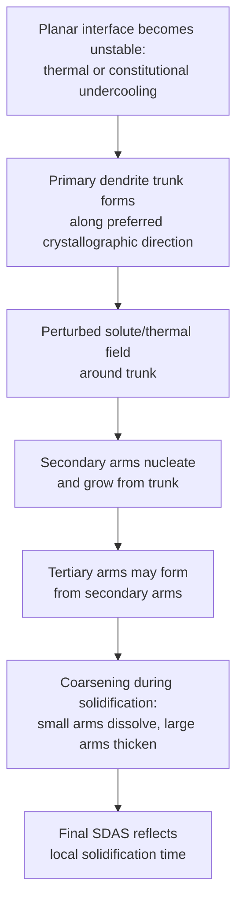

## Dendritic Growth and Solidification Morphology

### Definition and Scope

Dendritic growth is the tree-like, branching mode of crystal growth that develops when a solidification interface becomes morphologically unstable, producing primary stalks with regularly spaced secondary and tertiary side-arms. Dendrites are the dominant growth morphology in the vast majority of practical alloy solidification (castings, welds, ingots), and their scale and spacing directly govern as-cast microsegregation distance, porosity distribution, and post-solidification mechanical properties.

**Key Points**

- Arises from interface instability driven by either negative thermal gradients (pure metals) or constitutional supercooling (alloys), as small interface perturbations grow preferentially into locally undercooled liquid ahead of the front
- Characterized by a primary growth direction along specific low-index crystallographic directions (e.g., <100> for cubic metals), with regularly spaced secondary arms branching from the primary trunk, and sometimes tertiary arms from the secondary arms
- The length scale of dendritic substructure (arm spacing) is one of the most important as-cast microstructural parameters, since it controls the diffusion distances relevant to microsegregation and subsequent homogenization

### Origin of Dendritic Instability

**Key Points**

- A planar solidification interface is unstable whenever a small protrusion into the liquid encounters conditions more favorable for continued growth than the surrounding planar regions — either colder liquid (pure metal, negative thermal gradient) or constitutionally undercooled liquid (alloy, low $G_L/R$)
- Once a protrusion begins to grow preferentially, it develops into a primary dendrite trunk; the resulting local perturbation in the solute/thermal field around the trunk then creates conditions favorable for secondary arm nucleation along its length via the same instability mechanism operating at a smaller scale
- This self-similar, cascading instability (primary → secondary → tertiary arms) is why dendrites exhibit their characteristic branching, quasi-fractal morphology

### Dendrite Tip Growth: Marginal Stability / Selection

**Key Points**

- A dendrite tip approximates a paraboloid of revolution, characterized by a tip radius $r_t$ and growth (tip) velocity $V$
- The tip must balance two competing effects: sharper tips (smaller $r_t$) experience a larger local undercooling requirement due to the Gibbs-Thomson (capillarity) effect, while blunter tips are less efficient at rejecting solute/extracting heat — the combination selects a specific operating tip radius and velocity for given undercooling conditions
- The **marginal stability criterion** and more rigorous **microscopic solvability theory** are the standard frameworks used to predict the selected tip radius as a function of undercooling, combining capillarity (interfacial energy, anisotropic in real crystals) with the diffusion field (thermal for pure metals, solutal and thermal for alloys)
- [Inference] While these frameworks successfully predict qualitative and often quantitative dendrite tip behavior for many systems, the full theory (particularly for alloy dendrites with coupled thermal and solutal fields under realistic convection) remains an area of active refinement in solidification science, so specific tip-selection predictions are generally validated against experimental or numerical (phase-field) results for a given system rather than assumed universally accurate from the analytical theory alone

### Primary Dendrite Arm Spacing (PDAS)

**Key Points**

- Primary dendrite arm spacing $\lambda_1$ (distance between adjacent primary trunks) is primarily controlled by the local thermal gradient $G$ and growth rate $R$ (or equivalently, local solidification time)
- Empirically often correlated as $\lambda_1\propto G^{-a}R^{-b}$ with $a$, $b$ typically in the range of roughly 0.5, though exact exponents are alloy- and model-dependent
- Higher $G$ and higher $R$ (faster cooling, steeper thermal gradients, as near a chill surface) both tend to **decrease** primary spacing, producing finer dendritic substructure

### Secondary Dendrite Arm Spacing (SDAS)

**Key Points**

- Secondary dendrite arm spacing $\lambda_2$ is generally considered the more practically important length scale, since it directly governs microsegregation diffusion distances and is more straightforwardly measured on a polished cross-section
- Primarily controlled by **local solidification time** $t_f$ (time between local liquidus and solidus temperatures being reached), following an empirical relationship of the general form:

$$\lambda_2=Kt_f^n$$

where $K$ is a material-and-alloy-specific constant and $n$ is typically in the range of ~0.3-0.4 for many alloy systems

- Longer local solidification time (slower cooling, as in the center of a thick casting section) produces coarser secondary arm spacing; faster cooling (thin sections, chill surfaces, rapid solidification processes) produces much finer spacing
- **Coarsening** of secondary arms occurs during solidification itself: smaller/thinner arms with higher curvature dissolve (driven by Gibbs-Thomson capillarity effects, analogous to Ostwald ripening) while larger arms grow and thicken, meaning the final observed spacing reflects a time-integrated coarsening process, not simply the initial arm formation spacing

### Relationship Between Cooling Rate and Dendrite Spacing

**Example**

A general practical relationship used across many casting processes:

$$\lambda_2=A\dot{T}^{-n}$$

where $\dot{T}$ is the local cooling rate and $A$, $n$ are alloy-specific empirical constants (commonly $n\approx0.3$-$0.5$ depending on system and reference).

**Key Points**

- This relationship is widely used to estimate local cooling rate from measured dendrite arm spacing in a solidified component (or conversely, to predict expected dendrite spacing for a given process cooling rate), and underlies practical process control and casting quality assessment
- Because $\lambda_2$ decreases with increasing cooling rate, rapid solidification processes (e.g., melt spinning, some additive manufacturing processes) can achieve dramatically finer, near-nanoscale dendritic or cellular substructures compared to conventional sand or permanent-mold casting

### Columnar versus Equiaxed Dendritic Growth

**Key Points**

- **Columnar dendrites**: grow directionally from the mold wall/chill surface inward, elongated parallel to the dominant heat-flow direction, formed via competitive growth of favorably crystallographically oriented grains from the initial chill zone (see the three-zone as-cast structure)
- **Equiaxed dendrites**: grow with roughly equal extension in all directions from nucleation sites within the undercooled bulk liquid, typically forming in the casting interior or throughout the volume when heterogeneous nucleation site density is high (e.g., via grain refiner addition)
- The transition between these two growth modes (the columnar-to-equiaxed transition, CET) is governed by the balance of nucleation rate in the undercooled liquid ahead of the columnar front versus the growth rate of the columnar dendrites themselves

### Dendrite Morphology Cross-Section Illustration

Raw SVG illustration of a primary dendrite trunk with secondary arms, as typically observed in a polished cross-section:

<svg xmlns="http://www.w3.org/2000/svg" viewBox="0 0 400 300">
<title>Dendrite Primary Trunk with Secondary Arms (svg_diagram)</title>
<line x1="200" y1="20" x2="200" y2="280" stroke="#333" stroke-width="4" />
<g stroke="#0077cc" stroke-width="2.5">
<line x1="200" y1="60" x2="130" y2="45" />
<line x1="200" y1="60" x2="270" y2="45" />
<line x1="200" y1="110" x2="130" y2="95" />
<line x1="200" y1="110" x2="270" y2="95" />
<line x1="200" y1="160" x2="130" y2="145" />
<line x1="200" y1="160" x2="270" y2="145" />
<line x1="200" y1="210" x2="130" y2="195" />
<line x1="200" y1="210" x2="270" y2="195" />
</g>
<text x="200" y="295" text-anchor="middle" font-size="11">Primary trunk with secondary arms</text>
<line x1="200" y1="60" x2="200" y2="110" stroke="#cc3300" stroke-width="1" stroke-dasharray="3,2" />
<text x="215" y="88" font-size="10" fill="#cc3300">lambda-2</text>
</svg>

### Effect on Microsegregation and Homogenization

**Key Points**

- Solute-enriched interdendritic liquid (for $k<1$) solidifies last, concentrated in the spaces between secondary arms; the diffusion distance relevant to subsequent homogenization annealing scales directly with $\lambda_2$, not with grain size
- Finer dendrite arm spacing (faster cooling) therefore reduces the required homogenization time for a given degree of compositional uniformity, since diffusion distances are shorter — this is a major practical motivation for rapid solidification processing when subsequent homogenization is impractical or undesirable
- Coarser dendrite spacing (slower cooling, thick castings) requires substantially longer homogenization times, following the general diffusion scaling relationship $t\propto\lambda^2/D$

### Practical Significance in Casting and Welding

**Key Points**

- Porosity and shrinkage defects tend to concentrate in interdendritic regions (last liquid to solidify, most difficult to feed with additional liquid metal), so dendrite morphology directly influences casting soundness
- Weld pool solidification is governed by the same dendritic growth principles, but at much higher $G$ and $R$ than typical casting, generally producing very fine cellular/dendritic substructure within the fusion zone
- Directionally solidified and single-crystal casting processes (e.g., turbine blade manufacturing) deliberately control $G$ and $R$ to maintain a specific, well-aligned columnar dendritic (or fully single-crystal, dendrite-free in some advanced processes) structure, exploiting the same growth-selection physics for beneficial anisotropic property control
- Additive manufacturing (e.g., laser powder bed fusion) processes typically exhibit extremely fine cellular/dendritic substructure due to very high local $G$ and $R$, a direct consequence of the rapid, localized solidification conditions

### Common Pitfalls

- Confusing primary and secondary dendrite arm spacing — PDAS is controlled mainly by $G$ and $R$ near the interface, while SDAS is controlled mainly by local solidification time and coarsening, and SDAS is the more common/practically relevant measurement
- Assuming dendrite arm spacing is fixed once arms initially form — significant coarsening occurs during the remainder of solidification, so final observed spacing reflects a time-integrated process, not the initial branching spacing
- Treating dendrite morphology as purely a thermal phenomenon in alloys — for alloys, constitutional (solutal) undercooling is typically the dominant driver of instability, not thermal undercooling alone
- Assuming faster cooling is always straightforwardly beneficial — while it refines dendrite spacing and reduces microsegregation/homogenization time, extremely rapid solidification can introduce other issues (e.g., increased porosity risk from reduced feeding time, or altered phase selection favoring metastable phases)
- Extrapolating empirical $\lambda_2$ vs. cooling-rate relationships (with fitted constants $A$, $n$) outside the alloy system and cooling-rate range for which they were determined

**Related Topics**

- Constitutional Supercooling and Interface Stability
- Solidification of Pure Metals versus Alloys
- Nucleation During Solidification
- Coring and Microsegregation, Homogenization Annealing
- Directional Solidification and Single-Crystal Casting
- Porosity and Shrinkage Defects in Castings