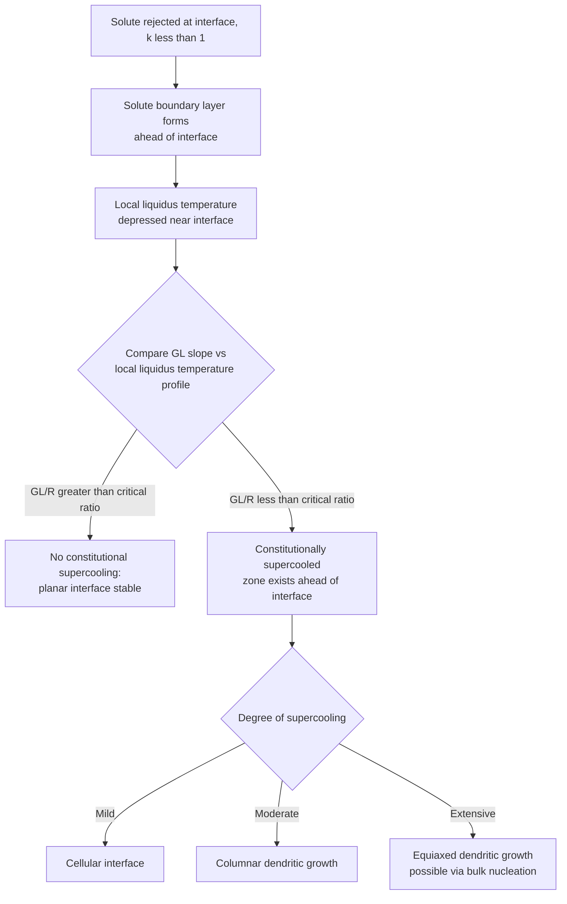

## Constitutional Supercooling

### Definition

Constitutional supercooling (also called constitutional undercooling) is the condition in which liquid ahead of an advancing solidification interface has an actual temperature below its local equilibrium liquidus temperature, due to solute partitioning at the interface, even when the macroscopic thermal gradient is nominally positive. It is the compositional analog of thermal undercooling and is the central mechanism controlling interface stability and growth morphology in alloy solidification.

**Key Points**

- Arises exclusively in alloy (multi-component) systems, since it fundamentally requires solute partitioning between solid and liquid at the interface — absent in pure-metal solidification
- Distinct from bulk thermal undercooling: constitutional supercooling can occur even when the actual thermal gradient in the liquid is positive (increasing away from the interface), because the *local equilibrium liquidus temperature* of the solute-enriched liquid varies with position, not the actual temperature field alone
- Is the primary driver of the planar → cellular → dendritic morphological progression observed in essentially all practical alloy solidification

### Physical Origin: Solute Rejection

**Key Points**

- For an alloy with partition coefficient $k<1$ (the common case, solute lowers the liquidus temperature), the advancing solid rejects solute into the adjacent liquid, since the solid can only incorporate a fraction $k$ of the local liquid composition
- This rejected solute accumulates in a boundary layer ahead of the interface, with concentration decreasing from a maximum at the interface ($C_L=C_0/k$ under steady-state conditions) down to the bulk liquid composition $C_0$ far from the interface
- Because the liquidus temperature depends on local composition (via the liquidus slope $m$ of the phase diagram), this solute-enriched boundary layer has a correspondingly **depressed local liquidus temperature** near the interface, rising back toward the bulk liquidus temperature further from the interface

### The Constitutional Supercooling Criterion

Comparing the actual temperature profile in the liquid (set by the imposed thermal gradient $G_L$) against the local equilibrium liquidus temperature profile (set by the solute boundary layer) determines whether constitutional supercooling exists.

For steady-state planar growth with no convection, the simplified criterion for onset of constitutional supercooling is:

$$\frac{G_L}{R}<\frac{mC_0(1-k)}{Dk}$$

where $G_L$ is the temperature gradient in the liquid at the interface, $R$ is the interface growth velocity, $m$ is the liquidus slope (magnitude), $C_0$ is the bulk alloy composition, $D$ is the solute diffusion coefficient in the liquid, and $k$ is the equilibrium partition coefficient.

**Key Points**

- The left side, $G_L/R$, is set by **external process conditions** (how the casting/weld/crystal-growth process is controlled)
- The right side is set by **intrinsic alloy properties** (phase diagram parameters and diffusivity) at the given bulk composition
- When $G_L/R$ is **higher** than this critical ratio: the actual thermal gradient exceeds the local liquidus gradient everywhere ahead of the interface, no liquid is constitutionally undercooled, and the interface remains **planar and stable**
- When $G_L/R$ is **lower** than this critical ratio: a zone of liquid ahead of the interface exists where the actual temperature is below the local liquidus temperature — this liquid is constitutionally supercooled, and the planar interface becomes **unstable**

### Graphical Interpretation

**Key Points**

- Plotting both the actual temperature profile (a line with slope $G_L$ starting at the interface temperature) and the local liquidus temperature profile (determined by the solute concentration profile and the phase diagram's liquidus slope) on the same temperature-vs-distance axes visually reveals constitutional supercooling as the region where the liquidus-temperature curve lies **above** the actual-temperature line
- If the liquidus curve is everywhere below or tangent to the actual-temperature line, no constitutional supercooling exists (stable planar interface)
- If the liquidus curve rises above the actual-temperature line anywhere ahead of the interface, that region is constitutionally supercooled

Raw SVG illustration of the constitutional supercooling graphical criterion:

<svg xmlns="http://www.w3.org/2000/svg" viewBox="0 0 460 320">
<title>Constitutional Supercooling Graphical Criterion (svg_diagram)</title>
<line x1="60" y1="280" x2="420" y2="280" stroke="#333" stroke-width="2" />
<line x1="60" y1="20" x2="60" y2="280" stroke="#333" stroke-width="2" />
<text x="240" y="305" text-anchor="middle" font-size="12">Distance ahead of interface</text>
<text x="20" y="150" text-anchor="middle" font-size="12" transform="rotate(-90 20 150)">Temperature</text>
<line x1="60" y1="240" x2="420" y2="100" stroke="#0077cc" stroke-width="2.5" />
<text x="300" y="130" font-size="11" fill="#0077cc">Actual temperature (slope = GL)</text>
<path d="M 60 180 C 150 60, 250 60, 420 130" fill="none" stroke="#cc3300" stroke-width="2.5" />
<text x="150" y="55" font-size="11" fill="#cc3300">Local liquidus temperature </text>
<text x="150" y="45" font-size="11" fill="#cc3300">(from solute boundary layer)</text>
<path d="M 60 180 C 150 60, 250 60, 260 108 L 260 214 C 200 190, 130 210, 60 240 Z" fill="#ffcccc" opacity="0.5" stroke="none" />
<text x="150" y="150" font-size="11" fill="#990000">Constitutionally supercooled zone</text>
</svg>

### Effect of Growth Rate and Thermal Gradient

**Key Points**

- **Increasing growth rate $R$** (faster solidification): more solute is rejected per unit time relative to how far it can diffuse away, steepening the solute concentration gradient at the interface and increasing the tendency toward constitutional supercooling
- **Increasing thermal gradient $G_L$** (steeper imposed temperature gradient): raises the actual-temperature line's slope, making it more likely to stay above the liquidus-temperature curve everywhere, suppressing constitutional supercooling
- **Increasing bulk composition $C_0$**: more solute available for rejection, generally increases the tendency toward constitutional supercooling (for $k<1$ systems)
- This is why achieving planar growth in practice (e.g., in Bridgman-type directional solidification/crystal growth) requires simultaneously **low growth rate** and **high thermal gradient** — the ratio $G_L/R$ must be kept high

### Consequence: Morphological Progression

**Key Points**

- As the degree of constitutional supercooling increases (decreasing $G_L/R$ progressively below the critical value), interface morphology transitions through a characteristic sequence: **planar → cellular → columnar dendritic → equiaxed dendritic**
- Mild constitutional supercooling (just below critical): shallow **cellular** structure, regular hexagonal/finger-like cells growing parallel to the heat-flow direction, solute segregated to cell walls
- Increasing supercooling: cells develop side-branching and become full **dendrites**, since the constitutionally undercooled zone is now deep enough to support secondary arm formation
- Extensive constitutional supercooling: sufficient undercooled liquid exists ahead of the front to support independent nucleation events, potentially triggering the columnar-to-equiaxed transition

### Worked Example: Applying the Criterion

**Example**

For a binary alloy with $m=5$ K/wt%, $C_0=2$ wt%, $k=0.3$, and $D=3\times10^{-9}$ m²/s in the liquid, the critical ratio is:

$$\left(\frac{G_L}{R}\right)_{crit}=\frac{mC_0(1-k)}{Dk}=\frac{5\times2\times(1-0.3)}{3\times10^{-9}\times0.3}\approx2.33\times10^{10}\ \text{K}\cdot\text{s/m}^2$$

If the process is operated with $G_L=5\times10^3$ K/m and $R=1\times10^{-6}$ m/s, then $G_L/R=5\times10^9$ K·s/m², which is **less than** the critical value — constitutional supercooling exists, and the interface will not remain planar under these conditions. Achieving planar growth would require either substantially reducing $R$, increasing $G_L$, or both.

[Inference] Real directional solidification processes typically must satisfy this criterion with considerable margin, since convection, non-steady-state transients, and other practical deviations from the idealized diffusion-only analysis tend to further promote instability beyond what the simplified criterion predicts alone.

### Distinction from Constitutional Undercooling in Growth Selection

**Key Points**

- Constitutional supercooling determines whether a planar interface is **stable at all**, but does not by itself specify the resulting dendrite tip radius, spacing, or growth velocity once instability occurs — those quantities require the more detailed marginal stability / microscopic solvability frameworks covering dendrite tip growth
- Constitutional supercooling is a **necessary but not sufficient** description of dendritic growth onset — it explains *why* the interface destabilizes, while separate growth theory explains the resulting dendrite morphology and scale

### Practical Applications and Process Implications

**Key Points**

- **Directional solidification / single-crystal casting** (e.g., turbine blades): process parameters are deliberately controlled to maintain $G_L/R$ above the critical constitutional supercooling threshold, preserving planar or well-controlled columnar growth and avoiding unwanted equiaxed grain formation
- **Crystal growth for semiconductors** (e.g., Czochralski silicon): extremely tight control of $G_L/R$ is required to grow dislocation-free, compositionally uniform single crystals, since constitutional supercooling would introduce dopant segregation and structural defects
- **Welding**: typically operates at high $R$ (fast solidification) with comparatively modest $G_L$, placing most weld solidification well into the constitutionally supercooled (cellular/dendritic) regime — planar weld solidification is difficult to achieve and rarely targeted in conventional welding
- **Zone refining and purification processes**: deliberately exploit solute partitioning ($k\ne1$) for purification, but must also manage constitutional supercooling to control interface morphology during the refining pass

### Common Pitfalls

- Assuming a positive macroscopic thermal gradient guarantees a stable planar interface for alloys — constitutional supercooling can destabilize the interface even under a positive thermal gradient, unlike the pure-metal case
- Treating constitutional supercooling and thermal undercooling as the same phenomenon — they arise from different physical origins (compositional vs. purely thermal) though they produce qualitatively similar interface-destabilizing effects
- Forgetting that both increasing $R$ and decreasing $G_L$ push toward instability — controlling only one variable while ignoring the other is insufficient for predicting or controlling interface morphology
- Applying the simplified steady-state planar criterion to highly transient or convection-dominated solidification without qualification — convection can significantly alter the effective solute boundary layer thickness and therefore the effective onset criterion
- Assuming the constitutional supercooling criterion alone predicts the resulting dendrite structure's scale (spacing, tip radius) — it only predicts the onset of instability, not the subsequent growth morphology details

**Related Topics**

- Dendritic Growth and Solidification Morphology
- Solidification of Pure Metals versus Alloys
- Coring and Microsegregation, Homogenization Annealing
- Directional Solidification and Single-Crystal Casting
- Zone Refining and Solute Partitioning
- Nucleation During Solidification