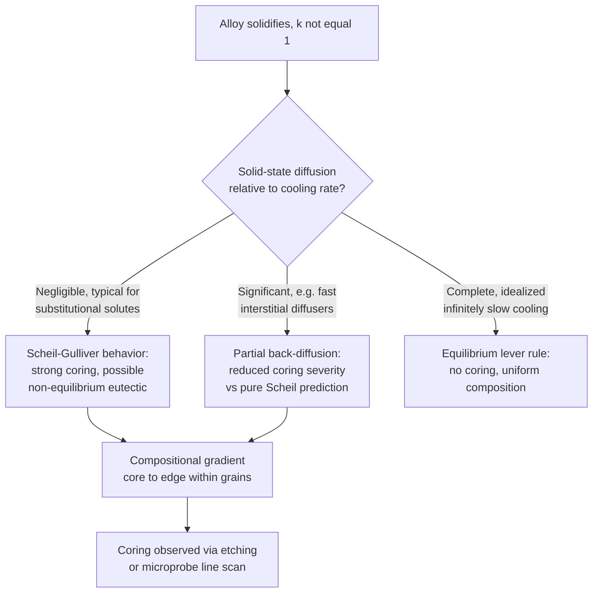

## Segregation and Coring

### Definition and Scope

Segregation refers to the non-uniform distribution of solute across a solidified alloy's microstructure, arising from solute partitioning between solid and liquid during freezing. Coring is the specific manifestation of segregation *within individual grains*, producing a compositional gradient from grain core (solidified first) to grain edge (solidified last), a direct microstructural consequence of non-equilibrium solidification.

**Key Points**

- Segregation is a general term spanning multiple length scales: **microsegregation** (within a single grain/dendrite, i.e., coring) and **macrosegregation** (compositional variation across an entire casting, at the scale of centimeters to meters)
- Both forms arise fundamentally from the same root cause: the partition coefficient $k=C_S/C_L\ne1$ means solid and liquid in equilibrium at the interface have different compositions, and solid-state diffusion is generally too slow to homogenize the solid during the timescale of solidification
- Coring occurs even under idealized, defect-free, non-convective solidification conditions, since it results from a fundamental thermodynamic/kinetic mismatch (fast solidification vs. slow solid diffusion), not from processing defects

### Origin of Coring: Non-Equilibrium Solidification

**Key Points**

- Under **true equilibrium solidification** (infinitely slow cooling, allowing complete diffusion in both liquid and solid at every instant), the solid composition would follow the solidus line exactly, and the final solidified grain would have **uniform composition** equal to the nominal alloy composition — no coring would occur
- In practice, solid-state diffusion is orders of magnitude slower than liquid diffusion, so the assumption of complete solid-state homogenization during solidification is essentially never valid at practical cooling rates
- The solid that forms first (grain/dendrite core), at the highest temperature within the freezing range, has a composition close to the solidus at that temperature; as solidification proceeds and temperature drops, subsequently formed solid has progressively different (for $k<1$, more solute-rich) composition, but the earlier-formed solid does not have time to re-equilibrate via diffusion
- The result is a solid with a **range of compositions frozen in**, from core to edge, rather than the single uniform composition predicted by the equilibrium lever rule

### The Scheil-Gulliver Model

The Scheil (or Scheil-Gulliver) equation provides the standard idealized model for non-equilibrium solidification microsegregation, based on two limiting assumptions: **complete diffusion in the liquid** (uniform liquid composition at every instant) and **no diffusion in the solid** (zero solid-state diffusivity, so each increment of solid retains its as-formed composition).

$$C_S=kC_0(1-f_S)^{k-1}$$

where $C_S$ is the composition of the solid forming at a given instant, $C_0$ is the nominal (bulk) alloy composition, $f_S$ is the fraction solid already formed, and $k$ is the partition coefficient.

**Key Points**

- As $f_S\rightarrow1$ (near the end of solidification), $C_S$ predicted by the Scheil equation diverges toward very high values (for $k<1$) — in practice this is limited by eutectic or other invariant reactions consuming the remaining highly enriched last liquid, rather than the composition rising without bound
- The Scheil model represents one limiting case; real solidification behavior typically falls **between** the Scheil prediction (no solid diffusion) and the equilibrium lever-rule prediction (complete solid diffusion), depending on how significant solid-state diffusion is relative to the solidification timescale for the specific solute and cooling rate involved
- [Inference] More refined models incorporating finite (non-zero, non-infinite) solid-state diffusion, such as the Brody-Flemings model and its later refinements, are used when solid diffusion is not negligible (e.g., for fast-diffusing interstitial solutes like carbon in steel, where some back-diffusion into the solid is significant even at practical cooling rates) — selecting the appropriate model requires judgment about the relevant solute's diffusivity relative to the specific process cooling rate

### Comparison: Equilibrium versus Scheil Solidification

| Aspect | Equilibrium (Lever Rule) | Scheil-Gulliver (Non-Equilibrium) |
| --- | --- | --- |
| Liquid diffusion | Complete | Complete |
| Solid diffusion | Complete | None |
| Final solid composition | Uniform, equals $C_0$ | Range of compositions (cored) |
| Last liquid composition | Reaches solidus-consistent value at solidus temperature | Can be driven to eutectic composition, forming non-equilibrium eutectic even in alloys nominally below the eutectic solute content |
| Solidification range predicted | Matches phase diagram solidus/liquidus | Often extends below the equilibrium solidus (freezing continues to lower temperature than equilibrium predicts) |

### Non-Equilibrium (Divorced) Eutectic Formation

**Key Points**

- A key practical consequence of Scheil-type behavior: the last liquid to solidify can become progressively enriched in solute (for $k<1$) until it reaches the **eutectic composition**, even in an alloy whose nominal bulk composition is well within the single-phase solid-solution region of the equilibrium phase diagram
- This produces small amounts of **non-equilibrium eutectic** microconstituent at grain boundaries/interdendritic regions in an alloy that, under true equilibrium solidification, would show no eutectic at all
- This non-equilibrium eutectic typically has a lower melting point than the bulk alloy, which has significant practical implications (see hot tearing/incipient melting below)

### Microstructural Manifestation of Coring

**Key Points**

- Within a single dendrite or grain, composition varies systematically from core (first-formed, closer to solidus composition at high temperature) to edge/interdendritic region (last-formed, more solute-enriched for $k<1$)
- This compositional gradient is often visible directly via etching (differential etch response to composition) revealing "coring bands" or "growth rings" within grains, or quantitatively measured via electron microprobe/EDS line scans across a dendrite
- The length scale over which coring occurs is set by the **secondary dendrite arm spacing**, since interdendritic regions (between secondary arms) are where the final, most-enriched liquid solidifies

### Consequences of Coring and Segregation

**Key Points**

- **Reduced ductility and toughness**: solute-enriched interdendritic regions and any associated non-equilibrium eutectic are often more brittle, and provide preferential crack initiation/propagation paths
- **Incipient melting risk during subsequent processing**: because the non-equilibrium interdendritic regions can have a locally depressed solidus (down to the eutectic temperature), subsequent hot working or heat treatment above the *nominal* solidus but below the true bulk solidus can cause **localized incipient melting** at these regions, a serious defect
- **Hot tearing/hot cracking susceptibility**: the presence of low-melting-point interdendritic liquid films late in solidification increases susceptibility to hot tearing under the thermal contraction stresses present during the final stages of solidification
- **Corrosion susceptibility**: compositional variation can create local galvanic differences, and segregated regions (e.g., Cr-depleted zones near carbide precipitates in some stainless steel welds, related to but distinct from coring) can be preferentially attacked
- **Variable local mechanical/physical properties**: hardness, strength, and other properties can vary at the microscale corresponding to the compositional gradient, even though the bulk average composition matches nominal specification

### Homogenization: Correcting Coring

**Key Points**

- **Homogenization annealing**: holding the solidified alloy at an elevated temperature (below the solidus, often the highest safely achievable temperature to maximize diffusion rate) for extended time allows solid-state diffusion to reduce the compositional gradient toward uniformity
- The characteristic homogenization time scales with the square of the diffusion distance (secondary dendrite arm spacing) per Fick's second law: $t\propto\lambda_2^2/D$
- This is why **finer dendrite arm spacing (faster original solidification) reduces required homogenization time** — a major practical motivation for controlling cooling rate during casting when subsequent homogenization treatment is planned
- Homogenization does not always achieve perfectly uniform composition in practical timeframes, particularly for slowly diffusing solutes or coarse as-cast structures — the degree of residual segregation after a given homogenization treatment is typically assessed via measured concentration profiles or predictive diffusion modeling

### Macrosegregation: Distinction from Coring

**Key Points**

- **Macrosegregation** is compositional variation at the scale of the entire casting (not just within individual grains), arising from bulk transport of solute-enriched or solute-depleted liquid via fluid flow (density-driven convection, solidification shrinkage-driven flow, or externally imposed flow) during solidification, rather than purely local solute partitioning at the interface
- Unlike coring/microsegregation, macrosegregation **cannot be corrected by homogenization annealing**, because the diffusion distances involved (centimeters to meters) are far too large for practical solid-state diffusion timescales
- Common macrosegregation patterns include normal segregation (solute-enriched regions in the last-to-solidify locations, typically the casting center/top) and inverse segregation (solute-enriched regions near the chill surface, driven by interdendritic liquid flow toward the cooling surface during shrinkage)
- [Inference] Because macrosegregation is fundamentally a fluid-flow-coupled phenomenon rather than a purely diffusional one, its prediction and mitigation typically require more complex process-specific modeling (coupling solidification kinetics with melt convection) compared to the relatively well-established diffusional treatment of microsegregation/coring

### Common Pitfalls

- Confusing coring (microsegregation, within-grain, correctable by homogenization) with macrosegregation (casting-scale, flow-driven, generally not correctable by homogenization)
- Assuming the equilibrium lever rule accurately predicts final as-cast composition distribution — in practice, Scheil-type or intermediate (partial back-diffusion) behavior is far more representative of real solidification
- Overlooking non-equilibrium eutectic formation in alloys with bulk composition nominally below the eutectic point on the equilibrium diagram — this is a real and common consequence of coring, not a diagram-reading error
- Applying a subsequent heat treatment at or near the nominal (equilibrium) solidus temperature without accounting for the locally depressed solidus at cored/segregated regions, risking incipient melting
- Assuming faster cooling always eliminates segregation concerns — faster cooling reduces the *length scale* (dendrite spacing) and thus homogenization time required, but does not eliminate the underlying partitioning-driven compositional gradient itself, which is intrinsic to any $k\ne1$ alloy system

**Related Topics**

- Solidification of Pure Metals versus Alloys
- Dendritic Growth and Solidification Morphology
- Homogenization Annealing and Diffusion in Solids
- Hot Tearing and Hot Cracking in Castings and Welds
- The Lever Rule and Equilibrium Phase Fraction Calculation
- Macrosegregation in Large Castings and Ingots