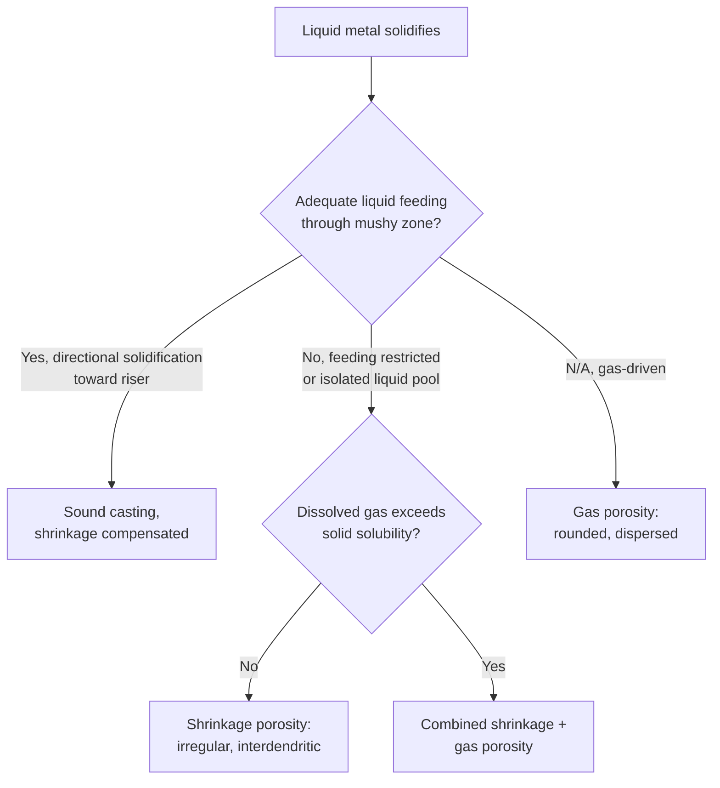

## Solidification Defects: Porosity and Shrinkage

### Definition and Scope

Porosity and shrinkage defects are volumetric discontinuities that form during solidification when liquid metal fails to adequately compensate for volume contraction as it transforms to solid, or when dissolved gases exceed their solubility limit and precipitate as bubbles. These defects are among the most common and economically significant casting quality issues, directly reducing mechanical properties, fatigue life, and pressure-tightness of cast components.

**Key Points**

- Two fundamentally distinct root causes are often grouped together as "porosity": **shrinkage-driven porosity** (volumetric contraction not fed by liquid metal) and **gas porosity** (dissolved gas exceeding solubility and nucleating bubbles) — many real defects arise from a combination of both mechanisms
- Nearly all metals contract on solidification (a few exceptions like some cast irons expand due to graphite precipitation), and virtually all metals also contract further during subsequent solid-state cooling to room temperature
- Defect severity and morphology depend strongly on alloy freezing range, section geometry, gating/risering design, and dissolved gas content

### Three Stages of Volumetric Contraction

**Key Points**

- **Liquid contraction**: shrinkage of the liquid metal as it cools from pouring temperature down to the liquidus temperature (typically 1-2% by volume for most metals, compensated relatively easily by continued liquid feeding from risers/sprue)
- **Solidification contraction**: shrinkage occurring during the liquid-to-solid transformation itself (typically the largest contribution, often 3-7% by volume depending on alloy) — this is the stage most directly responsible for shrinkage porosity, since it must be fed by remaining liquid flowing through an increasingly restrictive, partially solidified dendritic network
- **Solid contraction**: shrinkage of the fully solid casting as it continues cooling from solidus to room temperature (typically 1-8% linear depending on alloy, generally the largest single stage but manageable via pattern/mold sizing allowances since the casting is already fully solid and rigid) — this stage causes overall dimensional change and residual stress rather than porosity per se

### Shrinkage Porosity: Feeding Requirement

**Key Points**

- As solidification proceeds, remaining liquid must be able to flow through the solidifying network (particularly late-stage interdendritic channels) to compensate for the volume reduction as liquid converts to (denser) solid
- If liquid feeding becomes restricted before solidification is complete — due to dendrite coalescence narrowing/blocking interdendritic channels, or the feeding liquid source (riser) itself solidifying prematurely — the resulting volume deficit manifests as **porosity** (voids) rather than being filled
- **Feeding resistance increases dramatically as fraction solid increases**, since the permeability of the mushy (partially solid) zone to liquid flow drops sharply as the interdendritic channel network narrows — most shrinkage porosity nucleates and grows during the final stages of solidification, in the last liquid to freeze

### Macroshrinkage versus Microshrinkage

**Key Points**

- **Macroshrinkage (shrinkage cavity/pipe)**: a large, often centrally located void or funnel-shaped cavity forming where a significant volume of liquid solidifies last without adequate feeding — typically located at the thermal center of a casting or in a poorly designed riser, visible to the naked eye
- **Microshrinkage (microporosity)**: fine, distributed porosity at the scale of the dendritic substructure (interdendritic spacing), forming throughout the mushy zone wherever local feeding is marginally insufficient — often not visible without sectioning, radiography, or metallographic examination, but can significantly degrade fatigue and fracture properties even when total porosity volume fraction is small
- Alloys with a **wide freezing range** (large temperature difference between liquidus and solidus) tend to develop extensive mushy zones with poor interdendritic permeability, favoring dispersed microporosity over a single concentrated macroshrinkage cavity
- Alloys with a **narrow freezing range** (near-eutectic or pure-metal-like solidification, with a sharply defined solidification front) tend toward more effective directional solidification and concentrated macroshrinkage (easier to control via riser placement) rather than dispersed microporosity

### Gas Porosity

**Key Points**

- Most liquid metals dissolve significantly more gas (commonly hydrogen in aluminum and magnesium alloys, hydrogen and nitrogen in steels, and others depending on system) than the corresponding solid phase can hold at the same temperature — solubility typically **drops sharply upon solidification**
- As solidification proceeds, this rejected gas concentrates in the remaining liquid (analogous to solute rejection in microsegregation) until it exceeds the local solubility limit and nucleates as **gas bubbles**, which can become trapped in the solidifying structure
- Gas porosity is often **spherical or rounded** in morphology (reflecting bubble nucleation and growth), in contrast to the more irregular, interdendritic morphology typical of shrinkage porosity — though combined shrinkage-gas porosity (where existing gas bubbles are subsequently stretched/distorted by shrinkage-driven feeding flow) is common and can complicate morphological diagnosis
- Dissolved gas content is influenced by melting practice (furnace atmosphere, humidity, raw material cleanliness), and is commonly controlled via degassing treatments (e.g., inert gas purging/rotary degassing for aluminum, vacuum degassing for steel) prior to casting

### Distinguishing Shrinkage from Gas Porosity

| Feature | Shrinkage Porosity | Gas Porosity |
| --- | --- | --- |
| Morphology | Irregular, interdendritic, jagged | Rounded, spherical to near-spherical |
| Location | Thermal centers, last-to-freeze regions | Can occur throughout, often more dispersed |
| Driving cause | Inadequate liquid feeding during solidification contraction | Dissolved gas exceeding solubility limit on solidification |
| Primary mitigation | Riser/gating design, directional solidification, chills | Melt degassing, reduced pouring turbulence, controlled atmosphere |
| Alloy dependency | Strongly linked to freezing range | Linked to gas solubility difference between liquid and solid |

### Directional Solidification and Feeding Design

**Key Points**

- The fundamental mitigation strategy for shrinkage porosity is ensuring **directional solidification** — arranging the casting/riser/mold system so that solidification proceeds progressively from the extremities of the casting toward a riser (or series of risers), which remains liquid longest and can continue feeding the casting until the very end
- **Risers** (feeders) are reservoirs of extra liquid metal, positioned and sized to solidify after the casting section they feed, providing a continuous liquid supply during the solidification contraction stage; riser design (size, location, use of insulating/exothermic sleeves) is a major focus of casting process engineering
- **Chills** (localized regions of higher mold thermal conductivity, e.g., metal inserts in an otherwise sand mold) can be used to locally accelerate solidification at specific casting locations, helping establish or reinforce a directional solidification pattern toward the riser
- [Inference] Modern casting process design increasingly relies on solidification simulation software to predict feeding paths, identify "hot spots" (isolated liquid pools likely to form shrinkage porosity), and optimize riser placement/size before physical trials — though final process validation via physical casting trials and defect inspection generally remains standard practice even when simulation is used

### Consequences for Mechanical Properties

**Key Points**

- Porosity acts as a stress concentrator and effective load-bearing area reducer, directly decreasing tensile strength, ductility, and particularly **fatigue life**, which is often highly sensitive even to small volume fractions of porosity, especially near component surfaces
- Porosity also compromises **pressure tightness**, a critical requirement for cast components used in fluid/gas-containing applications (engine blocks, valve bodies, hydraulic components) — interconnected microporosity can create leak paths even when the casting appears sound externally
- Machining can expose subsurface porosity at a finished surface, creating both a cosmetic and functional (stress concentration, leak path) problem even if the porosity did not affect the as-cast surface
- [Inference] The quantitative relationship between porosity fraction/morphology and specific mechanical property degradation is alloy- and application-specific; industry practice generally relies on established acceptance criteria (e.g., radiographic porosity standards) calibrated to the specific component's service requirements rather than a single universal porosity-property relationship

### Mitigation Strategies Summary

**Next Steps**

- Optimize riser size, number, and placement to ensure directional solidification toward the last-freezing region
- Use chills strategically to promote directional solidification and eliminate isolated hot spots
- Control pouring practice (temperature, turbulence, gating design) to minimize gas entrainment and turbulence-induced defects
- Apply appropriate melt treatment (degassing, filtration) to reduce dissolved gas and inclusion content before pouring
- For alloys with wide freezing ranges prone to microporosity, consider process adjustments (e.g., increased cooling rate, grain refinement, or applied pressure during solidification as in squeeze casting) to improve feeding effectiveness
- Use non-destructive inspection (radiography, ultrasonic testing, dye penetrant for surface-breaking porosity) to verify casting soundness against application-specific acceptance criteria

### Common Pitfalls

- Assuming all internal casting voids are the same defect type — shrinkage and gas porosity have different root causes and require different, sometimes conflicting, mitigation approaches
- Treating riser addition alone as sufficient without verifying that a genuine directional solidification path exists from the casting extremities to the riser — an improperly placed riser will not feed isolated hot spots
- Ignoring alloy freezing range when selecting a feeding/risering strategy — wide-freezing-range alloys are inherently more prone to dispersed microporosity that concentrated risering alone cannot fully eliminate
- Neglecting melt quality (dissolved gas, inclusion content) as a porosity source, focusing exclusively on geometric/thermal (shrinkage) mitigation
- Assuming a casting free of visible macroshrinkage is necessarily free of porosity-related property degradation — fine dispersed microporosity can significantly affect fatigue performance while remaining invisible without appropriate inspection

**Related Topics**

- Dendritic Growth and Solidification Morphology
- Segregation and Coring
- Riser and Gating System Design
- Melt Degassing and Inclusion Control
- Non-Destructive Testing of Castings (Radiography, Ultrasonic)
- Hot Tearing and Hot Cracking in Castings