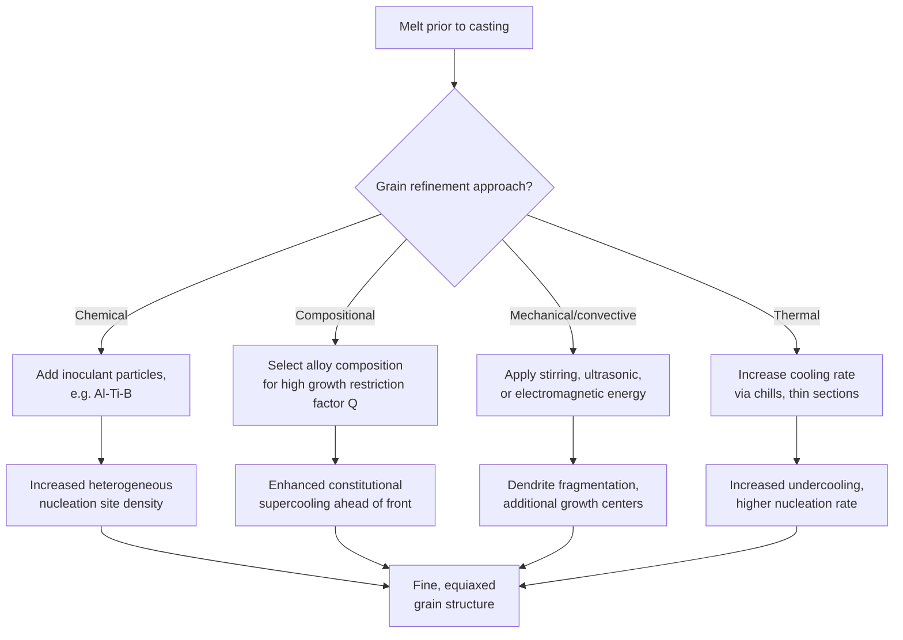

## Grain Refinement Techniques

### Definition and Purpose

Grain refinement encompasses the range of process and alloy-design strategies used to deliberately reduce as-cast (or as-solidified) grain size, producing a finer, more uniform microstructure. Since grain size directly influences strength (Hall-Petch relationship), ductility, fatigue resistance, feeding/porosity behavior, and hot tearing susceptibility, grain refinement is among the most widely applied practical interventions in casting and solidification processing.

**Key Points**

- Finer grain size generally improves strength ($\sigma_y=\sigma_0+k_yd^{-1/2}$), ductility, toughness, and fatigue resistance simultaneously — one of relatively few strengthening approaches that does not trade strength against ductility
- Finer, more equiaxed grain structures also generally reduce hot tearing susceptibility (better accommodation of solidification strain across more, smaller grains) and can improve feeding behavior (more isotropic, less directionally restrictive interdendritic channel network) compared to coarse columnar structures
- Grain refinement techniques act by either increasing the **nucleation rate/site density** during solidification or by physically **disrupting/fragmenting** the growing solid structure — essentially all techniques operate through one or both of these mechanisms

### Mechanism 1: Chemical Grain Refinement (Inoculation)

**Key Points**

- Involves deliberate addition of a **grain refiner** (inoculant) to the melt shortly before casting, introducing highly potent heterogeneous nucleation substrate particles distributed throughout the bulk liquid
- Increases nucleation site density dramatically compared to relying on native mold-wall or oxide-film nucleation alone, suppressing columnar growth and promoting a fine, fully equiaxed grain structure
- Effectiveness depends on the wetting angle $\theta$ between the inoculant particle and the solidifying phase (per heterogeneous nucleation theory) — good crystallographic/lattice matching between inoculant and solidifying metal generally produces low $\theta$ and high potency

**Example**

In aluminum casting, **Al-Ti-B master alloys** (typically Al-5Ti-1B or similar) are the standard commercial grain refiner, added as rod or waffle ingot shortly before pouring. TiB₂ particles act as the primary nucleant substrate, often assisted by a thin Al₃Ti layer forming via peritectic reaction at the particle surface (the "peritectic hulk" or "duplex nucleation" model), providing an effective low-wetting-angle nucleation site for primary α-Al.

**Key Points**

- Other systems use analogous inoculant chemistries: Zr additions in magnesium alloys, TiB₂/TiC in some steels, and various proprietary refiner chemistries for other alloy families
- Grain refiner fade (loss of effectiveness with holding time after addition, due to particle agglomeration/settling or dissolution) is a practical process control concern — refiner is typically added as close to pouring as practical, and fade behavior is alloy- and refiner-chemistry-specific
- [Inference] The precise nucleation mechanism (direct heterogeneous nucleation on the inoculant particle itself vs. peritectic-reaction-mediated nucleation) remains, for some systems, an area of ongoing mechanistic study; the practical effectiveness of established commercial refiners is well-demonstrated empirically even where the finest mechanistic details are still debated

### Mechanism 2: Alloying/Solute-Based Grain Refinement

**Key Points**

- Certain solute additions, even without forming discrete heterogeneous nucleant particles, can refine grain size through **growth restriction** — solute partitioning at the growing interface creates constitutional supercooling ahead of the front, which promotes additional nucleation events in that undercooled zone and also slows the advance of existing grains, allowing more nuclei to survive and contribute to the final structure
- This effect is often quantified via the **growth restriction factor** $Q=mC_0(k-1)$, where higher $Q$ values are associated with finer resulting grain size for a given nucleant population — this connects alloy composition directly to grain refinement potential independent of, or in combination with, inoculant addition
- [Inference] Growth restriction and chemical inoculation are generally understood to act synergistically (potent nucleant sites plus high growth restriction produce the finest structures), though the relative quantitative contribution of each mechanism is alloy-system- and composition-specific

### Mechanism 3: Dendrite Fragmentation (Mechanical/Convective)

**Key Points**

- Physical disruption of the growing solidification front — via mechanical stirring, ultrasonic/vibrational energy, electromagnetic stirring, or natural convection — can fracture dendrite arms (particularly the necked, thinner regions of secondary arms undergoing coarsening) and disperse the fragments into the bulk liquid
- Each dendrite fragment can act as an additional effective nucleation site (or, more precisely, as a pre-existing solid seed requiring no further nucleation barrier), increasing the population of growth centers and refining final grain size
- **Mechanical/electromagnetic stirring**: commonly used in continuous casting processes to promote equiaxed grain structure and reduce macrosegregation by disrupting columnar dendrite growth
- **Ultrasonic melt treatment**: acoustic cavitation in the melt can both promote nucleation (via cavitation-induced pressure fluctuations affecting local melting point) and fragment growing dendrites, applied in some aluminum and magnesium casting processes
- [Inference] The relative contribution of cavitation-enhanced nucleation versus dendrite fragmentation in ultrasonic grain refinement is an area with some ongoing research interest; both mechanisms are generally considered to contribute, with their relative importance depending on processing parameters (power, frequency, melt superheat) and alloy system

### Mechanism 4: Rapid Cooling / Increased Undercooling

**Key Points**

- Simply increasing the cooling rate (via thinner sections, higher-conductivity molds, chills, or rapid solidification processes) increases the achievable undercooling before nucleation occurs, which per classical nucleation theory increases nucleation rate and reduces the time available for existing grains to grow before impingement — both effects favor finer grain size
- This is the mechanism underlying grain refinement observed in chill zones adjacent to mold walls, and is exploited deliberately in rapid solidification processing (melt spinning, atomization, some additive manufacturing processes) to achieve very fine, sometimes metastable/amorphous microstructures
- Distinct from chemical inoculation in that it does not require added nucleant particles, relying instead purely on thermal/kinetic effects, though the two approaches are often combined in practice

### Comparative Summary of Techniques

| Technique | Primary Mechanism | Typical Application |
| --- | --- | --- |
| Chemical inoculation (Al-Ti-B, etc.) | Heterogeneous nucleation site addition | Aluminum, magnesium sand/permanent-mold casting |
| Growth restriction (alloying) | Constitutional supercooling promoting nucleation, restricting growth | Combined with inoculation; inherent to alloy composition |
| Mechanical/electromagnetic stirring | Dendrite fragmentation, convective mixing | Continuous casting, large ingots |
| Ultrasonic treatment | Cavitation-assisted nucleation + fragmentation | Aluminum/magnesium melt treatment |
| Rapid cooling/chills | Increased undercooling, higher nucleation rate | Chill casting, rapid solidification processing |

### Grain Refinement Process Flow

### Evaluating Grain Refiner Effectiveness

**Key Points**

- Standard evaluation methods include the **TP-1 test** (a standardized aluminum industry test casting used to compare grain refiner performance under controlled cooling conditions) and general metallographic grain size measurement (linear intercept or ASTM grain size number) on production or test castings
- Effectiveness is assessed by both the **degree of refinement** achieved (final grain size) and the **fade resistance** (how long the effect persists after addition, relevant to holding-furnace practice before casting)
- [Inference] Selecting an appropriate refiner addition level and timing generally involves balancing refinement effectiveness against cost, fade behavior, and potential side effects (e.g., excessive TiB₂ addition can, in some circumstances, promote unwanted particle agglomeration or affect fluidity) — optimal practice is typically established via trial casting and process-specific qualification rather than a single universal addition rate

### Practical Considerations and Trade-offs

**Key Points**

- Excessive grain refiner addition beyond the level needed for effective refinement generally provides diminishing returns and unnecessary cost, and in some cases can introduce inclusion-related defects if refiner particles agglomerate
- Mechanical/electromagnetic stirring approaches require capital equipment investment and are generally applied in higher-volume or larger-scale processes (continuous casting) rather than simple sand casting
- Grain refinement effectiveness and required approach differ substantially across alloy families — a refiner effective in aluminum systems is not necessarily applicable or effective in magnesium, steel, or nickel-based systems, requiring system-specific refiner chemistry and process qualification
- Combining multiple mechanisms (e.g., chemical inoculation together with controlled cooling rate) is common practice, since the mechanisms are largely complementary rather than mutually exclusive

### Common Pitfalls

- Assuming a single grain refiner chemistry or addition rate transfers directly between different alloy systems without requalification
- Neglecting refiner fade when refiner is added well before pouring (e.g., in a holding furnace) — effectiveness can diminish significantly over time depending on refiner chemistry and holding conditions
- Treating grain refinement purely as a nucleation-site addition problem while ignoring growth restriction (alloy composition) effects, which can be equally or more significant depending on the system
- Assuming mechanical/ultrasonic grain refinement techniques act purely via one mechanism (e.g., fragmentation alone) when cavitation-enhanced nucleation may also contribute meaningfully
- Over-adding inoculant in pursuit of maximum refinement without considering cost, potential agglomeration defects, or diminishing marginal effectiveness beyond the alloy-specific optimal addition level

**Related Topics**

- Nucleation During Solidification
- Homogeneous versus Heterogeneous Nucleation
- Dendritic Growth and Solidification Morphology
- Hall-Petch Relationship and Grain Size Strengthening
- Continuous Casting Process Fundamentals
- Hot Tearing and Hot Cracking in Castings