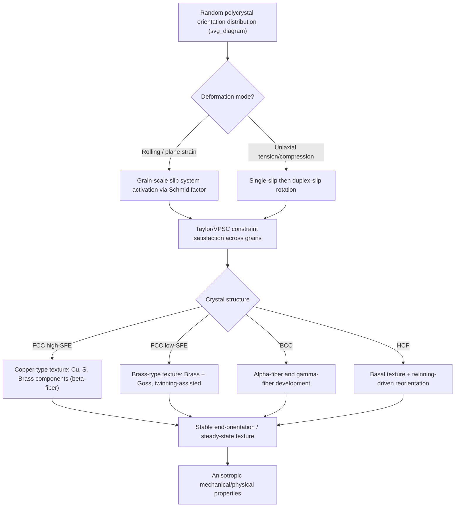

## Texture Development During Deformation

### Definition and Physical Origin

Crystallographic texture refers to the non-random distribution of crystallite (grain) orientations within a polycrystalline material. During plastic deformation, grains do not rotate randomly — instead, each grain's lattice rotates toward preferred orientations dictated by the active slip or twinning systems and the imposed strain path. The cumulative effect across billions of grains produces a statistically preferred orientation distribution known as deformation texture.

Texture arises because plastic deformation by slip is crystallographically constrained: dislocations glide on specific {hkl}⟨uvw⟩ slip systems, and the lattice must rotate to maintain compatibility between the imposed macroscopic strain and the geometry of slip. This rotation is not arbitrary; it follows deterministic crystal-plasticity rules, so grains starting from different initial orientations converge toward a limited set of stable end-orientations, or texture components.

### Why Texture Matters

**Key Points**

- Textured materials exhibit anisotropic mechanical, magnetic, and physical properties (Young's modulus, yield strength, formability, magnetostriction, etc.)
- Texture governs earing in deep-drawn cups, ridging in stainless sheet, and Lankford ($r$-value) anisotropy in sheet-metal forming
- Texture control is deliberately engineered in transformer steels (Goss texture for low core loss), beverage-can stock (minimizing earing), and Zircaloy nuclear cladding (controlling irradiation growth)
- Texture measurements (via X-ray diffraction pole figures, EBSD, or neutron diffraction) are used to validate crystal-plasticity models and infer deformation history

### Crystallographic Rotation Mechanics

**Single Crystal Rotation Under Tension**

For an FCC or BCC single crystal pulled in tension, slip occurs on the system with the highest Schmid factor:

$$\tau = \sigma \cos\phi \cos\lambda$$

where $\phi$ is the angle between the tensile axis and the slip plane normal, and $\lambda$ is the angle between the tensile axis and the slip direction. As slip proceeds, the crystal lattice rotates such that the slip direction rotates toward the tensile axis (in tension) — this is the classical **Schmid and Boas** rotation. When the tensile axis reaches a symmetry boundary between two equally stressed slip systems, duplex slip is activated and rotation direction changes, driving grains toward stable end-orientations at the corners of the standard stereographic triangle (e.g., ⟨100⟩ and ⟨111⟩ for FCC tension).

**Polycrystal Constraints: Taylor Theory**

In a polycrystalline aggregate, each grain must accommodate an externally imposed, spatially uniform strain while remaining compatible with its neighbors. **Taylor's full-constraints model** assumes each grain undergoes the same strain tensor as the bulk, requiring a minimum of five independent slip systems (von Mises criterion) to accommodate an arbitrary shape change. Taylor's theory selects, among all combinations of five active slip systems, the one that minimizes the total internal work:

$$dW = \sum_{s} \tau_c^s \, d\gamma^s = M \cdot \tau_c \cdot d\bar\varepsilon$$

where $M$ is the **Taylor factor**, a dimensionless geometric quantity relating polycrystal flow stress to single-crystal critical resolved shear stress (CRSS):

$$\sigma = M \tau_c$$

The Taylor factor is orientation-dependent; averaging $M$ over an initial orientation distribution and tracking its evolution predicts both texture-hardening and the macroscopic stress-strain response (Taylor/Bishop-Hill polycrystal plasticity).

**Relaxed-Constraints and Self-Consistent Models**

Full-constraints Taylor theory over-predicts hardening and produces textures sharper than experimentally observed, especially in rolling of thin sheet where grains are flattened (pancake-shaped) and can relax certain shear-strain components at free surfaces. Refinements include:

- **Relaxed-constraints (RC) Taylor models** — permit selected shear components to be relaxed for grains with specific shape ratios
- **Self-consistent (Eshelby-based) models** (e.g., **VPSC** — Viscoplastic Self-Consistent) — treat each grain as an ellipsoidal inclusion in a homogeneous effective medium, allowing local stress/strain to differ from the macroscopic average
- **Crystal Plasticity Finite Element Method (CPFEM)** — solves full grain-to-grain compatibility and equilibrium using finite elements, capturing intragranular orientation gradients and neighbor interactions [Inference: computationally intensive; adoption is dictated by available computing resources and required fidelity]

### Deformation Textures by Crystal Structure

**FCC Metals (Cu, Al, Ni, austenitic steels, Ag)**

Rolling texture in FCC metals falls into two broad classes depending on stacking-fault energy (SFE):

- **Copper-type (high-SFE) texture**: dominated by the **Copper {112}⟨111⟩**, **S {123}⟨634⟩**, and **Brass {110}⟨112⟩** components, forming a continuous orientation "tube" (the β-fiber) connecting these three ideal orientations in Euler space
- **Brass-type (low-SFE) texture**: found in low-SFE metals (brass, silver, and Cu-based alloys with SFE < ~20 mJ/m²) where deformation twinning competes with slip; texture is dominated by the **Brass {110}⟨112⟩** and **Goss {110}⟨001⟩** components

The transition between copper-type and brass-type texture is governed by the propensity for cross-slip (suppressed at low SFE, promoting planar slip and twinning) [Inference: transition strain/SFE thresholds vary with alloy composition and deformation temperature].

**BCC Metals (α-Fe, low-carbon steels, Nb, Mo, W)**

BCC rolling texture is characterized by two major fiber textures in Euler space:

- **α-fiber**: ⟨110⟩ parallel to the rolling direction (RD), spanning from {001}⟨110⟩ to {111}⟨110⟩
- **γ-fiber**: {111} parallel to the normal direction (ND), spanning {111}⟨110⟩ to {111}⟨112⟩

The γ-fiber is particularly significant in steel sheet metallurgy — a strong, homogeneous γ-fiber correlates with high normal anisotropy (high $\bar{r}$-value), which is desirable for deep-drawability in automotive body panels.

**HCP Metals (Mg, Ti, Zr, Zn, Be)**

HCP metals develop the most distinctive textures because of limited independent slip systems at room temperature (basal $\{0001\}\langle11\bar{2}0\rangle$ and prismatic $\{10\bar{1}0\}\langle11\bar{2}0\rangle$ slip alone provide only 4 independent systems, violating the von Mises criterion) — deformation twinning becomes mechanically essential:

- **Magnesium**: rolling produces a strong **basal texture** with basal planes tilted toward the rolling direction; $\{10\bar{1}2\}$ extension twinning and $\{10\bar{1}1\}$ contraction twinning reorient grains by ~86° and ~56° respectively, causing abrupt texture changes not predicted by slip alone
- **Titanium (α-Ti)**: develops strong basal or transverse-tilted basal textures depending on Al content and twinning activity; c/a ratio (1.587, below ideal 1.633) affects the relative CRSS of prismatic vs. basal slip
- **Zirconium**: similar behavior to Ti, critical for nuclear fuel cladding where texture controls irradiation-induced dimensional growth anisotropy

### Texture Representation

**Pole Figures**

A pole figure is a stereographic projection showing the distribution of a specific crystallographic plane normal (e.g., {111}) relative to the sample reference frame (RD, TD, ND for rolled sheet). Measured directly by X-ray or neutron diffraction, pole figures are the traditional experimental texture fingerprint.

**Orientation Distribution Function (ODF)**

The ODF, $f(g)$, is a three-dimensional function over orientation space (parameterized by Euler angles $\varphi_1, \Phi, \varphi_2$ in the Bunge convention) representing the volume fraction of crystallites with orientation $g$:

$$dV/V = f(g) \, dg$$

The ODF is reconstructed from multiple pole figures via harmonic series expansion or direct methods, and provides a complete, projection-free texture description — essential for anisotropic property prediction. ODFs are typically visualized as sections at constant $\varphi_2$ (commonly $\varphi_2 = 0°, 45°, 65°$ for cubic metals).

**Texture Index and Sharpness**

Texture sharpness is quantified by the **texture index** $J$:

$$J = \int f(g)^2 \, dg$$

$J = 1$ corresponds to a random (untextured) polycrystal; higher values indicate sharper texture. An analogous entropy-based measure is also used in some formulations [Inference: exact normalization conventions vary by software package, e.g., popLA vs. MTEX].

### Mermaid Diagram: Texture Evolution Pathway

### SVG Diagram: FCC Rolling Texture β-Fiber Schematic (Euler Space, φ2 = 45° Section)

<svg xmlns="http://www.w3.org/2000/svg" viewBox="0 0 640 460" font-family="Helvetica, Arial, sans-serif">
<text x="320" y="30" text-anchor="middle" font-size="18" font-weight="bold" fill="#1a1a1a">FCC Rolling Texture: β-Fiber in φ2 = 45° ODF Section (svg_diagram)</text>

<line x1="80" y1="400" x2="580" y2="400" stroke="#333" stroke-width="2" />
<line x1="80" y1="400" x2="80" y2="60" stroke="#333" stroke-width="2" />
<text x="330" y="430" text-anchor="middle" font-size="14" fill="#333">φ1 (0° to 90°)</text>
<text x="35" y="230" text-anchor="middle" font-size="14" fill="#333" transform="rotate(-90 35 230)">Φ (0° to 90°)</text>

<text x="80" y="418" text-anchor="middle" font-size="11" fill="#555">0°</text>

<text x="580" y="418" text-anchor="middle" font-size="11" fill="#555">90°</text>

<text x="65" y="405" text-anchor="end" font-size="11" fill="#555">0°</text>

<text x="65" y="65" text-anchor="end" font-size="11" fill="#555">90°</text>

<path d="M 130 380 C 220 320, 300 260, 360 200 C 420 150, 480 110, 540 90" fill="none" stroke="`#c0392b`" stroke-width="4" stroke-dasharray="0" />

<circle cx="130" cy="380" r="9" fill="#e67e22" stroke="#1a1a1a" stroke-width="1.5" />
<text x="130" y="410" text-anchor="middle" font-size="13" font-weight="bold" fill="#1a1a1a">Brass</text>
<text x="130" y="424" text-anchor="middle" font-size="11" fill="#555">{110}⟨112⟩</text>
<circle cx="360" cy="200" r="9" fill="#2980b9" stroke="#1a1a1a" stroke-width="1.5" />
<text x="360" y="190" text-anchor="middle" font-size="13" font-weight="bold" fill="#1a1a1a">S</text>
<text x="360" y="176" text-anchor="middle" font-size="11" fill="#555">{123}⟨634⟩</text>
<circle cx="540" cy="90" r="9" fill="#27ae60" stroke="#1a1a1a" stroke-width="1.5" />
<text x="540" y="75" text-anchor="middle" font-size="13" font-weight="bold" fill="#1a1a1a">Copper</text>
<text x="540" y="61" text-anchor="middle" font-size="11" fill="#555">{112}⟨111⟩</text>

<rect x="380" y="340" width="180" height="80" fill="#f7f7f7" stroke="#999" stroke-width="1" rx="6" />
<line x1="392" y1="360" x2="420" y2="360" stroke="#c0392b" stroke-width="4" />
<text x="428" y="365" font-size="12" fill="#333">β-fiber (continuous)</text>
<circle cx="406" cy="385" r="6" fill="#e67e22" />
<text x="428" y="390" font-size="12" fill="#333">Ideal texture component</text>
<text x="392" y="410" font-size="11" fill="#777">Schematic — not exact ODF intensities</text>
</svg>

### Recrystallization Texture vs. Deformation Texture

**Key Points**

- Deformation texture forms during plastic straining; recrystallization texture forms during subsequent annealing via nucleation and growth of new strain-free grains
- Recrystallization texture can *retain* the deformation texture (oriented nucleation), *replace* it with a new component (oriented growth, e.g., **Cube {001}⟨100⟩** in FCC metals), or produce a randomized texture, depending on stored energy distribution and annealing twin activity
- In steels, the deformation γ-fiber often partially transforms into a recrystallization texture retaining γ-fiber character while adding {001}⟨110⟩-type components, directly affecting final sheet formability [Inference: exact component evolution is alloy- and processing-route-dependent]

### Experimental Characterization Methods

**Example**

| Technique | Spatial Resolution | Output | Typical Use Case |
| --- | --- | --- | --- |
| X-ray diffraction (pole figures) | Bulk (mm–cm, averaged) | Pole figures → ODF | Routine QC of sheet/plate texture |
| Neutron diffraction | Bulk, deep penetration | Full ODF, bulk statistics | Thick sections, in-situ loading studies |
| EBSD (SEM-based) | Sub-micron to μm, grain-resolved | Orientation maps, local ODF, misorientation | Correlating texture with microstructure/grain boundaries |
| Synchrotron X-ray (3DXRD/HEDM) | μm, non-destructive, in-situ | Grain orientation evolution during deformation | In-situ study of individual grain rotation |

### Worked Example: Taylor Factor and Flow Stress Anisotropy

Consider a rolled FCC sheet where tensile tests are performed along RD, 45° to RD, and TD. If EBSD-derived Taylor factors are $M_{RD} = 3.1$, $M_{45°} = 2.7$, $M_{TD} = 3.3$ (values illustrative of a textured low-carbon-steel-like response), and the CRSS $\tau_c = 40\ \text{MPa}$, the predicted yield stresses are:

$$\sigma_{RD} = M_{RD}\tau_c = 3.1 \times 40 = 124\ \text{MPa}$$

$$\sigma_{45°} = M_{45°}\tau_c = 2.7 \times 40 = 108\ \text{MPa}$$

$$\sigma_{TD} = M_{TD}\tau_c = 3.3 \times 40 = 132\ \text{MPa}$$

This directly predicts the **planar anisotropy** ($\Delta r$) responsible for earing during cup-drawing — ears form at angles where $r$-value (related inversely to $M$ variation) is locally minimum or maximum around the sheet plane [Inference: quantitative earing height also depends on friction, die geometry, and blank-holder force, not texture alone].

### Related Topics

- Deformation twinning mechanisms and Schmid-law violations
- Recrystallization texture and the Cube component in FCC metals
- Lankford coefficient ($r$-value) and formability limit diagrams
- Crystal Plasticity Finite Element Method (CPFEM) fundamentals
- Grain boundary character distribution and texture-microstructure coupling
- Goss texture engineering in grain-oriented electrical steel
- Viscoplastic Self-Consistent (VPSC) modeling framework
- Stacking fault energy and its role in deformation mechanism selection