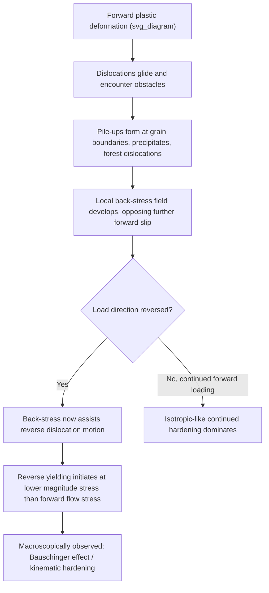

## The Bauschinger Effect

### Definition

The Bauschinger effect describes the phenomenon in which a metal that has been plastically deformed in one direction (e.g., tension) exhibits a **reduced yield strength** when subsequently loaded in the reverse direction (e.g., compression), compared to the yield strength that would be measured in that reverse direction without prior forward straining. It is a manifestation of directional strain-path-dependent hardening and constitutes clear evidence that isotropic hardening models are physically incomplete for describing real metal plasticity under load reversal.

Discovered and systematically documented by Johann Bauschinger in 1881, the effect is universal across metallic materials to varying degrees, though its magnitude depends strongly on alloy microstructure, prior strain, and precipitate/dispersoid content.

### Key Points

- Reverse yield stress magnitude is *smaller* than the forward flow stress at the point of unloading
- The effect is a **kinematic hardening** phenomenon: the yield surface translates in stress space rather than expanding uniformly (isotropic hardening)
- Present in essentially all crystalline metals and alloys, but especially pronounced in precipitation-hardened alloys, dual-phase steels, and materials with strong dislocation substructure (cells, pile-ups)
- Critically important in components subjected to cyclic or reversed loading: sheet metal forming (springback, roll-forming), seismic-resistant structures, fatigue life prediction, and residual stress engineering

### Physical/Microstructural Origin

**Dislocation Pile-Up Mechanism**

During forward plastic deformation, dislocations moving on active slip systems encounter obstacles — grain boundaries, precipitates, forest dislocations, or other barriers — and form **pile-ups**. These pile-ups generate a local back-stress that opposes further dislocation motion in the forward direction. Upon load reversal, this same back-stress now *assists* dislocation motion in the reverse direction, lowering the stress required to initiate reverse yielding. This is the classical explanation attributed to **Orowan** and further developed in dislocation pile-up theory.

**Composite/Two-Phase Model (Mughrabi)**

In materials with heterogeneous dislocation structures — particularly cyclically deformed metals forming dislocation cell structures — the microstructure can be idealized as a composite of "hard" (dislocation-dense cell walls) and "soft" (dislocation-poor cell interiors) regions. Elastic and plastic incompatibility between these regions during forward loading generates internal (long-range) back-stresses; upon reversal, these back-stresses promote early reverse yielding in the soft regions.

**Precipitate/Particle Bypass Mechanisms**

In age-hardened alloys (Al-Cu, Al-Zn-Mg, Ni-based superalloys), dislocations bypass shearable or non-shearable precipitates by looping (Orowan looping) or cross-slip, leaving residual dislocation loops around particles. These loops generate local back-stresses proportional to precipitate spacing and dislocation density, producing a Bauschinger effect that scales with precipitate volume fraction and coherency strain [Inference: the precise magnitude depends on precipitate size, coherency, and interparticle spacing, which vary by alloy and aging condition].

**Grain Boundary and Multi-Phase Effects**

In polycrystals, elastic and plastic anisotropy between neighboring grains (grain-to-grain incompatibility stresses) and, in multi-phase alloys (e.g., dual-phase ferrite-martensite steels), the elastic mismatch between hard and soft phases both contribute additional intergranular/interphase back-stress components superimposed on the dislocation-pile-up mechanism.

### Mathematical/Constitutive Description

**Isotropic vs. Kinematic Hardening**

For a uniaxial stress state, the yield condition can be written generally as:

$$f = |\sigma - \alpha| - \sigma_y = 0$$

where $\sigma_y$ is the size of the yield surface (constant under pure kinematic hardening) and $\alpha$ is the **back-stress**, representing the translation of the yield surface center in stress space. Under **isotropic hardening alone** ($\alpha = 0$ always), the model predicts equal forward and reverse yield stress magnitudes — failing to capture the Bauschinger effect. Kinematic hardening, in which $\alpha$ evolves with plastic strain, is required to reproduce it.

**Armstrong-Frederick Nonlinear Kinematic Hardening**

A widely used evolution law for the back-stress is:

$$d\alpha = C \, d\varepsilon^p - \gamma \, \alpha \, |d\varepsilon^p|$$

where $C$ is the initial (linear) hardening modulus and $\gamma$ is a dynamic recovery coefficient controlling the saturation of back-stress with accumulated plastic strain $\varepsilon^p$. This nonlinear formulation (and its multi-term extensions, e.g., Chaboche model summing several such back-stress components) reproduces the smooth, rounded reverse-yielding transition and cyclic softening/hardening observed experimentally, unlike simple linear (Prager) kinematic hardening.

**Bauschinger Effect Parameter (BEP)**

A common quantitative metric is:

$$\text{BEP} = \frac{\sigma_f - \sigma_r}{\sigma_f}$$

where $\sigma_f$ is the forward flow stress at unloading and $\sigma_r$ is the reverse yield stress (often defined at a small offset strain, e.g., 0.2% or by a back-extrapolation method). $\text{BEP} = 0$ indicates no Bauschinger effect (pure isotropic hardening); higher values indicate stronger reverse-yield softening.

### Stress-Strain Curve Illustration

**Example**

Consider a low-alloy steel strained in tension to $\varepsilon^p = 5\%$, reaching a flow stress $\sigma_f = 450$ MPa, then unloaded and reloaded in compression:

- If the material obeyed pure isotropic hardening, reverse (compressive) yielding would begin at $-450$ MPa
- With the Bauschinger effect present, reverse yielding instead begins at approximately $-280$ to $-350$ MPa (BEP ≈ 0.22–0.38, illustrative range) — a substantially "softer" reverse response
- The transition from elastic reverse loading to reverse plastic flow is typically gradual and rounded (not sharp), reflecting the progressive activation of differently-oriented microstructural regions rather than a single discrete threshold

### SVG Diagram: Forward-Reverse Stress-Strain Response Showing the Bauschinger Effect

<svg xmlns="http://www.w3.org/2000/svg" viewBox="0 0 640 480" font-family="Helvetica, Arial, sans-serif">
<text x="320" y="28" text-anchor="middle" font-size="18" font-weight="bold" fill="#1a1a1a">Bauschinger Effect: Forward-Reverse Loading (svg_diagram)</text>

<line x1="320" y1="440" x2="320" y2="60" stroke="#333" stroke-width="1.5" />
<line x1="60" y1="250" x2="580" y2="250" stroke="#333" stroke-width="1.5" />
<text x="590" y="255" font-size="13" fill="#333">ε (strain)</text>
<text x="330" y="70" font-size="13" fill="#333">σ (stress)</text>
<text x="330" y="460" font-size="12" fill="#666">(compression)</text>
<text x="470" y="460" font-size="12" fill="#666">(tension)</text>

<path d="M 320 250 Q 380 130, 470 100" fill="none" stroke="#999" stroke-width="2" />
<path d="M 470 100 L 470 250" fill="none" stroke="#999" stroke-width="1.5" stroke-dasharray="5,4" />
<path d="M 470 250 Q 400 340, 320 400" fill="none" stroke="#999" stroke-width="2" stroke-dasharray="6,3" />
<text x="200" y="410" font-size="12" fill="#777">Isotropic hardening prediction</text>
<text x="200" y="425" font-size="12" fill="#777">(symmetric reverse yield)</text>

<path d="M 320 250 Q 380 130, 470 100" fill="none" stroke="#c0392b" stroke-width="3.5" />
<path d="M 470 100 L 470 250" fill="none" stroke="#c0392b" stroke-width="3.5" />
<path d="M 470 250 Q 440 275, 415 310 Q 380 350, 330 350" fill="none" stroke="#2980b9" stroke-width="3.5" />

<circle cx="470" cy="100" r="6" fill="#c0392b" />
<text x="480" y="95" font-size="12" fill="#1a1a1a">σf (forward flow stress)</text>
<circle cx="330" cy="350" r="6" fill="#2980b9" />
<text x="200" y="345" font-size="12" fill="#1a1a1a">σr (reduced reverse yield)</text>
<circle cx="320" cy="400" r="5" fill="#999" />
<text x="140" y="400" font-size="11" fill="#777">-σf (isotropic prediction)</text>

<rect x="60" y="60" width="230" height="70" fill="#f7f7f7" stroke="#999" stroke-width="1" rx="6" />
<line x1="72" y1="78" x2="100" y2="78" stroke="#c0392b" stroke-width="3.5" />
<text x="106" y="82" font-size="12" fill="#333">Forward loading (tension)</text>
<line x1="72" y1="98" x2="100" y2="98" stroke="#2980b9" stroke-width="3.5" />
<text x="106" y="102" font-size="12" fill="#333">Reverse loading (compression)</text>
<line x1="72" y1="118" x2="100" y2="118" stroke="#999" stroke-width="2" stroke-dasharray="5,4" />
<text x="106" y="122" font-size="12" fill="#333">Isotropic hardening (no effect)</text>
</svg>

### Mermaid Diagram: Mechanistic Origin of the Bauschinger Effect

### Relation to Other Path-Dependent Phenomena

**Key Points**

- **Permanent softening**: after load reversal, the subsequent stress-strain curve may lie below the monotonic curve extrapolated from the same strain — a related but distinct effect from the initial reduced yield point
- **Transient hardening/softening**: some materials exhibit a brief period of rapid hardening rate change immediately after reversal before "re-establishing" a hardening rate similar to monotonic loading
- **Cross-hardening / latent hardening**: related phenomena where prior deformation in one strain path affects yielding along a *different* (non-collinear) strain path, relevant in multiaxial forming operations
- Distinguish the Bauschinger effect (uniaxial or collinear load reversal) from more general **strain-path change effects** studied in sheet-forming mechanics, though both stem from similar dislocation substructure evolution

### Engineering Significance and Applications

**Example**

1. **Springback prediction in sheet metal forming**: Roll-forming, bending, and stamping operations subject material to sequential bending-unbending strain reversals (e.g., as sheet passes over a die radius). Finite-element springback simulations that use only isotropic hardening models systematically over-predict springback recovery; incorporating kinematic (or mixed isotropic-kinematic) hardening models with calibrated Bauschinger parameters is standard practice in automotive sheet-forming simulation.
2. **Residual stress relief via reverse loading**: Controlled reverse plastic straining (e.g., in autofrettage of pressure vessels and gun barrels) exploits the Bauschinger effect — engineers must account for the reduced reverse yield to correctly predict the resulting residual stress distribution.
3. **Low-cycle fatigue**: Because fatigue involves repeated load reversals, the Bauschinger effect directly governs the shape of stabilized hysteresis loops and is embedded in cyclic plasticity models (Chaboche, Ohno-Wang) used for fatigue life prediction in turbine components, automotive suspension parts, and pressure vessel nozzles.
4. **Cold-worked component reliability**: Structural members that are cold-formed (e.g., roll-formed steel studs, drawn tubing) and later experience service loads in the reverse direction from the forming strain will yield at a lower stress than anticipated from simple monotonic tensile data, a consideration in structural design codes for cold-formed steel.

### Experimental Measurement Approaches

| Method | Description | Typical Application |
| --- | --- | --- |
| Tension-compression testing | Direct uniaxial load reversal on a single specimen (often with anti-buckling fixtures for thin sheet) | Standard characterization of BEP and kinematic hardening parameters |
| Cyclic (push-pull) testing | Repeated load reversals to stabilized hysteresis loop | Fatigue-relevant back-stress evolution, Chaboche parameter fitting |
| In-situ neutron/X-ray diffraction during reversal | Measures lattice strain evolution in different phases/grain families | Decomposing intergranular vs. intragranular contributions to back-stress |
| Shear reversal tests (e.g., simple shear on sheet) | Avoids buckling issues inherent to thin-sheet compression testing | Sheet-metal-specific Bauschinger characterization for forming simulation |

### Mitigating or Accounting for the Bauschinger Effect

**Next Steps**

- Calibrate combined isotropic-kinematic hardening models (e.g., Yoshida-Uemori, Chaboche) against measured forward-reverse stress-strain data rather than relying on monotonic tensile data alone
- For springback-sensitive forming operations, incorporate strain-path-dependent constitutive models into finite-element process simulations
- Account for BEP evolution with prior plastic strain magnitude — the effect is generally not constant but decreases at very large prior strains as dislocation structures saturate [Inference: saturation behavior and its strain threshold are alloy- and microstructure-specific]
- Consider stress-relief or aging treatments that may partially restore isotropic-like yield symmetry by allowing recovery of back-stress-generating dislocation configurations

### Related Topics

- Isotropic vs. kinematic hardening constitutive models (Chaboche, Armstrong-Frederick, Yoshida-Uemori)
- Cyclic plasticity and low-cycle fatigue (Coffin-Manson relationship)
- Springback prediction in sheet metal forming
- Residual stress engineering via autofrettage
- Dislocation pile-up theory and Orowan looping
- Composite (Mughrabi) model of cyclic deformation
- Strain-path change effects and cross-hardening in multiaxial forming
- Precipitation hardening and coherency strain effects on flow stress