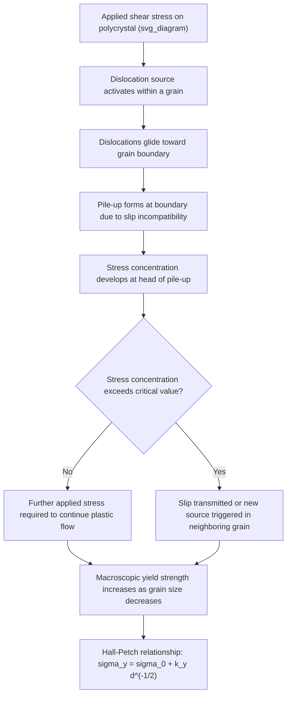

## Grain Boundary Strengthening and the Hall Petch Relationship

### Definition and Physical Basis

Grain boundary strengthening is the increase in yield strength of a polycrystalline material achieved by reducing average grain size. Grain boundaries act as barriers to dislocation motion: because adjacent grains have different crystallographic orientations, a dislocation gliding on an active slip system in one grain cannot simply continue into the neighboring grain — the slip plane orientation and Burgers vector direction are discontinuous across the boundary. Dislocations pile up against grain boundaries, and additional applied stress is required to transmit slip activity (via stress concentration triggering new dislocation sources) into adjacent grains. Since a finer grain structure provides more boundary area per unit volume, it produces more effective barriers and thus higher strength.

### The Hall-Petch Relationship

**Key Points**

- Formulated independently by **E.O. Hall (1951)** and **N.J. Petch (1953)**
- Expresses yield strength as an inverse square-root function of average grain diameter
- One of the few strengthening mechanisms that *simultaneously* increases both strength and toughness (in contrast to most hardening mechanisms, which trade ductility for strength)
- Empirically validated across a very wide range of grain sizes (roughly micrometers to tens of micrometers) in numerous metallic systems

The relationship is expressed as:

$$\sigma_y = \sigma_0 + k_y \, d^{-1/2}$$

where:

- $\sigma_y$ = macroscopic yield strength
- $\sigma_0$ = friction stress (lattice resistance to dislocation motion in a single crystal, sometimes interpreted as the intrinsic Peierls-Nabarro stress plus solid-solution contributions)
- $k_y$ = Hall-Petch slope (strengthening coefficient), material- and mechanism-dependent
- $d$ = average grain diameter

A plot of $\sigma_y$ versus $d^{-1/2}$ yields a straight line for most conventional polycrystalline metals over the micrometer grain-size regime, with intercept $\sigma_0$ and slope $k_y$.

### Derivation: Dislocation Pile-Up Model (Eshelby-Frank-Nabarro)

The classical derivation considers a dislocation pile-up of $n$ dislocations against a grain boundary, generated from a source at or near the grain center. The pile-up produces a stress concentration at its head that scales with the number of dislocations in the pile-up and the applied resolved shear stress $\tau$. For a pile-up length approximately equal to half the grain diameter $d/2$, the number of dislocations in the pile-up is:

$$n \approx \frac{k \, \tau \, d}{G b}$$

where $G$ is the shear modulus, $b$ is the Burgers vector magnitude, and $k$ is a geometric constant. The stress at the head of the pile-up, $\tau^*$, required to activate a source in the neighboring grain (or to propagate slip across the boundary) is:

$$\tau^* = n\tau$$

Setting $\tau^*$ equal to a critical stress $\tau_c$ needed to trigger the neighboring grain and solving for the applied stress $\tau$ required for continued yielding leads, after substitution and rearrangement, to the inverse-square-root grain-size dependence:

$$\tau_y = \tau_0 + k'\left(\frac{Gb\tau_c}{d}\right)^{1/2} = \tau_0 + k_y d^{-1/2}$$

This pile-up-based derivation is the most commonly cited physical justification, though it is understood to be a simplified representation rather than a complete micromechanical description [Inference: real grain boundary strengthening also involves grain-boundary ledges, dislocation transmission/absorption reactions, and geometrically necessary dislocations, which the simple pile-up model does not explicitly capture].

### Alternative Physical Interpretations

**Composite/Strain-Gradient (Geometrically Necessary Dislocation) Model**

An alternative explanation, more consistent with modern strain-gradient plasticity theory, attributes grain boundary strengthening to the accumulation of **geometrically necessary dislocations (GNDs)** near grain boundaries required to accommodate compatible plastic deformation between differently oriented grains. Smaller grains have a proportionally higher density of GNDs for a given imposed strain, raising the local dislocation density and thus the flow stress via the Taylor hardening relationship:

$$\tau = \alpha G b \sqrt{\rho}$$

where $\rho$ includes both statistically stored dislocations (SSDs) and GNDs, the latter scaling approximately as $1/d$.

**Grain Boundary Ledge / Source Model**

A further interpretation treats grain boundaries as sources of dislocations themselves (via ledges, steps, or triple junctions acting as Frank-Read-like sources), where finer grain size increases the density of potential dislocation nucleation sites, altering the stress needed to sustain plastic flow [Inference: this mechanism is considered more relevant at very fine grain sizes where classical pile-ups of many dislocations cannot physically form within the grain interior].

### Mermaid Diagram: Hall-Petch Mechanism Overview

### Graphical Representation

**Example**

For a typical low-carbon steel with $\sigma_0 \approx 70$ MPa and $k_y \approx 0.74$ MN·m$^{-3/2}$ (illustrative values, consistent with commonly cited literature ranges for ferritic steels):

| Grain size $d$ (μm) | $d^{-1/2}$ (μm$^{-1/2}$) | Predicted $\sigma_y$ (MPa) |
| --- | --- | --- |
| 100 | 0.100 | 144 |
| 25 | 0.200 | 218 |
| 10 | 0.316 | 304 |
| 5 | 0.447 | 401 |
| 1 | 1.000 | 810 |

This table illustrates the disproportionately large strengthening gains achievable by refining grain size from the tens-of-micrometers range down to a few micrometers — the basis for thermomechanical processing strategies (controlled rolling, accelerated cooling) in modern high-strength low-alloy (HSLA) steel design.

### SVG Diagram: Hall-Petch Plot (σy vs. d^-1/2)

<svg xmlns="http://www.w3.org/2000/svg" viewBox="0 0 640 460" font-family="Helvetica, Arial, sans-serif">
<text x="320" y="28" text-anchor="middle" font-size="18" font-weight="bold" fill="#1a1a1a">Hall-Petch Relationship (svg_diagram)</text>

<line x1="90" y1="400" x2="580" y2="400" stroke="#333" stroke-width="2" />
<line x1="90" y1="400" x2="90" y2="60" stroke="#333" stroke-width="2" />
<text x="330" y="430" text-anchor="middle" font-size="14" fill="#333">d^(-1/2) (μm^-1/2)</text>
<text x="45" y="230" text-anchor="middle" font-size="14" fill="#333" transform="rotate(-90 45 230)">σy (MPa)</text>

<text x="90" y="418" text-anchor="middle" font-size="11" fill="#555">0</text>

<text x="580" y="418" text-anchor="middle" font-size="11" fill="#555">1.0</text>

<text x="75" y="405" text-anchor="end" font-size="11" fill="#555">σ0</text>

<text x="75" y="70" text-anchor="end" font-size="11" fill="#555">800</text>

<line x1="90" y1="378" x2="560" y2="90" stroke="#c0392b" stroke-width="3.5" />

<circle cx="130" cy="365" r="6" fill="#2980b9" />
<text x="140" y="360" font-size="11" fill="#333">100 μm</text>
<circle cx="180" cy="345" r="6" fill="#2980b9" />
<text x="190" y="340" font-size="11" fill="#333">25 μm</text>
<circle cx="245" cy="318" r="6" fill="#2980b9" />
<text x="255" y="313" font-size="11" fill="#333">10 μm</text>
<circle cx="310" cy="290" r="6" fill="#2980b9" />
<text x="320" y="285" font-size="11" fill="#333">5 μm</text>
<circle cx="530" cy="105" r="6" fill="#2980b9" />
<text x="470" y="95" font-size="11" fill="#333">1 μm</text>

<circle cx="90" cy="378" r="5" fill="#27ae60" />
<text x="98" y="382" font-size="11" fill="#1a1a1a">Intercept = σ0 (friction stress)</text>

<text x="330" y="180" font-size="13" fill="`#c0392b`" font-weight="bold">Slope = k_y</text>

<text x="150" y="440" text-anchor="middle" font-size="11" fill="#777">Coarse grain</text>

<text x="500" y="440" text-anchor="middle" font-size="11" fill="#777">Fine grain</text>

</svg>

### Breakdown of Hall-Petch at Extremely Fine Grain Sizes: The Inverse Hall-Petch Effect

**Key Points**

- Below a critical grain size, typically cited around **~10–15 nm** for many nanocrystalline metals, experimental data show yield strength *plateauing or decreasing* with further grain refinement — the so-called **inverse (or reverse) Hall-Petch effect**
- Proposed explanations include a transition in the dominant deformation mechanism from dislocation slip to **grain boundary sliding**, grain-boundary-mediated processes (Coble creep-like mechanisms at low homologous temperature), and insufficient grain interior volume to sustain conventional dislocation pile-ups
- The critical grain size for the transition is alloy- and processing-dependent, and is an active area of research; molecular dynamics simulations and nanoindentation studies are the primary investigative tools at this length scale [Speculation: the precise mechanistic origin remains debated in the literature, with some studies attributing the effect partly to processing artifacts such as porosity in nanocrystalline samples rather than a purely intrinsic mechanistic transition]

### Grain Boundary Strengthening in Different Crystal Structures and Material Classes

**Example**

- **BCC metals (ferritic steels)**: exhibit relatively high $k_y$ values; Hall-Petch strengthening is a cornerstone of HSLA steel design via controlled thermomechanical processing (microalloying with Nb, Ti, V to pin austenite grain boundaries and promote fine ferrite grain formation on transformation)
- **FCC metals (Cu, Al, austenitic stainless steels)**: generally exhibit lower $k_y$ than BCC metals of comparable purity, reflecting differences in dislocation mobility and cross-slip behavior; nonetheless remains a significant strengthening contributor, especially in severe-plastic-deformation-processed (ECAP, HPT) ultrafine-grained Al and Cu
- **HCP metals (Mg, Ti)**: Hall-Petch behavior is complicated by limited independent slip systems and significant deformation twinning contributions; grain refinement also suppresses twinning (twinning becomes less favorable in very fine grains), producing an additional, twinning-related grain-size effect beyond the classical slip-based mechanism
- **Ceramics and intermetallics**: Hall-Petch-type relationships are also observed, though the underlying mechanism differs (crack nucleation/propagation resistance related to flaw size scaling with grain size, in addition to any dislocation-based contribution) [Inference: applicability and mechanistic interpretation in brittle materials is distinct from the metallic dislocation-pile-up picture]

### Grain Refinement Strategies in Practice

**Next Steps / Practical Processing Routes**

- **Controlled rolling and accelerated cooling** in steel processing — refines austenite grain size prior to transformation, yielding fine ferrite/pearlite or ferrite/bainite microstructures
- **Microalloying** with Nb, Ti, V, or Al to form fine carbide/nitride precipitates that pin grain boundaries (Zener pinning) and retard grain growth during processing
- **Severe plastic deformation (SPD)** techniques — Equal Channel Angular Pressing (ECAP), High-Pressure Torsion (HPT), Accumulative Roll Bonding (ARB) — to produce ultrafine-grained (sub-micron) and nanocrystalline microstructures in a wide range of metals
- **Rapid solidification processing** and **powder metallurgy** routes to directly produce fine-grained or nanocrystalline starting microstructures
- **Recrystallization control** during thermomechanical treatment — manipulating annealing temperature/time and prior deformation to control final recrystallized grain size

### Relationship to Other Strengthening Mechanisms

**Key Points**

- Hall-Petch strengthening is generally treated as **additive** (in a simplified linear superposition sense) with solid-solution strengthening, precipitation/dispersion strengthening, and dislocation (work) hardening in composite strength models, though the mechanisms are not strictly independent at a micromechanical level [Inference: superposition rules such as linear addition versus root-sum-square addition are empirical approximations, and their accuracy varies by alloy system and relative magnitude of contributing mechanisms]
- Grain refinement is unique among strengthening mechanisms in that it does **not** significantly degrade ductility or toughness — in ferritic steels it simultaneously *raises* the ductile-to-brittle transition temperature performance (lowers the DBTT), unlike solid-solution or precipitation strengthening, which typically reduce toughness
- This combination of strength and toughness benefit makes grain refinement a preferred strengthening strategy in structural and pressure-vessel steel design where fracture toughness requirements are stringent

### Related Topics

- Dislocation pile-up theory and stress concentration at obstacles
- Geometrically necessary dislocations and strain-gradient plasticity
- Zener pinning and grain growth kinetics
- Severe plastic deformation processing (ECAP, HPT, ARB)
- Microalloyed HSLA steel design and controlled rolling
- Ductile-to-brittle transition temperature (DBTT) in ferritic steels
- Inverse Hall-Petch effect and nanocrystalline deformation mechanisms
- Deformation twinning in HCP metals and its grain-size dependence